# 新闻中的冠状病毒:他们反应过度了吗？

> 原文：<https://towardsdatascience.com/coronavirus-in-the-news-are-they-overreacting-8b88da5f4afa?source=collection_archive---------7----------------------->

## 我搜集了 5000 多篇新闻文章来寻找答案


伊利亚·安东内尔在 [Unsplash](https://unsplash.com?utm_source=medium&utm_medium=referral) 上的照片

[2022 年更新:亲爱的读者，请记住这篇文章最初写于 2020 年 3 月 12 日——远在我们知道我们现在对 COVID 的大部分了解之前。写这篇文章的时候，我纯粹是好奇媒体是否客观地描述了情况，我意识到疫情造成的损失比我当时想象的要大得多。阅读时，请尽量记住这个上下文。谢谢——汤姆·夏普。]

随着冠状病毒(新冠肺炎)的发作，许多人转向媒体来评估形势的严重性。一些人说媒体反应过度，描绘了一个远比现实更糟糕的情况。其他人认为，媒体是在严格地描述事实，也就是说，不是试图以这样或那样的方式说服我们。我们如何确定哪一个是真实发生的？

作为一个数据驱动型的人，我开始着手评估媒体在过去几个月的反应。一周前，我建立了几个不同的网络抓取器来收集任何引用冠状病毒的文章的链接，然后将这些文章的内容收集到一个数据库中。利用这些文章，我能够分析媒体是否对新冠肺炎反应过度，以及反应过度的程度。

在开始分析文章数据之前，我必须确定我实际上在寻找什么。你如何量化一篇文章对一种情况的反应？为此，我决定采用一种自然语言处理(NLP)技术——情感分析。情感分析可以让我们推断出一篇文章对特定情况的观点、态度或感受。

我选择的用于情感分析的 Python 库是 TextBlob。 [TextBlob](https://textblob.readthedocs.io/en/dev/quickstart.html) 是一个 NLP 包，因其简单而丰富的情感分析而备受推崇。TextBlob 分析文本主体并输出该文本的主观性和极性得分。通过评估冠状病毒文章的这些度量，我们可以确定所述文章有多主观和/或负面，这可以是作者对情况“反应过度”的指示。

说完这些，我们开始分析一些文章吧！


照片由 [Unsplash](https://unsplash.com?utm_source=medium&utm_medium=referral) 上的 [Utsav Srestha](https://unsplash.com/@utsavsrestha?utm_source=medium&utm_medium=referral) 拍摄

# 数据

使用 Python，我能够从两个不同的新闻网站上找到冠状病毒的文章。这些文章可以追溯到 2020 年 1 月初，当时主流媒体开始讨论该病毒。

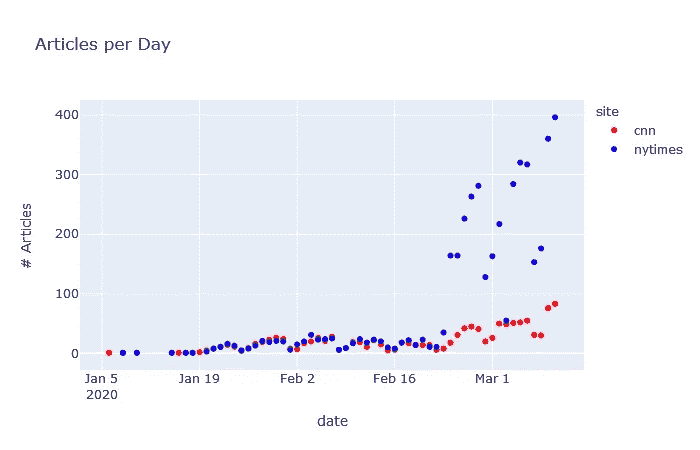

对于每篇文章，我都存储了元数据(作者、日期、链接、站点等。)以及 SQLite 数据库中的实际文本。我每天都在不断更新这个数据库，每天早上都会把最新的文章拉进来。在写这篇文章的时候，我已经从 CNN 和纽约时报获得了 5451 篇关于冠状病毒的文章。

# 情感分析:主观性

作为新闻的读者和观众，我们希望确保我们消费的内容更符合事实，而不是固执己见。主观性是衡量这一点的一个很好的标准——高度固执己见的文章会落在量表的高端(接近 1)，而更真实、更贴近现实的文章会落在量表的低端(接近 0)。

也就是说，我想用主观性来回答以下几个问题:

1.  *这些冠状病毒新闻文章有多主观？*
2.  *新闻来源不同，主观性也不同吗？*
3.  *随着情况的发展(随着时间的推移)，主观性会改变吗？*

## 这些冠状病毒新闻文章有多主观？

让我们快速看一下所有 5000 篇文章的主观性:

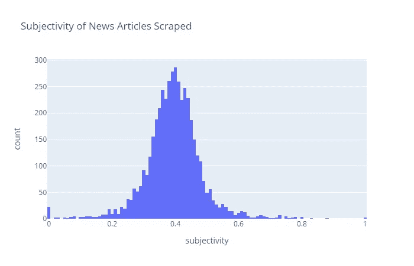

```
count    5451
mean     0.393
std      0.092
```

上面的直方图显示了主观性在所有文章中的分布。分布中的关键指标显示在灰色框中。即*平均主观性为 0.39* ，主观性的*标准差(std)为 0.09* 。同样，假设主观性=1 相当于一篇完全主观的文章，我们可以说**这些文章平均有 40%是主观的**。

还不错！这意味着一般的文章是客观多于主观的。看起来我们从这些网站获得的内容是值得的。你可能想知道，“虽然文章的总体平均值是 40%，但不同新闻来源之间的平均值有所不同吗？”。

## 新闻来源不同，主观性也不同吗？

虽然上面的分析很好地概括了文章，但它没有区分新闻来源。显然，不同的新闻网站和电台有不同的政治倾向和风格，所以他们对冠状病毒情况的解释不同是有道理的，对吗？

让我们重新绘制情绪分布图，这次突出显示两个新闻网站，看看我们能否确定两者之间的任何差异。

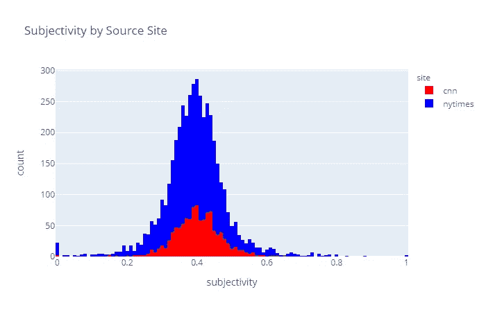

```
site    count  mean   std 
cnn     1208  0.401  0.071
nytimes 4243  0.391  0.097
```

注意到什么不同了吗？可能很难说。让我们看一下有帮助的指标。

两个站点的平均值大致相同，为 40%。但是，我们可以看到标准差差别很大。这些指标似乎给了我们相互矛盾的结果。有没有另一种方法可以量化这两种分布有多相似？

*Kolmogorov–Smirnov(KS)检验*是一种非参数检验，用于确定抽取的两个样本的分布是否不同。对于我们的情况，这意味着:一个站点的分布与另一个站点的分布相同吗？

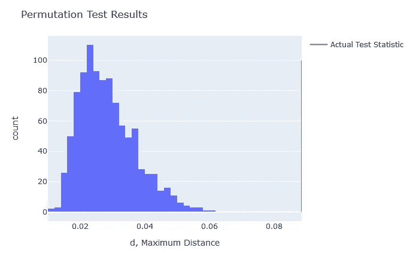

KS 检验的无效假设是:*【H0 =一个站点的文章情感分布与另一个站点相同*。

使用 KS 检验，我得到了一个检验统计量 *d=0.089* ，并通过排列确定 p 值为 0。因此，我们可以得出结论，我们可以*拒绝零假设* : **第一个位点的分布不同于第二个位点的分布。**这很可能是由于标准偏差的差异(以及分布中潜在的其他细微差别)。

虽然两个发行版不同，但还是有点难看出原因。让我们以不同的方式分割数据，看看它是否揭示了感兴趣的东西。

## 主观性会随着情况的发展而改变吗？

观察主观性的分布是一个很好的起点，但它未能代表我们都知道的东西:情况每天都在演变。1 月初，美国的新冠肺炎病例数为 0，并且进展迅速，尤其是在过去几天。文章的主观性是否遵循这种趋势？

为了证明这一点，让我们画出过去几个月的平均每日主观性，看看随着情况的发展是否有任何变化。日均主观就是当天发表的所有文章的平均主观。我们可以看到下面的结果:

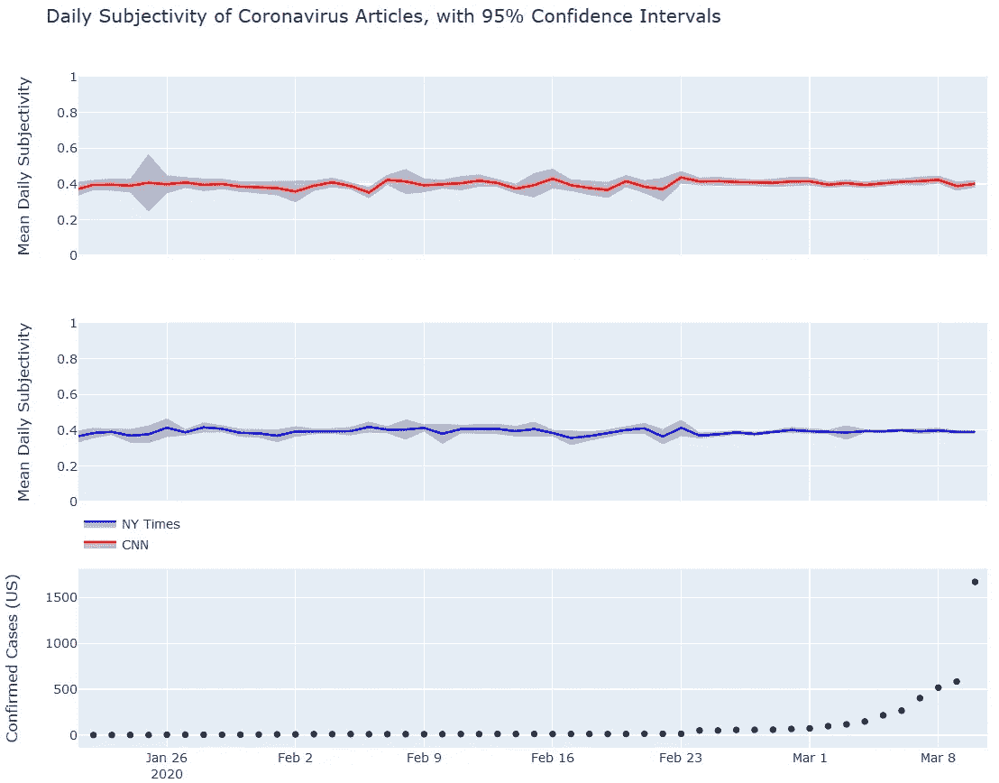

如图所示，尽管病例数量在 2 月底开始增加，但主观性仍然相当稳定。对于这两个站点，平均每日主观性在 0.40 左右徘徊，与上述分布中发现的 40%主观性一致。不是很刺激…

让我们更细化一点。我们可以绘制每篇文章在相应日期的主观性，以查看任何给定日期的传播:

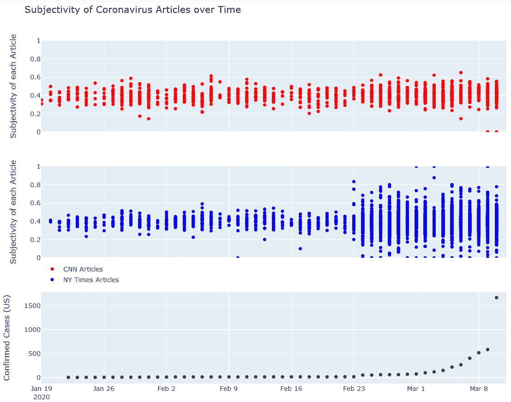

我们在这里看到的是相当惊人的。2 月 23 日之后,《纽约时报》的文章写作方式发生了巨大的转变。这也恰好对应了确诊病例曲线的一个大台阶。在 2 月 23 日之前，大多数文章的主观评分都在 0.2 到 0.6 之间。2 月 24 日，美国确诊的新冠肺炎病例从 15 例猛增至 51 例(增长了 3.4 倍！)，从这一点上来说，文章的主观性是非常可变的——在某些日子里，整个范围是变化的。

对 CNN 的影响似乎更微妙，如果有的话。即使在 2 月 23 日之后，主观性也大多保持在 0.2 到 0.6 的范围内。CNN 的作者似乎保持着同样的客观水平，而《纽约时报》的作者对事态发展做出反应，在某些情况下撰写完全主观的文章。

现在，纽约时报的一些文章在 2 月 23 日之后变得更加客观，但这里的要点是，根据你阅读的文章，你将不会获得与之前相同的一致性。

# 情绪分析:极性(消极与积极)

现在我们对这些新闻来源的主观性有了更好的了解，让我们把注意力转向极性。极性衡量给定文本块的正负程度。TextBlob 对任何给定文本块的极性进行排序，从-1(负)到 1(正)。

*在这一部分之前，我应该说，任何关于冠状病毒的文章的极性，就其本身而言，是一个见仁见智的问题。换句话说，如果你真的相信眼前的情况是值得担心的，那么一篇负面的文章似乎也是一样的。然而，如果你认为这种情况被“过度炒作”，那么一篇负面的文章可能会显得与现实脱节。因此，对结果的解释取决于你的观点。*

让我们像以前一样进行同样的分析，这一次看文章的极性。

1.  *这些冠状病毒的新闻报道有多极端？*
2.  *极性是否因新闻来源不同而不同？*
3.  *随着情况的发展(随着时间的推移)，极性会发生变化吗？*

## 这些冠状病毒新闻文章的极性有多大？

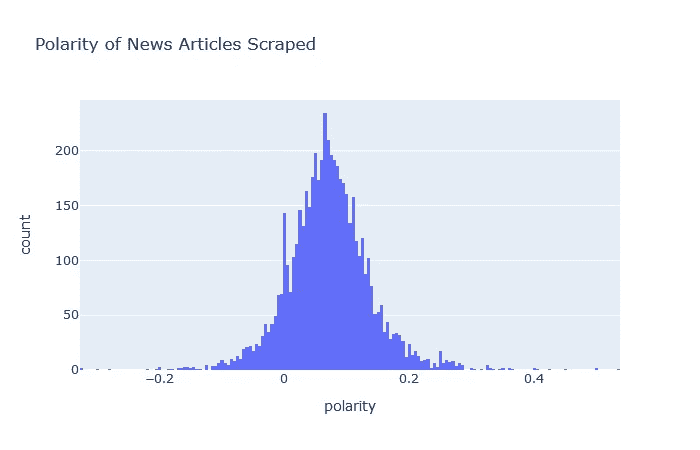

```
count       5451
mean        0.071
std         0.068
```

**平均而言，文章的极性相当中性。这是我们应该从一个声誉良好的新闻来源中期待的。标准偏差也很小，表明极性在所有文章中相当一致。它也小于主观性，这意味着极性的变化小于主观性。**

## 极性是否因新闻来源不同而不同？

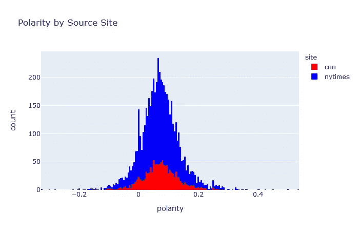

```
site    count  mean   std 
cnn     1208  0.072  0.061
nytimes 4243  0.070  0.070
```

同样，我们看到两个新闻网站的平均值大致相同，这次的标准差也有些相似。我们应该预料到两个站点之间的极性分布更有可能是相同的。让我们用另一个 KS 测试来测试这个。

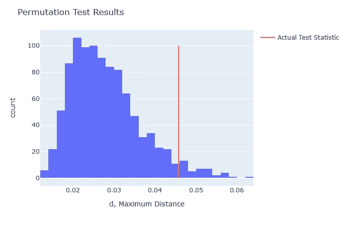

这个有点接近，但是 p 值为 0.04，我们仍然*拒绝零假设:* **分布看起来是不同的。**

## 极性会随着情况的发展而改变吗？

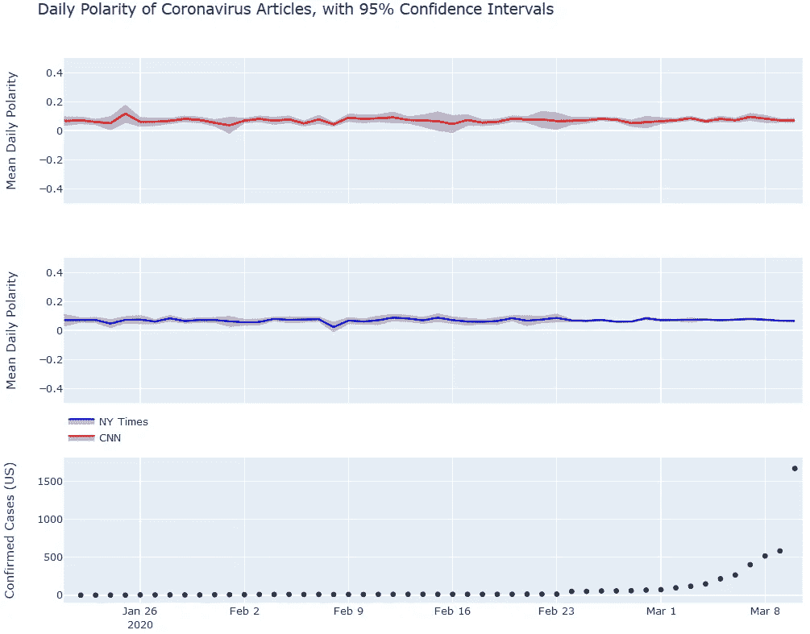

我们在这里看到了与主观性相似的行为:日平均极性随着时间的推移相当恒定，两个站点的日平均极性大多保持在 0 到 0.2 之间。因此，在任何一天，一般的文章都是相当中性的。

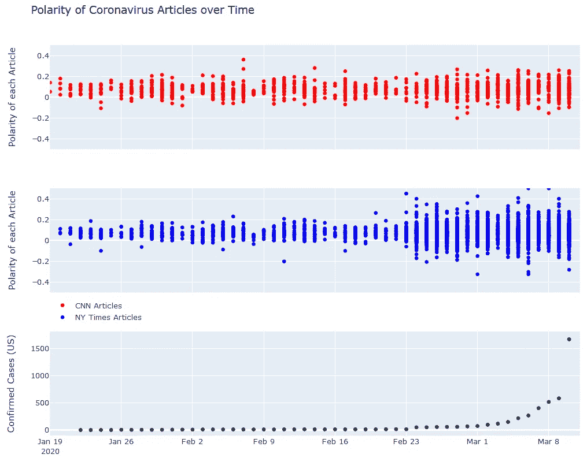

令人惊讶的是，同样的行为也在极性中出现。2 月 23 日之后，纽约时报的文章在任何一天都有很大的极性差异。然而，方差似乎稍微偏向范围的正端，这意味着 2 月 23 日之后发表的任何给定的纽约时报文章都有更好的机会不是中立的，但有更高的机会是积极的。同样，CNN 似乎很少表现出这种行为。

# 结论

通过使用网络抓取和 NLP(情绪分析)，该分析显示了媒体对美国当前冠状病毒形势的反应。我们发现，平均而言，文章有 40%是主观的，而且在极性上相当中性。我们还表明，两个新闻站之间的文章实际上是不同的，纽约时报对形势变化的反应要比 CNN 大得多。

希望下次你打开一篇新闻文章时，你会对你将要阅读的内容描述冠状病毒现状的程度更有信心。

我希望你喜欢这篇文章。如果有，在下面给我留言评论吧！让我知道你喜欢它的什么，或者你是否有兴趣在这篇分析中看到任何其他新闻网站！

*该项目的代码可以在* [*GitHub*](https://github.com/tomsharp/coronavirus-news) *上找到。*

如果你想更新我正在写的东西、我正在构建的辅助项目或我觉得有趣的文章，请随时加入我的时事通讯— [**有抱负的数据科学家**](http://aspiringdatascientist.com/) 。

*编者按:《走向数据科学》是一份主要基于数据科学和机器学习研究的媒体出版物。我们不是健康专家或流行病学家，本文的观点不应被解释为专业建议。想了解更多关于疫情冠状病毒的信息，可以点击* [*这里*](https://www.who.int/emergencies/diseases/novel-coronavirus-2019/situation-reports) *。*