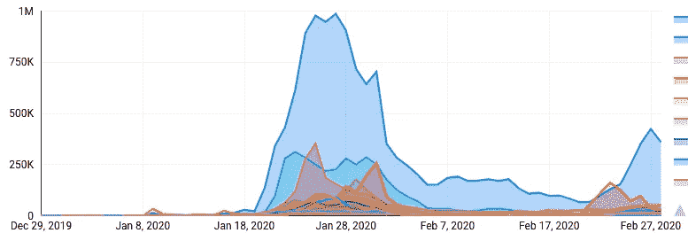
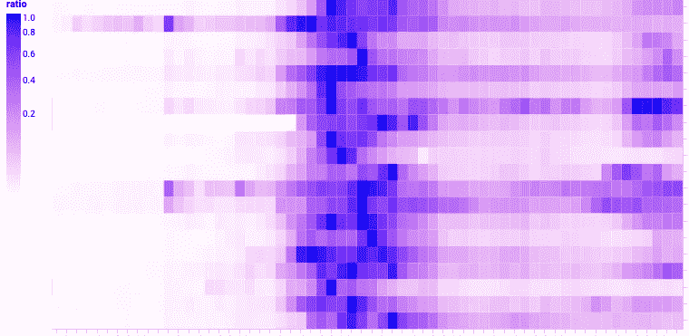

# 维基百科中冠状病毒的语言-可视化

> 原文：<https://towardsdatascience.com/coronavirus-interest-inwikipedia-by-language-1b3e6562040d?source=collection_archive---------20----------------------->


按冠状病毒语言分类的维基百科页面浏览量

## 查看维基百科的页面浏览量，深入了解新闻在世界各地的传播和趋势。首先，我们将从维基百科的页面浏览量中提取数据来创建一个新的仪表板。坚持到最后，看看在 Data Studio 中使用 Vega 和 Vega Lite 实现高度可配置的可视化的秘密。

一些有趣的趋势你可以很快想象出来:

*   中文的冠状病毒比其他语言早 9 天开始流行。
*   日语和韩语是最先赶上的语言。
*   在过去的几天里，意大利、挪威和波斯的反弹最为强劲。


一些有趣的趋势你可以很快想象出来

在开头的图表中，您可以找到每种语言的冠状病毒页面的浏览量。下一个图表显示了当前新闻之后的[维基百科文章的相同情况:](https://en.wikipedia.org/wiki/2019%E2%80%9320_coronavirus_outbreak)


主题[2019–20 _ 武汉 _ 冠状病毒 _ 爆发](https://en.wikipedia.org/wiki/2019%E2%80%9320_coronavirus_outbreak)的每种语言的维基百科浏览量。请看[冠状病毒](https://en.wikipedia.org/wiki/Coronavirus)的开场图。

在 BigQuery 中从维基数据中获取所有冠状病毒页面标题:

```
CREATE OR REPLACE TABLE `temp.wikidata_coronavirus`
AS
SELECT REGEXP_EXTRACT(site, '(..)wiki') language, encoded value
FROM `bigquery-public-data.wikipedia.wikidata`, UNNEST(sitelinks)
WHERE numeric_id = 290805
AND LENGTH(site)=6# 1.9 sec elapsed, 9.7 MB processed
```

修正了西班牙语、荷兰语、斯洛伐克语页面的重命名:

```
INSERT INTO `temp.wikidata_coronavirus` 
SELECT 'es', 'Orthocoronavirinae';
INSERT INTO `temp.wikidata_coronavirus`
SELECT 'nl', 'Coronavirussen'
INSERT INTO `temp.wikidata_coronavirus`
SELECT 'sk', 'Coronavírus'
```

为 Data Studio 创建一个表:

```
CREATE OR REPLACE TABLE 
  `fh-bigquery.wikipedia_extracts.wikipedia_corona_views`
AS
WITH sumviews AS (
  SELECT * REPLACE(IF(date=CURRENT_DATE(), views*24/hours_day, views) AS views) # last fractional day correction
  FROM (
    SELECT SUM(views) views, SUBSTR(a.wiki, 0, 2) wiki, title,  DATE(datehour) date, COUNT(DISTINCT datehour) hours_day
    FROM `bigquery-public-data.wikipedia.pageviews_20*`  a 
    JOIN `temp.wikidata_coronavirus` b
    ON ((a.title=b.value AND SUBSTR(a.wiki, 0, 2)=b.language))
    WHERE DATE(a.datehour) > '2019-12-28'
    GROUP BY wiki, title, date
  )
)
SELECT *, (FORMAT('%s - %s', language, title)) wiki_title
FROM (
  SELECT * 
    REPLACE((SELECT STRING_AGG(DISTINCT title ORDER BY title) FROM sumviews WHERE a.wiki=wiki) AS title)
    , (views)/ (MAX(views) OVER(PARTITION BY wiki)) ratio
    , (SELECT language FROM `wikipedia_extracts.wiki_langs` WHERE a.wiki=wiki ) language
  FROM sumviews a
  WHERE wiki IN (SELECT wiki FROM (SELECT wiki, SUM(views) FROM sumviews GROUP BY 1 ORDER BY 2 DESC LIMIT 28 ))
)# (13.4 sec elapsed, 411.3 GB processed)
```

**优化待办事项**:这 411.3 GB 可以进行大量优化——尤其是如果在持续的基础上，我只是加载增量小时的视图，而不是重新处理整个事情。

# 玩弄结果

包含结果的整个表只有 1，239 行，您可以在 BigQuery 上找到它:

```
SELECT *
FROM `fh-bigquery.wikipedia_extracts.wikipedia_corona_views`
```

[*新加入 BigQuery？从这里开始*](/bigquery-without-a-credit-card-discover-learn-and-share-199e08d4a064) 。

# 数据工作室

你见过这样的图表:



典型的数据工作室面积图

但是这有多酷？



Data Studio 中连接到 BigQuery 的 Vega Lite 可视化

秘密:我们现在可以在 Data Studio 中使用 [Vega & Vega lite 图表。有了这个社区可视化，我只需要为 Vega lite 提供一个配置:](https://twitter.com/googleanalytics/status/1233170199211380736)

```
{
   "$schema":"[https://vega.github.io/schema/vega-lite/v3.json](https://vega.github.io/schema/vega-lite/v3.json)",
   "mark":"rect",
   "config":{
      "axisRight":{
         "labelFontSize":15
      }
   },
   "encoding":{
      "y":{
         "title":"",
         "field":"$dimension0",
         "type":"nominal",
         "axis":{
            "labelAlign":"left",
            "orient":"right"
         }
      },
      "x":{
         "field":"$dimension1",
         "type":"ordinal"
      },
      "color":{
         "field":"$metric0",
         "type":"quantitative",
         "legend":{
            "orient":"left"
         },
         "scale":{
            "type":"sqrt",
            "range":[
               "#fffaff",
               "blue"
            ]
         }
      }
   }
}
```

不同的尝试:


在 Data Studio 中使用 Vega Lite

# 想要更多吗？

敬请关注交互式仪表盘和更多更新。请给我留下您的意见和任何建议或更正。

**感谢**:[Denny vrandei](https://medium.com/u/ac7d3bcad193?source=post_page-----1b3e6562040d--------------------------------)，感谢维基数据和对这篇文章的最后修正。[马克·科恩](https://medium.com/u/1f225b5f22b2?source=post_page-----1b3e6562040d--------------------------------)在 BigQuery 中为维基数据和维基百科数据建立了一个可靠的管道。更多详情请见下文。

## 冠状病毒和 Meetup RSVPs

哦，我也在看世界各地的 Meetup RSVPs 是如何受到影响的。看看这个:


参加 Meetup.com 技术会议的回复数量下降(与去年相比)

我是 Felipe Hoffa，谷歌云的开发者倡导者。在 [@felipehoffa](https://twitter.com/felipehoffa) 上关注我，在[medium.com/@hoffa](https://medium.com/@hoffa)上找到我以前的帖子，在[reddit.com/r/bigquery](https://reddit.com/r/bigquery)上找到所有关于 BigQuery 的帖子。

[](/bigquery-without-a-credit-card-discover-learn-and-share-199e08d4a064) [## 没有信用卡的 BigQuery:发现、学习和分享

### 如果你在注册 BigQuery 时遇到了困难，不用担心——现在注册和开始使用比以往任何时候都容易

towardsdatascience.com](/bigquery-without-a-credit-card-discover-learn-and-share-199e08d4a064) [](/inequality-how-to-draw-a-lorenz-curve-with-sql-bigquery-and-data-studio-c70824b0748d) [## 不等式:如何用 SQL、BigQuery 和 Data Studio 绘制洛伦兹曲线

### 所有维基百科页面中排名前 0.1%的页面获得了 25%的浏览量。最底层的 99%只获得了 42%的浏览量。还有……

towardsdatascience.com](/inequality-how-to-draw-a-lorenz-curve-with-sql-bigquery-and-data-studio-c70824b0748d) [](/interactive-the-top-2019-wikipedia-pages-d3b96335b6ae) [## 互动:2019 年维基百科页面排行榜

### 维基媒体公布了他们 2019 年最受欢迎的页面——但我们能更深入吗？当然，这里有 BigQuery 和…

towardsdatascience.com](/interactive-the-top-2019-wikipedia-pages-d3b96335b6ae) [](https://medium.com/google-cloud/bigquery-optimized-cluster-your-tables-65e2f684594b) [## 优化 BigQuery:聚集您的表

### BigQuery 刚刚宣布了对表进行集群的能力——我将在这里进行描述。如果您正在寻找大量的…

medium.com](https://medium.com/google-cloud/bigquery-optimized-cluster-your-tables-65e2f684594b)