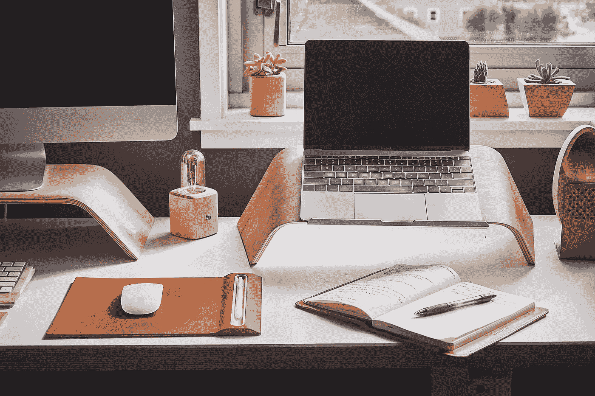
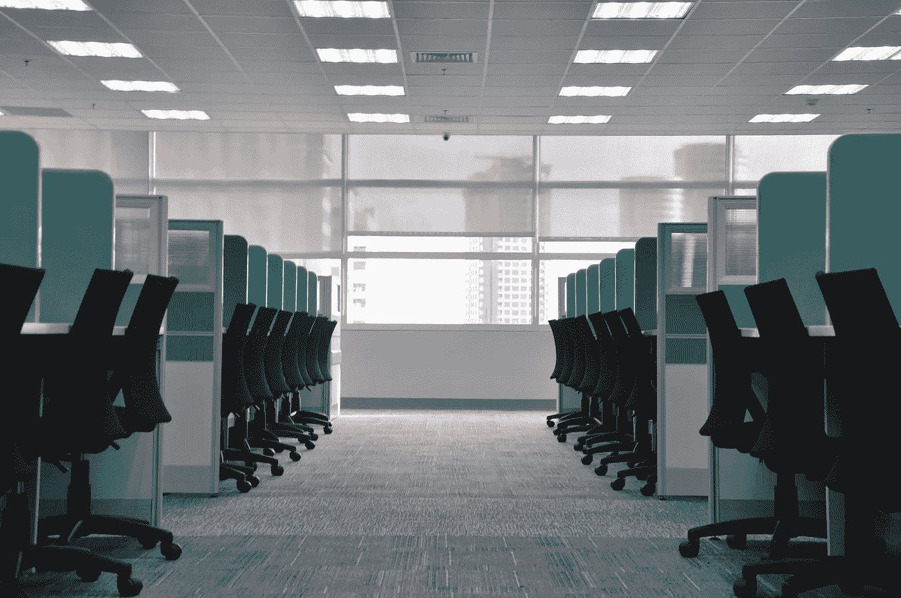

# 冠状病毒让远程工作成为新常态

> 原文：<https://towardsdatascience.com/coronavirus-made-remote-work-the-new-normal-c190267074c2?source=collection_archive---------51----------------------->

## 在家工作时如何保持高效和精神健康

照片由 Grovemade 在 Unsplash 上拍摄

关于远程工作的争论已经酝酿了几十年。冠状病毒，以及曲线扁平化的必要性，导致了它的爆发。

21 世纪的技术工具早就让工作不受地点限制成为可能，但直到现在，员工仍然被束缚在自己的小隔间里。

人们已经清楚地认识到[拉平曲线势在必行](https://blogs.scientificamerican.com/observations/flattening-the-covid-19-curves/)，办公室纷纷关闭，远程工作的未来已经在全球展开。社交距离揭示了一个强大的技术基础设施，使远程工作不仅可能，而且有效。

随着远程工作成为现状，学会在同一个空间生活和工作需要实践。三年来，我一直作为一名[研究&分析顾问](http://www.44thbombgroup.org)远程工作。通过许多陷阱，我学会了如何保持高效和精神健康。

虽然遥远的生活方式不是未来的灵丹妙药，但它是今天的必需品，就像照顾彼此的必要性一样，即使我们分开了。

TL；博士适应这种新的工作方式需要努力。考虑以下四种在家工作时保持高效和精神健康的基本行为:

照片由 kate.sade 在 Unsplash 上拍摄

1.  **在家中指定办公空间**

当远程工作的新鲜感逐渐消失时，一个令人惊讶的认识是常见的:事实上，错过一个小隔间是可能的。

诞生于效率至上的 20 世纪哲学——泰勒主义，小隔间已经演变成了办公室工作被鄙视的象征。但是为什么呢？这个小隔间的设计是为了增强员工的注意力和生产力，它确实起作用了。

然而，20 世纪的家被设计成完全支持不同的目标:在漫长的一天工作后加油、聚会和充电。

这种差异很重要。考虑你的办公室和你的家的功能空间——并划分两者——是远程生活的第一个关键点。

在你专注于工作本身之前，先专注于在家里定义一个工作空间。

在家工作的两个方面对你的工作和幸福有着巨大的影响:物理空间中的环境因素和完成工作的工具和技术。

先说环境因素。

首先要做的是创造一个你将工作的物理空间，这个空间不同于你下班后放松的空间。无论是书桌还是茶几，最重要的不是你的工作空间的大小，而是为工作腾出空间的感觉。

越来越多的研究表明，工作场所的环境因素，如光线、空气和温度，对健康和生产力有着重大影响。2019 年由 [View](https://view.com/sites/default/files/documents/workplace-wellness-study.pdf) 进行的一项关于工作场所健康的研究发现，三分之一的人报告称，由于温度、照明、空气质量和声学等环境因素，他们每天损失超过 60 分钟的工作时间。这相当于一周损失了惊人的 8 小时工作时间。

考虑一下你家里的这些相同的环境因素，以及为了改善你的精神健康和工作效率需要做些什么。例如:

*   把你的工作空间建在窗户附近——自然光与情绪健康密切相关
*   打开窗户，选择新鲜空气而不是空调
*   创造一种与自然的联系——在附近摆放植物/花卉，或者悬挂喜爱的风景照片

当你考虑了家中的环境因素并创造了工作空间后，转向*你将如何*工作:你有哪些工具和技术来完成对你的工作效率有积极影响的工作？

我们谈论的不仅仅是一台笔记本电脑。相反，考虑一下什么样的工具可以增强和扩展你的工作方式，使工作更加高效和舒适。例如:

*   厨房里堆满了健康零食，可以缓解下午的疲劳
*   扩展您工作站的外接显示器
*   无线耳机，让您可以不受电话束缚地接听电话
*   在 PPT 或 Excel 中处理大项目时，可以快速点击的计算机鼠标
*   复印室里一度近在咫尺的基本办公用品

确定你工作场所需要的工具不会一蹴而就，但是投资于你自己和你的工作方式将会给你的生产力和精神健康带来好处。

**2。风雨无阻，出门**

根据康奈尔大学 Alan Hedge 的 2018 年[研究](https://www.prnewswire.com/news-releases/study-natural-light-is-the-best-medicine-for-the-office-300590905.html)，美国人 90%的时间都在室内度过。没有通勤，远程工作人员几乎 100%的时间都呆在室内。

意向性对于远程工作和保持理智至关重要。在街区周围进行户外散步来清理你的大脑和释放压力的好处在科学中得到很好的证明，在历史中得到很好的证明。

这是一个常识性的建议，但需要有意识的努力。让自己对白天外出负责。例如:

*   在你的日历上划出时间，就像你开会、外出散步一样
*   在你通常通勤的时候，早上和晚上散步

**3。常规会让你保持理智**

远程工作通常意味着独自工作。围绕社交互动的办公室日常事务不再打断一天的工作。

常规很难建立，但很容易停止。想想这个:一天中 40%的人的行为是习惯的结果，而不是决定，查尔斯·杜希格在他的畅销书《习惯的力量》中强调了这一事实。习惯不费吹灰之力就能形成，但常规需要训练。想想看:当一个人的日常生活被打乱时，坏习惯往往会卷土重来。从办公室转移到远程工作就是一个典型的例子。

如果没有办公室生活的外部激励因素——阻止坏习惯的日常事务很容易被转移。在家里，办公室环境特有的外在激励因素突然消失了。突然间，内在激励因素成为让你保持高效的驱动力，但更重要的是，强大的精神和身体健康。

根据西北医学的研究，当日常事务减少时，生产力和睡眠也会减少，导致压力、不良饮食和嗜睡。

在家工作时，日常事务的重要性并不是一个启示性的发现，但它值得一提，因为日常事务很容易丢失并痛苦地重新建立。

当你适应了偏远的生活，很容易沉溺于新发现的自由，导致日常事务瓦解。从关注基础开始。例如:

*   每天在同一时间醒来
*   在打开笔记本电脑开始工作之前，养成阅读、写作或锻炼的习惯
*   决定什么时候关闭你的笔记本电脑，停止晚上的工作
*   每天抽出时间给家人/朋友打电话——养成每天和某人保持私人联系的习惯

对于远程工作者来说，日常工作对心理健康至关重要，尤其是在这种长时间的社会距离中。

**4。运用你的创造力将人们聚集在一起——事实上**

当团队远离时，建立一种规范虚拟协作和学习的文化应该是当务之急。

当员工远离办公室时，非正式的饮水机谈话和办公室小房间里的随意交谈就消失了。清晰的沟通、协作和学习渠道，团队和组织必须保持文化的首要地位。

随着我们适应远程工作的节奏，员工有了前所未有的机会成为领导者，带领团队进行协作和学习。

考虑创造性的方法来利用现有的业务运营工具/技术，在您的团队或员工中创建连接点。例如:

*   促成一次虚拟午餐并学习 Zoom
*   举办一次创新挑战，邀请那些远程工作时不经常联系的同事
*   使用 Slack 之类的交流工具来促进虚拟的、特别的学习——例如，分享一篇文章和促进讨论

创造机会，从远方一起学习，一起成长。

在这个虚拟的景观中照顾好自己和彼此。

在家工作时，锻炼“肌肉”来保持高效和精神健康需要练习。在这种新常态下的繁荣取决于你如何塑造你的习惯和环境。

在新冠肺炎危机中，我们更有理由关注自己在偏远地区的成功:当你照顾好自己，你就能更好地照顾你所在社区的人。