# 冠状病毒爆发—问大数据的 5 个问题

> 原文：<https://towardsdatascience.com/coronavirus-outbreak-5-questions-to-ask-big-data-3550794d2fe9?source=collection_archive---------30----------------------->

## 让我们利用大数据来探索人类历史上最大的隔离规模

# ***2020 年 2 月 18 日更新***

*这篇文章最初写于 1 月 31 日。自那以后，疫情的规模导致了加强措施来控制传播。比如我住的住宅小区，最近就采取了封闭式管理。我得到了下面的进入许可。任何没有登记的人都不允许进入。*

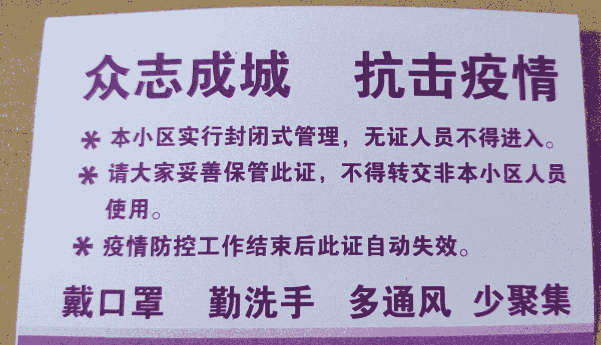

*我在北京居住小区的入园证背面*

中国许多城市的情况都很相似。在一些地方，居民购买食品杂货有配额，例如每两天一次。在北京和许多其他城市，从外地来的人需要遵守强制性的 14 天隔离期。学校已经关闭，活动取消，大多数公司都采取在家工作的政策。

的确，我们正在经历人类历史上最大规模的隔离！如果你不相信，看看下面的图表，它显示了中国前 30 大交通枢纽(机场和火车站)的总交通流量的同比比较。红色是今年，绿色是去年。

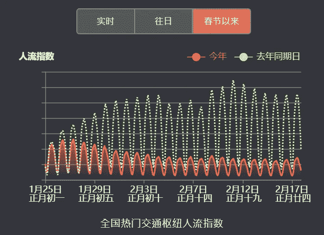

中国前 30 大交通枢纽的交通流量指数，同比

让我们希望这些强有力的措施能有效地阻止这种高传染性疾病的传播。

*当我写这篇文章时，钻石公主号游轮上的冠状病毒病例总数已跃升至 454 例，凸显了隔离的必要性。*

 [## 日本钻石公主号游轮确认 99 例新型冠状病毒病例

### 停靠在…的受灾的钻石公主号游轮上又有 99 人被检测出冠状病毒阳性

www.theguardian.com](https://www.theguardian.com/world/2020/feb/17/coronavirus-japan-braces-for-hundreds-more-cases-as-another-china-city-locked-down) 

# **原文章发表于 2020 年 2 月 1 日**

百度地图在全球每天被使用 1200 亿次。基于如此多的地理空间数据，百度推出了这个令人惊叹的数据可视化平台，叫做百度千玺(意为迁移)。再加上搜索引擎的数据，百度真的很了解正在发生的事情。

冠状病毒的爆发以及随之而来的武汉和周边城市的封锁给人们的生活带来了严重的干扰。基于大数据，百度能为我们提供哪些答案？

1.  武汉现在的交通状况如何？

在武汉，衡量交通活动的高速公路交通堵塞距离与去年同期相比下降了 99.7%(红线对绿线)。封锁是真实存在的。

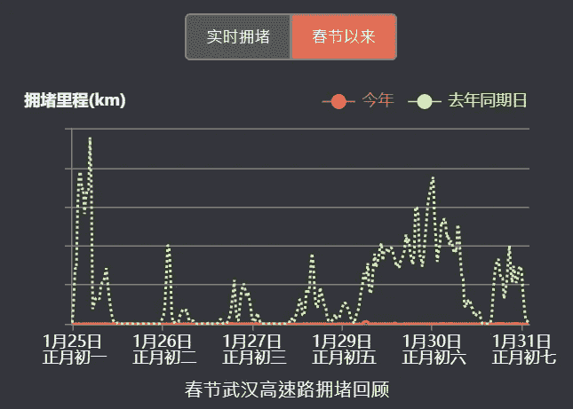

交通堵塞距离(公里)同比对比—武汉

相比之下，北京的图表“仅仅”下降了大约 50%。

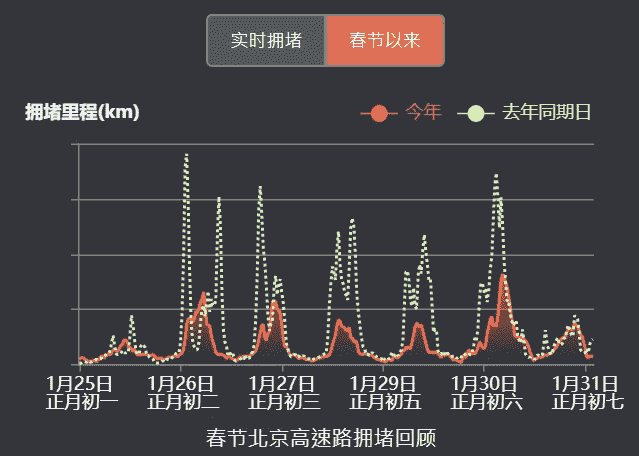

北京交通堵塞距离(公里)同比对比

传统上，现在是人们回到大城市开始工作的时候了。由于我们仍处于这场大规模疫情中，交通流量有可能进一步传播病毒。

中国各地政府要么延长了公共假期，要么要求雇主安排员工在家工作。今年会是中国的“在家工作”年吗？

**2。封锁前后武汉的交通怎么样？**

1 月 23 日，武汉[从上午 10 点开始暂停所有公共交通](https://en.wikipedia.org/wiki/2020_Wuhan_lockdown)，包括所有公交、地铁和轮渡线路。此外，所有出境的火车和航班都停止了。

从下面的图表中我们可以看到，交通流量在 1 月 23 日宣布后急剧下降，但交通管制直到 1 月 26 日才完全有效。

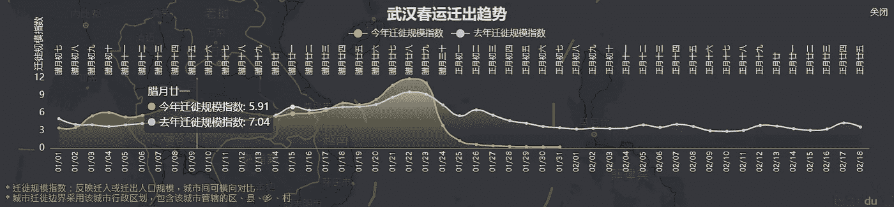

武汉对外交通流量指数(黄色=今年，白色=去年)

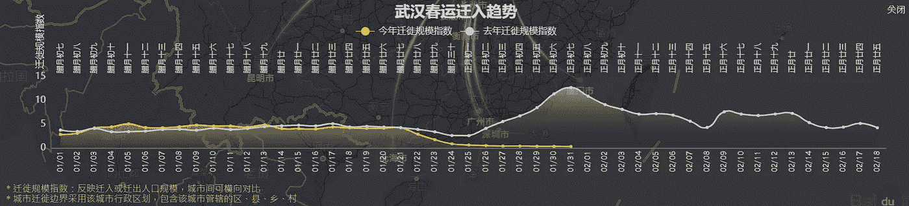

武汉入境交通流量指数(黄色=今年，白色=去年)

同样，现在应该是春节后入境游进入武汉市的高峰时间，但今年有很大不同。

**3。对于那些在封锁前离开武汉的人，他们去了哪里？**

下图显示他们中的大多数去了湖北省内的其他城市。毫不奇怪，武汉地震后几天，几乎整个湖北省都被封锁了。

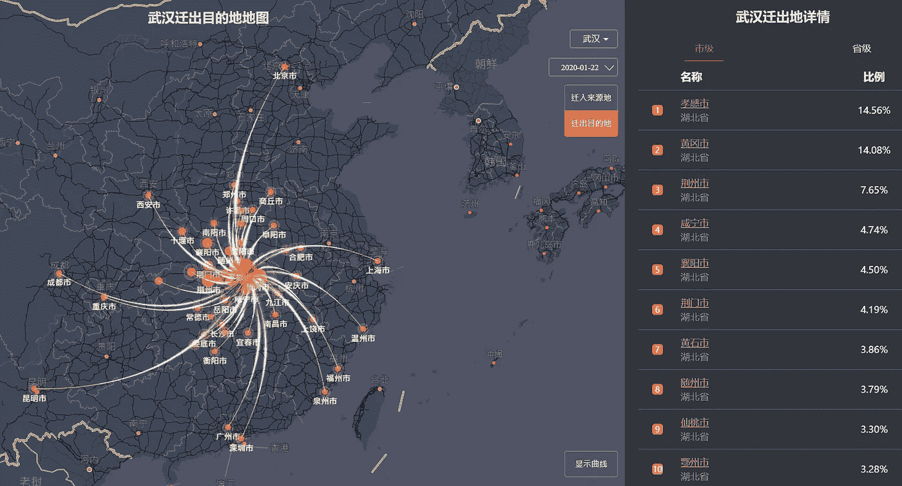

1 月 22 日来自武汉的出境交通流量

作为参考，这里有一张来自维基百科[的关于交通禁令影响的表格:](https://en.wikipedia.org/wiki/2019%E2%80%9320_Wuhan_coronavirus_outbreak)

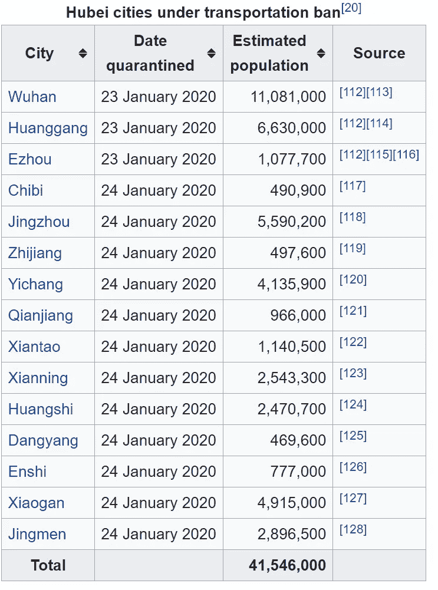

**4。从百度搜索关键词趋势可以学到什么？**

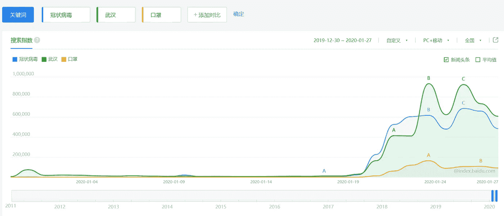

蓝色:冠状病毒，绿色:武汉，橙色:口罩

“冠状病毒”(绿线)和“武汉”(绿线)的搜索量在 1 月 19 日左右开始上升。

1 月 23 日，交通禁令宣布后，“武汉”的搜索量再次大幅增加。

搜索“口罩”(橙色线)的数量增长缓慢，这是因为人们广泛宣传戴口罩是避免病毒传播的最佳措施之一。

**5。“武汉”这个关键词在封锁前后的语境是怎样的？**

百度“需求图”展示了相关关键词随时间的相关性。随着时间的变化，关键字的上下文也在变化。这让我们了解了当时人们的想法。

在 12 月，“武汉”往往与中国其他城市(如长沙、成都)或武汉境内最受欢迎的旅游目的地(如武汉著名的早餐巷户部巷)相关联，表明与旅游相关的兴趣。

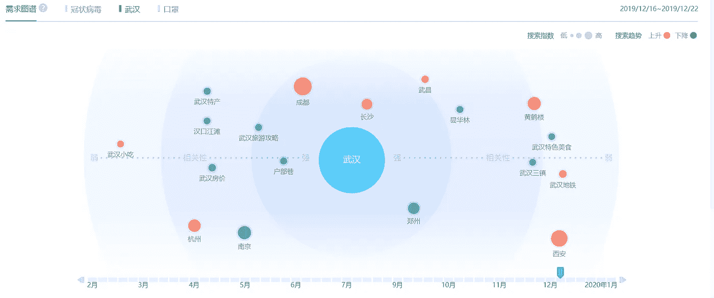

两周后,“SARS”这个词第一次出现在图表中，可能是因为当时人们不知道如何称呼这种新病毒，怀疑 SARS 爆发了。

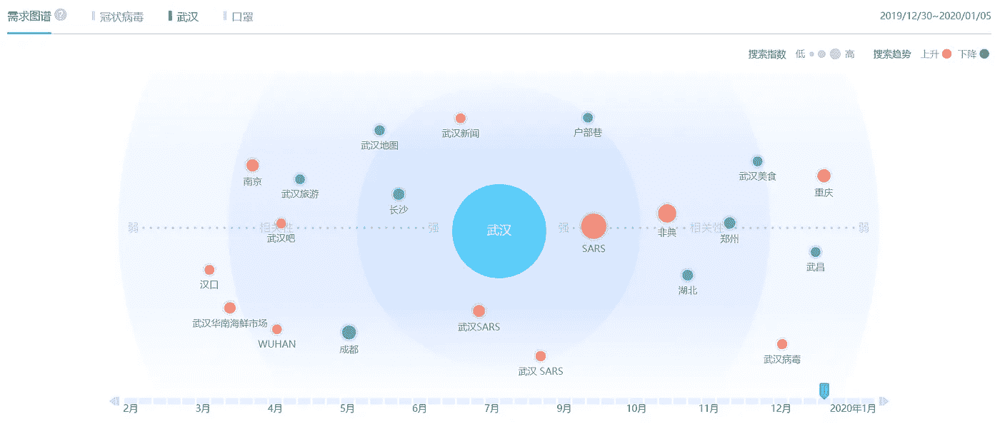

快进到 1 月下旬，一些最相关的关键词是“武汉封锁”、“武汉肺炎”，甚至“[华南海鲜市场](https://en.wikipedia.org/wiki/Huanan_Seafood_Wholesale_Market)”，这是大多数人在爆发早期接触冠状病毒的地方。

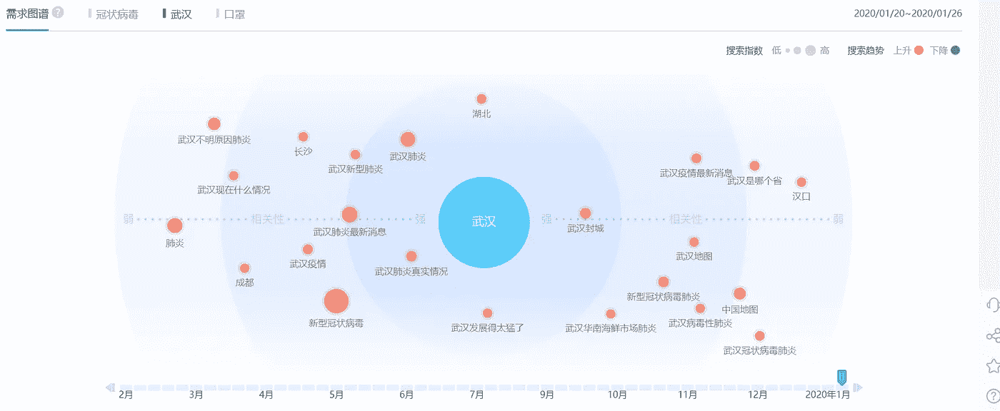

在大数据时代，我们可以使用像百度这样的数据提供商来了解人们的出行模式和搜索模式。所有这些在 2003 年 SARS 爆发时都不存在。额外的数据使人们能够在这一次做出更明智的决定，并在对抗病毒爆发的斗争中发挥关键作用。

# **文章中使用的工具**

**百度千禧**是百度提供的一款大数据产品，可以让你实时监控春节期间中国各地的人口迁移情况。

 [## 百度迁徙-百度地图慧眼

### 百度迁徙，通过将定位可视化直观呈现国内春运期间人口迁徙情况。

qianxi.baidu.com](https://qianxi.baidu.com/) 

百度关键词搜索和需求图可以在**百度索引**中找到。

 [## 百度指数

### 百度指数是以百度海量网民行为数据为基础的数据分享平台。在这里，你可以研究关键词搜索趋势、洞察网民兴趣和需求、监测舆情动向、定位受众特征。

index.baidu.com](https://index.baidu.com/) 

这两种工具都是纯粹的点击式。只需点击链接，选择您想要监控的相关城市。遗憾的是，这些工具没有英文版。如果你需要在这方面做一些研究，但不懂中文，也许找一个懂中文的人来协助你是个好主意。