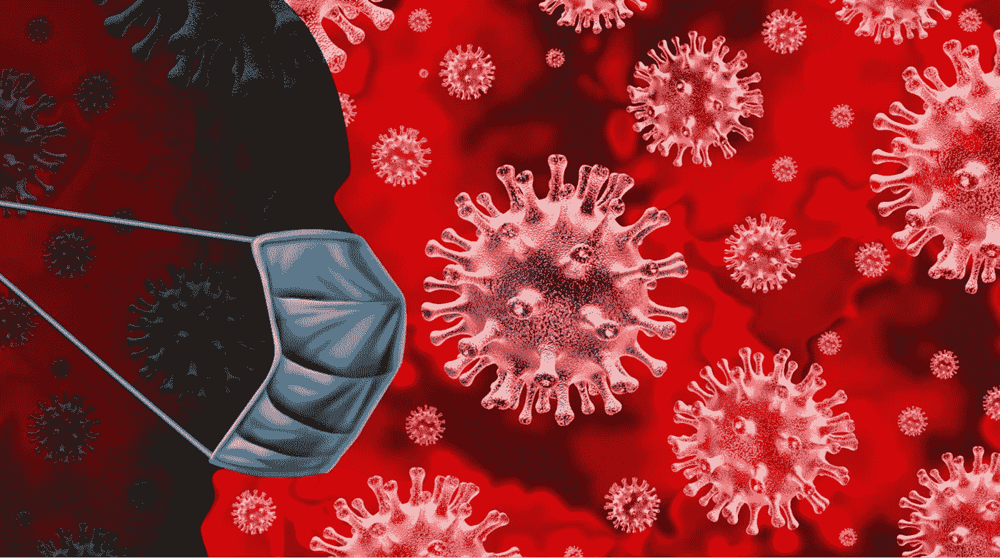
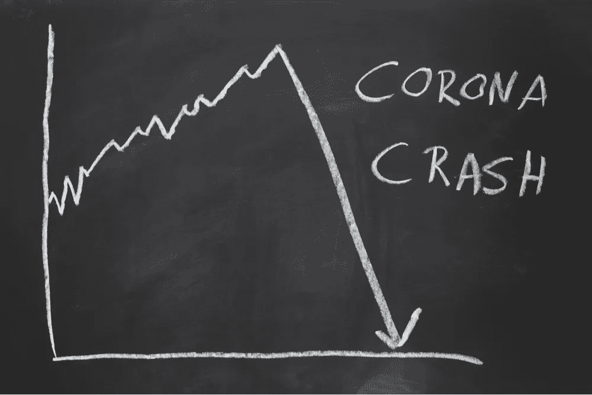
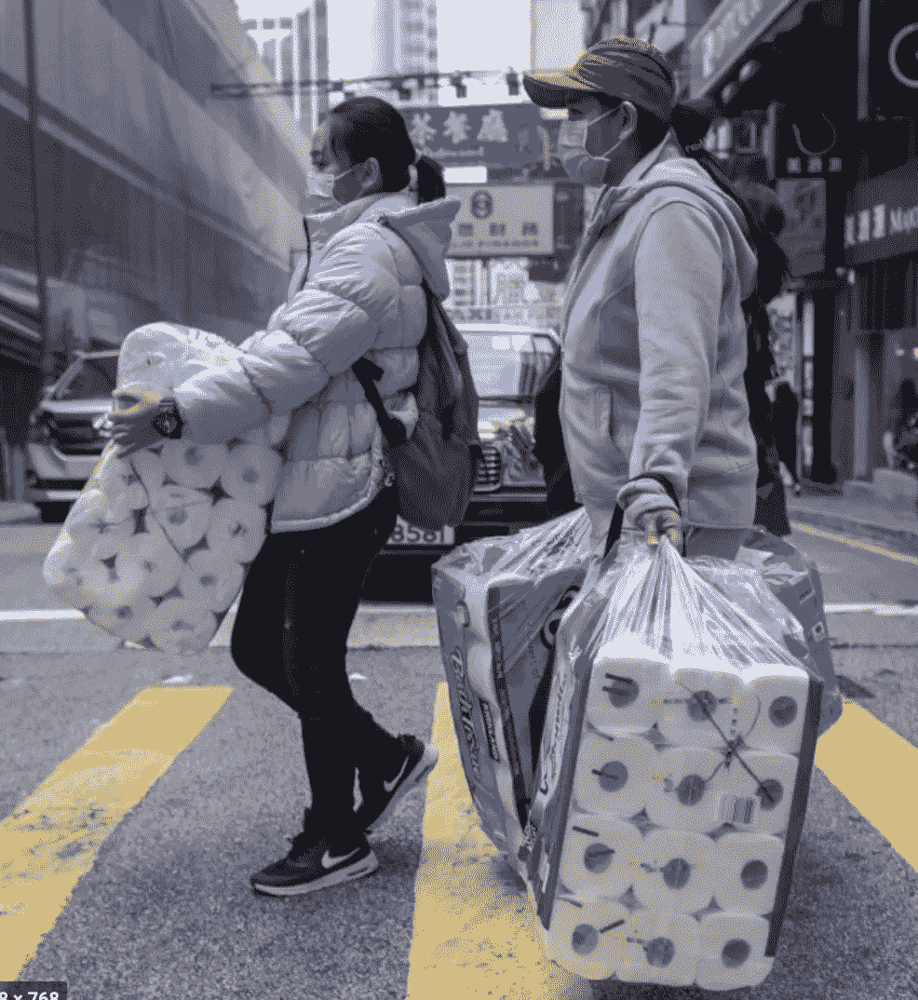
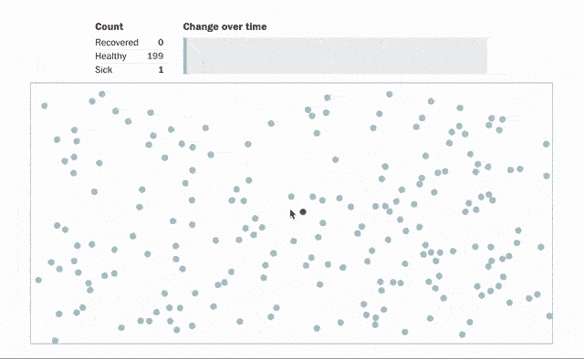
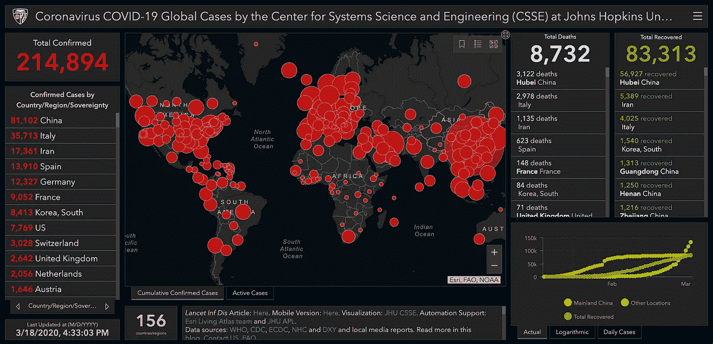

# 冠状病毒、心理学和数据科学

> 原文：<https://towardsdatascience.com/coronavirus-psychology-and-data-science-7302835e1517?source=collection_archive---------34----------------------->

来源:Shutterstock

## 尽管这是一场全球性的灾难，但这场疫情应该是一次令人大开眼界的经历，让我们重新安排我们的优先事项。

***编者按:*** [*走向数据科学*](http://towardsdatascience.com/) *是一份以数据科学和机器学习研究为主的中型刊物。我们不是健康专家或流行病学家，本文的观点不应被解释为专业建议。想了解更多关于疫情冠状病毒的信息，可以点击* [*这里*](https://www.who.int/emergencies/diseases/novel-coronavirus-2019/situation-reports) *。*

作为一个年轻的成年人，我不太关心病毒会如何影响我自己的健康。然而，我非常担心我会成为图表中的另一个节点，并间接加剧处于危险中的人群的痛苦。

来源:shutterstock

作为一个商务人士，我也有点关心自己的事业。我认为，科技行业将会像其他行业一样遭受损失，但这也是在医疗保健、远程医疗、电子学习等领域创造价值的大好机会。与个人健康问题类似，我也有点担心自己(和我的企业)，但非常担心全球的整体经济健康。受影响最大的领域可能是酒店业和旅游业，但许多企业将不得不创新和蓬勃发展才能生存。数百万人可能会失去工作或毕生积蓄，这对许多人来说是一个巨大的风险。

作为一名科学家，我对疫情爆发期间收集的所有数据以及所有自然发生的行为实验很感兴趣。它有巨大的成本。成千上万的生命和数百万的企业将会破产。然而，如果我们足够聪明，我们将会对疾病爆发、整个社会以及我们如何防止未来的大流行产生我们现在看到的灾难性影响有更多的了解。

**作为技术建设者，我们可以一起解决我们这个时代最困难的问题。**

作为一个物种，我们被赋予了我们这个时代最大的责任。我们正面临着巨大的挑战，但我们获得的见解和数据将使我们振作起来，不仅应对当前的疫情，而且应对未来的疫情。

是时候站出来了。是时候开始我们的游戏了。学习的时间到了。

# 心理学

本文的目标是探索在疾病爆发期间变得明显的心理状况和偏见。

先说最值得注意的问题。

## 卫生纸大批量购买

好吧，这是一个非常重要的项目，但大量购买是必要的吗？

资料来源:cnn.com

卫生纸的抢购超越了国界和文化。里面有东西。我们的恐慌按钮与我们储存大量卫生纸的欲望是密不可分的。

在我看来，这里有三个主要特征:

首先，我们的进化心理是由一种控制偏差的幻觉支配的。如果政府告诉我们呆在家里，洗手，这听起来并不是什么过分的要求。

但是，人们自然希望采取主动和步骤来感到更安全，因为情况正在威胁他们的生命。不幸的是，市场营销给了我们一种消费安全的错觉，从而助长了这种特质。这种感觉是与生俱来的，隐含在我们的生存中，不会轻易消失。通过储备，我们觉得我们正在采取措施做好准备。

控制偏差的错觉源于我们认为我们可以控制或影响结果。虽然这可以在大规模上进行，数百万人都采取同样的行动，但不幸的是，一个人无法影响宏观性质的结果。这种偏见已被证明会影响健康、投资、商业等。这与众所周知的“**赌徒谬误**”密切相关，参与者被证明当他们要求高数字时掷得更用力，当他们要求低数字时掷得更柔和。掷骰子的速度对掷出的数字没有影响，但是受试者仍然相信他们可以根据掷骰子的方式来控制结果。

与这种偏差相关，我们还可以识别出**零风险偏差**。通过完全消除一个风险，我们减少了我们面临的认知压力，使降低风险的选择更有吸引力。有些人会选择降低这种风险，即使讽刺的是，不消除这种风险会更大程度地降低他们面临的总风险。储存卫生纸是一种相对便宜的行为，它告诉我们的反馈机制我们正在采取行动。

第二，有证据表明，对感染的恐惧和厌恶之间有很强的相关性。卫生纸是一种消除我们不希望看到的浪费的工具。厌恶就像一个警报机制，警告你避免某种形式的污染。

最后，我们需要调查**羊群行为**。人类是群居动物，我们有随大流的倾向也就不足为奇了。从进化的角度来看，这通过确保数量安全来保护我们。这在许多场景中都被观察到:体育赛事、股市泡沫和宗教集会。卫生纸的有趣之处在于它又大又笨重，当其他人在买它，或者货架空了的时候，你很容易就能注意到。随着货架开始空空如也，卫生纸开始获得越来越多的人的心理价值。如果你问购物者批量购买卫生纸的动机，他们会说其他人都在这么做。

总之，大量购买卫生纸可以归因于不同偏见和行为的集合:控制的幻觉，零风险偏见，我们对恐惧和厌恶的原始反应，以及从众行为。

## 我们能从意大利的反应中学到什么

意大利对疫情的反应是对世界其他地区的一个警告。随着指数复利的增长，它很快失去了控制。此外，它还成为将疾病传播到欧洲和美洲的最大枢纽。

意大利公民有责任吗？意大利政府是大反派吗？号码

从生物学上讲，我们的大脑是一台模式检测机器。我们所知道的最复杂的。我们大部分时间都在探测模式。我们甚至可以发现不存在的模式(**模式识别偏差* *)，就像在一片烤面包上看到基督的形象。这次疫情给我们的生活带来了前所未有的局面。

虽然社会和政府都在努力寻找最好的应对方式，但不幸的是，他们没有一个参照点。他们无法审视过去的情况，评估哪些可行，哪些不可行。新冠肺炎疫情及其影响的社会与过去的其他事件有着根本的不同，比如 1918 年的流感、艾滋病毒爆发、非典、中东呼吸综合征或鼠疫。

**现实与任何已知模式都不匹配**。我们的社会和政府被迫随机应变，用他们所拥有的科学知识，不幸地低估了问题。

一线希望是，通过对这次疫情的研究，我们将能够开发适当的模型和工具，为下一次疫情做好更好的准备。

## 平坦的曲线和超级碗休息室休息

曲线变平意味着我们试图控制传播，以避免每个人同时患病，并给我们的医疗保健系统带来无法承受的压力。不同的措施可以而且已经被采用，比如隔离和社会距离。《华盛顿邮报》为此撰写了一篇颇有见地的文章，包括下面的[模拟器](https://www.washingtonpost.com/graphics/2020/world/corona-simulator/)。

来源:who.int 和华盛顿邮报(公共领域)。爆发模拟器

如果我们不采取适当的措施会发生什么，一个很好的例子就是在超级碗期间发生的现象。

在那一天，许多人喝大量的啤酒，这是一种利尿剂，会让你频繁地去洗手间。这导致大量人员在中场休息时离开，给我们城市的卫生基础设施带来巨大压力。当很多人在看下半场的时候，环卫工人正在地下工作，修复倒塌的管道、卫生下水道和其他问题。如果我们不尽一切努力使曲线变平，这种情况很有可能发生。

为了帮助集体解决这场危机，我们必须审视自己的行为。

良好的第一步是意识到这三个认知偏差。

*   **常态偏差**导致我们的大脑假设事情会像以前一样“正常”进行，并根据我们的短期经验评估近期的未来。正因为如此，我们可能低估了我们的生活方式受到严重破坏的可能性和影响。
*   **计划谬误**导致我们在试图提前计划时过于乐观。苏格兰议会大厦的建设就是一个很好的例子。成本估计为 4，000 万英镑，但最终成本为 4.31 亿英镑。我们自然相信未来会按计划进行。这种心理盲点导致我们没有为突发事件和问题做好准备，包括可预测的和未知的未知。
*   **双曲线贴现偏差**是我们倾向于优先考虑短期，低估中长期结果的重要性。由于我们作为一个社会需要评估新冠肺炎疫情的潜在长期影响，而不仅仅是短期影响，这一点现在尤其重要。

## 个人主义还是集体主义

在分析人类行为时，一个好的方法是回顾进化趋势，试图解释非理性或次优行为。有时候，对我们个人来说是好的，对社会来说却不是最好的，反之亦然。我们期待政府通过制定法律、规则、界限和条例，努力公平地权衡个人愿望和集体需求。社会是[博弈论](https://plato.stanford.edu/entries/game-theory/)最好的例子。这一理论解释了代理人的选择的相互作用是如何产生与这些代理人的偏好(或效用)相关的结果的，而这些结果可能不是这些代理人所希望的。

不同的文化有重要的差异。个人主义文化鼓励人们把自己看作独立的人。相比之下，集体主义文化认可人们彼此高度关联的思想。个人主义文化强调自我表现和对个性的追求，而不是群体目标，而集体主义文化更喜欢维护社会和谐，而不是坚持个性。

有证据表明，除了文化因素，人类的行为还受到特定基因的影响，如 5-羟色胺转运体基因(SLC6A4)，它调节 5-羟色胺能神经传递(5-HTT)。

文化和基因反应都不是巧合，它们是进化的结果。历史上和当代传染病(如疟疾、斑疹伤寒和麻风病)流行较严重的国家更有可能支持集体主义文化规范，这可能是因为集体主义规范可能具有抗病原体防御功能。

在恐惧的氛围中，可以理解的是，人们会自然地倾向于忘记社会的需求，并尽一切努力来获得安全感。如果他们觉得这不是对个人的威胁(例如，年轻和健康)，这可能是库存过多(导致短缺)或成为污染图中的一个节点。

我们被进化训练成更个人主义而不是集体主义。然而，我们已经进化到足以认识到我们的个人行为可能是问题的一部分，相信科学，并为了更大的利益做出明智的决定。

# 数据科学

我们来分析一下各国是如何备战的。

他们创造军队、武器、技术和工具。他们模拟战斗情况，紧急情况，战斗场景以及如何应对各种不同的问题。他们有庞大的预算，后备部队，在和平时期，他们一遍又一遍地训练和模拟。

在医疗保健行业，大规模的模拟无法运行，通常是由于与大型实验和大规模准备相关的成本。因此，这让我们许多人措手不及，因为我们不知道如何周到有效地应对危机的具体想法。

来源:仪表板截图，系统科学与工程中心(CSSE)。公共领域。

然而，我们可以在未来采取行动。冠状病毒是一个改变世界的问题，我们必须从这次爆发中吸取教训，以便为下一次爆发做好准备。我们必须检查相关性，假设因果推理，产生洞察力，可视化，并建立下一代工具，让我们在游戏中领先一步。

有一些与疫情相关的数据集:

*   [南韩的新冠肺炎](https://www.kaggle.com/kimjihoo/coronavirusdataset)
*   [新冠肺炎病例](https://www.kaggle.com/sudalairajkumar/novel-corona-virus-2019-dataset)
*   [意大利的新冠肺炎](https://www.kaggle.com/sudalairajkumar/covid19-in-italy)
*   [新冠肺炎时间序列](https://github.com/CSSEGISandData/COVID-19/tree/master/csse_covid_19_data/csse_covid_19_time_series)

就我个人而言，我有许多问题可以通过简单地看一下这些数据来问。

*   感染率和气候有什么关联？
*   文化是如何影响它的？文化的哪些方面更有相关性？个人空间？
*   病毒传播的主要途径是什么？
*   怎样才能防止下一次感染的传播？我们可以使用机器学习从现有数据中学习吗？
*   死亡率和其他因素有什么关联？
*   死亡率高的国家发生了什么？我们可以假设其中一些诊断不足吗？
*   医疗保健系统容量(即医生数量)和死亡率之间有什么关系。
*   不同的措施如何影响病毒传播的方式？什么能更有效地控制病毒？

这个列表还可以继续下去。

回答这些问题是至关重要的，并且可以带来拯救生命的突破。这需要工作、合作、资金和技能。

下一次爆发可能会让很多人大吃一惊。

但是，如果我们能够有效地分析这次疫情，我们就可以解决，或者至少最小化我们这个时代的一些最大问题。

齐心协力，我们就能确保这种规模的疫情不再发生。

# 参考

查尔斯·霍尔姆。25 种认知偏差。揭开理性思维的神话(2015)。

马修·塞德。黑箱思维(2015)。

克里斯·哈德菲尔德。《宇航员在地球上的生活指南——太空之旅教会了我智慧、决心和做好一切准备》(2013)。

丹尼尔·卡内曼。《思考的快慢》(2011)。

华盛顿邮报。[电晕模拟器](https://www.washingtonpost.com/graphics/2020/world/corona-simulator/)。参考日期 2020 年 3 月 16 日。

哈里·特里安迪斯，米歇尔·盖尔范德。个人主义和集体主义理论(2012)。琼·焦英和凯瑟琳·d·布利金斯基。文化——个人主义-集体主义和血清素转运蛋白基因的基因共同进化(2019)。

焦虑相关性状与血清素转运蛋白基因调控区多态性的关联(1996)。