# 冠状病毒、远程医疗和种族:模拟现实世界的证据

> 原文：<https://towardsdatascience.com/coronavirus-telemedicine-and-race-part-1-simulated-real-world-evidence-9971f553194d?source=collection_archive---------52----------------------->

## 使用合成数据的因果推理教程(第 1 部分)

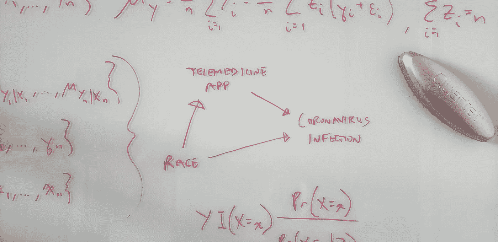

作者的玻璃板照片。

> 我们会夸大我们的远程医疗应用程序的有效性，声称它将新型冠状病毒感染的风险降低了 16.9%——而事实上它只会将这种风险降低 3.1%。

考虑一个关于虚假关联的经典例子的适时的假设扭曲:最近，冰淇淋的销量一直在下降——凶杀案的数量也在下降。但这并不是因为吃冰淇淋会让人去杀人。这是因为一项社区范围的就地避难的命令被颁布，以防止一种新的传染性病原体的传播。这个令人困惑的因素降低了冰淇淋的销量和凶杀案的数量；因此产生了虚假的相关性。

在这个由两部分组成的教程中，我们将研究一个合成数据集，该数据集受到最近一个涉及新冠肺炎种族差异的医疗保健案例的启发([加格等人，2020](https://www.cdc.gov/mmwr/volumes/69/wr/mm6915e3.htm)；[奥布里，2020 年](https://www.npr.org/sections/coronavirus-live-updates/2020/04/08/830030932/cdc-hospital-data-point-to-racial-disparity-in-covid-19-cases)。(合成数据是模拟的，而不是真实的，通常是为了教授或学习分析工具而创建的数据。)我们将遵循典型的数据科学分析工作流程。

我们的分析目标将是帮助我们模拟世界中的公共卫生当局减少新型冠状病毒(“冠状病毒”)感染。我们相信我们的**数字健康或远程医疗应用**可以帮助预防新的感染；例如，通过促进健康的生活方式选择——特别是在社交距离和就地庇护时——来降低冠状病毒感染的风险。但是要做到这一点，我们需要一个无偏的或统计上一致的(即，更大样本的无偏性)估计，来估计我们将要进行的干预的真实效果。

*   **辅导目标**:理解因果假设如何改变我们对预测的解释，将它们推向解释。在量化我们的技术解决方案的影响之前，理解为什么需要这样做。
*   **我们将学到什么**:如何识别建模联想和因果效应之间的区别。如何通过 g 公式进行因果推理([罗宾斯，1986](https://www.sciencedirect.com/science/article/pii/0270025586900886)； [Hernán 和 Robins，2006](https://jech.bmj.com/content/60/7/578.short) )和倾向得分加权( [Rosenbaum 和 Rubin，1983](https://academic.oup.com/biomet/article/70/1/41/240879)；[平野和伊本，2001](https://link.springer.com/article/10.1023/A:1020371312283)；[伦瑟福德和大卫安，2004 年](https://onlinelibrary.wiley.com/doi/abs/10.1002/sim.1903)。( [Pearl's (2009)](http://bayes.cs.ucla.edu/BOOK-2K/) *后门调整公式*与 g 公式密切相关。)

我们将了解混杂因素如何使我们对假设的远程医疗干预的潜在效果的估计产生偏差。从我们的合成数据中出现的偏差如下所示。

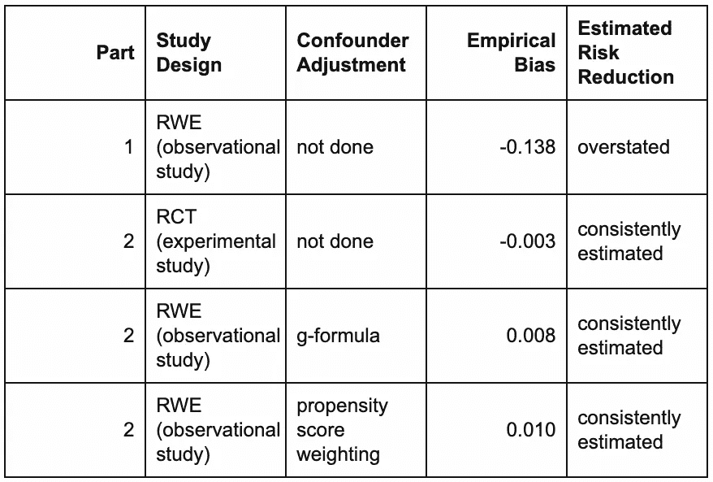

在第 1 部分中，我们将分析合成的真实世界证据(RWE)数据。我们将开始了解为什么一般来说，陈述因果机制(例如，有向无环图)和控制所有混杂因素是不够的——假设我们观察了我们数据集中的所有混杂因素。为了估计干预的真正效果大小和方向，我们必须更进一步。这一步使用了总期望法则，这是一个我们实际上一直在使用的简单直观的概念，我们将在第二部分中回顾。

我们将在[第二部分](/your-coronavirus-telemedicine-health-app-might-be-overrated-29989a9f7343?source=email-8430d9f1992d-1587482396812-layerCake.autoLayerCakeWriterNotification-------------------------166cf834_3f8b_4914_b9c2_31e05a5964bb&sk=80cef577e780551938c40676e27fe3b6)中通过分析来自一项合成随机对照试验(RCT)的数据得出结论，在该试验中，我们将应用随机分配给所有试验参与者的 50%。我们将学习如何使用总期望法则，通过 RWE 数据进行因果推断。(在 RWE 和 RCT 的数据集中，无论其他原因如何，该应用对感染风险的平均影响相同；也就是说，应用程序的使用与其他原因没有相互作用。)具体来说，我们将学习如何应用 g 公式(也称为“标准化”)和倾向得分加权来估计真实的总体或*平均治疗效果* (ATE)。

在第 1 部分中，我们将分析一个具有三个人级变量的合成 RWE 数据集:`infection`状态、`app`使用情况和`race`(为简单起见，仅黑或白)。

*   **第 1 部分目标**:尝试估算应用程序在感染中的使用率，但失败了。我们将 ATE 指定为感染风险的差异，或 [*风险差异*](https://en.wikipedia.org/wiki/Risk_difference)(RD)；具体来说，用户中的风险减去非用户中的风险。
*   **我们将学习**:如何识别统计对比(如研发)和因果效应之间的差异。混淆了前者和后者，从而错误地估计了 ATE，这将对公共卫生产生深远的影响。

我们将以关键的洞察力来结束第一部分，如果我们错误地从相关性中推断出因果关系:

**我们会夸大我们的远程医疗应用程序的有效性，声称它将新型冠状病毒感染的风险降低了 16.9%——而事实上它只会将这种风险降低 3.1%。**

# 数据集特征

观察到的(即非随机化的)RWE 数据在表`observational_rwe`中。(用附录中的 R 代码生成这个。)

```
glimpse(observational_rwe)## Observations: 80,000
## Variables: 3
## $ race      <chr> "White", "White", "Black", "White", "White", "White", "Whit…
## $ app       <chr> "used app", "used app", "didn't use app", "used app", "used…
## $ infection <chr> "1\. infected", "0\. uninfected", "0\. uninfected", "0\. uninfe… 
```

每个观察值(即行)代表最初易感和未感染的独特个体。变量及其唯一值如下:

```
knitr::kable(apply(observational_rwe, 2, unique)) 
```

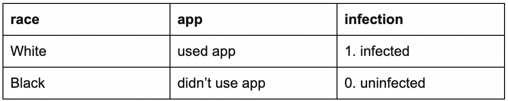

让我们将数据随机分为 80%的训练集用于探索性数据分析(EDA)，20%的维持集用于拟合解释模型( [Shmueli，2010](https://projecteuclid.org/euclid.ss/1294167961) )进行最终验证/确认分析。

```
holdout_proportion <- 0.2
observational_rwe <- observational_rwe %>% dplyr::mutate(rownum = row_number())
set.seed(2004120322)
observational_rwe_training <- observational_rwe %>% dplyr::sample_frac(1 - holdout_proportion)
observational_rwe_holdout <- observational_rwe %>% dplyr::filter(!(rownum %**in**%
  observational_rwe_training$rownum))

*# clean up: remove rownum*
observational_rwe$rownum <- NULL
observational_rwe_training$rownum <- NULL
observational_rwe_holdout$rownum <- NULL 
```

有 64000 个训练观察和 16000 个保持观察。

# 探索性数据分析

## 单变量关联

**相关矩阵**

```
dummy_rwe_training <- observational_rwe_training %>%
  dplyr::mutate(
    race = (race == "White"),
    app = (app == "used app"),
    infection = (infection == "1\. infected")
  )
knitr::kable(round(cor(dummy_rwe_training), 4)) 
```

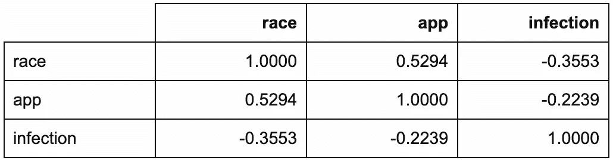

`corrplot::corrplot.mixed(cor(dummy_rwe_training))`

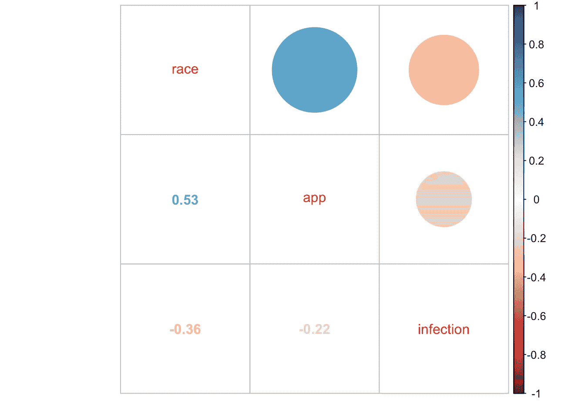

即使在这个简单的相关矩阵中，也已经有了未来挑战的迹象。你能认出他们吗？

**按应用使用分类的感染(边际模型)**

让我们检查一下我们的主要利益关系。

```
observational_rwe_training %>%
  ggplot2::ggplot(ggplot2::aes(x = app, fill = infection)) +
  ggplot2::theme_classic() +
  ggplot2::geom_bar(position = "dodge") +
  ggplot2::ggtitle("Infections by App Usage") 
```

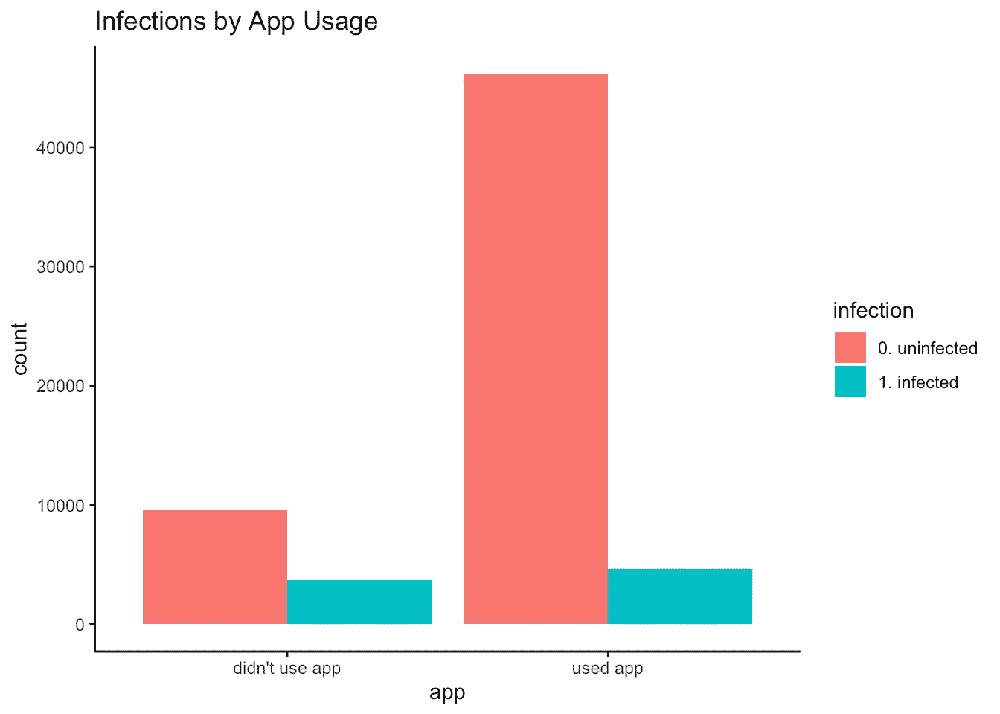

```
df_rwe_training <- with(
  observational_rwe_training,
  cbind(
    table(app, infection),
    prop.table(table(app, infection), margin = 1) # row proportions
  )
)
knitr::kable(df_rwe_training) # row proportions
```

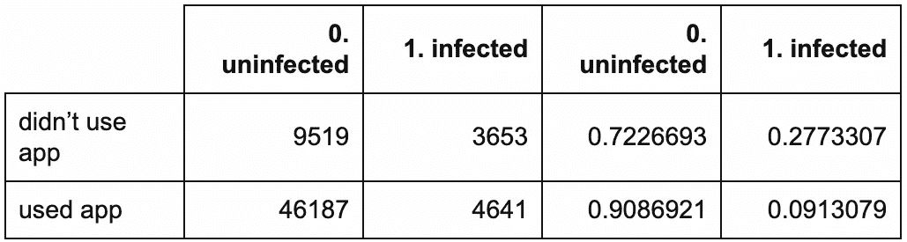

应用程序用户的感染率(即经验或观察到的感染风险)较低:只有 9.1%的用户感染了病毒，而非用户的感染率为 27.7%。经验 RD 是 0.091 - 0.277 = -0.186，这是一个统计意义上的*边际*量，因为它没有考虑(即“被边缘化”)任何其他变量。除了潜在的干预(这里是应用程序使用)之外，还考虑了其他变量(这里是种族)的模型被称为*条件*模型。

```
out_fisher_rwe_training <- with(
  observational_rwe_training,
  fisher.test(app, infection)
)
out_fisher_rwe_training## 
##  Fisher's Exact Test for Count Data
## 
## data:  app and infection
## p-value < 2.2e-16
## alternative hypothesis: true odds ratio is not equal to 1
## 95 percent confidence interval:
##  0.2493633 0.2749802
## sample estimates:
## odds ratio 
##  0.2618449 
```

此外，有强有力的统计证据(即，统计显著性)表明感染因应用使用而异(p_EDA << 0.001). Here, the estimated odds of infection for app users were only 0.262 (i.e., roughly a quarter) that of non-users, with an EDA 95% confidence interval (CI) of (0.249, 0.275).

*   **统计显著性并不意味着重要性**:这一强有力的统计证据并不令人惊讶。RWE 数据的典型样本越大，对结果均值中逐渐变小的差异提供的估计就越好(即，对于任何给定的具有有限均值和方差的结果分布集)。这与这些差异的领域(例如，科学、临床、研究、商业)有用性无关。
*   **相关性并不意味着因果关系**:这一发现并不意味着使用应用程序会降低感染风险。像这样的统计发现不能暗示因果关系。统计结果是因果关系的暗示，而不是相反。但是它应该促使我们进一步调查，并且应该与随后的发现和假说一起评估，以帮助解释这种联系是如何产生的。

**按种族分列的感染情况**

种族似乎在某种程度上与感染有关。

```
observational_rwe_training %>%
  ggplot2::ggplot(ggplot2::aes(x = race, fill = infection)) +
  ggplot2::theme_classic() +
  ggplot2::geom_bar(position = "dodge") +
  ggplot2::ggtitle("Infections by Race")
```

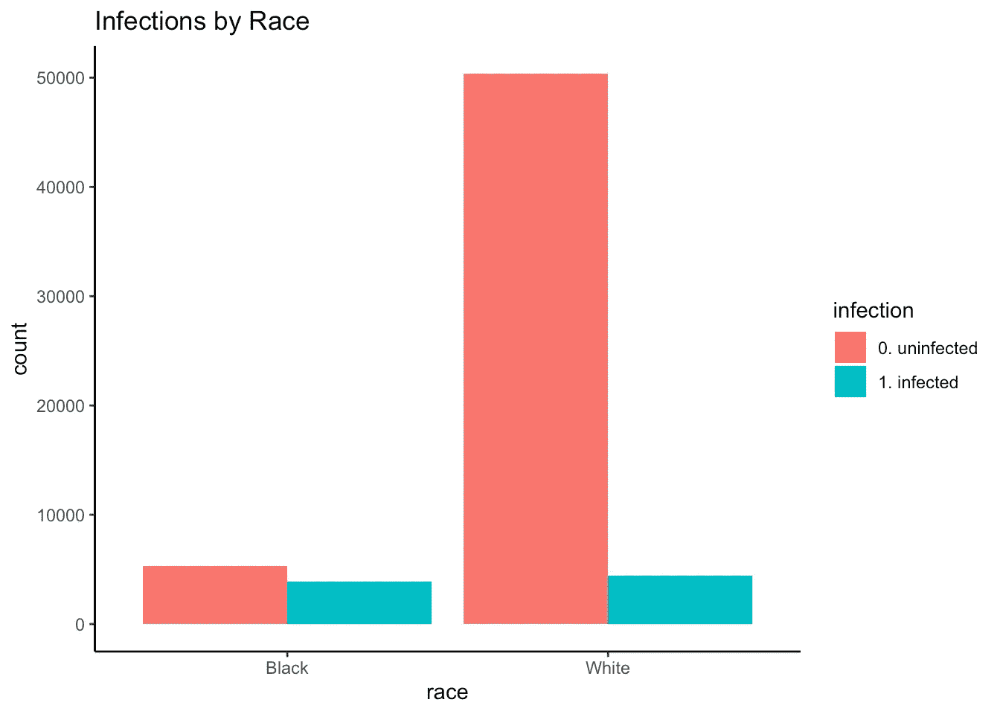

```
df_rwe_training_race_infection <- with(
  observational_rwe_training,
  cbind(
    table(race, infection),
    prop.table(table(race, infection), margin = 1) # row proportions
  )
)
knitr::kable(df_rwe_training_race_infection) # row proportions
```

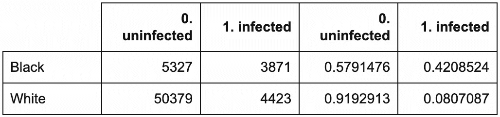

```
out_fisher_rwe_training_race_infection <- with(
  observational_rwe_training,
  fisher.test(race, infection)
)
out_fisher_rwe_training_race_infection## 
##  Fisher's Exact Test for Count Data
## 
## data:  race and infection
## p-value < 2.2e-16
## alternative hypothesis: true odds ratio is not equal to 1
## 95 percent confidence interval:
##  0.1147125 0.1272759
## sample estimates:
## odds ratio 
##  0.1208232 
```

非裔美国人比白人更有可能被感染(按种族划分的应用使用情况)

重要的是，种族似乎与应用程序的使用密切相关。

非裔美国人使用该应用的可能性低于白人(p_EDA << 0.001): Only 27.2% of African Americans used the app, compared to 88.2% of Whites. Put differently, the estimated odds of using the app for Whites were 20.001 (95% CI_EDA: 18.956, 21.108) times that of African Americans.

```
observational_rwe_training %>%
  ggplot2::ggplot(ggplot2::aes(x = race, fill = app)) +
  ggplot2::theme_classic() +
  ggplot2::geom_bar(position = "dodge") +
  ggplot2::ggtitle("App Usage by Race")
```

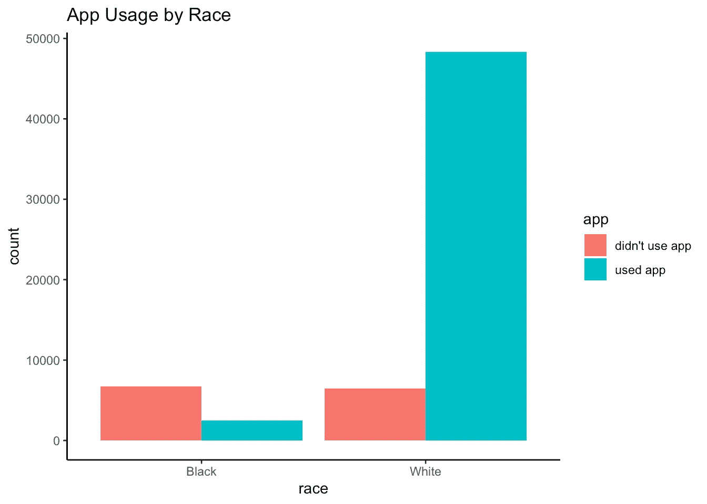

```
df_rwe_training_race_app <- with(
  observational_rwe_training,
  cbind(
    table(race, app),
    prop.table(table(race, app), margin = 1) # row proportions
  )
)
knitr::kable(df_rwe_training_race_app) # row proportions
```

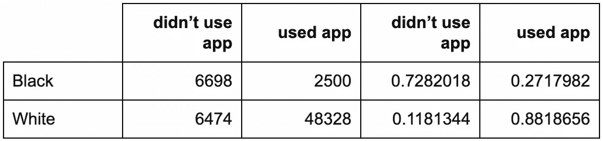

```
out_fisher_rwe_training_race_app <- with(
  observational_rwe_training,
  fisher.test(race, app)
)
out_fisher_rwe_training_race_app## 
##  Fisher's Exact Test for Count Data
## 
## data:  race and app
## p-value < 2.2e-16
## alternative hypothesis: true odds ratio is not equal to 1
## 95 percent confidence interval:
##  18.95585 21.10802
## sample estimates:
## odds ratio 
##   20.00128
```

This finding is plausible also due to structural inequality. For example, suppose our app was only available on iPhone. African Americans are less likely than Whites to own iPhones (e.g., page 7 of [Smith，2013](http://boletines.prisadigital.com/PIP_Smartphone_adoption_2013.pdf) )，这将限制他们对该应用的访问。一般来说，非裔美国人也更难获得远程医疗服务。

**解释性建模的含义**

这些发现暗示了我们应该如何估计 ATE？种族会影响应用程序的使用和感染风险吗？如果是这样的话，种族将会是一个混杂因素——这意味着我们早先的边际研发估计不足以作为 ate 的估计。(我们将在稍后的[第二部分](/your-coronavirus-telemedicine-health-app-might-be-overrated-29989a9f7343?source=email-8430d9f1992d-1587482396812-layerCake.autoLayerCakeWriterNotification-------------------------166cf834_3f8b_4914_b9c2_31e05a5964bb&sk=80cef577e780551938c40676e27fe3b6)中看到如何实现，以及为什么会这样。)

变量选择

## **预测建模**

假设我们决定拟合一个预测模型。我们认为这可能有助于我们决定是否应该在我们的最终解释模型中包括种族(除了应用程序的使用)。我们将用 logit link(即对应于逻辑回归)拟合 10 重交叉验证的岭正则化广义线性模型(GLM)。

我们将选择`app`而不管它的系数大小，因为它是我们潜在的干预。不过，我们注意到，自动搜索按系数大小排序的重要预测指标，会使`race`的排名高于`app`。我们想知道这样的程序怎么可能从我们所做的其他分析中排除系数较小的真正原因——这些原因对于推荐行动方案很重要。

```
set.seed(2004110254)
glmnet_rwe_training <- glmnet::cv.glmnet(
  x = model.matrix(
    object = infection ~ app + race,
    data = observational_rwe_training
  ),
  y = observational_rwe_training$infection,
  family = "binomial",
  type.measure = "auc",
  alpha = 0 # ridge: https://web.stanford.edu/~hastie/glmnet/glmnet_alpha.html
)
glmnet_rwe_training$glmnet_preds <- as.numeric(
  predict(
    object = glmnet_rwe_training,
    newx = model.matrix(
      object = infection ~ app + race,
      data = observational_rwe_training
    ),
    s = glmnet_rwe_training$lambda.min,
    type = "response"
  )
)
glmnet_ROC_rwe_training <- pROC::roc(
  response = observational_rwe_training$infection,
  predictor = glmnet_rwe_training$glmnet_preds
)
coef_glmnet_rwe_training <- coef(glmnet_rwe_training)
plot(glmnet_ROC_rwe_training) 
```

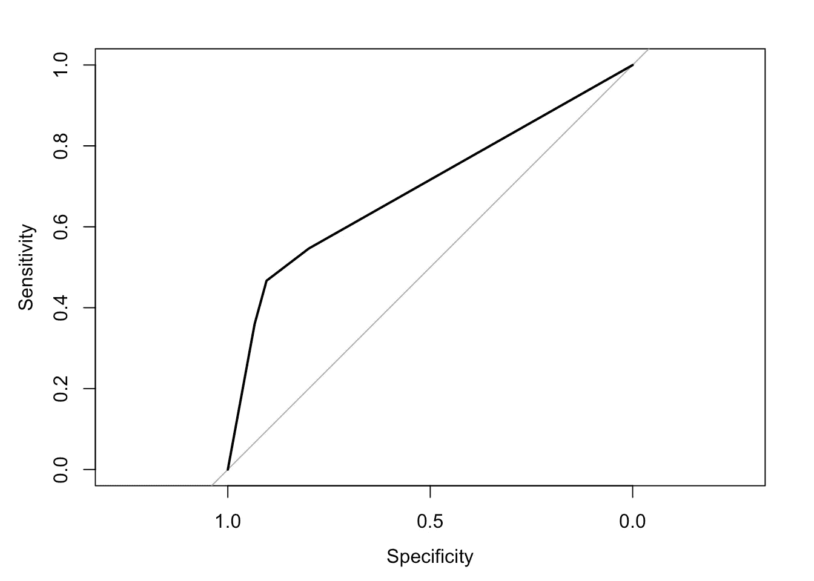

```
glmnet_ROC_rwe_training$auc # training set cross-validated AUC## Area under the curve: 0.6954coef_glmnet_rwe_training## 4 x 1 sparse Matrix of class "dgCMatrix"
##                        1
## (Intercept) -1.900132655
## (Intercept)  .          
## appused app -0.001874018
## raceWhite   -0.003428336 
```

重要的是，请注意受试者操作特征(ROC)曲线(AUC)下的面积并不是特别大，即使存在 app 使用对感染风险的**真实比率**。我们使用模拟参数和模型(见附录)将 ate 计算为-0.031。(我们将在[第二部分](/your-coronavirus-telemedicine-health-app-might-be-overrated-29989a9f7343?source=email-8430d9f1992d-1587482396812-layerCake.autoLayerCakeWriterNotification-------------------------166cf834_3f8b_4914_b9c2_31e05a5964bb&sk=80cef577e780551938c40676e27fe3b6)中推导出这个计算方法。)这个 ATE 的大小适中；因此 AUC 不大。

**“解释还是预测？”**这些发现强调了( [Shmueli，2010](https://projecteuclid.org/euclid.ss/1294167961) )中关于预测和解释的不同目标、程序和属性的要点。

**解释性建模的含义**

由于其相对较大的预测系数，我们决定在最终解释模型中保留`race`，即使在控制了`app`之后。

提出解释模型

## 解释性模型是由因果模型和统计模型组成的领域假设。

我们将使用我们的拒绝数据来验证或确认统计模型。

*   我们无法仅使用我们的 RWE 数据(培训或抵制)来验证或确认因果模型。我们需要进行一项实验或 RCT 来做这件事，或者从科学文献中提供支持我们提出的因果模型的证据。
*   我们*可以*——也应该！—清楚地陈述我们假设为真的因果模型。这是科学交流的一个关键部分:它帮助读者在采取进一步行动之前正确地解释和评估我们的发现。
*   为了用期望的统计能力和证据水平来拟合解释性统计模型，我们还需要指定样本大小。

**因果模型**

根据我们的发现，我们提出以下因果模型，形式化为有向无环图(DAG) ( [Pearl，2009](http://bayes.cs.ucla.edu/BOOK-2K/) ):

应用使用→感染

1.  种族→感染
2.  比赛→应用程序使用
3.  在这里，种族混淆了应用程序使用对感染的影响。

```
DiagrammeR::grViz("
digraph causal {

  # Nodes
  node [shape = plaintext]
  Z [label = 'Race']
  X [label = 'App \n Usage']
  Y [label = 'Infection']

  # Edges
  edge [color = black,
        arrowhead = vee]
  rankdir = LR
  X -> Y
  Z -> X
  Z -> Y

  # Graph
  graph [overlap = true]
}")
```

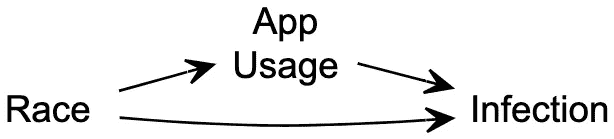

**统计模型和样本量**

根据我们的 DAG，将感染风险建模为种族和应用程序使用的函数是有意义的。我们提出以下逻辑模型。

应用程序用户的估计感染几率为非用户的 exp(-0.343)= 0.709(95% CI _ EDA:0.666，0.756)倍(不考虑种族)。按种族划分的应用程序使用的相应估计感染风险如下:

```
glm_rwe_training <- glm(
  data = observational_rwe_training,
  formula = as.factor(infection) ~ app + race,
  family = "binomial"
)
summary(glm_rwe_training)$coefficients##               Estimate Std. Error   z value     Pr(>|z|)
## (Intercept) -0.2280908 0.02278461 -10.01074 1.367266e-23
## appused app -0.3432987 0.03249127 -10.56588 4.289439e-26
## raceWhite   -1.9073638 0.03260492 -58.49926 0.000000e+00 
```

不使用该应用程序的非洲裔美国人为 0.443

```
risk_didnt_use_app_black_training <- plogis(coef(glm_rwe_training) %*% c(1, 0, 0))
risk_used_app_black_training <- plogis(coef(glm_rwe_training) %*% c(1, 1, 0))
risk_didnt_use_app_white_training <- plogis(coef(glm_rwe_training) %*% c(1, 0, 1))
risk_used_app_white_training <- plogis(coef(glm_rwe_training) %*% c(1, 1, 1)) 
```

*   使用该应用程序的非洲裔美国人为 0.361
*   不使用该应用程序的白人为 0.106
*   使用该应用程序的白人为 0.077
*   为了在α= 0.05 的总体统计证据水平下用 80%的统计功效估计非裔美国人的 RD，所需的样本量为:

每个应用使用群体中的 556 名非裔美国人(即用户或非用户)

```
# https://cran.r-project.org/web/packages/pwr/vignettes/pwr-vignette.html
sample_size_black <- ceiling(
  pwr::pwr.2p.test(
    h = pwr::ES.h(p1 = risk_used_app_black_training, p2 = risk_didnt_use_app_black_training),
    sig.level = 0.025,
    power = .80,
    alternative = "less"
  )$n
)
sample_size_white <- ceiling(
  pwr::pwr.2p.test(
    h = pwr::ES.h(p1 = risk_used_app_white_training, p2 = risk_didnt_use_app_white_training),
    sig.level = 0.025,
    power = .80,
    alternative = "less"
  )$n
) 
```

*   每个应用程序使用组中有 1617 名白人
*   请注意，这些数字是单边假设测试，即在每个种族群体中，应用程序用户的感染风险低于非用户*。他们通过要求两个单独的统计假设检验中的每一个都满足统计证据的α= 0.025 水平来调整[多重检验](https://en.wikipedia.org/wiki/Multiple_comparisons_problem)(即多重比较、多重性)。*

解释性建模(验证/确认)

# 回想一下，我们的维持数据集有 16000 个观察值。

按应用使用分类的感染(边际模型)

## 让我们首先检查我们的主要利益关系，就像我们对训练数据所做的那样。

和以前一样，应用程序用户的感染率较低:只有 9%的用户受到感染，而非用户的感染率为 26%。维持经验 RD 为-0.169，类似于训练经验 RD 为-0.186。

```
observational_rwe_holdout %>%
  ggplot2::ggplot(ggplot2::aes(x = app, fill = infection)) +
  ggplot2::theme_classic() +
  ggplot2::geom_bar(position = "dodge") +
  ggplot2::ggtitle("Infections by App Usage")
```


```
df_rwe_holdout <- with(
  observational_rwe_holdout,
  cbind(
    table(app, infection),
    prop.table(table(app, infection), margin = 1) # row proportions
  )
)
knitr::kable(df_rwe_holdout) # row proportions 
```


解释性模型

## **检查样本量**

对于每个应用程序的使用和种族组合，我们有足够大的样本来满足我们的统计能力和证据要求吗？

是的:每个应用程序使用群体中至少有 556 名非裔美国人，同样至少有 1617 名白人。

```
observational_rwe_holdout %>%
  ggplot2::ggplot(ggplot2::aes(x = race, fill = app)) +
  ggplot2::theme_classic() +
  ggplot2::geom_bar(position = "dodge") +
  ggplot2::ggtitle("App Usage by Race")
```


```
df_rwe_holdout_race_app <- with(
  observational_rwe_holdout,
  cbind(
    table(race, app),
    prop.table(table(race, app), margin = 1) # row proportions
  )
)
knitr::kable(df_rwe_holdout_race_app) # row proportions 
```

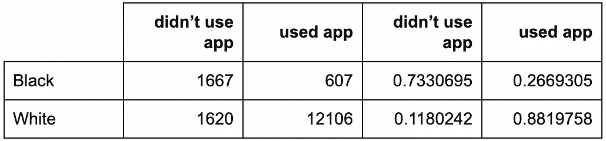

**拟合统计模型**

基于我们提出的因果和统计模型，我们符合以下逻辑模型。

在对种族进行控制后，有很好的统计证据(p < 0.001)表明应用程序使用和感染之间的关联。这证实了我们的训练数据发现。也有非常有力的统计证据(p <<< 0.001)表明种族与感染风险有关。具体来说，白人感染的估计几率是非洲裔美国人的 exp(-1.934) = 0.145 倍(95% CI: 0.127，0.165)(不考虑应用程序的使用)。

```
glm_rwe_holdout <- glm(
  data = observational_rwe_holdout,
  formula = as.factor(infection) ~ app + race,
  family = "binomial"
)
summary(glm_rwe_holdout)$coefficients##               Estimate Std. Error    z value      Pr(>|z|)
## (Intercept) -0.3220348 0.04608849  -6.987316  2.801938e-12
## appused app -0.2316567 0.06680031  -3.467899  5.245447e-04
## raceWhite   -1.9344662 0.06675370 -28.979159 1.204740e-184 
```

应用程序用户感染的估计几率为非用户(不考虑种族)的 exp(-0.232) = 0.793 倍(95% CI: 0.696，0.905)。按种族划分的应用程序使用的相应估计感染风险如下:

不使用该应用程序的非洲裔美国人为 0.42

```
risk_didnt_use_app_black_holdout <- plogis(coef(glm_rwe_holdout) %*% c(1, 0, 0))
risk_used_app_black_holdout <- plogis(coef(glm_rwe_holdout) %*% c(1, 1, 0))
risk_didnt_use_app_white_holdout <- plogis(coef(glm_rwe_holdout) %*% c(1, 0, 1))
risk_used_app_white_holdout <- plogis(coef(glm_rwe_holdout) %*% c(1, 1, 1)) 
```

*   使用该应用程序的非洲裔美国人为 0.365
*   不使用该应用程序的白人为 0.095
*   使用该应用程序的白人为 0.077
*   按种族估计的 RDs 为:

非裔美国人-0.055 (95%置信区间:-0.083，-0.025)

```
rwe_holdout_rd_black <- risk_used_app_black_holdout - risk_didnt_use_app_black_holdout
rwe_holdout_rd_white <- risk_used_app_white_holdout - risk_didnt_use_app_white_holdout
confint_glm_rwe_holdout <- confint(glm_rwe_holdout) # 95% CIs: odds ratios of infection
rwe_holdout_rd_ci_black <- c(
  plogis(confint_glm_rwe_holdout[, 1] %*% c(1, 1, 0)) - plogis(confint_glm_rwe_holdout[, 1] %*% c(1, 0, 0)),
  plogis(confint_glm_rwe_holdout[, 2] %*% c(1, 1, 0)) - plogis(confint_glm_rwe_holdout[, 2] %*% c(1, 0, 0))
)
rwe_holdout_rd_ci_white <- c(
  plogis(confint_glm_rwe_holdout[, 1] %*% c(1, 1, 1)) - plogis(confint_glm_rwe_holdout[, 1] %*% c(1, 0, 1)),
  plogis(confint_glm_rwe_holdout[, 2] %*% c(1, 1, 1)) - plogis(confint_glm_rwe_holdout[, 2] %*% c(1, 0, 1))
) 
```

*   -0.018 (95%置信区间:-0.022，-0.01)
*   结论和公共卫生影响

# 我们如何估计-0.031 的真实 ate？

尝试 1:抵制经验风险差异

## 我们可以简单地使用-0.169(即一个边际量)的维持经验 RD 作为我们的 ATE 估计值吗？

在我们的合成数据中，种族通过设计混淆了应用程序使用对感染风险的假定影响。将维持经验 RD 误认为 ate 估计值的**真实偏差**正好是-0.169 - -0.031 = -0.138。

这突出了一个关键点:

***假设我们把这个经验 RD 误认为是对 ate 的估计。我们不知道的是，*** 在我们的模拟世界中 ***我们会夸大我们的远程医疗应用的有效性，声称它降低了 16.9%的新型冠状病毒感染风险——而事实上它只会降低 3.1%的风险。***

> 一些公共卫生影响包括:

卫生当局将浪费宝贵的几周时间来部署我们的应用程序并评估其有效性。在此期间，本可以实施更有希望的解决方案。更多的人将成为新感染者，否则他们可能会幸免于难。

*   医院、政府机构和企业在制定计划时会错误地预计感染率会下降 16.9%。
*   尝试二:(未完待续……)

## 我们可以用我们的解释模型来估计 ate 吗？毕竟，我们把种族作为一个混杂因素。我们的种族特异性 RDs 估计值是否为-0.031 的真实 ate 估计值？不幸的是，答案是否定的:ATE 是所有其他变量的平均风险差*。(这是一个边际量，不是有条件的量。)*

那么，我们能否将 ate 估计为这些估计 RDs 的加权平均值？幸运的是，是的:g 公式确实做到了这一点，我们将在[第 2 部分](/your-coronavirus-telemedicine-health-app-might-be-overrated-29989a9f7343?source=email-8430d9f1992d-1587482396812-layerCake.autoLayerCakeWriterNotification-------------------------166cf834_3f8b_4914_b9c2_31e05a5964bb&sk=80cef577e780551938c40676e27fe3b6)中学习。我们将应用 g 公式来估计 ATE——以及另一种流行的方法，称为倾向得分加权。

但首先，我们将了解 RCT 如何让我们以统计一致或无偏的方式估计 ate。

参考

# Aubrey A. CDC 医院的数据指出了新冠肺炎案例中的种族差异。NPR。美国东部时间 2020 年 4 月 8 日下午 2:43。[NPR . org/sections/coronavirus-live-updates/2020/04/08/830030932/CDC-hospital-data-point-to-racial-disparity-in-新冠肺炎-cases](https://www.npr.org/sections/coronavirus-live-updates/2020/04/08/830030932/cdc-hospital-data-point-to-racial-disparity-in-covid-19-cases)

*   Garg S 年实验室确认的冠状病毒疾病住院患者的住院率和特征-COVID-NET，14 个州，2020 年 3 月 1 日至 30 日。MMWR。发病率和死亡率周报。2020;69.[cdc.gov/mmwr/volumes/69/wr/mm6915e3.htm](https://www.cdc.gov/mmwr/volumes/69/wr/mm6915e3.htm)
*   埃尔南·马，罗宾斯·JM。根据流行病学数据估计因果效应。流行病学与社区健康杂志。2006 年 7 月 1 日；60(7):578–86.[jech.bmj.com/content/60/7/578.short](https://jech.bmj.com/content/60/7/578.short)
*   平野 K，Imbens GW。使用倾向评分加权估计因果效应:对右心导管插入术数据的应用。健康服务和结果研究方法。2001 年 12 月 1 日；2(3–4):259–78.https://link.springer.com/article/10.1023/A:1020371312283
*   通过倾向评分评估因果治疗效果的分层和加权:一项比较研究。医学统计学。2004 年 10 月 15 日；23(19):2937–60.【https://onlinelibrary.wiley.com/doi/abs/10.1002/sim.1903 
*   珀尔 j .因果关系。剑桥大学出版社；2009 年 9 月 14 日。[bayes.cs.ucla.edu/BOOK-2K/](http://bayes.cs.ucla.edu/BOOK-2K/)
*   持续暴露期死亡率研究中因果推断的新方法——健康工人幸存者效应控制的应用。数学建模。1986 年 1 月 1 日；7(9–12):1393–512.[sciencedirect.com/science/article/pii/0270025586900886](https://www.sciencedirect.com/science/article/pii/0270025586900886)
*   罗森鲍姆公关，鲁宾 DB。倾向评分在因果效应观察研究中的核心作用。Biometrika。1983 年 4 月 1 日；70(1):41–55.[academic.oup.com/biomet/article/70/1/41/240879](https://academic.oup.com/biomet/article/70/1/41/240879)
*   智能手机的所有权-2013 年更新。DC 华盛顿:皮尤研究中心；2013 年 6 月 5 日。[boletines.prisadigital.com/PIP_Smartphone_adoption_2013.pdf](http://boletines.prisadigital.com/PIP_Smartphone_adoption_2013.pdf)
*   解释还是预测？。统计科学。2010;25(3):289–310.[projecteuclid.org/euclid.ss/1294167961](https://projecteuclid.org/euclid.ss/1294167961)
*   附录

# RWE 模拟参数和数据生成模型

## **特征分布**

种族:根据美国人口普查，白人的概率被设定为 Pr(*Z*= 1)=*π_ Z*= 0.8560091。

**结果模型**

*部分因果模型*

种族和应用程序的使用都会影响感染风险。部分 DAG 是:

应用使用(X) →感染(Y)

1.  种族(Z) →感染(Y)
2.  这是不全面的，因为我们还没有具体说明应用程序的使用和种族是如何关联的。

```
DiagrammeR::grViz("
digraph causal {

  # Nodes
  node [shape = plaintext]
  X [label = 'App \n Usage \n (X)']
  Z [label = 'Race \n (Z)']
  Y [label = 'Infection \n (Y)']

  # Edges
  edge [color = black,
        arrowhead = vee]
  rankdir = LR
  X -> Y
  Z -> Y

  # Graph
  graph [overlap = true]
}") 
```

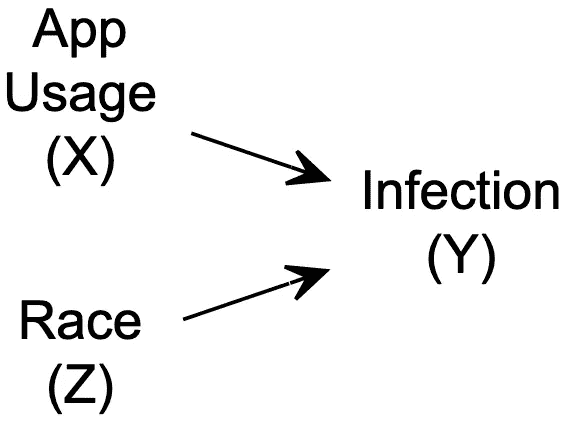

*统计模型*

应用程序用户(X=1)的感染风险低于非用户(X=0)。

*   由于结构性不平等(例如，更好的医疗服务、更高的社会经济地位、更少的潜在健康状况)，白人(Z=1)的感染风险低于非裔美国人(Z=0)。
*   这些统计关系由逻辑模型描述

其中β_ 0 =-0.2381882，β_ X =-0.3，β_ Z =-1.9469256。因此，给定种族和应用程序使用的感染概率为

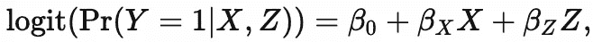

特别是，感染风险是:

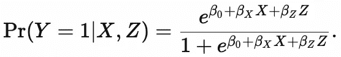

对于不使用该应用程序的非裔美国人，Pr(Y=1|X=0，Z=0) = 0.441

*   使用该应用程序的非裔美国人的 Pr(Y=1|X=1，Z=0) = 0.369
*   对于不使用该应用程序的白人，Pr(Y=1|X=0，Z=1) = 0.101
*   对于使用该应用程序的白人，Pr(Y=1|X=1，Z=1) = 0.077
*   我选择这些参数值来反映截至 2020 年 4 月 10 日的已知情况，正如最近一个涉及新冠肺炎种族差异的医疗保健案例中所报告的那样( [Garg 等人，2020](https://www.cdc.gov/mmwr/volumes/69/wr/mm6915e3.htm)；[奥布里，2020](https://www.npr.org/sections/coronavirus-live-updates/2020/04/08/830030932/cdc-hospital-data-point-to-racial-disparity-in-covid-19-cases) )和[这篇华盛顿邮报的文章](https://www.washingtonpost.com/news/powerpost/paloma/the-health-202/2020/04/09/the-health-202-los-angeles-is-racing-to-discover-the-true-coronavirus-infection-rate/5e8de70588e0fa101a75e13d/)。模拟中仿真的表是:

**倾向模型:应用使用**

```
a <- round((1 - prInfectionGivenBlack) * prBlack, 3)
b <- round(prBlackGivenInfection * prInfection, 3)
c <- round((1 - prInfectionGivenWhite) * prWhite, 3)
d <- round(prWhiteGivenInfection * prInfection, 3)
knitr::kable(
  dplyr::tribble(
    ~Race, ~Uninfected, ~Infected, ~`Row Total`,
    "Black", a, b, a + b,
    "White", c, d, c + d,
    "Column Total", a + c, b + d, a + b + c + d
  )
) 
```

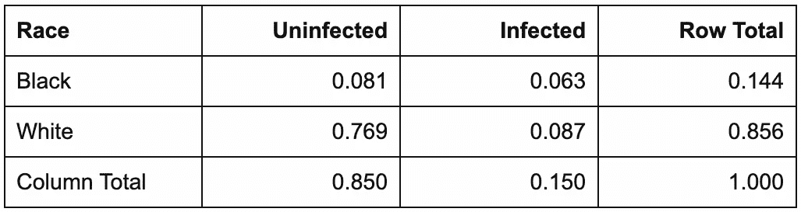

*部分因果模型*

种族影响应用使用。例如，假设我们的应用程序只能在 iPhone 上使用，而非裔美国人比白人更不可能拥有 iPhone(例如， [Smith，2013](http://boletines.prisadigital.com/PIP_Smartphone_adoption_2013.pdf) 第 7 页)。此外，假设非裔美国人很难获得远程医疗服务，因此往往不太了解这类应用程序。

也就是说，部分 DAG 是:

比赛(Z) →应用程序使用(X)

1.  *统计模型*

```
DiagrammeR::grViz("
digraph causal {

  # Nodes
  node [shape = plaintext]
  Z [label = 'Race \n (Z)']
  X [label = 'App \n Usage \n (X)']

  # Edges
  edge [color = black,
        arrowhead = vee]
  rankdir = LR
  Z -> X

  # Graph
  graph [overlap = true]
}")
```

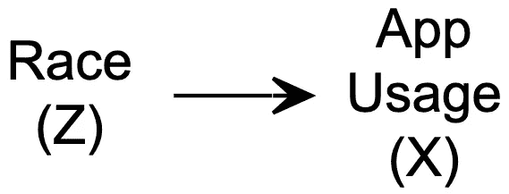

白人比非裔美国人更有可能使用这款应用。这种统计关系由逻辑模型描述

其中α_ 0 =-1，α_ Z = 3。因此，给定种族使用该应用的概率为

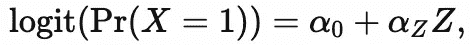

特别是:

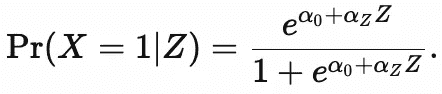

Pr(X=1|Z=0) x 100 = 26.9%的非洲裔美国人使用该应用程序

1.  Pr(X=1|Z=1) x 100 = 88.1%的白人使用该应用程序
2.  **因果模型**

完整的 DAG 是:

应用使用(X) →感染(Y)

1.  种族(Z) →感染(Y)
2.  比赛(Z) →应用程序使用(X)
3.  RWE 模拟 R 代码

```
DiagrammeR::grViz("
digraph causal {

  # Nodes
  node [shape = plaintext]
  X [label = 'App \n Usage \n (X)']
  Z [label = 'Race \n (Z)']
  Y [label = 'Infection \n (Y)']

  # Edges
  edge [color = black,
        arrowhead = vee]
  rankdir = LR
  X -> Y
  Z -> Y
  Z -> X

  # Graph
  graph [overlap = true]
}")
```


## 关于作者

```
##### Set simulation parameters

### Preliminaries
random_seed <- 2004101447
sample_size_observational <- 80000

### Feature distribution
piZ <- 0.755 / (0.755 + 0.127) # race (based on U.S. Census)

### Outcome model

# beta0 and betaZ are derived from:
#   https://www.cdc.gov/mmwr/volumes/69/wr/mm6915e3.htm
#   https://www.npr.org/sections/coronavirus-live-updates/2020/04/08/830030932/cdc-hospital-data-point-to-racial-disparity-in-covid-19-cases
#   https://www.washingtonpost.com/news/powerpost/paloma/the-health-202/2020/04/09/the-health-202-los-angeles-is-racing-to-discover-the-true-coronavirus-infection-rate/5e8de70588e0fa101a75e13d/

prInfection <- 0.15
prBlack <- 1 - piZ
prWhite <- piZ
prBlackGivenInfection <- 33 / (33 + 45)
prWhiteGivenInfection <- 1 - prBlackGivenInfection
prInfectionGivenBlack <- prBlackGivenInfection * prInfection / prBlack
prInfectionGivenWhite <- prWhiteGivenInfection * prInfection / prWhite

beta0 <- log(prInfectionGivenBlack / (1 - prInfectionGivenBlack)) # baseline: infection risk for African Americans who don't use app
betaX <- -0.3
betaZ <- log(prInfectionGivenWhite / (1 - prInfectionGivenWhite)) - beta0 # average influence of being White on infection risk

### Propensity model: app usage
alpha0_observational <- -1 # observational real-world evidence: baseline probability of using app for African Americans
alphaZ_observational <- 3 # observational real-world evidence: average influence of being White on probability of using app

##### Generate data.
set.seed(random_seed)
observational_rwe <- dplyr::tibble(
  race = rbinom(n = sample_size_observational, size = 1, prob = piZ),
  app = rbinom(n = sample_size_observational, size = 1, prob = plogis(alpha0_observational + alphaZ_observational * race)),
  infection = rbinom(n = sample_size_observational, size = 1, prob = plogis(beta0 + betaX * app + betaZ * race))
) %>%
  dplyr::mutate(
    race = ifelse(race == 1, "White", ifelse(race == 0, "Black", NA)),
    app = ifelse(app == 1, "used app", ifelse(app == 0, "didn't use app", NA)),
    infection = ifelse(infection == 1, "1\. infected", ifelse(infection == 0, "0\. uninfected", NA))
  )
```

# Daza 博士是一名生物统计学家和健康数据科学家，而不是流行病学家，他为个性化(n-of-1)数字健康开发因果推断方法。| ericjdaza.com[🇵🇭🇺🇸](https://www.ericjdaza.com/)@埃里克森 linkedin.com/in/ericjdaza|[statsof1.org](https://statsof1.org/)[@ stats of](https://twitter.com/statsof1)[@ fsbiostats](https://twitter.com/fsbiostats)

版权 2020 埃里克·j·达扎和 Stats-1。保留所有权利。

*职位也可在*[*https://rpubs.com/ericjdaza/599497*](https://rpubs.com/ericjdaza/599497)*获得。*

***编者注:*** [*走向数据科学*](http://towardsdatascience.com/) *是一份以研究数据科学和机器学习为主的中型刊物。我们不是健康专家或流行病学家，本文的观点不应被解释为专业建议。想了解更多关于疫情冠状病毒的信息，可以点击* [*这里*](https://www.who.int/emergencies/diseases/novel-coronavirus-2019/situation-reports) *。*

***Note from the editors:***[*Towards Data Science*](http://towardsdatascience.com/) *is a Medium publication primarily based on the study of data science and machine learning. We are not health professionals or epidemiologists, and the opinions of this article should not be interpreted as professional advice. To learn more about the coronavirus pandemic, you can click* [*here*](https://www.who.int/emergencies/diseases/novel-coronavirus-2019/situation-reports)*.*