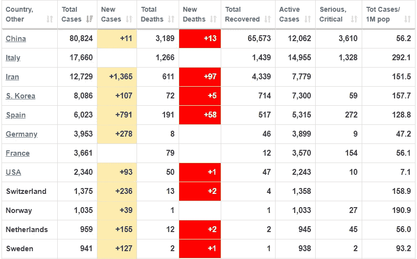
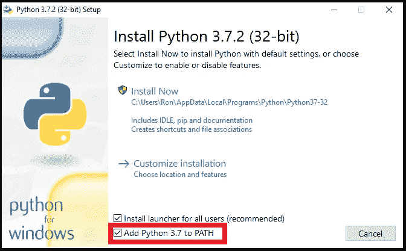
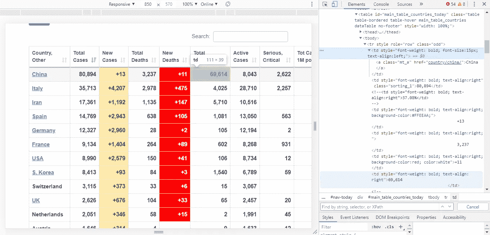
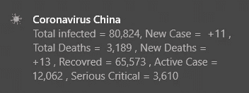
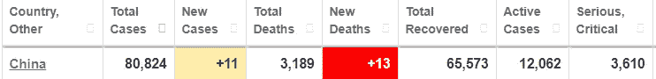
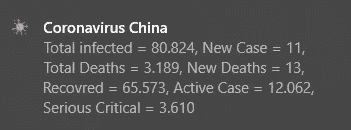
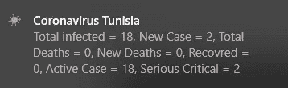
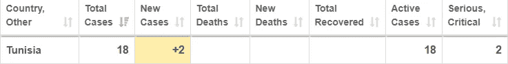

# 通过使用 Python 显示通知来跟踪您所在国家的冠状病毒

> 原文：<https://towardsdatascience.com/coronavirus-track-coronavirus-in-your-country-by-displaying-notification-c914b5652088?source=collection_archive---------9----------------------->

## 为了避免关于冠状病毒的假新闻，您可以创建一个 python 脚本来更新您的信息。

到被更新关于冠状病毒(新冠肺炎)在你居住的**地区的**传播**，我决定向你展示如何使用 python** 和一些库来获取数据和显示 Windows 10 *通知*。


背景图片由 [Felicity Yick](https://www.linkedin.com/in/felicity-yick-52256b152?originalSubdomain=hk) 经由[thedp.com](https://www.thedp.com/staff/felicity-yick)

# 过程设计

> "计划就是把未来带入现在，这样你现在就可以做些事情了."艾伦·莱克因


[medbadrc](https://unsplash.com/photos/ZSPBhokqDMc) 在 [Unsplash](https://unsplash.com/) 上拍摄的照片

首先，我们必须**找到一个可靠的网站** **提供我们需要的数据**。我决定在这个项目中使用[](https://www.worldometers.info/coronavirus/)**。**

****

**截图:[作者](https://medium.com/@ahmedazizkhelifi)**

**网站给了我们一个**现成的数据集**，不同的数据作为列，不同的国家作为行。**

**因此，我们必须**找到并过滤 web 元素，以获取数据**、**、**，然后**将其显示在通知上。****

# **设置环境**

**首先，我们需要**安装**[**Python**](https://www.python.org/downloads/)**和**将其添加到路径:******

********

****截图:[作者](https://medium.com/@ahmedazizkhelifi)****

****然后我们必须**安装 3 个库**:****

1.  ****[**win 10 toast**](https://github.com/jithurjacob/Windows-10-Toast-Notifications):*Python 库以* ***显示 Windows 10 的 Toast 通知。*******
2.  ****[**bs4**](https://www.crummy.com/software/BeautifulSoup/bs4/doc/):*Python 库用于* ***从 HTML*** *和 XML 文件中提取数据*。****
3.  ****[**请求**](https://requests.readthedocs.io/en/master/) : *一个优雅简单的* ***HTTP 库*** *为 Python*****

****要安装，打开**命令提示符** (CMD)和**键入**这些**命令**:****

****打开**命令提示符** (CMD)并输入这些命令**来安装**下面的 **python 包**:****

```
****pip install win10toast
pip install bs4
pip install requests****
```

****现在我们准备好**开始编码**。****

# ****编码****

****[](https://www.python.org/)****

****带上你的咖啡，让我们从**创建一个新的 python 脚本**和**导入**所有必要的**包**开始:****

```
****from win10toast import ToastNotifier
from bs4 import BeautifulSoup
import requests
import time****
```

****然后我们将**创建并初始化**一些**变量**:****

> ******变量*:类型:角色***
> `country`*:str:*国家名称
> `notification_duration` *: int :* 通知显示时间(秒)
> `*refresh_time*`*:**int:*两次通知之间的时间间隔(分钟)
> `*woldmetersLink*`*:*****

```
****country = "Tunisia"
notification_duration = 10
refresh_time = 10 #minutes
worldmetersLink = "[https://www.worldometers.info/coronavirus/](https://www.worldometers.info/coronavirus/)"****
```

****现在让我们**获取网页**:****

```
****try:
    html_page = requests.get(worldmetersLink)
except requests.exceptions.RequestException as e: 
    print(e) #ConnectionError
    continue****
```

****现在让我们**检查** [**网页**](https://www.worldometers.info/coronavirus/)**获取数据**。我们可以看到这个表在`div`标签中，所有的数据在`tbody`标签中，每个国家的信息在`tr -> td`中。
所以层级是:`div -> tbody -> tr -> td`****

********

****截图:[作者](https://medium.com/@ahmedazizkhelifi)****

****所以，我们使用 [**CSS 选择器**](https://www.crummy.com/software/BeautifulSoup/bs4/doc/#css-selectors) 到**来搜索匹配那些 CSS 类(div，tbody，tr，td)的标签**:****

```
****search = bs.select("div tbody tr td")****
```

****然后我们使用`[get_text](https://www.crummy.com/software/BeautifulSoup/bs4/doc/#get-text)()`方法**获取标签下的文本**(国家名称)**，**然后我们使用`[find](https://www.crummy.com/software/BeautifulSoup/bs4/doc/#find)()`来提取满足我们限制的第一个元素，即国家名称。****

```
****start = -1
for i in range(len(search)):
    if search[i].get_text().find(country) !=-1:
        start = i
        break****
```

****然后我们**将标签之间的数据**、**存储在一个数组中:******

```
****data = []
for i in range(1,8):
    try:
        data += [search[start+i].get_text()]
    except:
        data += [0]****
```

****现在我们必须**生成**一个 *str* ，其中包含通知的**消息**:****

```
****message = "Total infected = {}, New Case = {}, Total Deaths = {}, New Deaths = {}, Recovred = {}, Active Case = {}, Serious Critical = {}".format(*data)****
```

****是时候使用我们的 win10toast 模块了，我们从**创建一个对象到 ToastNotifier 类**开始:****

```
****toaster = ToastNotifier()****
```

****然后，我们使用 show_toast 函数，该函数接受以下参数:****

*******标题*** *:包含通知标题。* ***消息*** *:包含通知消息。* ***持续时间*** *”:指定通知销毁活动持续时间。* ***icon _ path****:它包含了到的路径。ico 文件。(那是可选的)(我用了一个图标，你可以在* [*Github 库*](https://github.com/AhmedAzizKhelifi/coronavirusTrackYourCountry) *上找到)。*****

```
****#toaster.show_toast(title, notification message, duration, icon)toaster.show_toast("Coronavirus in {}".format(country) , message, duration = notification_duration , icon_path ="icon.ico")****
```

****最后但同样重要的是，我们将代码放在一个**无限循环中:******

```
****While True :
#our code****
```

****并将此行添加到循环的末尾以**刷新**软件:****

```
****time.sleep(refresh_time * 60) #parameter in seconds****
```

# ****代码清理****

********

****图片由[杰马斯托克](https://www.freepik.com/jemastock)在[freepik.com](https://www.freepik.com/home)上拍摄****

****让我们看看国家=“中国”的**结果**:****

********

****Windows 10 通知截图:[作者](https://medium.com/@ahmedazizkhelifi)****

****嗯，我们可以看到**成功地抓取了数据**，但是**的格式不正确**，我们可以看到“+”、随机空格和“，”。****

****让我们清理一下我们的数组。事实上，data = ['80，824 '，'+11 '，' 3，189 '，'+13 '，' 65，573 '，' 12，062 '，' 3，610 ']或者我们想要**更干净的版本**所以我们要把它改成:data = ['80.824 '，' 11 '，' 3.189 '，' 13 '，' 65.573 '，' 12.062 '，' 3.610']****

> ****从:
> 数据= ['80 **，** 824 '，' **+** 11 **【T19 '，' 3 **，** 189 '，' **+** 13 '，' 65 **，** 573 '，' 12062 '，' 3 **，**610 '] **【T30]到:【t3t********

****我们将添加一个名为 data_cleanup 的**函数**，该函数**将一个不清理数组**作为参数**并清理它******

****让我们做一个**函数** **来为我们清洗数组**(它的**参数**就是**免清洗数组**)。我们称之为`data_cleanup`函数。记住，函数定义总是以`def`开头，后面是函数名、括号`(parameter)`和冒号`:`。****

****提醒:Python 字符串`[strip](https://docs.python.org/2/library/string.html#string.strip)()`方法:去掉字符串开头和结尾的空格:****

```
****def data_cleanup(array):
    L = []
    for i in array:
        i = i.replace("+","") 
        i = i.replace("-","")
        i = i.replace(",",".")
        if i == "":
            i = "0"
        L.append(i.strip())
    return L****
```

****所以**结果**是:****

```
****# " +3,420   " >>> "3.420"****
```

****现在我们只需在生成消息之前**使用这个函数:******

```
****data= data_cleanup(data)****
```

# ****成品****

********

****由 [Freepic](http://freepik.com/freepik) 在[Freepic.com](https://fr.freepik.com/vecteurs-libre/concept-programmeurs-design-plat_2456100.htm)上设计****

****让我们看看**最后的结果**吧:****

1.  ****国家=中国****

********

****截图:作者****

********

****Windows 10 通知截图:[作者](https://medium.com/@ahmedazizkhelifi)****

****2.国家=突尼斯****

********

****Windows 10 通知截图:[作者](https://medium.com/@ahmedazizkhelifi)****

********

****截图:[作者](https://medium.com/@ahmedazizkhelifi)****

****瞧😄****

****下面是 [**完整源代码**](https://github.com/AhmedAzizKhelifi/coronavirusTrackYourCountry) :****

****[](https://github.com/AhmedAzizKhelifi/coronavirusTrackYourCountry) [## AhmedAzizKhelifi/冠状病毒追踪你的国家

### 显示您所在国家的冠状病毒数据的 Windows 10 通知。…

github.com](https://github.com/AhmedAzizKhelifi/coronavirusTrackYourCountry) 

我将脚本打包在 **EXE 文件**中。你可以在[*git repos*](https://github.com/AhmedAzizKhelifi/coronavirusTrackYourCountry)*上找到**可执行文件**。*

# 更新

如果希望仅在数组值改变时显示通知**。**我们可以添加一个*新变量*(列表)`data_check`，初始化`data_check=[]`并将`time.sleep`(最后一行)替换为:

```
if data_check!= data:
    data_check = data
    toaster = ToastNotifier()
    toaster.show_toast("Coronavirus {}".format(country) , message, duration = notification_duration , icon_path ="icon.ico")   
else:
    time.sleep(refresh_time*60)
    continue
```

所以 [**最后的代码**](https://github.com/AhmedAzizKhelifi/coronavirusTrackYourCountry/blob/master/coronaV2.py) 在**添加了这个特性**之后看起来是这样的:

# 最后一句话

最后，我会提醒你注意安全，记住预防胜于治疗。


图片来源[worldindependant.com](https://worldindependant.com/china-needs-to-show-taiwan-respect-says-president/)**** 

******感谢阅读！😄******

****[](https://medium.com/@ahmedazizkhelifi)

查看**我的其他文章**并关注我的 [**中型**](https://medium.com/@ahmedazizkhelifi)**** 

****哈利菲·艾哈迈德·阿齐兹****