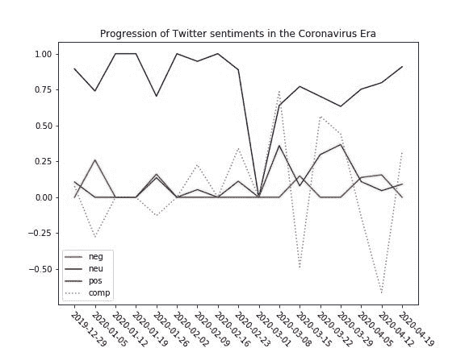
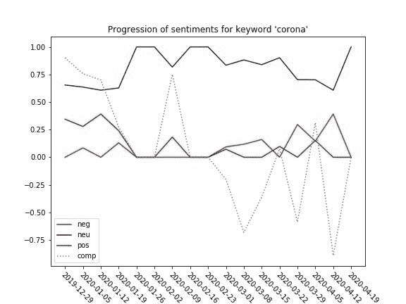
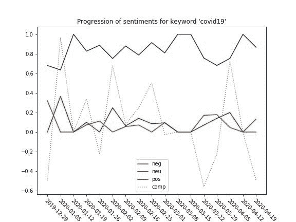
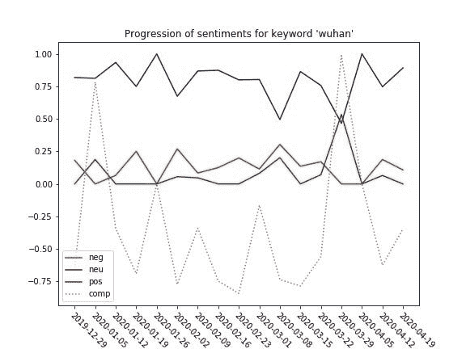
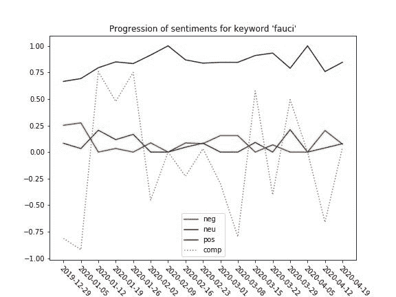

# 探索冠状病毒推特趋势

> 原文：<https://towardsdatascience.com/coronavirus-twitter-trends-d32fed5a027e?source=collection_archive---------40----------------------->

## 新冠肺炎·疫情改变了世界。它如何改变了我们的推文？

莎拉·谭和黛比·哈姆

来源: [edar](https://pixabay.com/users/edar-609103/) ，via: [pixabay](https://pixabay.com/illustrations/smartphone-twitter-mobile-phone-586944/) (CC0)

# 介绍

在过去的四个月里，疫情冠状病毒颠覆了全世界人民的生活。人们被敦促呆在家里，因为各国关闭了边境，争相减缓病毒的传播。学校已经关闭，学生已经被送回家继续虚拟学期(包括我们的留学项目 DIS Copenhagen)。

在这个前所未有的时代，人们做出了各种各样的反应。许多国家、政治领导人和世界卫生组织都因其对危机的处理而受到批评。特别是，自武汉疫情爆发以来，中国一直是仇恨的目标，因此，反亚裔种族主义有所抬头。像安东尼·福奇博士和纽约州州长安德鲁·科莫这样的人物在这场危机中脱颖而出。

我们想进一步了解冠状病毒时期是如何影响人们的观点、态度和心态的。我们将 Twitter 作为衡量这些变化的来源，Twitter 是一个微博和状态更新的社交媒体平台。

# 数据收集

世卫组织新冠肺炎时间轴上的第一个事件[发生在 2019 年 12 月 31 日，当时武汉市报告了](https://www.who.int/news-room/detail/27-04-2020-who-timeline---covid-19)[一系列肺炎病例](https://www.who.int/csr/don/05-january-2020-pneumonia-of-unkown-cause-china/en/)，并发现了一种新型冠状病毒。因此，我们选择那一周作为“冠状病毒时期”的起点。为了挖掘推文，我们使用了在 GitHub 上找到的[库，因为它允许我们通过关键词、日期和语言进行搜索。在 2019 年 12 月 29 日至 2020 年 4 月 25 日期间的每个星期，我们每个关键词收集(最多)1000 条推文，我们将搜索限制在英语热门推文。为了评估冠状病毒期间的总体趋势，我们每周额外收集 1000 条没有指定关键词的推文。](https://github.com/marquisvictor/Optimized-Modified-GetOldTweets3-OMGOT)

**关键词:**

*{ '冠状'，'病毒'，'冠状病毒'，' covid19' }*

*{ '亚洲'，'中国'，'中国'，'武汉' }*

*{ '福齐'，'库莫' }*

我们选择了一些与病毒直接相关的关键词，以及我们预计在频率或情感方面发生了变化的关键词。例如，我们有一组与中国相关的关键词，因为疫情始于中国武汉，并导致反亚洲情绪高涨。我们还有福奇和科莫，这两个人物在疫情事件后受到了关注。

**基线数据**:为了更清楚地了解这段时间内推文的变化，减少偏差，我们将通过挖掘疫情之前(1 月至 11 月)2019 年每个月的 1000 条热门推文来建立基线。通过与基线进行比较，我们希望将先前存在的趋势与可归因于最近事件的趋势区分开来。

**数据清理:**对于词频分析，我们分割字符串，然后删除停用词(由 nltk 库定义)、标点符号和链接。对于情感分析，我们只移除了链接。

# **方法**

为了确定推文的情绪，我们使用了 nltk 图书馆的 VADER 包。这个软件包给出了给定文本的四个不同的分数:负面、中性、正面和复合。前三个是与该类别对齐的文本比例，因此它们的总和总是 1。复合得分的不同之处在于，它是每个单词的化合价得分的标准化加权复合得分。这是一个有用的衡量标准，可以根据以下标准判断文本是负面、中性还是正面

*   负复合分数<= -0.05
*   neutral: -0.05 < compound score < 0.05
*   positive: compound score > = 0.05

对于每个关键词类别中的所有推文，我们计算了其情感得分。然后，我们按周确定该关键词类别的平均情感得分。这样做可以让我们跟踪人们对每个关键词的感受，以及从 12 月下旬到现在，这种感受是如何随着时间的推移而变化的。

对于词频分析，我们简单地统计了几周内每个关键词类别中每个词的出现频率。在这样做的时候，我们排除了计算关键词的频率，因为这些推文是通过寻找这些关键词挖掘出来的。从每个计数器中，我们找到 100 个最常用的单词，并将它们合并成一个集合。然后，我们利用这些数据创建了一个矩阵，其中列代表一周，行代表集合中的一个词，以及该词在该周推文中的出现频率。

# 结果

## 词频分析

我们通过为每个关键词创建词频矩阵并将其上传到[fluid](https://flourish.studio/)来创建条形图比赛动画。这些动画显示了最常用的词——一般 Twitter 数据集的前 25 个词和每个关键词的前 15 个词——按周显示，显示了主题受欢迎程度的变化。这些动画中显示的一些单词是没有意义的(例如，在一般的 Twitter 动画中，“like”是该数据集中最常见的第一个单词)，但我们仍然可以通过我们的数据观察到有意义的趋势。

与“fauci”连用的词频

经常与“中国”连用的词

在这两次关键词条形图竞赛中，我们看到最常用词的变化有相似的模式和时间线。在新冠肺炎时间线的早期阶段，每个关键词最常见的词都与当时其他紧迫的话题有关，与新冠肺炎无关。“福奇”一词中有流感或艾滋病毒等词，与流感季节、他作为 NIH 主任的角色以及他在艾滋病/艾滋病毒领域的突出地位有关。与此同时，“中国”的图表被政治关联的推文所主导，如伊朗、俄罗斯、美国和战争。然而，新冠肺炎开始以多种形式(如“冠状病毒”、“冠状病毒”、“病毒”等)迅速占据这两个排行榜的首位。对于“中国”，“病毒”首次进入前 15 名是在 1 月 5 日的那个星期，大约在这个时候，中国[首次宣布了一种神秘的类似肺炎的疾病](https://www.nytimes.com/2020/01/06/world/asia/china-SARS-pneumonialike.html)，我们现在知道这种疾病就是新冠肺炎。从那以后，“冠状病毒”以及与之相关的词，如“武汉”、“病例”和“爆发”，占据了图表的主导地位。同样，《福西》中“nih”、“transmission”和“director”等词的使用也在增加，因为公众被介绍给了福奇博士，他原本是一个相对不为人知的人物。

我们看到，在时间线的早期，Twitter 上的对话主要是关于病毒的信息和与病毒相关的数字。然而，我们看到从三月份开始，谈话从信息转移到更具政治微妙性的话题。“川普”迅速上升到排行榜的首位，反映了他在新冠肺炎的简报和他对新冠肺炎的观点/看法的流行。人们不是以医学或信息的方式寻找或谈论新冠肺炎；到目前为止，大多数人都非常熟悉这些信息。因此，随着政府机构和公众考虑并试图应对疫情的后果，关于这些术语的讨论范围扩大了。

经常与“电晕”一起使用的词

这个条形图比赛特别突出了人们对新冠肺炎的联想和特定主题。可以预见的是，在一开始,“电晕”推文中的热门词汇是“病毒”、“中国”、“中国人”等等。“特朗普”将在 2 月中旬进入图表，因为白宫冠状病毒特别工作组(White House Coronavirus Task Force)以及他的简报会开始认真进行。有趣的是，在此期间，“恶作剧”非常流行，这可能是由于缺乏对新冠肺炎的广泛了解以及当时新冠肺炎在美国的影响相对较小。然而，到了 3 月，“恶作剧”从排行榜的前 25 名中滑落，“停留”和“家”等词开始流行。随着各州发布居家隔离令，居家隔离成为许多人的新常态。

冠状病毒时期的常用词(2019 年 12 月 29 日至 2019 年 4 月 25 日)

与上面的关键词条形图比赛相比，我们在一般 Twitter 数据集中看到的单词更加多样，更不具体，这是可以预料的，因为这些单词来自随机的推文。从这张图表中，我们可以大致了解 Twitter 上的热门话题，以及不同话题与公众相关需要多长时间。例如，今年 2 月，“伯尼”进入了前 25 名，这与几场有争议的民主党初选的领先优势以及他的支持者对社交媒体的普遍使用相一致。

我们可能已经预料到“冠状病毒”或相关术语会在 2 月份出现得更多，因为此时世卫组织已经宣布进入全球卫生紧急状态，特朗普政府已经限制外国公民从中国旅行。相反，我们看到，“冠状病毒”在 3 月 1 日的一周首次出现在前 25 名中，在 3 月 8 日的一周达到顶峰，然后在 3 月 15 日的一周排名下降。这可能是偶然的，因为这些是随机的推文，但是也可以被解读为冠状病毒的最初恐慌，关于它的信息变得更加广泛，然后随着人们收集了足够多的关于 COVID-10 的信息，人们对它的关注度逐渐降低，他们开始适应新的“正常”。15 日的那一周，“隔离”也出现在图表上，反映了这一现象。

## **关键词提及增加**

在数据收集过程中，我们注意到，对于几个关键词，图书馆在最初几周检索到的数量远远低于 1000 条推特的限制。换句话说，这些关键词没有被广泛讨论。然而，随着时间的推移，他们的提及率直线上升。我们在这里绘制了他们每周的推文数量:

1 月 12 日当[中国宣布首例猪流感死亡](https://www.nytimes.com/2020/01/10/world/asia/china-virus-wuhan-death.html)时，提及“电晕”、“冠状病毒”和“武汉”的推文数量都达到峰值。这种病毒的科学术语“covid19”还需要一个月才能得到更广泛的使用。一个月后，福奇和科莫因为他们的持续努力获得了更多的关注。随着这座城市结束封锁，开始回归正常生活，提到“武汉”的次数似乎已经开始减少。

# ***情绪分析***

## 基线比较

作为基线，我们绘制了 2019 年 1 月至 11 月 Twitter 总体情绪的进展。首先，推特上的情绪似乎有很大的可变性。积极情绪通常在 1.00 到 0.50 之间，换句话说，陈述是 50%到 100%积极的。中性和负面情绪介于 0.0 和 0.30 之间。

在冠状病毒时期，我们预计正面情绪会减少，负面情绪会增加。然而，我们惊讶地发现*的负面情绪得分更低。在 3 月的第一周，积极情绪出现了一次明显的下滑，这一周美国报告了第一例死亡病例。*

## 通过关键字进行情感分析

**来自冠状病毒相关关键词的见解:**在疫情开始之前，术语“冠状病毒”大多与啤酒联系在一起。我们可以看到,“日冕”开始时的复合情绪始终高于零，或为正。然而，三月标志着意义的变化:复合情绪转化为消极情绪，消极情绪的水平呈上升趋势。

令人惊讶的是，新冠肺炎的负面情绪很低，而正面情绪很高。我们注意到“冠状病毒”也有类似趋势。复合情绪的最大跌幅出现在 3 月份，当时各国开始采取更严厉的措施。例如，欧盟禁止大多数旅行者进入欧盟之外。在美国，像加利福尼亚这样的州发布了就地安置令。查看原始数据，我们可以看到许多推文是关于病毒健康和安全更新的公告、新闻标题、筹款和推广病毒预防协议。所有这些话题都倾向于中性或积极的情绪。这里有几个例子:

> “100 万美元，这是你帮助我们在@脸书网站上为#COVID19Fund 在 24 小时内筹集的金额。每一点都有助于@世卫组织对抗#COVID19 疫情。但是我们现在不能停止，我们需要更多来对付#冠状病毒。加入战斗并捐款:[http://bit.ly/38Pz11x](http://bit.ly/38Pz11x)pic.twitter.com/4jwqgBWbt9"
> 
> “什么是# SocialDistancing？它意味着避免拥挤的地方和非必要的聚会。这是我们必须做的，以防止#COVID19 的传播，并帮助尽可能多的加拿大人保持健康。# cdn health pic . Twitter . com/3 O3 aw 6 vjpu "
> 
> 贾斯廷·特鲁多总理与魁北克省总理@ francoislegault 讨论了#COVID19 的发展。点击此处阅读通话摘要:【http://ow.ly/1CQJ50yLXuI

最初几周的情绪看起来与其余几周明显不同。查看原始数据，我们意识到该库提取了 twitter 句柄中带有“covid19”的用户的推文。因此，在前三周，推文中没有提到病毒，这解释了情绪上的差异。

**洞察中国相关关键词:**“武汉”是唯一一个对这段时间有意义的洞察的词。其他三个术语(“亚洲”、“中国”和“中国”)的波动与基线数据相似。与“病毒”关键字一起，这表明在此期间更一般的术语的用法没有显著变化。我们在整个期间观察到负面复合情绪，在 2020 年 1 月 5 日和 2020 年 4 月 5 日出现两次异常峰值。这并不奇怪，因为冠状病毒是在武汉首次报道的，许多人认为那里的早期病例处理不当。

**公众人物观点关键词:**我们预计福奇和科莫的人气会随着时间的推移呈上升趋势。然而，我们没有发现任何重大变化，他们的情绪波动与基线相似。我们确实观察到福奇的积极情绪得分略高于基线。虽然基线推文的正面情绪得分在 1.0 到 0.50 之间，但福奇的正面情绪得分在 1.0 到 0.75 之间，特别是在他越来越受欢迎的时候，

# 结论

我们承认，Twitter 数据可能无法准确代表所有人口统计的情绪和前景。如果我们使用不同的数据源，比如新闻媒体，我们可以期待看到非常不同的结果。受到冠状病毒负面影响的人可能不会在 Twitter 上发布消息，或者没有时间发布关于他们不幸的消息，特别是那些社会经济地位较低的人。名人和其他处于特权地位的人面临着社交媒体帖子的反弹，这些帖子对人们因疫情而面临的挑战麻木不仁。

总的来说，我们预计冠状病毒期间 Twitter 上的负面情绪会更高。我们期望看到更多的人抱怨隔离生活和社会距离。事实上，我们看到了一些中立情绪的高涨。作为一种潜在的解释，我们发现许多与冠状病毒关键词相关的推文都是关于新闻和健康/安全更新的。我们还预计在冠状病毒期间，对亚洲人的负面情绪会减少。然而，我们惊喜地发现，总体情绪保持不变。看到大量关于筹款、促进安全指南意识和认可一线工人的推文令人振奋。

# 参考

 [## Twitter 数据挖掘:挖掘没有 API 键的 Twitter 数据。

### 使用一行命令获取旧的 Twitter 大数据进行分析。

medium.com](https://medium.com/@IrekponorVictor/twitter-data-mining-mining-twitter-data-without-api-keys-a2a2bd3f11c)  [## 世卫组织时间轴-新冠肺炎

### 2019 年 12 月 31 日中国报告了湖北省武汉市的聚集性病例。一种新型冠状病毒最终被…

www.who.int](https://www.who.int/news-room/detail/27-04-2020-who-timeline---covid-19)  [## cjhutto/Vader 情操

### VADER 情绪分析。VADER(价感知词典和情感推理机)是一个词典和基于规则的情感…

github.com](https://github.com/cjhutto/vaderSentiment)