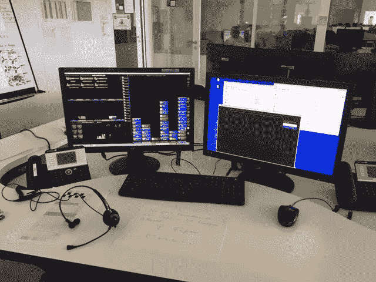

# 冠状病毒:使用机器学习对新冠肺炎患者进行分类

> 原文：<https://towardsdatascience.com/coronavirus-using-machine-learning-to-triage-covid-19-patients-980e62489fd4?source=collection_archive---------21----------------------->

## 分析和分类真实的病人咳嗽声。

***编者按:*** [*走向数据科学*](http://towardsdatascience.com/) *是一份以数据科学和机器学习研究为主的中型刊物。我们不是健康专家或流行病学家，本文的观点不应被解释为专业建议。想了解更多关于疫情冠状病毒的信息，可以点击* [*这里*](https://www.who.int/emergencies/diseases/novel-coronavirus-2019/situation-reports) *。*

***注:*** *本文讨论的方法背后的方法论来源于我和来自卡迪夫大学的*[*Irene Anthi*](https://twitter.com/IreneAnthi)*以及来自法国 CHU Montpellier 的 Patrick Fafet 博士之间的一个合作项目。*

# 介绍

在近 5 个月内，当前的新型冠状病毒(新冠肺炎)将爆发一年。尽管我们还远远不知道如何全面应对这种病毒，但我们已经看到了一些非常酷的社交距离技术解决方案(如点餐应用)，以及医疗领域的解决方案(如自动检测肺部 x 光片中的肺炎样迹象)。

几周前，我们共同的一个朋友带着一个假设找到了我们。Patrick Fafet 博士是法国蒙彼利埃 CHU 的医学博士，他和他的团队对通过电话表达 COVID 症状的患者进行了分类。他们很快意识到，除了已知的病毒症状外，患者是否患有 COVID 的一个可能指标是他们咳嗽的区别。随着突然激增的患者打电话并要求由医生进行测试或检查，需要一种支持对可能的 COVID 患者进行分类的解决方案。

已知呼吸声具有诊断特性。也有一些初步证据表明，呼吸声，特别是咳嗽，可能是病毒的迹象。直到最近，这种信号通常是在使用听诊器进行人工听诊时收集的。研究现在已经开始使用数字技术来收集身体的声音，并对数据进行自动分析。

这篇文章讨论了我们应用机器学习来分析和分类 COVID 阳性和 COVID 阴性患者咳嗽声的初步方法。本实验中使用的数据是使用电话分诊系统从真实患者收集的，并同意用于训练学习模型。这些数据目前还不能公开。

# 数据分析

用于构建模型基础的初始数据集由 251 个. mp3 文件和一个. csv 电子表格组成，该电子表格详细说明了它们的 ID 和作为其标签的 COVID 测试结果。

一些患者详细信息的分布显示在下面的直方图中。这些数据包括大量阴性 COVID 患者，以及大量女性参与者和不吸烟的参与者。该数据集还包括年龄在 8 至 81 岁之间的患者，其中大部分患者年龄在 22 至 34 岁之间。

患者在数据集中的分布

Fafet 博士指出，对于人耳来说，COVID 和非 COVID 咳嗽之间的主要区别之一是患者的吸气有多不清楚。在这种情况下，我们首先分析了患者咳嗽的差异，特别是咳嗽后吸入空气的差异。

当我们谈论声音时，我们通常谈论一系列不同压力强度的振动。所以想象声音意味着以某种方式想象电波。我们可以通过将音频文件转换成频谱图来实现这一点。频谱图是信号随时间变化时频谱的直观表示。

为了将数据转换成声谱图表示，我们使用了 [LibROSA](https://librosa.github.io/librosa/) ，这是一个用于音乐和音频分析的开源 Python 包。由此产生的表示可以显示为 2D 图像，并被称为短时傅立叶变换(STFT)。由于人类以对数标度感知声音，我们将 STFT 转换为[梅尔标度](https://en.wikipedia.org/wiki/Mel_scale)，这是频率标度非线性转换的结果。这个 Mel 标度被构造成使得在 Mel 标度上彼此距离相等的声音对于人类来说也是“听起来”的，因为它们彼此距离相等。LibROSA 库允许我们加载一个音频文件，并使用以下代码片段将其转换为 melspectrogram:

音频到声谱图由 [achillessin](https://gist.github.com/achillessin) 提供

在对光谱图进行人工分析后，阳性和阴性患者之间的吸气差异很明显。可以看出，与阳性患者相比，阴性 COVID 患者咳嗽后的进气清晰度。在同一个光谱图中，我们用绿色标记来识别病人在哪里吸气。通过眼睛，可以看到 COVID 患者咳嗽后的吸气不清晰，并且检测到一些低频声音。

阴性(左)和阳性(右)新冠肺炎咳嗽频谱图

阴性(左)和阳性(右)新冠肺炎咳嗽谱图——分析吸入剂

# 特征选择

数据集预处理、特征提取和特征工程是从底层数据中提取信息的步骤。在机器学习的背景下，这些信息对于预测样本的类别应该是有用的。在音频分析中，这一过程很大程度上是基于找到音频信号中有助于将其与其他信号区分开来的成分。

我们用基于频率的变量分析了咳嗽的声音。这些指纹捕捉通用的音频信息，并对无法轻易手工制作的细微差别或模式进行编码。Joel Jogy 的名为' [*的帖子我是如何理解的:在训练音频文件时需要考虑哪些特性？*](/how-i-understood-what-features-to-consider-while-training-audio-files-eedfb6e9002b) 概述了为音频分类任务建立模型可能需要的一些最重要的特征，并包括如何使用 LibROSA 提取这些特征。

从咳嗽样本中提取的一些特征是:

*   基于色度的特征，计算信号中存在的每个半音音高类别(c、C♯、d、D♯、e、f、F♯、g、G♯、a、A♯、b)的数量。
*   梅尔频率倒谱系数。Pratheeksha Nair 的帖子名为“[*MFCC 假人指南*](https://medium.com/prathena/the-dummys-guide-to-mfcc-aceab2450fd) ”指出，人类发出的任何声音都是由其声道的形状决定的(包括舌头、牙齿等)。如果这个形状能够被正确地确定，那么产生的任何声音都能够被准确地表现出来。
*   过零率衡量给定时间帧内信号幅度通过零值的次数。
*   频谱质心是给定声音的“亮度”指标，代表频谱重心。如果你要取频谱，用它做一个木块，试着在你的手指上平衡它(横过 X 轴)，当它成功平衡时，频谱质心将是你的手指“接触”的频率。
*   频谱滚降是指包含 99%频谱能量的频率。
*   与其响度对应的波形的均方根(RMS)。

# 神经网络

一旦我们成功地从底层音频数据中提取了特征，我们就开始用 Keras 和 Tensorflow 后端拟合一个简单的神经网络。

Gideon Mendels 的“帖子名为“ [*”如何将机器学习和深度学习方法应用于音频分析*](/how-to-apply-machine-learning-and-deep-learning-methods-to-audio-analysis-615e286fcbbc) ”介绍了如何将音频特征转换为 NumPy 数组，如何对分类标签进行编码，以及如何将数据拆分为训练集和测试集。在我们的例子中，我们将数据分成 70%的训练和 30%的测试。我们还缩放特征值。也就是说，我们转换数据，使其符合 0 和 1 的范围。

一旦设置了参数，您就可以使用类似于以下代码的内容来定义和编译一个简单的神经网络架构。由于这是一个二元分类问题，即我们试图对咳嗽声是 COVID 阳性还是 COVID 阴性进行分类，因此应该说明二元交叉熵。

关于神经网络的更多内容，我们强烈推荐杰森·布朗利(Jason Brownlee)的电子书《机器学习大师*》。*

*一旦训练完成，就对模型进行评估。基于最初的小数据集，我们的结果表明咳嗽声可以以近 80%的准确率预测新冠肺炎。*

# *结论*

*那么，我们从这个分析中学到了什么？*

*这些结果仅仅触及了这类数据潜力的表面；虽然我们的结果是一个积极的迹象，但它们还不足以构成一个独立的筛选工具。准确检测咳嗽声的细微差别是一项非常具有挑战性的任务。*

*然而，该模型被释放到野外，并集成为电话录音软件的一部分。这是为了确保从受试患者那里收集更多的数据。用新收集的数据系统地重新训练该模型，并且调整参数以实现尽可能高的精度。应答者根据他们的咳嗽得到呼叫者患 COVID 可能性的准确度分数。利用该信息以及其他症状和他们与患者的对话，应答者能够确定患者是否需要被查看和/或测试。*

*作为改进模型的一部分，我们的下一步是研究咳嗽声的频谱图是否也可以被纳入。声音分类的要素也可以作为使用卷积神经网络的传统图像分类任务来处理，这可以实现更高的精度。*

**

*整合到分类软件中的新冠肺炎咳嗽分析仪*