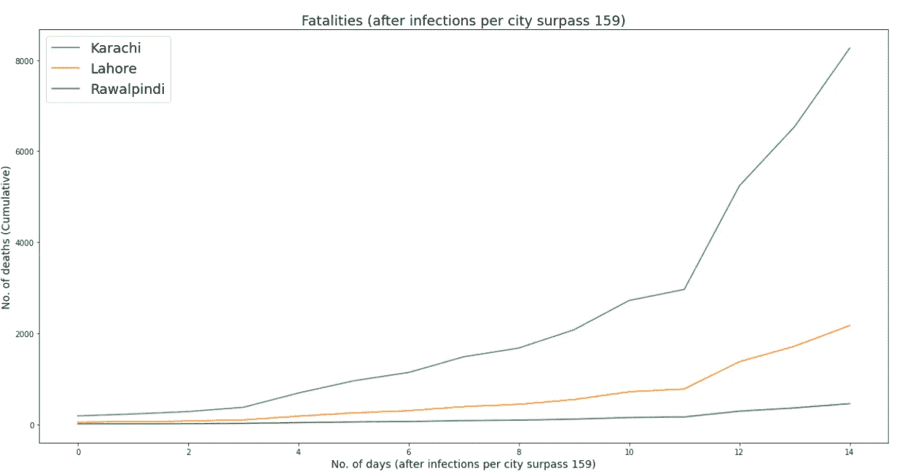

# 冠状病毒:发展中国家面临什么威胁？

> 原文：<https://towardsdatascience.com/coronavirus-what-does-the-data-say-for-pakistan-cacfe51b76c3?source=collection_archive---------1----------------------->

## 让数据科学变得有趣

## 初步数据分析，用于评估感染人数上升后巴基斯坦面临的风险

[疾控中心](https://unsplash.com/@cdc?utm_source=unsplash&utm_medium=referral&utm_content=creditCopyText)在 [Unsplash](https://unsplash.com/s/photos/coronavirus?utm_source=unsplash&utm_medium=referral&utm_content=creditCopyText) 拍摄的照片

*注:本文* ***并不预测*** *巴基斯坦的冠状病毒病例数，因此，不应该成为恐慌的来源。相反，本文估计了特定情况下的病例数，* ***当且仅当那些*情况*发生*** *时，以强调及时预防措施的重要性。*

最近几周，由于冠状病毒，世界上发生了很多事情。随着死亡人数的上升和边境的关闭，像巴基斯坦这样的发展中国家在情况变得更糟之前能从其他国家学到什么？

考虑到巴基斯坦的动态和人口结构，我将尝试根据世界上一些遭受严重打击的国家来估计巴基斯坦的**潜在风险，以努力强调**开始认真对待它**的重要性。以下是我在这篇文章中将要涉及的内容:**

*   世界冠状病毒病例和死亡病例概要。
*   如果不及早遏制，巴基斯坦的情况会有多糟糕？
*   巴基斯坦的卫生基础设施能够应对吗？
*   【概要】是否可以避免？巴基斯坦人能做什么？

# 1.世界冠状病毒病例和死亡病例概要

注:文章发表后，数字可能会改变。

在撰写本文时，新冠肺炎冠状病毒已经传播到全球超过 176 个国家和地区。虽然中国和韩国等少数国家似乎已经控制住了病毒，因为新病例数量正在迅速减少，但在世界其他地区，病毒刚刚开始呈指数增长。

随着超过 221，926 例确诊病例和 8，999 例死亡，各国政府被迫关闭边境、市场、学校和机构，并采取许多其他严厉措施试图遏制病毒。

让我们首先简要地看一下与中国、韩国、欧洲和美国的病毒传播相关的一些图表。

## 确诊感染病例

下图显示了世界上一些受影响最严重的国家的确诊病例数。

图 1:全球冠状病毒确诊病例数

由于中国采取了严厉的措施，那里的新病例数量最终似乎有所下降，但情况正呈指数级增长，在 T2、T4、欧洲、美国和美国，情况变得更糟。让我们放大图表的这一部分。以下是除中国以外的国家的图表:

图 2:全球冠状病毒确诊病例数(不包括中国)

## 命运

由于许多因素的影响，不同地区和国家的死亡率确实不同，但⁴的最新研究估计全球死亡率为 1.4%**，大大低于先前估计的 2-3%。**

以下是不同国家的死亡人数图表:

图 3:全球冠状病毒致死病例数

放大呈指数增长的曲线，我们会看到下面的图表:

图 4:全球(不包括中国)因冠状病毒导致的死亡人数

本节中的所有图表应该为您提供足够的线索，说明该病毒如何在人群中呈指数级传播，并且对于许多国家来说，这似乎只是灾难性情况的开始。

即使整个世界立即停止，新病例仍将呈指数级出现**至少再过 5-14 天**，因为这是病毒的潜伏期，使医疗系统和基础设施的情况恶化。

巴基斯坦人应该期待什么？

*   预计在接下来的几周内，即使采取了严厉的措施，病例数仍会增加。
*   这种病毒不分国界，如果政府和人民不采取足够的预防措施，它会很快降临到你头上。
*   如果疫情扩散到一定程度，预计贵国的经济和基础设施将受到严重影响。

# 2.如果不及早遏制，巴基斯坦的情况会有多糟糕？

> **坏消息:**与许多其他国家相比，巴基斯坦主要城市的感染人数可能会高得多(非常非常高)。
> 
> **好消息:**巴基斯坦的死亡率(占确诊病例的百分比)可能会低得多。

根据目前有限的数据，很难预测巴基斯坦的感染和死亡人数，事实上，此时任何预测都只是猜测，可能会导致恐慌。

然而，除了预测感染人数，我们可以尝试将病毒呈指数传播的其他国家的数据和情况应用到巴基斯坦的人口统计中，并尝试估计巴基斯坦的数字，只有在情况变得更糟的情况下。

我将以德国的情况为例，因为它:

*   不是病毒的起源。
*   拥有良好的卫生基础设施(最大限度地减少医疗管理不善的影响)。
*   在指数增长之前没有采取足够的预防措施。

**关于巴基斯坦的一些事实**

*   世界上人口最多的五个国家之一，有几个城市人口密度很高。
*   与意大利/欧洲相比，一天的平均社交圈和互动要高得多。(无数据，这是我个人观察)
*   与德国/欧洲相比，国际游客的数量要少得多。另一方面，国内旅游业规模可观。
*   拥有世界上最年轻的人口。

巴基斯坦主要城市的高人口密度和较高的平均社交圈有助于病毒的传播，而国际游客数量的减少会产生相反的效果。

## 2.1 病毒传播与人口密度

假设人口密度与病例增加率至少有某种联系是很直观的，但这需要根据数据进行验证。

一个技巧是预测一些国家相对于中国的人口密度的累计病例数，看看它们是否会变得相似，就像它们的人口密度一样。密度变得相似。

图 5:一些国家/地区的人口密度

左边的图表显示了武汉(中国最大的城市)、德国和意大利的人口密度。

我们想看看，如果德国和意大利的人口密度接近武汉的人口密度，它们的冠状病毒病例上升会是什么样子。

我将德国和意大利的冠状病毒病例数曲线换算成它们与武汉人口密度的比率，随着它们的人口密度接近武汉，曲线变得非常相似。

下面的图 6 解释了这种行为。为了便于比较，曲线也被时移。

*注:为简单起见，并且因为每个国家的主要地区感染人数最多，所以没有使用个别地区的曲线。*

图 6:基于相对人口密度的预测感染

上面的图表是什么意思？

它表明，如果不同国家的人口密度相似，那么它们的感染率会变得非常相似。但是这种**只有在案例达到某个阈值**后才会发生(因为曲线需要时移)。

每个国家和地区的门槛不同(见下图 7)。在本文的其余部分，我们将这个阈值称为**感染阈值。**

> 在一定数量的感染被确认后，不同国家的病例(指数)增长是相似的。
> 
> 人口密度越高，病毒传播越快

重要的是要明白，实验**并不一定**意味着感染的增加与人口密度**成正比，因为可能有太多其他因素参与其中。**

> 任何基于两个国家相对人口密度的估计都可能只能表明，如果一个国家开始出现类似的情况，那么基于另一个国家的估计会有多少病例。

## 2.2 冠状病毒感染的估计数量

如前所述，预测一个国家的冠状病毒病例是不太可能的，因为有太多的未知因素，这篇文章*并不打算通过猜测来煽动恐慌。*

因此，我将使用德国的病毒传播率，根据巴基斯坦主要城市与德国的相对人口密度(在病例数超过阈值后)，找出这些城市可能的感染人数。这实际上意味着:

> 如果巴基斯坦开始出现类似德国的情况，卡拉奇、拉合尔和拉瓦尔品第的病例数超过某个阈值，我们很容易接近本节估计的冠状病毒病例数，除非提前采取预防措施。

让我们从比较卡拉奇、拉合尔和拉瓦尔品第(巴基斯坦的三大城市)相对于其他地区/国家的人口密度开始。

图 7:几个地区/国家的人口密度(平方公里)

卡拉奇和拉合尔非常高的人口密度很容易成为冠状病毒的温床，可能会在很短的时间内导致非常高的感染人数。

下图显示了卡拉奇、拉合尔和拉瓦尔品第感染人数的估计增长，在每个城市超过 159 例感染(巴基斯坦三个城市的感染阈值)后，如果巴基斯坦发生类似德国的情况。

卡拉奇、拉合尔和拉瓦尔品第的相对人口密度系数取自图 7，然后乘以图 6 的德国感染上升曲线，分别估算卡拉奇、拉合尔和拉瓦尔品第的感染上升。

图 8:巴基斯坦主要城市的估计感染情况(如果每个城市超过 159 例)

上图显示，如果病毒的传播没有在早期阶段得到控制，巴基斯坦人口密集地区将面临潜在的灾难性局面。

> 如果没有采取预防措施，卡拉奇的病例数超过 159 例，并且病毒像在德国一样传播，那么卡拉奇可能在接下来的 14 到 16 天内有超过 50 万的感染者。

希望这永远不会发生，因为巴基斯坦政府似乎已经开始采取一些措施试图控制病毒。但是如果真的发生了，那么 T2 的前景对巴基斯坦来说将会非常黯淡。

## 2.3 估计死亡人数

> 巴基斯坦是世界上人口最年轻的国家之一，这可能会导致更低的死亡率(确诊+确诊病例的百分比)

我们还没有非常准确的冠状病毒死亡率，因为疫情仍在进行中，还有许多未解决的感染病例。这也确实取决于地区和国家，在韩国的 0.6%和伊朗的 4.4%之间，我们应该使用哪个？

对于这个案例研究，不同年龄组世界平均死亡率应该足够了。

例如，让我们比较一下巴基斯坦和 Italy⁴的人口年龄组以及全球冠状病毒死亡率。

图 9:意大利和巴基斯坦年龄组与冠状病毒死亡率的比较

图 8 显示了**对巴基斯坦相对积极的**画面。巴基斯坦的人口(蓝绿色条)比意大利的人口(橙红色条)年轻得多，估计表明老年人口的死亡率**高得多**。该年龄组的死亡率(红色条)可以在 y 轴中间显示为白色文本。

> 据估计，巴基斯坦的冠状病毒死亡率相对低于世界其他地区(如果患者得到适当治疗)。
> 
> 例如，理论上，巴基斯坦的死亡率应该至少比意大利低 4 倍。

基于巴基斯坦的人口统计数据和各年龄组冠状病毒的死亡率，让我们根据图 8 所示的估计感染人数来估计死亡人数。

图 10:巴基斯坦主要城市的估计死亡人数(在每个城市超过 159 例感染后)

即使死亡率低得多，我们也看到了很高的死亡人数，因为感染人数要高得多。因此，在巴基斯坦的主要城市尽可能地限制感染人数是至关重要的。

# 3.如果情况变得非常糟糕，巴基斯坦的卫生基础设施能够应对吗？

**短长回答:**没有

巴基斯坦是世界上公共卫生支出占 GDP 百分比最低的国家之一，每 1000 people⁵只有 0.6 张病床。相比之下，德国每 1000 人拥有 8.5 张床位。

在卡拉奇这样的大城市，情况尤其糟糕，那里的人口达到了惊人的 1491 万。在这个城市的卫生基础设施陷入混乱之前，传染病的传播还能持续多久？让我通过一些图表再给你们展示一下。

这张图表显示了巴基斯坦各地可用的医院床位。

图 11:巴基斯坦医院床位容量

对于一个拥有 1491 万人口(即卡拉奇)的城市来说，在短短 14 天内估计有 50 万以上的感染病例，甚至巴基斯坦所有的 13 万以上的医院床位都无法处理如此大量的患者。

当然，并不是所有的病毒携带者都需要住院治疗，所以我们在评估时应该考虑到这一点。

图 12:冠状病毒轻度、重度和危重患者的百分比(图片来源)

左边的图表由 Association⁶美国医院制作，显示了需要住院治疗的冠状病毒重症和危重患者的估计百分比。

为了简单起见，我们将同样对待严重和关键的情况，因为这应该足以证明这一点。

使用图 8 中卡拉奇的估计感染人数以及所有患者中 18.5%的患者需要住院治疗的估计，我们可以得出以下图表:

图 13:巴基斯坦卡拉奇估计的冠状病毒患者给信德省医疗系统带来的负担

> 即使该省所有的医院床位都已经空了，估计需要住院的卡拉奇病人的数量将在不到 12 天的时间里耗尽全省的能力。

显而易见，如果本节描述的巴基斯坦主要城市的情况开始发生，巴基斯坦的医疗保健系统陷入混乱只是几个星期的事情，因此，会导致进一步的传播。

此外，估计是根据德国的情况进行的，德国甚至不是冠状病毒袭击最严重的国家。基于意大利情况的估计会更糟，那里的病毒传播速度比德国快得多。

# 4.是可以避免的吗？巴基斯坦人能做什么？

**是的，**虽然很难，但事实上是可以避免的，也是可以控制的，中国已经证明了这一点。

最新数字显示**有 189 例** **确诊** **病例**。由于缺乏卫生设施以及医生数量不足，可能**少报**病例数**，实际情况可能已经比报告的情况更糟，只有在大量死亡开始发生时才会显现出来，但到了那个阶段，可能就太晚了。**

**无论如何，对巴基斯坦来说还不算太晚。如果在政府层面采取足够的措施，并且人们认真对待他们的个人和社会责任，那么这是很有可能得到控制的**

**如果没有，那就等着它狠狠地打击你吧。**

## **巴基斯坦人应该担心吗？**

**是**

**担忧的主要原因:**

*   **它可能会感染大城市的大量人口。**
*   **大约%的康复病人似乎终生肺功能减退。这可能导致大约 20-30%的人口肺功能下降。**
*   **它将彻底耗尽国家的医疗保健系统。**
*   **经济活动将会瘫痪。**

**令人担忧的次要原因:**

*   **会有人死亡。**

## **一些预防措施**

**这篇文章的主要目的不是列出人们可以采取的所有预防措施和步骤，但这里有一个最重要的简短列表:**

*   **社交距离:尽可能避免与人见面，尤其是任何形式的身体接触。**
*   **在公共场所接触任何物体表面后都要洗手。**
*   **当不能洗手时，使用洗手液(酒精浓度大于 60%)。**
*   **如果你出现 nose⁷，高烧，咳嗽，呼吸困难，和/或从感染区回来，在家里连续隔离 14 天直到症状出现。**
*   **如果症状恶化，寻求医疗帮助，但要确保通过戴口罩和保持至少 2-3 英尺的距离来保护其他人。**
*   **随着大量猜测的出现，只寻找真实的信息来源，并保持更新。**

## **常见问题**

**病毒是通过空气传播的吗？**

**大多数研究表明 no⁸.**

**一些新的研究说是的，但只是在很短的时间内。因此，只要你离被感染的人 2-3 英尺远，这可能不是一个问题。**

****——洗手液有效吗？****

**⁹washing·汉兹是你最好的机会。但是当没有肥皂和水的时候，酒精洗手液(酒精含量大于 60%)是一个实用的选择。**

****——口罩有效吗？****

**⁷Better 比没有任何东西，但不是很有效，因为病毒可以穿透口罩，甚至还通过眼睛传播。**

****—冠状病毒是否就像流感一样，只是被夸大了？****

**⁰Totally 不是，冠状病毒比流感致命至少 10 倍到 30 倍。**

# **参考**

**[1] [世界冠状病毒病例](https://www.worldometers.info/coronavirus/)**

**[2] [巴基斯坦人口统计](https://en.wikipedia.org/wiki/Demographics_of_Pakistan)**

**[3] [按国家分列的《世界人口评论》](https://worldpopulationreview.com/countries/countries-by-density/)**

**[4] [意大利人口统计资料](https://www.indexmundi.com/italy/demographics_profile.html)**

**[5] [巴基斯坦卫生部门的状况](http://www.sbp.org.pk/publications/staff-notes/State-of-Health-Sector-in-Pakistan-(06-04-2018).pdf)**

**冠状病毒:今天就行动，否则人们将会死亡**

**【7】[如何保护自己免受冠状病毒](https://www.theguardian.com/world/2020/mar/02/how-to-protect-yourself-coronavirus)**

**[8] [冠状病毒是空气传播的并不意味着在劫难逃](https://www.statnews.com/2020/03/16/coronavirus-can-become-aerosol-doesnt-mean-doomed)**

**不是所有的洗手液都能抵抗冠状病毒**

**冠状病毒看起来没有以前那么致命，但仍然不像流感**

**[11] [冠状病毒数据集](https://www.kaggle.com/imdevskp/corona-virus-report)**

**[12] [巴基斯坦各省的药房和床位](http://www.pbs.gov.pk/content/hospitalsdispensaries-and-beds-province)**

**【13】[冠状病毒恢复损害肺功能](https://www.businessinsider.de/international/coronavirus-recovery-damage-lung-function-gasping-air-hong-kong-doctors-2020-3/?r=US&IR=T)**

**较低的死亡率带来了一线希望**

*****编者注:*** [*迈向数据科学*](http://towardsdatascience.com/) *是一份以数据科学和机器学习研究为主的中型刊物。我们不是健康专家或流行病学家，本文的观点不应被解释为专业建议。想了解更多关于疫情冠状病毒的信息，可以点击* [*这里*](https://www.who.int/emergencies/diseases/novel-coronavirus-2019/situation-reports) *。***