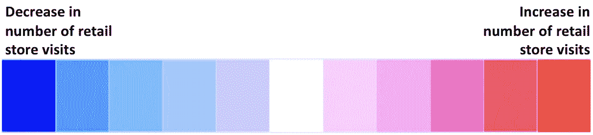
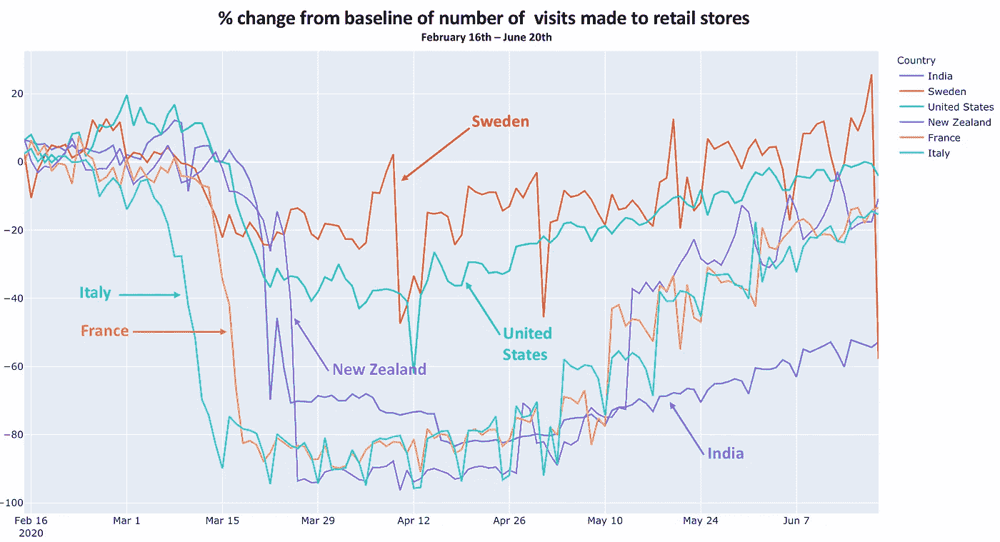
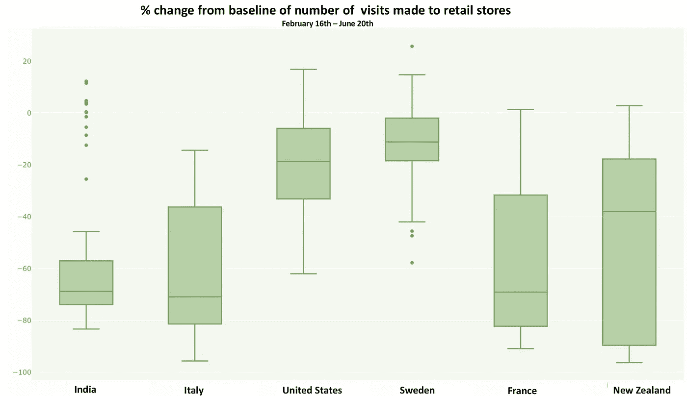

# 冠状病毒:哪个国家做对了？

> 原文：<https://towardsdatascience.com/coronavirus-which-country-got-it-right-b25023f52666?source=collection_archive---------49----------------------->

## 在世界各地，各国对冠状病毒的反应各不相同。数据能告诉我们哪种政策策略最有效吗？

尼古拉斯·霍伊泽在 [Unsplash](https://unsplash.com/s/photos/olympic-games?utm_source=unsplash&utm_medium=referral&utm_content=creditCopyText) 上拍摄的照片

***编者按:*** [*走向数据科学*](http://towardsdatascience.com/) *是一份以数据科学和机器学习研究为主的中型刊物。我们不是健康专家或流行病学家，本文的观点不应被解释为专业建议。想了解更多关于疫情冠状病毒的信息，可以点击* [*这里*](https://www.who.int/emergencies/diseases/novel-coronavirus-2019/situation-reports) *。*

# 内容

在这篇文章中，你会发现:

*   **动态 choropleth 图**——指示迁移率的变化
*   **线形图** —描绘了锁定在降低移动性方面的有效性
*   **散点图**——比较受病毒影响国家的谷底和回升
*   **箱线图** —比较各国对冠状病毒爆发的反应范围，以相对于基线的百分比变化来衡量

# 什么是谷歌移动报告？

二月初，谷歌推出了*新冠肺炎社区移动报告。*这些报告使用从谷歌地图等应用中收集的匿名数据来衡量移动模式的百分比变化。这个数据集由谷歌自己定期更新，可以在[这里](https://www.google.com/covid19/mobility/)找到。用于本分析的最新日期是 6 月 20 日。

**目的地的特定类别**已在谷歌的研究中确定，并测量了这些目的地的**访客数量**。例如，已经记录了去药房的次数，并将其与之前记录的**基线日**进行比较。

# 什么是基准日？

基准日可被标记为“正常日”，并已被选为 2020 年 1 月内的平均值。一月份去药店或零售店的次数提供了一个移动性的基线值，我们将在其他日子与之进行比较。例如，假设移动模式在周末和工作日之间发生变化，则给出了一周中每天的基线值。

# 我们来看看吧！

自疫情开始以来，零售商和娱乐中心的游客数量发生了怎样的变化？

# 各国的流动性差异

*   意大利是第一个从 3 月 9 日开始实施隔离的国家，这使得意大利人的流动性减少了大约 90%*。封锁于 5 月 18 日解除，持续了整整两个月零一周零两天。法国的强制隔离开始于 3 月 17 日，比意大利晚一周，并遵循了与其邻国相似的流动趋势。*

**

*   ***瑞典**没有实施封锁，但从 3 月 20 日起其机动性下降了 ***20%*** 。学校、咖啡馆、餐馆和商店仍然开放，以避免经济衰退。与大多数欧洲国家不同，居家政策只是政府的一项建议。瑞典公民自愿将其流动性从基线水平降低 ***10%至***20%。*
*   ***新西兰**于 2020 年 3 月 19 日关闭边境，并于 3 月 25 日建立全国封锁。这可以在线图中清楚地看到，迁移率在 ***-90%*** 附近急剧下降。4 月 27 日，封锁限制被部分解除，5 月 13 日完全解除。这两个日期都标志着新西兰公民的流动性增加。然而，我们可以注意到，尽管该国没有宣布新的病例，但流动性尚未恢复正常，这表明在没有政府义务的情况下正在采取预防措施。*
*   *从 3 月 22 日开始，印度至今仍处于封锁状态，自那以后已经延期两次。这应该在 6 月 30 日结束，也就是印度大部分地区封锁的预定结束日。他们的流动性从基线下降到 ***-70%*** ，并在过去两个月中设法保持在这一水平，使**印度成为锁定期最长的国家。***

# *谁答对了？*

*下面的散点图显示了每个国家的**“从病毒中反弹”**行为的水平。*

> ****x 轴*** *是各个国家流动性的平均变化值。美国和瑞典在最右边，因为他们的流动性平均只改变了大约* ***-10%*** *。而意大利、法国或新西兰等国家则完全停滞不前，流动性大约下降了 80%***。***
> 
> ****y 轴** *是过去两周各国记录的最大移动值。各国的最新趋势是启动经济，鼓励回归日常生活，这条轴线是对由于开放而增加的流动性的衡量。例如，由于封锁还没有解除，印度和许多南美国家仍然处于下半部分。***

****

# **我们希望国家在哪里…**

**最有可能的情况是:一个国家进入高度封锁状态，人口流动性大幅下降，但现在已经反弹，人口流动性几乎恢复正常。这些国家位于散点图的左上角，包括新西兰、法国和意大利。**

**W **orst 案例情景**:一个进入重度封锁、流动性大幅下降但仍未能减少冠状病毒病例以解除隔离的国家。这些国家包括印度，但许多拉丁美洲国家，如巴西，智利和阿根廷，今天仍然完全隔离。**

**E **例外**:瑞典和美国以及其他北欧国家和一些非洲国家，没有对流动性施加严格的限制，因此不需要大举卷土重来……这些国家将位于散点图的右上方。其中最小移动性很低，但是最大“返回”移动性很高。**

# **各大洲内的明显趋势**

**在创作这个情节时，我决定给每个大陆涂上不同的颜色。我发现了一些有趣的事情:**

*   ****欧洲国家**的回答范围很广，因为它们分散在 x 轴的整个长度上。然而，他们从较低的流动性中恢复得非常好，因为他们在 y 轴上始终高于其他国家，这意味着他们在过去两周内已经恢复到几乎“正常”的流动性模式。**
*   ****拉丁美洲国家**只能在散点图的左下方区域看到，这意味着它们的流动性大幅下降，但尚未设法弥补这一下降。**
*   ****亚洲**和**非洲**覆盖了完整的散点图，没有指向特定的趋势。在本分析的下一步中，我将研究特定大陆的流动性变化，特别是覆盖大面积地理区域并因此具有不同气候、人口密度和文化的大陆。**

****

## ****结束语****

**在写这篇文章的时候，我没有研究每个国家在任何特定时刻冠状病毒病例的数量。这可能会非常有见地地解释为什么国家进入和退出封锁。各国测量每日新增病例数量和量化死亡人数的方式大相径庭，在我看来，这将掩盖谷歌移动报告提供的普遍和同质数据。**

**从谷歌移动性报告提供的信息中可以得出更多的见解。本文只是一个初步的评价。更多更新即将到来，**请在下面评论您希望在即将到来的更新中看到您的原籍国或居住地。****

**F 或者深入分析如果这个数据看看这篇[文章](/can-googles-mobility-report-explain-new-zealand-s-win-against-the-virus-9e036ace0a2) : *谷歌的报告能解释新西兰战胜病毒的原因吗？***

** [## 谷歌的移动报告能解释新西兰战胜病毒的原因吗？

### 对疫情早期社会距离和锁定政策的数据驱动分析。

towardsdatascience.com](/can-googles-mobility-report-explain-new-zealand-s-win-against-the-virus-9e036ace0a2) 

# Github 知识库

所有代码都可以在 Github [上的 **after_covid.py** 文件中找到这里](https://github.com/alejandra-gutierrez/LondonCovid.git)！

# 非常感谢你的阅读！

如果你喜欢我的作品，我会非常感激你跟随我来到这里。

如果您对如何改进有任何问题、建议或想法，请在下面留下评论或通过 LinkedIn [这里](https://www.linkedin.com/in/alejandra-g-283595b8)取得联系。**