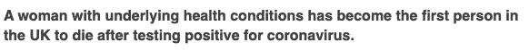
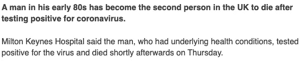
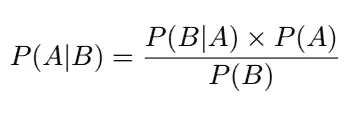

# 冠状病毒和概率——媒体现在必须学会如何报道统计数据

> 原文：<https://towardsdatascience.com/coronovarius-and-probability-the-media-must-learn-how-to-report-statistics-now-973ed2d52959?source=collection_archive---------5----------------------->

## 随着新冠肺炎的广泛恐慌，媒体必须了解两个非常不同的统计数据之间的差异。

来源:https://www.bbc.co.uk/news/uk-51759602

来源:https://www.bbc.co.uk/news/uk-51771815

“潜在症状”这个短语出现在几乎所有新闻报道中，在这些报道中，有人死于看似普通的事件。无论是过敏患者，还是冠状病毒(“covid”)的受害者，“潜在症状”短语都是用来减轻恐惧的。作为一个忧郁症患者和统计学家的不幸组合，每当我看到这样的新闻文章时，我都会立即浏览找到相关的行，并对自己说“唷，我没事了”。当然，这是难以置信的自我中心思想。但是，只要媒体报道了无条件的可能性，公众(当然也包括我)的个人危险感就会增强。

# 无条件概率与条件概率

为了更好地解释我正在谈论的问题，我们将不得不稍微看一下统计数据，我将在这里尽可能保持它的基本性，稍后我们将进入一点更详细的内容。

假设我们想预测投掷时骰子落在数字 6 上的概率，我们想知道:

*P(Die = 6)*

其读作“骰子等于 6 的概率”。现在假设我们想预测骰子落在数字 6 上的概率，因为我们知道(不管出于什么原因)它一定落在大于 3 的数字上。然后我们想知道:

*P(Die = 6 | Die > 3)*

其中竖线“|”表示“鉴于”。

这两个等式的区别在于，第一个等式是无条件的——我们想知道在没有其他信息的情况下某个事件发生的概率——第二个等式是有条件的——我们想知道某个事件发生的概率，并以(或“给定”)其他条件或事件为条件。

Mike Szczepanski 在 [Unsplash](https://unsplash.com?utm_source=medium&utm_medium=referral) 上拍摄的照片

# 贝叶斯定理

当我们开始讨论贝叶斯定理(或贝叶斯法则)时，这才是真正有所不同的地方。注意:这里有数学和统计数据，如果你不想再看到一个方程，请随意跳到“是时候改变了”。

贝叶斯定理用于根据其他可用信息计算或更新条件概率。等式是:

贝叶斯定理

换句话说:给定某个事件 B，事件 A 发生的概率，等于给定事件 A，事件 B 发生的概率，乘以事件 A 的概率，再除以事件 B 的概率，有点拗口，我们来看个例子。

我们将称*为*事件:冠状病毒导致的死亡(明白我的意思了吗？)，以及 *B* 事件:年龄在 65 岁以下。现在我们有:

*P(因 65 岁以下死亡)= P(因 65 岁以下死亡)× P(因 65 岁以下死亡)/P(65 岁以下)*

用一些代数来整理它:

*P(C | A<65)= P(A<65 | C)×P(C)/P(A<65)*

这里我们读到 *C* 是死于 covid，而 *A* 是某人的年龄。

因此，考虑到新闻中的统计数据，让我们看看是否能找到更相关的死亡风险。我们需要找到:

*   *P(A<65 | C)*—65 岁以下死于 covid 的概率。
*   *P(C)* —死于 covid 的(无条件)概率。
*   P(A<65)——小于 65 的(无条件)概率。

警告:我的数字在这里不会太精确。

我们从研究和报告中知道，目前估计的死亡率是 3.4 *%* ，所以

*P(C) = 0.034*

根据一项 website⁴调查，8%的人口超过 65 岁，这意味着

*P(A < 65) = 0.92*

现在更难的是计算出 65 岁以下的概率，因为 covid 已经死亡。此时，我们不得不求助于原始数据。数据无法告诉我们确切的死亡率，P(C | A<65), because we don’t know who does and doesn’t have the virus, i.e. there could be many unreported cases. (This is also a problem with P(C) but I’m ignoring that for the sake of this example). However, the data can tell us exactly P(A<65|C). We will use data from a recent study from the Chinese Center for Disease Control and Prevention¹. According to this study,

*P(A<65 | C)= 0.19*

这个数字其实是针对 P(A< 60|C), but it’s good enough for us. So putting this all together we have

*P(C | A<65)= 0.19×0.034/0.92 = 0.007 = 0.7%。*

因此，根据我们的计算，如果你不到 65 岁，死于新冠肺炎的概率实际上只有 0.7%左右(这与更准确的估计相符)。

# 是时候改变了

我已经展示了获得与读者实际相关的计算是多么容易。上面的例子只与 92%的人口相关，其他的 8%同样重要。这个例子以年龄为死亡概率的条件，但是潜在的健康可能同样重要。如果没有潜在的健康问题，死亡的概率实际上是 0.9%。当然，在理想情况下，我们应该有一个考虑到所有年龄、潜在健康状况和其他相关背景信息的大模型，但在这一点上，我们正在进入更高级的统计领域，这超出了一篇短文的范围。

我受够了，沮丧和害怕。因为尽管理解了统计数据，我还是一次又一次地看到同样刺眼的标题。是时候对统计数据进行更负责任的报道了，我对如何做到这一点有一些想法。

# 前进的道路…在某些条件下

1.  **给读者:**学习一个无条件概率告诉你什么。当我们听到 3.4%的死亡率时，我们实际上被告知的是，在所有感染新冠肺炎的人中，3.4%的人*已经死亡*(过去式)。这并不意味着在一个 100 人的房间里，有 3 个人*会*死去。无条件概率可以告诉我们过去的事情，也可以告诉我们简单的统计数据，这些数据忽略了重要的和至关重要的信息。无条件概率不应该被用来预测未来。
2.  **对于媒体**:停止报道无条件概率。取而代之的是:“不到 1%的 65 岁以下的新冠肺炎感染者已经死亡”或者“不到 1%没有潜在健康问题的人已经死于新冠肺炎”。当然，这有将读者按年龄和健康状况分开的风险，但这是一个开始。
3.  **对媒体来说:**好吧，所以你可能不会停止，但如果你坚持继续报道无条件概率，你必须强调它们到底代表什么，不代表什么。强调过去时，而不是未来——“3.4%*已经*死亡”。强调知识的缺乏——“3.4%的报告病例已经死亡*，但是*这个数字取决于个人情况”(好吧，这个不太吸引人，但是你已经明白了)。

继续洗手—照片由 [Curology](https://unsplash.com/@curology?utm_source=medium&utm_medium=referral) 在 [Unsplash](https://unsplash.com?utm_source=medium&utm_medium=referral) 上拍摄

# 参考

新型冠状病毒肺炎应急反应流行病学小组。2019 年新型冠状病毒疾病暴发的流行病学特征(新冠肺炎)-中国，2020[J].中国疾病预防控制中心周刊，2020，2(8):113–122。[http://weekly . China CDC . cn/en/article/id/e 53946 e 2-c6c 4-41e 9-9 a9 b-FEA 8 db 1a 8 f 51](http://weekly.chinacdc.cn/en/article/id/e53946e2-c6c4-41e9-9a9b-fea8db1a8f51)。
[https://www . world ometers . info/coronavirus/coronavirus-age-sex-demographics/](https://www.worldometers.info/coronavirus/coronavirus-age-sex-demographics/)
[https://www.bbc.co.uk/news/health-51674743](https://www.bbc.co.uk/news/health-51674743)
⁴[https://ourworldindata.org/age-structure](https://ourworldindata.org/age-structure)