# 幸福、互联网使用和数学之间的相关性

> 原文：<https://towardsdatascience.com/correlation-between-happiness-internet-usage-and-mathematics-3f23e539b5fb?source=collection_archive---------31----------------------->

## 区分虚假相关和真实相关的逐步指南


丹尼斯·琼斯在 [Unsplash](https://unsplash.com/s/photos/happiness-and-mathematics?utm_source=unsplash&utm_medium=referral&utm_content=creditCopyText) 拍摄的照片

一些奇怪的事情之间的关联经常会激怒我们的好奇心，让我们怀疑这背后是否有因果关系！举几个相关的例子:

1.  *海贼荒* [*全球变暖*](https://www.buzzfeednews.com/article/kjh2110/the-10-most-bizarre-correlations) *。*
2.  *美国柠檬进口增加，高速公路死亡率下降。*
3.  *全球非商业航天发射和* [*社会学博士学位授予*](http://www.tylervigen.com/spurious-correlations) *。*
4.  *良好的雨季和拖拉机公司股价的上涨。*
5.  *贵金属价格的增加* [*利率的降低*](https://medium.com/fintechexplained/did-you-know-the-importance-of-finding-correlations-in-data-science-1fa3943debc2) *。*
6.  *油价上涨，旅游业下降。*

乍一看，人们可以看出前三种相关性和后三种相关性之间的区别。前三种相关性被称为滑稽的相关性。这些相关性可能只是偶然发现的结果，提醒我们一句古老的谚语，“相关性并不意味着因果关系”。但是，后三者之间似乎确实有因果关系。例如，一个好的雨季意味着一个好的农业产量，这反过来意味着农业相关产品的购买增加，如拖拉机、杀虫剂、肥料等。

现在，我们如何确定这两个变量是否有一个虚假的关系，与实际的因果关系相反。这是一个经常需要人类直觉和专业知识的问题。在这篇文章中，我们试图使用 15 岁学生的幸福数据、人均互联网使用率和数学水平，将这种直观的方法形式化为几个更具体的步骤。

# 数据

1.  《2020 年世界幸福报告》:这份报告由 156 个国家组成，涵盖了影响幸福的因素，如社会支持、健康的预期寿命、做出生活选择的自由等。
2.  【2018 年互联网使用情况:216 个国家的互联网用户数据，按绝对用户数和人均用户数排名。在这里，我们使用每个人口的用户排名。
3.  [Pisa 全球排名 2018](https://www.kaggle.com/vasanthbalakrishna/pisa-2018-worldwide-ranking) :包含 79 个国家 15 岁学生的数学学业表现数据。

# 数据可视化

以上数据包含了大量国家的连续变量——最少的国家有 79 个。理解这些数据最有效的方法是使用 choropleth 图，其中数据被转换成类别。这是通过 python 中的[*map classify*](https://pypi.org/project/mapclassify/)*包实现的。 *mapclassify* 能够为 choropleth 地图实现一系列分类方案。*

```
*fig, ax = plt.subplots(1,figsize=(15, 10))
ax.axis('off')
ax.set_title('Pisa Mathematics Ranking', fontdict={'fontsize': '35', 'fontweight' : '3'}) merged.plot(column='Avg_score', cmap='RdBu', scheme="User_Defined", 
         legend=True, edgecolor='0.8',classification_kwds=dict(bins=[300,350,400,450,500,550,600]),
         ax=ax,label='Ranking')
ax.set_xlim(minx+10, maxx-10)
ax.set_ylim(miny+10, maxy-10)
leg = ax.get_legend()
plt.rc('legend', fontsize=20)
leg.set_bbox_to_anchor((0.85, 0.6, 0.2, 0.2))*
```

*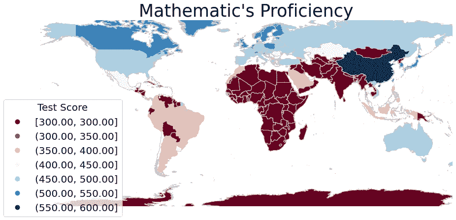*

*图片作者。*

*在这张 choropleth 地图上，不在 pisa 排名中的国家被任意打分至 300 分，仅低于最低分 325 分。很明显，大多数非洲和亚洲国家不在这个排名之内。一个可能的原因是这项测试的价格标签，每个参与国的费用为 205000 欧元。只有两个行政区，澳门和香港，从这张地图上被删除(由于绘图困难)，并显示为中国本身的一部分。中国和新加坡是仅有的两个得分超过 550 的国家，而中国得分高达 591，新加坡得分为 569。总的来说，发达的亚洲、欧洲和美洲国家在这个排名中表现更好。然而，这并不表明一个国家的表现与其经济地位之间有任何关系，因为这一测试尚未渗透到非洲和亚洲的发展中国家。*

*同样，世界幸福指数的 choropleth 图如下所示。*

*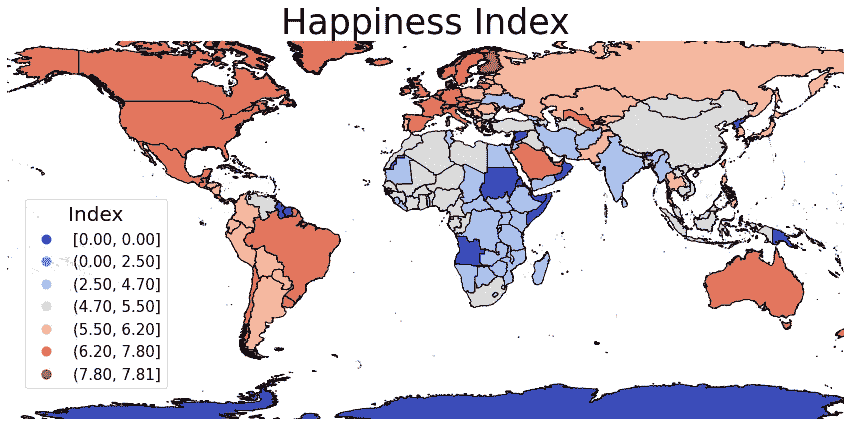*

*图片作者。*

*这里的颜色模式与上面的图相比是颠倒的，以便更好地可视化。没有幸福指数的国家的幸福指数为零。显然，这是一份更广泛的报告，总共包括 156 个国家。芬兰、丹麦和瑞士分别是排名前三的国家，而前十名大多被北欧国家占据。此外，在这张地图上，经济和幸福之间有着明显的正相关关系。*

*类似地，一张地图显示了每个人口中互联网用户的百分比:*

*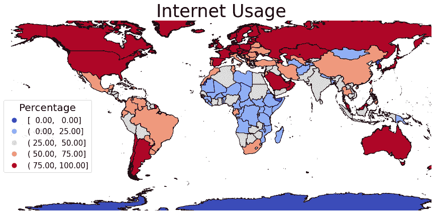*

*图片作者。*

*上图暗示了发达国家和每人口互联网用户百分比之间的相互关系。该图包含 216 个国家的数据，没有数据的国家以零百分比表示。在下面的部分中，我们计算这三个排名之间的皮尔逊相关性。*

# *相互关系*

*皮尔逊相关系数仅显示两个变量之间的线性关系。如果两个变量只是非线性相关，例如圆、双曲线、抛物线等方程，则相关性为零。皮尔逊相关性衡量两个变量之间关系的强度和方向。它不测量关系的斜率，并将零相关归因于纯非线性关系，分别如下图中的行所示。*

*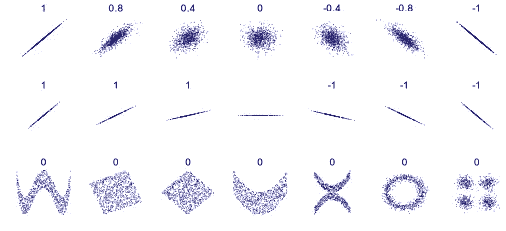*

*由 DenisBoigelot 原创上传者为 [Imagecreator — CC0](https://commons.wikimedia.org/w/index.php?curid=15165296) ，*

## *相关性的优势:*

1.  *两个变量之间很容易计算。*
2.  *如果两个变量高度相关，这有助于减少建模所需的特征数量。*
3.  *了解相关性有助于降低风险，例如，不同股票的相关性增加，而份额意味着一个股票的损失会导致其他股票的损失。[导致 2007 年金融危机的场景！](https://medium.com/fintechexplained/did-you-know-the-importance-of-finding-correlations-in-data-science-1fa3943debc2)*

## *相关性的缺点:*

1.  *它可以给出没有任何因果关系的虚假相关性。*
2.  *相关性随着数据的转换而改变。因此，在数据处理期间，需要在连续的基础上计算[。](https://medium.com/fintechexplained/did-you-know-the-importance-of-finding-correlations-in-data-science-1fa3943debc2)*
3.  *使用相关性永远无法得到两个变量之间的确切关系。*

## *幸福、互联网使用和数学之间的相关性*

*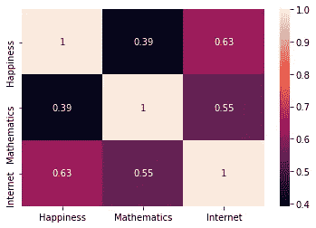*

*图 1(作者图片。)*

> *每个人口的互联网用户百分比与幸福指数之间有着惊人的正相关关系。此外，数学学习成绩与人口中互联网用户的比例之间也存在高度的正相关关系。数学和快乐之间有一个小的正相关。*

*在上面的图表中，相关性是在使用国家名称合并所有三个数据框架(幸福指数、pisa 排名和互联网使用)后计算的。因此，它将合并数据框架中的国家数目最多限制在国家数目最少的数据框架，即有 79 个国家的 pisa 数据框架。因此，这里合并的数据框架有 77 个国家，除了澳门和香港两个行政区。*

*为了利用具有更多数据的其他两个数据帧，我们分别计算它们的相关性。*

*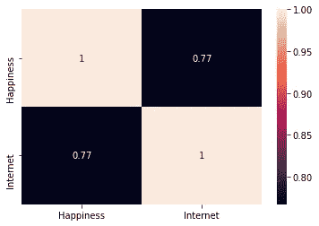*

*图 2(作者图片。)*

*显然，在添加更多数据后，幸福和互联网似乎有更多的相关性，因为在这个合并的数据框架中有 150 个国家。*

*同样，只有数学和互联网与 78 个国家的合并数据框架产生的相关性略低于所有三个数据框架的相关性。*

*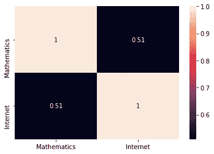*

*图 3(作者图片。)*

*可以看出，相关性对数据数量非常敏感。这是因为皮尔逊相关系数的分子计算 x 和 y 与其各自平均值之差的乘积之和(咽！).那就是:*

*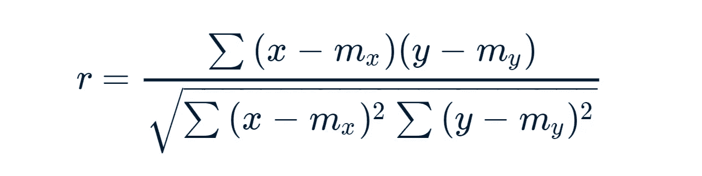*

*由 [GeeksforGeeks](https://www.geeksforgeeks.org/python-pearson-correlation-test-between-two-variables/)*

*因此，即使是具有较大噪声的单个数据点(x，y ),即使在通过分母进行归一化之后，也会产生显著影响。*

*与图 1 相比，只有数学和幸福之间的相关性显示出最小的变化，并且共有 77 个国家。*

*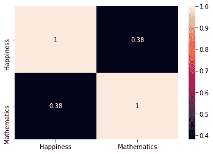*

*图 4(作者图片。)*

# *这是一种虚假的关联吗？*

*虽然，乍一看，幸福和互联网，以及数学和互联网之间似乎没有明显的关系。高正相关的两个组合**分别为 0.77 和 0.51** 。然而，更深入的考察可以看出:*

1.  *发达国家的人均互联网用户数量更高。*
2.  *这个国家的国内生产总值肯定能为人民的幸福做出贡献。*
3.  *此外，这意味着数学水平与该国的 GDP 更相关。这意味着，发达国家可以腾出更多的资源用于学生的素质教育。*

*在这一点上，所有这些可能看起来是一个疯狂的猜想。但是，有一个简单的方法可以证明它不是伪相关，并且上面的推理是正确的。那就是把这个国家的 GDP 与幸福、互联网和数学联系起来。如果我们的推理是正确的，它应该表明幸福、互联网和数学与 GDP 的相关性远远大于它们之间的相关性！*

*利用我们得到的幸福数据中记录的人均 GDP*

*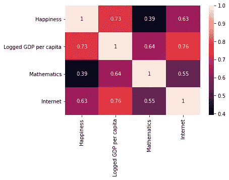*

*图 5(作者图片。)*

> *图 5 显示，记录的人均国内生产总值与幸福、数学和互联网的相关性比其他相关性更大。这证明了我们的猜想，即国家的经济发展与幸福感、数学水平和互联网使用率密切相关。因此，在这些明显不同的特征之间建立了合理的因果关系。**因此，这不是伪相关！***

*此外，如上所述，数据的转换可以改变它们之间的相关性。**特别是人均 GDP 的自然对数会把幂关系变成线性关系，从而增加相关系数！**因此，为了获得准确的关系，我们应该只与人均国内生产总值相关。*

*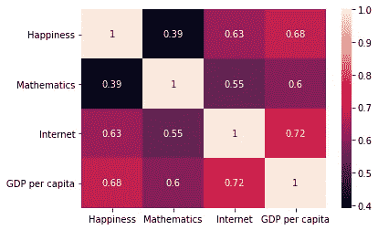*

*图 6(作者图片。)*

*显然，与图 5 中记录的人均国内生产总值相比，上述人均国内生产总值图显示了较小的相关性。*

*现在，只绘制互联网和人均国内生产总值，以利用这两个数据框架之间的更多数据，我们得到:*

*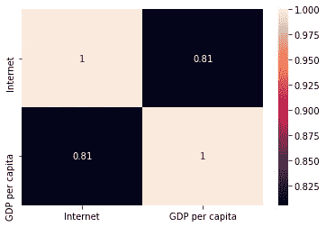*

*图 7(作者图片。)*

# *带回家的信息*

1.  *相关性在特征工程中很重要。如果特征彼此高度相关，则可以使用它来减少所使用的特征的数量。*
2.  *皮尔逊相关系数不能表达纯粹的非线性关系，例如由圆的方程相关的两个变量具有零相关性。*
3.  *相关性对使用的数据点数量非常敏感。即使一些数据点更加分散，也会反映在皮尔逊相关系数中。*
4.  ***幸福感&互联网使用率和数学&互联网使用率分别有 0.77 和 0.51 的显著正相关(见图 2 &图 3)！**这种相关性和图 6 的差异是由于图 2 和图 3 中的数据较多。*
5.  ***这是因为互联网使用量与该国国内生产总值之间的正相关性更高，为 0.81(见图 7)。**因此，GDP 在观察到的快乐相关性&互联网使用和数学&互联网使用之间建立了因果关系。*

*请参考此处的[整个笔记本](https://github.com/V-git-7003/Correlations-between-Happiness-Mathematics-and-Internet)以及数据集。*