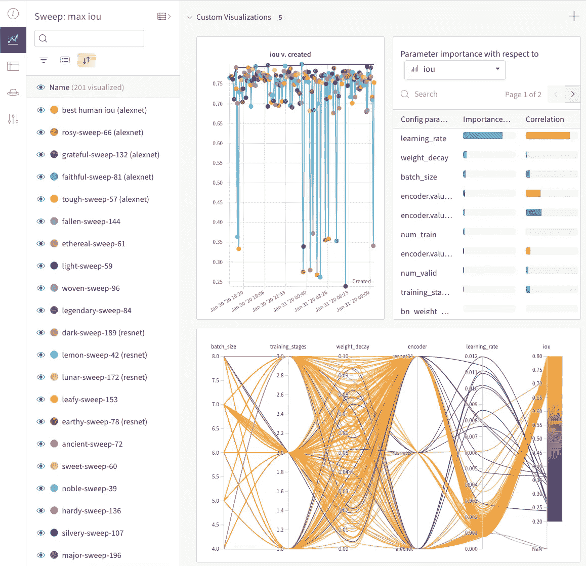
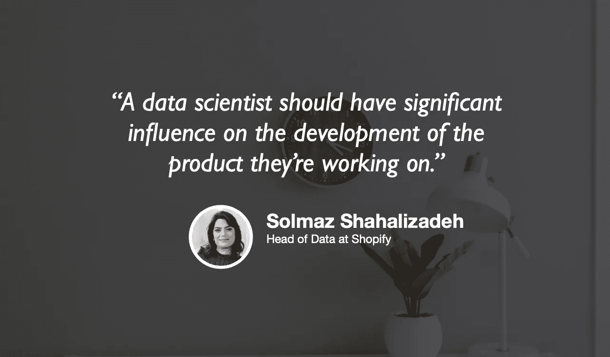

# 相关<>因果关系

> 原文：<https://towardsdatascience.com/correlation-causation-bb79e0f61dc?source=collection_archive---------81----------------------->

美国宇航局在 Unsplash 上拍摄的照片

## [什么是相关性？](/what-is-correlation-975ea899aaed)

凯西·科济尔科夫——5 分钟阅读

实验让你可以谈论因果。没有它们，你所拥有的只是相关性。什么是相关性？

这不是因果关系。(!！！！！)

一个示例在权重和偏差 UI 中扫描工作空间。图片作者。

## [迭代扫描超参数搜索](/hyperparameter-search-with-iterative-sweeps-3799df1a4d45)

由 Stacey Svetlichnaya — 13 分钟阅读

如何在深度学习模型上运行有效的超参数搜索，使用来自 Weights & Biases 的特定可视示例

Samantha Gades 的背景图片

## [高增长公司的数据科学](/data-science-in-high-growth-companies-a6208480d101)

作者:Jeremie Harris 和 Solmaz Shahalizadeh，3 分钟阅读🎧

在过去的几个月里，我看到越来越多的主题之一是数据科学中产品思维的重要性。

照片由 Fabian Blank 在 Unsplash 上拍摄

## [跟随我的极端预算改造(ft。Gmail API)](/follow-along-with-my-extreme-budget-makeover-ft-the-gmail-api-2872cc006b60)

通过[詹妮弗·金](https://medium.com/u/365eb23e93d8?source=post_page-----bb79e0f61dc--------------------------------) — 7 分钟读取

2020 年是改善之年——对自己，对政府和现有机构，对消费习惯。

图片由 Luke Chesser 在 Unsplash 上提供

## [部署企业级 R 闪亮应用的开源解决方案](/an-open-source-solution-to-deploy-enterprise-level-r-shiny-applications-2e19d950ff35)

由[明初许](https://medium.com/u/e56057bd1782?source=post_page-----bb79e0f61dc--------------------------------) — 14 分钟读完

对于许多 R 用户来说，R Shiny 已经成为一个为数据科学构建交互式 web 应用程序的流行平台。它允许人们轻松地从 R 可视化数据分析，而不需要弄乱许多行代码。