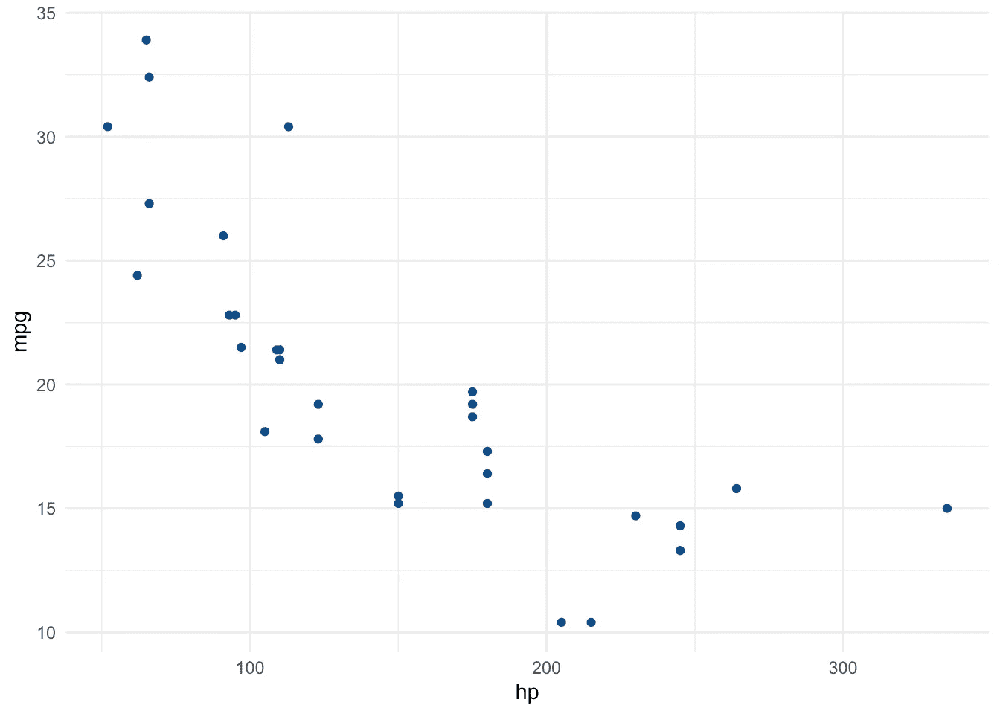
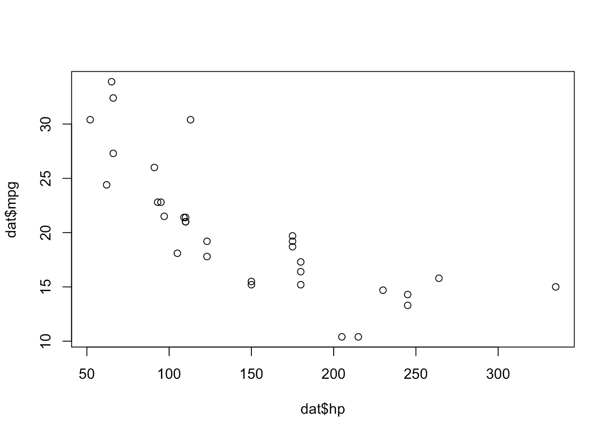
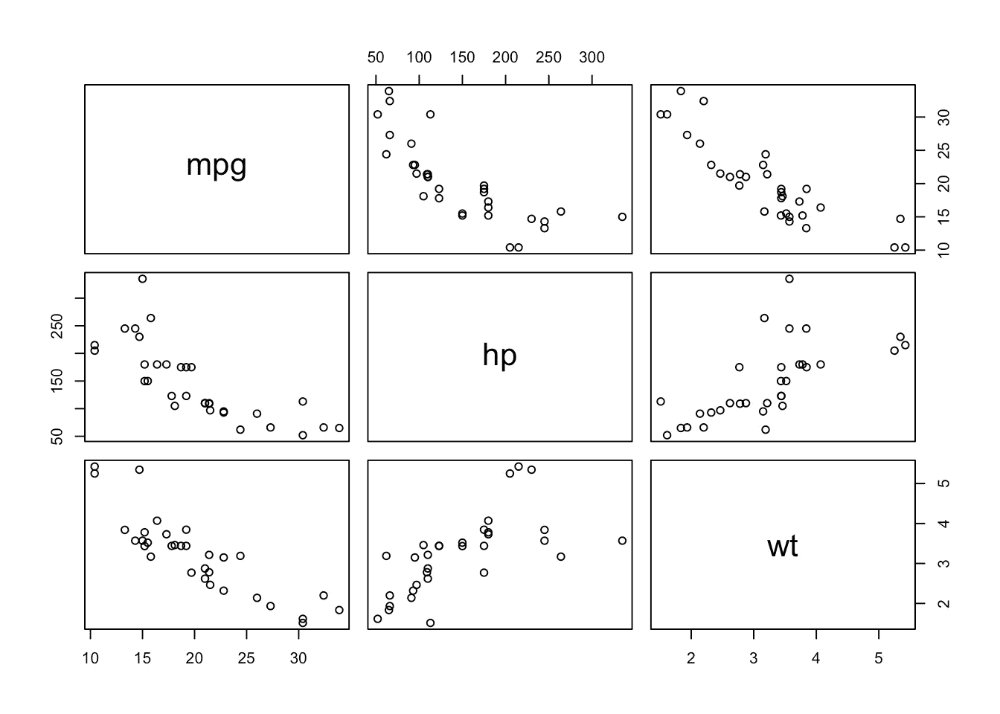
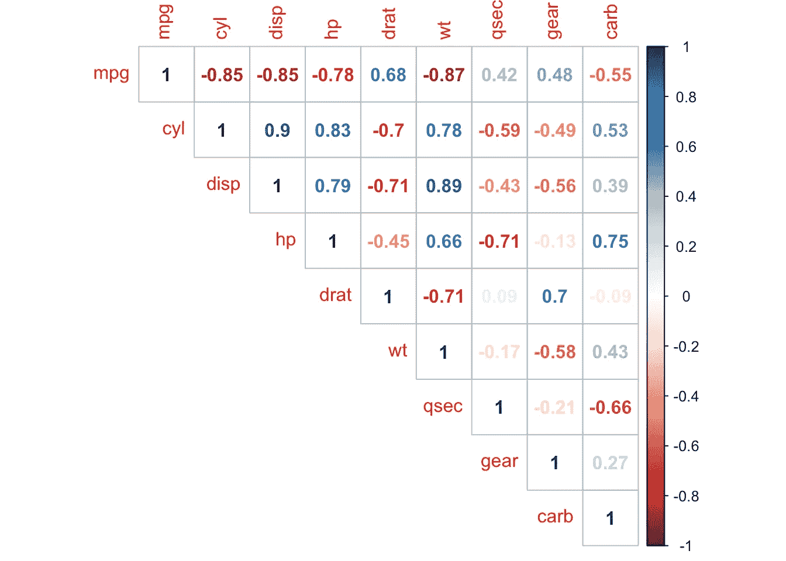
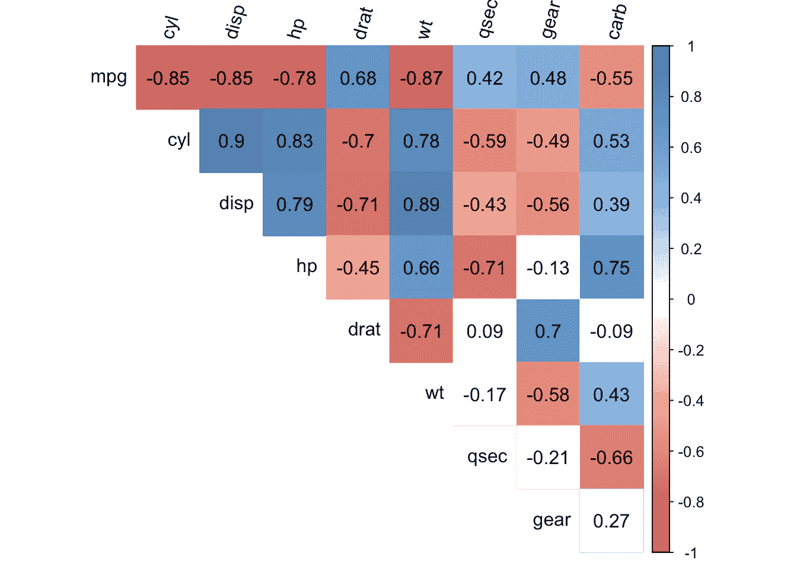
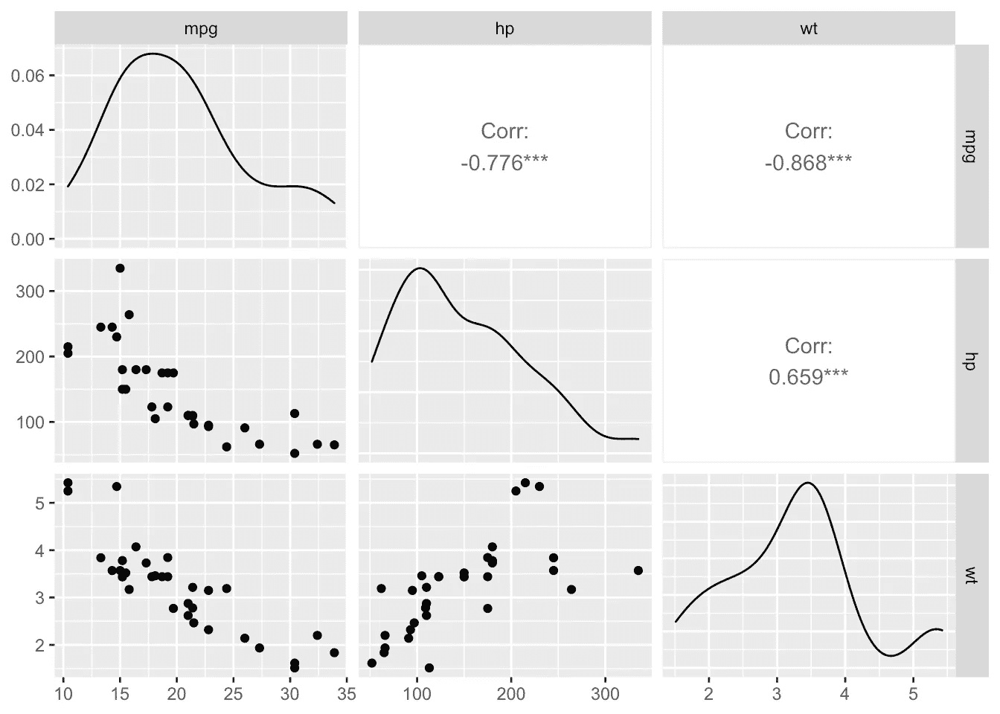

# R 中的相关系数和相关检验

> 原文：<https://towardsdatascience.com/correlation-coefficient-and-correlation-test-in-r-2c8324860b04?source=collection_archive---------46----------------------->

## 学习如何计算相关系数，并在 R


照片由[内森·杜姆劳](https://unsplash.com/@nate_dumlao?utm_source=medium&utm_medium=referral)

# 介绍

变量之间的关系在描述性分析中起着重要的作用。相关性衡量两个变量之间的**关系，即它们如何相互关联。从这个意义上来说，相关性可以让我们知道哪些变量是同向发展的，哪些是反向发展的，哪些是独立的。**

在本文中，我将展示如何计算**相关系数**，如何执行**相关测试**以及如何**可视化 r 中变量之间的关系**。

相关性通常计算在两个[定量](https://statsandr.com/blog/variable-types-and-examples/#quantitative)变量上，但也可以计算在两个[定性序数](https://statsandr.com/blog/variable-types-and-examples/#ordinal)变量上。如果需要研究两个[定性名义](https://statsandr.com/blog/variable-types-and-examples/#nominal)变量之间的关系，请参见[独立性卡方检验](https://statsandr.com/blog/chi-square-test-of-independence-in-r/)。

# 数据

在本文中，我们使用`mtcars`数据集(在 R 中默认加载):

```
# display first 5 observations
head(mtcars, 5)##                    mpg cyl disp  hp drat    wt  qsec vs am gear carb
## Mazda RX4         21.0   6  160 110 3.90 2.620 16.46  0  1    4    4
## Mazda RX4 Wag     21.0   6  160 110 3.90 2.875 17.02  0  1    4    4
## Datsun 710        22.8   4  108  93 3.85 2.320 18.61  1  1    4    1
## Hornet 4 Drive    21.4   6  258 110 3.08 3.215 19.44  1  0    3    1
## Hornet Sportabout 18.7   8  360 175 3.15 3.440 17.02  0  0    3    2
```

变量`vs`和`am`是分类变量，因此在本文中它们被删除了:

```
# remove vs and am variables
library(tidyverse)
dat <- mtcars %>%
  select(-vs, -am)# display 5 first obs. of new dataset
head(dat, 5)##                    mpg cyl disp  hp drat    wt  qsec gear carb
## Mazda RX4         21.0   6  160 110 3.90 2.620 16.46    4    4
## Mazda RX4 Wag     21.0   6  160 110 3.90 2.875 17.02    4    4
## Datsun 710        22.8   4  108  93 3.85 2.320 18.61    4    1
## Hornet 4 Drive    21.4   6  258 110 3.08 3.215 19.44    3    1
## Hornet Sportabout 18.7   8  360 175 3.15 3.440 17.02    3    2
```

# 相关系数

# 两个变量之间

使用`cor()`函数找到两个变量之间的相关性。假设我们想要计算马力(`hp`)和每加仑英里数(`mpg`)之间的相关性:

```
# Pearson correlation between 2 variables
cor(dat$hp, dat$mpg)## [1] -0.7761684
```

请注意，变量 *x* 和 *y* 之间的相关性等于变量 *y* 和 *x* 之间的相关性，因此`cor()`函数中变量的顺序无关紧要。

默认情况下，皮尔逊相关性是用`cor()`函数计算的。如果您想要计算 Spearman 相关性，请将参数`method = "spearman"`添加到`cor()`函数中:

```
# Spearman correlation between 2 variables
cor(dat$hp, dat$mpg,
  method = "spearman"
)## [1] -0.8946646
```

有多种相关方法(运行`?cor`了解更多关于`cor()`功能中可用的不同方法的信息):

*   **皮尔逊**相关性常用于具有线性关系的[定量连续](https://statsandr.com/blog/variable-types-and-examples/#continuous)变量
*   **Spearman** 相关性(实际上类似于 Pearson，但基于每个变量的排名值，而不是原始数据)通常用于评估涉及[定性序数](https://statsandr.com/blog/variable-types-and-examples/#ordinal)变量或定量变量的关系(如果联系是部分线性的)
*   根据和谐和不和谐对的数量计算得出的肯德尔(Kendall)常用于定性序数变量

# 相关矩阵:所有变量的相关性

假设现在我们想计算几对变量的相关性。我们可以很容易地对数据集中所有可能的变量对这样做，同样使用`cor()`函数:

```
# correlation for all variables
round(cor(dat),
  digits = 2 # rounded to 2 decimals
)##        mpg   cyl  disp    hp  drat    wt  qsec  gear  carb
## mpg   1.00 -0.85 -0.85 -0.78  0.68 -0.87  0.42  0.48 -0.55
## cyl  -0.85  1.00  0.90  0.83 -0.70  0.78 -0.59 -0.49  0.53
## disp -0.85  0.90  1.00  0.79 -0.71  0.89 -0.43 -0.56  0.39
## hp   -0.78  0.83  0.79  1.00 -0.45  0.66 -0.71 -0.13  0.75
## drat  0.68 -0.70 -0.71 -0.45  1.00 -0.71  0.09  0.70 -0.09
## wt   -0.87  0.78  0.89  0.66 -0.71  1.00 -0.17 -0.58  0.43
## qsec  0.42 -0.59 -0.43 -0.71  0.09 -0.17  1.00 -0.21 -0.66
## gear  0.48 -0.49 -0.56 -0.13  0.70 -0.58 -0.21  1.00  0.27
## carb -0.55  0.53  0.39  0.75 -0.09  0.43 -0.66  0.27  1.00
```

这个相关矩阵给出了两个变量的所有组合的相关性的概述。

# 相关系数的解释

首先，相关性的范围从 **-1 到 1** 。这给了我们两件事的提示:

1.  2 变量之间关系的方向
2.  2 变量之间关系的强度

关于关系的方向:一方面，**负相关**意味着所考虑的两个变量以**相反的方向**变化，也就是说，如果一个变量增加，另一个变量减少，反之亦然。另一方面，**正相关**意味着所考虑的两个变量在**相同方向**变化，即如果一个变量增加，另一个变量增加，如果一个变量减少，另一个变量也减少。

关于关系的强度:**相关系数越极端**(越接近-1 或 1)**关系越强**。这也意味着**相关性接近于 0** 表示两个变量**独立**，也就是说，当一个变量增加时，另一个变量没有减少或增加的趋势。

作为一个例子，上面找到的马力(`hp`)和每加仑英里数(`mpg`)之间的皮尔逊相关性是-0.78，这意味着这两个变量以相反的方向变化。这是有道理的，马力越大的汽车消耗的燃料越多(因此每加仑行驶里程越低)。相反，从相关矩阵中我们看到，每加仑英里数(`mpg`)和行驶 1/4 英里的时间(`qsec`)之间的相关性是 0.42，这意味着快车(低`qsec`)往往每加仑英里数更差(低`mpg`)。这也是有道理的，因为速度快的汽车往往消耗更多的燃料。

然而，相关矩阵不容易解释，尤其是当数据集由许多变量组成时。在接下来的章节中，我们将介绍相关矩阵的一些替代方案。

# 形象化

# 两个变量的散点图

可视化两个变量之间相关性的一个好方法是绘制两个感兴趣变量的散点图。假设我们想要检查马力(`hp`)和每加仑英里数(`mpg`)之间的关系:

```
# scatterplot
library(ggplot2)ggplot(dat) +
  aes(x = hp, y = mpg) +
  geom_point(colour = "#0c4c8a") +
  theme_minimal()
```



如果您不熟悉`[{ggplot2}](https://www.statsandr.com/blog/graphics-in-r-with-ggplot2/)` [包](https://www.statsandr.com/blog/graphics-in-r-with-ggplot2/)，您可以使用 R base graphics 的`plot()`功能绘制散点图:

```
plot(dat$hp, dat$mpg)
```



或者使用 [esquisse 插件](https://www.statsandr.com/blog/rstudio-addins-or-how-to-make-your-coding-life-easier/#esquisse)使用`{ggplot2}`包轻松绘制图形。

# 几对变量的散点图

假设我们想可视化几对变量之间的关系，而不是只可视化两个变量之间的关系。多亏了`pair()`功能，这才成为可能。对于这个例子，我们只关注每加仑英里数(`mpg`)、马力(`hp`)和重量(`wt`):

```
# multiple scatterplots
pairs(dat[, c(1, 4, 6)])
```



该图表明，重量(`wt`)和马力(`hp`)正相关，而每加仑英里数(`mpg`)似乎与马力(`hp`)和重量(`wt`)负相关。

# 另一个简单的相关矩阵

相关矩阵的这个版本以稍微更易读的方式呈现相关系数，即，通过基于它们的符号给系数着色。应用于我们的数据集，我们有:

```
# improved correlation matrix
library(corrplot)corrplot(cor(dat),
  method = "number",
  type = "upper" # show only upper side
)
```



# 相关性检验

# 对于 2 个变量

与指示[样本](https://statsandr.com/blog/what-is-the-difference-between-population-and-sample/)中某些变量对之间相关系数的相关矩阵不同，相关测试用于测试[总体](https://statsandr.com/blog/what-is-the-difference-between-population-and-sample/)中两个变量之间的相关性(表示为ρ)是否显著不同于 0。

实际上，样本中的相关系数不同于 0 并不意味着总体中的相关性**显著**不同于 0。这需要用一个[假设检验](https://statsandr.com/blog/hypothesis-test-by-hand/)来检验——也就是所谓的相关性检验。

相关性检验的无效假设和替代假设如下:

*   H0: ρ = 0(意味着两个变量之间没有线性关系)
*   H1: ρ ≠ 0(表示两个变量之间存在线性关系)

通过这种相关性测试，我们实际测试的是:

*   样本包含了足够的证据，可以拒绝零假设，得出相关系数不等于 0 的结论，所以总体中存在这种关系。
*   或者相反，样本没有包含足够的证据证明相关系数不等于 0，那么在这种情况下我们不拒绝总体中变量之间没有关系的零假设。

假设我们想要测试后轮轴比率(`drat`)是否与行驶四分之一英里的时间(`qsec`)相关:

```
# Pearson correlation test
test <- cor.test(dat$drat, dat$qsec)
test## 
##  Pearson's product-moment correlation
## 
## data:  dat$drat and dat$qsec
## t = 0.50164, df = 30, p-value = 0.6196
## alternative hypothesis: true correlation is not equal to 0
## 95 percent confidence interval:
##  -0.265947  0.426340
## sample estimates:
##        cor 
## 0.09120476
```

这两个变量之间相关性检验的*p*-值为 0.62。在 5%的显著性水平上，我们不拒绝无相关性的零假设。因此，我们得出结论，我们不拒绝这两个变量之间没有线性关系的假设。 [1](https://statsandr.com/blog/correlation-coefficient-and-correlation-test-in-r/#fn1)

这个检验证明，即使相关系数不等于 0(样本中相关系数为 0.09)，但在总体中实际上与 0 没有显著差异。

注意，相关性测试的*p*-值基于相关系数**和**样本大小。样本量越大，相关性越极端(接近-1 或 1)，无相关性的零假设被拒绝的可能性就越大。在小样本量的情况下，因此有可能在样本中获得*相对*大的相关性(基于相关系数)，但仍然在总体中找到与 0 没有显著差异的相关性(基于相关性测试)。因此，建议在解释相关系数之前始终进行相关性测试，以避免得出有缺陷的结论。

在 R 中报告相关性测试结果的一种简单而又好的方法是使用`{report}`包中的`report()`函数:

```
# install.packages("remotes")
# remotes::install_github("easystats/report") # You only need to do that once
library("report") # Load the package every time you start R
report(test)## Effect sizes were labelled following Funder's (2019) recommendations.
## 
## The Pearson's product-moment correlation between dat$drat and dat$qsec is positive, not significant and very small (r = 0.09, 95% CI [-0.27, 0.43], t(30) = 0.50, p = 0.620)
```

如您所见，该函数为您解释了测试(以及相关系数和*p*-值)。

注意，`report()`功能可用于其他分析。在软件包的[文档](https://easystats.github.io/report/)中查看更多示例。如果你觉得这个有用，也可以在 R 中看到更多的[提示和技巧。](https://statsandr.com/blog/tips-and-tricks-in-rstudio-and-r-markdown/)

# 对于几对变量

类似于用于计算几对变量相关性的相关矩阵，`rcorr()`函数(来自`{Hmisc}`包)允许一次计算几对变量相关性测试的 *p* 值。应用于我们的数据集，我们有:

```
# correlation tests for whole dataset
library(Hmisc)
res <- rcorr(as.matrix(dat)) # rcorr() accepts matrices only# display p-values (rounded to 3 decimals)
round(res$P, 3)##        mpg   cyl  disp    hp  drat    wt  qsec  gear  carb
## mpg     NA 0.000 0.000 0.000 0.000 0.000 0.017 0.005 0.001
## cyl  0.000    NA 0.000 0.000 0.000 0.000 0.000 0.004 0.002
## disp 0.000 0.000    NA 0.000 0.000 0.000 0.013 0.001 0.025
## hp   0.000 0.000 0.000    NA 0.010 0.000 0.000 0.493 0.000
## drat 0.000 0.000 0.000 0.010    NA 0.000 0.620 0.000 0.621
## wt   0.000 0.000 0.000 0.000 0.000    NA 0.339 0.000 0.015
## qsec 0.017 0.000 0.013 0.000 0.620 0.339    NA 0.243 0.000
## gear 0.005 0.004 0.001 0.493 0.000 0.000 0.243    NA 0.129
## carb 0.001 0.002 0.025 0.000 0.621 0.015 0.000 0.129    NA
```

仅应解释与小于显著性水平(通常α = 0.05)的 *p* 值的相关性。

# 相关系数和相关检验的组合

既然我们已经讨论了相关系数和相关性测试的概念，那么让我们看看是否可以将这两个概念结合起来。

来自 [easystats](https://easystats.github.io/correlation/) `[{correlation}](https://easystats.github.io/correlation/)` [包](https://easystats.github.io/correlation/)的`correlation`函数允许在单个表中组合相关系数和相关测试(感谢 [krzysiektr](https://github.com/AntoineSoetewey/statsandr/issues/8) 为我指出这一点):

```
library(correlation)correlation::correlation(dat,
  include_factors = TRUE, method = "auto"
)## Parameter1 | Parameter2 |     r |         95% CI |     t | df |      p |  Method | n_Obs
## ----------------------------------------------------------------------------------------
## mpg        |        cyl | -0.85 | [-0.93, -0.72] | -8.92 | 30 | < .001 | Pearson |    32
## mpg        |       disp | -0.85 | [-0.92, -0.71] | -8.75 | 30 | < .001 | Pearson |    32
## mpg        |         hp | -0.78 | [-0.89, -0.59] | -6.74 | 30 | < .001 | Pearson |    32
## mpg        |       drat |  0.68 | [ 0.44,  0.83] |  5.10 | 30 | < .001 | Pearson |    32
## mpg        |         wt | -0.87 | [-0.93, -0.74] | -9.56 | 30 | < .001 | Pearson |    32
## mpg        |       qsec |  0.42 | [ 0.08,  0.67] |  2.53 | 30 | 0.137  | Pearson |    32
## mpg        |       gear |  0.48 | [ 0.16,  0.71] |  3.00 | 30 | 0.065  | Pearson |    32
## mpg        |       carb | -0.55 | [-0.75, -0.25] | -3.62 | 30 | 0.016  | Pearson |    32
## cyl        |       disp |  0.90 | [ 0.81,  0.95] | 11.45 | 30 | < .001 | Pearson |    32
## cyl        |         hp |  0.83 | [ 0.68,  0.92] |  8.23 | 30 | < .001 | Pearson |    32
## cyl        |       drat | -0.70 | [-0.84, -0.46] | -5.37 | 30 | < .001 | Pearson |    32
## cyl        |         wt |  0.78 | [ 0.60,  0.89] |  6.88 | 30 | < .001 | Pearson |    32
## cyl        |       qsec | -0.59 | [-0.78, -0.31] | -4.02 | 30 | 0.007  | Pearson |    32
## cyl        |       gear | -0.49 | [-0.72, -0.17] | -3.10 | 30 | 0.054  | Pearson |    32
## cyl        |       carb |  0.53 | [ 0.22,  0.74] |  3.40 | 30 | 0.027  | Pearson |    32
## disp       |         hp |  0.79 | [ 0.61,  0.89] |  7.08 | 30 | < .001 | Pearson |    32
## disp       |       drat | -0.71 | [-0.85, -0.48] | -5.53 | 30 | < .001 | Pearson |    32
## disp       |         wt |  0.89 | [ 0.78,  0.94] | 10.58 | 30 | < .001 | Pearson |    32
## disp       |       qsec | -0.43 | [-0.68, -0.10] | -2.64 | 30 | 0.131  | Pearson |    32
## disp       |       gear | -0.56 | [-0.76, -0.26] | -3.66 | 30 | 0.015  | Pearson |    32
## disp       |       carb |  0.39 | [ 0.05,  0.65] |  2.35 | 30 | 0.177  | Pearson |    32
## hp         |       drat | -0.45 | [-0.69, -0.12] | -2.75 | 30 | 0.110  | Pearson |    32
## hp         |         wt |  0.66 | [ 0.40,  0.82] |  4.80 | 30 | < .001 | Pearson |    32
## hp         |       qsec | -0.71 | [-0.85, -0.48] | -5.49 | 30 | < .001 | Pearson |    32
## hp         |       gear | -0.13 | [-0.45,  0.23] | -0.69 | 30 | 1.000  | Pearson |    32
## hp         |       carb |  0.75 | [ 0.54,  0.87] |  6.21 | 30 | < .001 | Pearson |    32
## drat       |         wt | -0.71 | [-0.85, -0.48] | -5.56 | 30 | < .001 | Pearson |    32
## drat       |       qsec |  0.09 | [-0.27,  0.43] |  0.50 | 30 | 1.000  | Pearson |    32
## drat       |       gear |  0.70 | [ 0.46,  0.84] |  5.36 | 30 | < .001 | Pearson |    32
## drat       |       carb | -0.09 | [-0.43,  0.27] | -0.50 | 30 | 1.000  | Pearson |    32
## wt         |       qsec | -0.17 | [-0.49,  0.19] | -0.97 | 30 | 1.000  | Pearson |    32
## wt         |       gear | -0.58 | [-0.77, -0.29] | -3.93 | 30 | 0.008  | Pearson |    32
## wt         |       carb |  0.43 | [ 0.09,  0.68] |  2.59 | 30 | 0.132  | Pearson |    32
## qsec       |       gear | -0.21 | [-0.52,  0.15] | -1.19 | 30 | 1.000  | Pearson |    32
## qsec       |       carb | -0.66 | [-0.82, -0.40] | -4.76 | 30 | < .001 | Pearson |    32
## gear       |       carb |  0.27 | [-0.08,  0.57] |  1.56 | 30 | 0.774  | Pearson |    32
```

如你所见，它给出了所有变量对的相关系数(列`r`)和相关性测试的结果(列`95% CI`表示置信区间，列`p`表示 pp 值)，以及其他有用的信息。这个表非常有用，信息丰富，但是让我们看看是否有可能将相关系数和相关性测试的概念结合在一个单独的可视化中。易于阅读和解释的可视化。

理想情况下，我们希望对数据集中存在的所有可能的变量对之间的相关性有一个简明的概述，对与 0 显著不同的相关性有一个清楚的区分。

下图被称为[相关图](https://www.statsandr.com/blog/correlogram-in-r-how-to-highlight-the-most-correlated-variables-in-a-dataset/#correlogram)，由`corrplot()`函数改编而来，具体操作如下:

```
corrplot2 <- function(data,
                      method = "pearson",
                      sig.level = 0.05,
                      order = "original",
                      diag = FALSE,
                      type = "upper",
                      tl.srt = 90,
                      number.font = 1,
                      number.cex = 1,
                      mar = c(0, 0, 0, 0)) {
  library(corrplot)
  data_incomplete <- data
  data <- data[complete.cases(data), ]
  mat <- cor(data, method = method)
  cor.mtest <- function(mat, method) {
    mat <- as.matrix(mat)
    n <- ncol(mat)
    p.mat <- matrix(NA, n, n)
    diag(p.mat) <- 0
    for (i in 1:(n - 1)) {
      for (j in (i + 1):n) {
        tmp <- cor.test(mat[, i], mat[, j], method = method)
        p.mat[i, j] <- p.mat[j, i] <- tmp$p.value
      }
    }
    colnames(p.mat) <- rownames(p.mat) <- colnames(mat)
    p.mat
  }
  p.mat <- cor.mtest(data, method = method)
  col <- colorRampPalette(c("#BB4444", "#EE9988", "#FFFFFF", "#77AADD", "#4477AA"))
  corrplot(mat,
    method = "color", col = col(200), number.font = number.font,
    mar = mar, number.cex = number.cex,
    type = type, order = order,
    addCoef.col = "black", # add correlation coefficient
    tl.col = "black", tl.srt = tl.srt, # rotation of text labels
    # combine with significance level
    p.mat = p.mat, sig.level = sig.level, insig = "blank",
    # hide correlation coefficiens on the diagonal
    diag = diag
  )
}corrplot2(
  data = dat,
  method = "pearson",
  sig.level = 0.05,
  order = "original",
  diag = FALSE,
  type = "upper",
  tl.srt = 75
)
```



相关图显示了所有变量对的相关系数(更极端的相关性用更强烈的颜色表示)，与 0 没有显著差异的相关性用白色方框表示。

要了解更多关于这个图和使用的代码，我邀请您阅读题为“R 中的[相关图:如何突出显示数据集](https://www.statsandr.com/blog/correlogram-in-r-how-to-highlight-the-most-correlated-variables-in-a-dataset/)中最相关的变量”的文章。

对于那些仍然不完全满意的人，我最近从`{GGally}`包中找到了一个带有`ggpairs()`功能的替代品。

下面是一个带有变量`mpg`、`hp`和`wt`的例子:

```
library(GGally)ggpairs(dat[, c("mpg", "hp", "wt")])
```



该图结合了相关系数、相关性测试(通过系数 [2](https://statsandr.com/blog/correlation-coefficient-and-correlation-test-in-r/#fn2) 旁边的星号)和数据集中所有可能变量对的散点图。

# 相关性并不意味着因果关系

我确信你已经听说过统计学中的“相关性并不意味着因果关系”这句话。如果不讨论因果关系，一篇关于相关性的文章是不完整的。

两个变量之间的非零相关不一定意味着这两个变量之间有因果关系！

事实上，两个变量之间的显著相关性意味着一个变量的变化与另一个变量的变化相关(积极或消极)。尽管如此，显著的相关性*并不*表明一个变量的变化*导致另一个变量的变化*。

X 和 Y 之间的非零相关可能出现在几种情况下:

*   x 导致 Y
*   y 导致 X
*   第三个变量导致 X 和 Y
*   这三个原因的结合

有时，两个变量之间存在因果关系是相当清楚的。以牛奶等消费品的价格与其消费量之间的相关性为例。这两者之间的因果联系是相当明显的:如果牛奶价格上涨，预计其消费量将减少。

然而，这种因果联系并不总是存在的，即使相关性是显著的。Maurage、Heeren 和 Pesenti ( [2013](https://statsandr.com/blog/correlation-coefficient-and-correlation-test-in-r/#ref-maurage2013does) )表明，尽管巧克力消费量和诺贝尔奖获得者数量之间存在显著的正相关性，但这种相关性来自于第三个变量，即国内生产总值(GDP)，导致了巧克力消费量和诺贝尔奖获得者数量。他们发现，GDP 较高的国家往往有较高的巧克力消费和科学研究水平(导致更多的诺贝尔奖获得者)。

这个例子表明，在解释相关性时必须非常谨慎，避免将相关性过度解释为因果关系。

感谢阅读。我希望这篇文章能帮助你在 r 中计算相关性和执行相关性测试。

和往常一样，如果您有与本文主题相关的问题或建议，请将其添加为评论，以便其他读者可以从讨论中受益。

# 参考

毛拉日、皮埃尔、亚历山大·海伦和毛罗·佩森蒂。2013.“食用巧克力真的会增加获得诺贝尔奖的机会吗？健康研究中过度解释相关性的危险。”*营养杂志*143(6):931–33。

1.  重要的是要记住，我们测试了两个变量之间的*线性*关系，因为我们使用了皮尔逊相关性。总体中的两个变量之间可能存在关系，但这种关系可能不是线性的。 [↩︎](https://statsandr.com/blog/correlation-coefficient-and-correlation-test-in-r/#fnref1)
2.  3 星号表示系数在 5%水平显著，2 表示在 1%显著水平，3 表示在 0.1%显著水平。 [↩︎](https://statsandr.com/blog/correlation-coefficient-and-correlation-test-in-r/#fnref2)

# 相关文章

*   [R 中的描述性统计](https://www.statsandr.com/blog/descriptive-statistics-in-r/)
*   [一次比例和拟合优度测试(R 和手动)](https://www.statsandr.com/blog/one-proportion-and-goodness-of-fit-test-in-r-and-by-hand/)
*   [如何手动执行单样本 t 检验，并对一个平均值进行 R:检验](https://www.statsandr.com/blog/how-to-perform-a-one-sample-t-test-by-hand-and-in-r-test-on-one-mean/)
*   [每个数据科学家都应该知道的概率中的 9 个概念和公式](https://www.statsandr.com/blog/the-9-concepts-and-formulas-in-probability-that-every-data-scientist-should-know/)
*   [R 中的相关图:如何突出显示数据集中最相关的变量](https://www.statsandr.com/blog/correlogram-in-r-how-to-highlight-the-most-correlated-variables-in-a-dataset/)

*原载于 2020 年 5 月 28 日*[*https://statsandr.com*](https://statsandr.com/blog/correlation-coefficient-and-correlation-test-in-r/)T22。