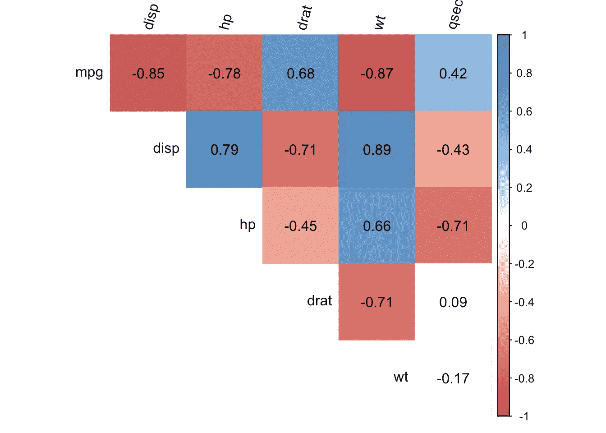
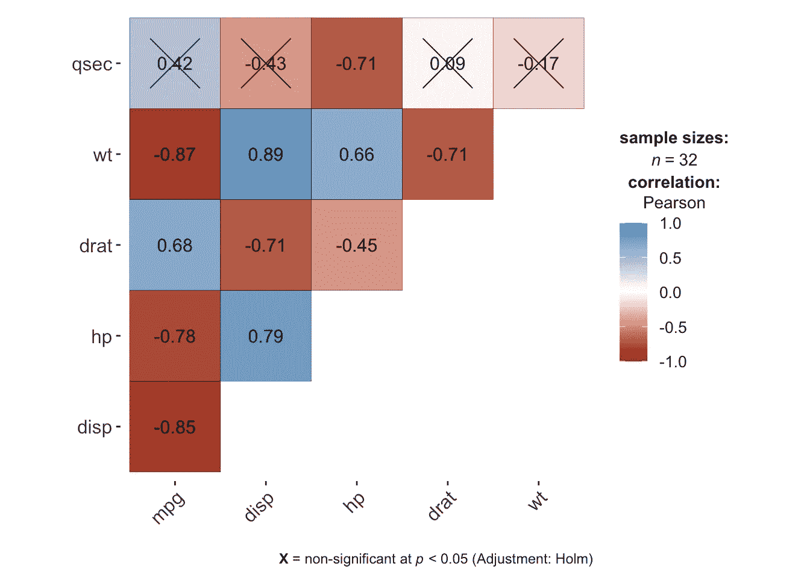
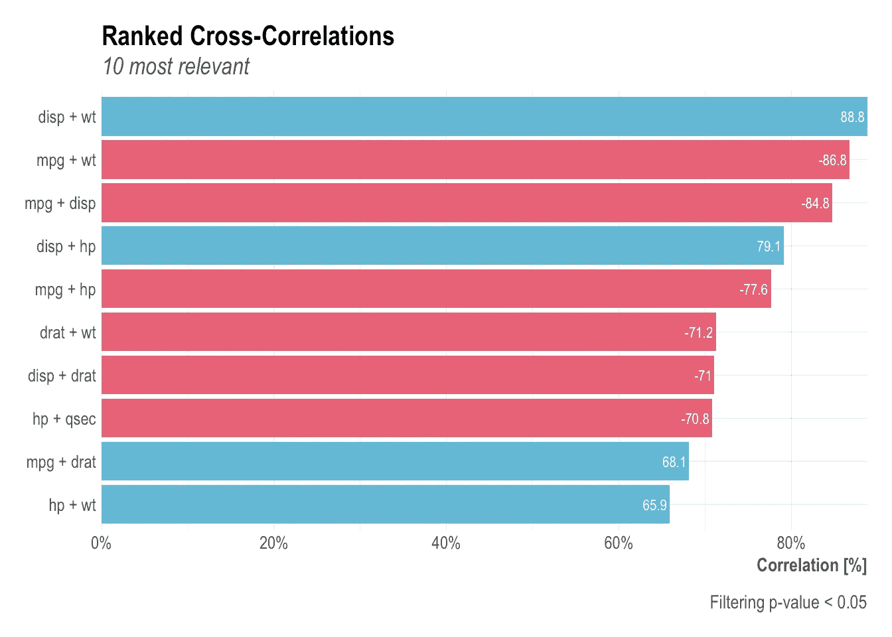
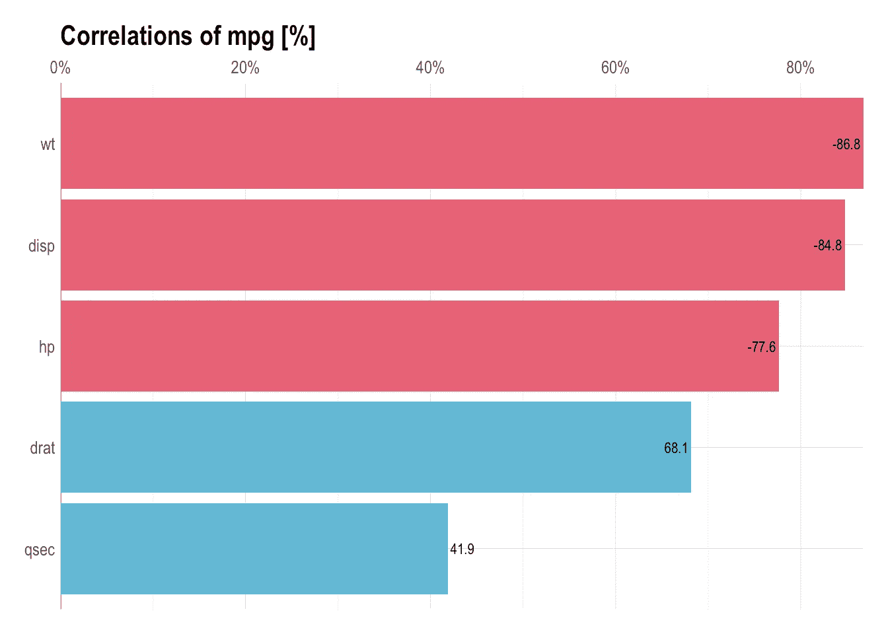

# R 中的相关图:如何突出显示数据集中最相关的变量

> 原文：<https://towardsdatascience.com/correlogram-in-r-how-to-highlight-the-most-correlated-variables-in-a-dataset-a9c2e6ea8529?source=collection_archive---------16----------------------->

## 或者如何以更有洞察力和更吸引人的方式呈现相关矩阵


照片由[普里特什·首陀罗](https://unsplash.com/@pritesh557?utm_source=medium&utm_medium=referral)拍摄

# 介绍

C [或相关性](https://www.statsandr.com/blog/correlation-coefficient-and-correlation-test-in-r/)，通常作为[描述性统计](https://www.statsandr.com/blog/descriptive-statistics-in-r)的一部分进行计算，是一种用于研究两个变量之间关系的统计工具，即变量对之间是否相关以及相关程度如何。

一次只能测量两个变量之间的相关性。因此，对于包含许多变量的数据集，计算相关性会变得非常麻烦和耗时。

# 相关矩阵

这个问题的解决方案是计算相关性并在相关矩阵中显示它们，相关矩阵显示数据集中两个变量的所有可能组合的相关系数。

例如，下面是数据集`mtcars`的相关矩阵(如 R 的帮助文档所述，它包括 32 辆汽车的燃料消耗和汽车设计和性能的 10 个方面)。 [1](https://www.statsandr.com/blog/correlogram-in-r-how-to-highlight-the-most-correlated-variables-in-a-dataset/#fn1) 对于本文，我们只包括[连续](https://www.statsandr.com/blog/variable-types-and-examples/#continuous)变量。

```
dat <- mtcars[, c(1, 3:7)]
round(cor(dat), 2)##        mpg  disp    hp  drat    wt  qsec
## mpg   1.00 -0.85 -0.78  0.68 -0.87  0.42
## disp -0.85  1.00  0.79 -0.71  0.89 -0.43
## hp   -0.78  0.79  1.00 -0.45  0.66 -0.71
## drat  0.68 -0.71 -0.45  1.00 -0.71  0.09
## wt   -0.87  0.89  0.66 -0.71  1.00 -0.17
## qsec  0.42 -0.43 -0.71  0.09 -0.17  1.00
```

即使将相关系数四舍五入到 2 位数，您也会认为这个相关矩阵不容易快速解释。

如果您使用的是 [R Markdown](https://www.statsandr.com/blog/getting-started-in-r-markdown) ，您可以使用`{pander}`包中的`pander()`函数，使其可读性稍微好一点，但我们仍然必须承认，当涉及到可视化数据集的几个变量之间的相关性时，这个表并不是最佳的，特别是对于大型数据集。

# 相关图

为了解决这个问题并使其更具洞察力，让我们将相关矩阵转换成相关图。相关图(在 Friendly (2002)中也称为相关图或相关图)可以突出显示最相关(正相关和负相关)的变量。下面是一个与上述数据集相同的示例:



相关图代表所有变量对的相关性。正相关显示为蓝色，负相关显示为红色。颜色的强度与相关系数成比例，因此相关性越强(即越接近-1 或 1)，方框越暗。相关图右侧的彩色图例显示了相关系数和相应的颜色。

提醒一下，负相关意味着两个变量的变化方向相反，也就是说，如果一个变量增加，另一个变量减少，反之亦然。正相关意味着所考虑的两个变量同向变化，也就是说，如果一个变量增加，另一个变量增加，如果一个变量减少，另一个变量也减少。此外，相关性越强，两个变量之间的关联就越强。

# 相关性检验

最后，相关图中的白色方框表示，对于变量对，在指定的显著性水平(在本例中，α = 5)下，相关性与 0 没有显著差异。与 0 没有显著差异的相关性意味着所考虑的两个变量之间没有线性关系(可能有另一种关联，但不是线性的)。

为了确定特定的相关系数是否明显不同于 0，进行了相关测试。提醒本测试的无效假设和替代假设是:

*   H0: ρ = 0
*   H1: ρ ≠ 0

其中，ρ是相关系数。相关性检验基于两个因素:观察次数和相关系数。观察越多，两个变量之间的相关性越强，就越有可能拒绝这两个变量之间没有相关性的零假设。

在我们的例子中，上面的相关图显示变量`wt`(重量)和`hp`(马力)正相关，而变量`mpg`(每加仑英里数)和`wt`(重量)负相关(如果我们仔细想想，这两种相关性都有意义)。此外，变量`wt`和`qsec`不相关(由白色方框表示)。即使两个变量之间的相关系数为-0.17，相关性检验表明我们不能拒绝不相关的假设。这就是这两个变量的方框是白色的原因。

尽管该相关图呈现的信息与相关矩阵完全相同，但相关图呈现的是相关矩阵的可视化表示，允许快速浏览相关矩阵，以查看哪些变量相关，哪些变量不相关。

# 密码

对于那些有兴趣用自己的数据绘制相关图的人，这里是我根据`{corrplot}`包中的`corrplot()`函数改编的函数代码(再次感谢这个包的所有贡献者):

`corrplot2()`函数中的主要参数如下:

*   `data`:数据集的名称
*   `method`:要计算的相关方法，为“pearson”(默认)、“kendall”或“spearman”之一。根据经验，如果你的数据集包含定量连续变量，你可以保持皮尔森方法，如果你有[定性序数](https://www.statsandr.com/blog/variable-types-and-examples)变量，斯皮尔曼方法更合适
*   `sig.level`:相关性检验的显著性水平，默认为 0.05
*   `order`:变量的顺序，“原始”(默认)、“AOE”(特征向量的角度顺序)、“FPC”(第一主成分顺序)、“hclust”(层次聚类顺序)、“alphabet”(字母顺序)之一
*   `diag`:在对角线上显示相关系数？默认为`FALSE`
*   `type`:显示整个相关矩阵或简单的上/下部分，“上”(默认)、“下”、“完整”之一
*   `tl.srt`:变量标签的旋转
*   (请注意，数据集中缺失的值会被自动删除)

您还可以使用`corrplot2`函数的参数，并通过这个 [R 闪亮的应用程序](https://antoinesoetewey.shinyapps.io/correlogram/)来查看结果。

# `{ggstatsplot}`包装

使用`{ggstatsplot}`包中的`ggcorrmat()`功能可以替代上述相关图:

```
# load package
library(ggstatsplot)# correlogram
ggstatsplot::ggcorrmat(
  data = dat,
  type = "parametric", # parametric for Pearson, nonparametric for Spearman's correlation
  colors = c("darkred", "white", "steelblue") # change default colors
)
```



在该相关图中，相关系数上的十字显示了非显著相关性(Holm 调整方法默认为 5%显著性水平)。

# `{lares}`包装

多亏了这篇文章，我发现了`{lares}`包，它在绘制相关性方面有非常好的特性。这个软件包的另一个优点是，它可以用来计算与数字，逻辑，分类和日期变量的相关性。

在这篇[文章](https://datascienceplus.com/find-insights-with-ranked-cross-correlations/)中可以看到更多关于这个包的信息。

# 所有可能的关联

如果您想计算所有相关性并返回图中最高和最重要的相关性，请使用`corr_cross()`功能:

```
# devtools::install_github("laresbernardo/lares")
library(lares)corr_cross(dat, # name of dataset
  max_pvalue = 0.05, # display only significant correlations (at 5% level)
  top = 10 # display top 10 couples of variables (by correlation coefficient)
)
```



负相关用红色表示，正相关用蓝色表示。

# 一个变量与所有其他变量的相关性

如果您想关注一个变量与所有其他变量的相关性，并返回图中最高的变量，请使用`corr_var()`函数:

```
corr_var(dat, # name of dataset
  mpg, # name of variable to focus on
  top = 5 # display top 5 correlations
)
```



感谢阅读。我希望这篇文章能帮助你可视化数据集中变量之间的相关性，并使相关矩阵更有洞察力和吸引力。如果你想了解更多关于这个话题的内容，请看如何计算 R 中的[相关系数和相关测试。](https://www.statsandr.com/blog/correlation-coefficient-and-correlation-test-in-r/)

和往常一样，如果您有与本文主题相关的问题或建议，请将其添加为评论，以便其他读者可以从讨论中受益。

**相关文章:**

*   [R markdown 入门](https://www.statsandr.com/blog/getting-started-in-r-markdown/)
*   [聚类分析完全指南:k-means 和手动和 in R 系统聚类](https://www.statsandr.com/blog/clustering-analysis-k-means-and-hierarchical-clustering-by-hand-and-in-r/)
*   [安装和加载 R 包的有效方法](https://www.statsandr.com/blog/an-efficient-way-to-install-and-load-r-packages/)
*   我的数据符合正态分布吗？关于最广泛使用的分布以及如何检验 R 中的正态性的注释

# 参考

很友好，迈克尔。2002."相关图:相关矩阵的探索性显示."*美国统计学家*56④。泰勒&弗朗西斯:316–24。

*原载于 2020 年 2 月 22 日 https://statsandr.com**T21*[。](https://statsandr.com/blog/correlogram-in-r-how-to-highlight-the-most-correlated-variables-in-a-dataset/)