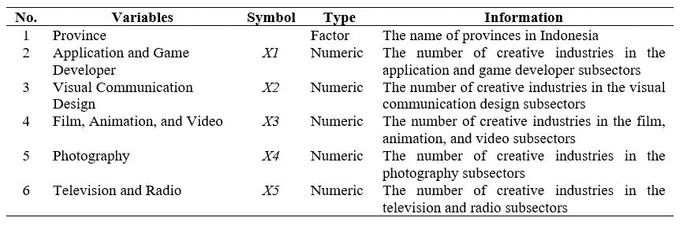
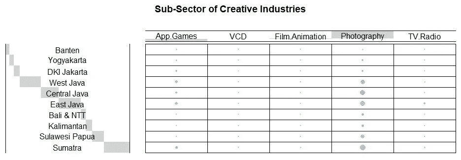
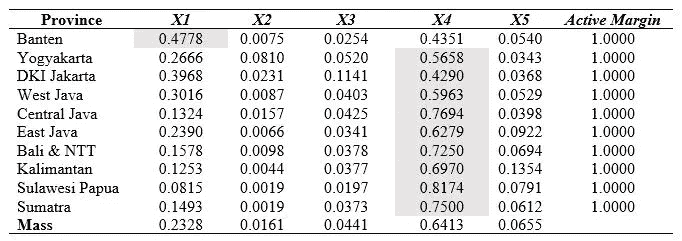
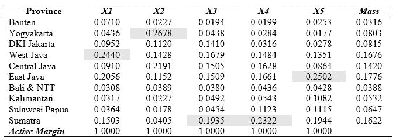
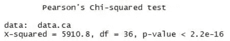
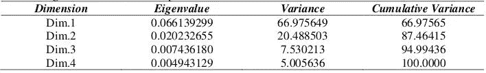
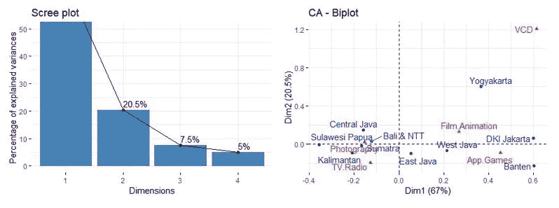

# 使用 R 和印度尼西亚真实数据集的对应分析介绍

> 原文：<https://towardsdatascience.com/correspondence-analysis-using-r-cd57675ffc3a?source=collection_archive---------12----------------------->


Rachael Gorjestani 在 [Unsplash](https://unsplash.com?utm_source=medium&utm_medium=referral) 上拍摄的照片

## [动手教程](https://towardsdatascience.com/tagged/hands-on-tutorials)

## 印度尼西亚创意经济署 2016

## 目录(仅适用于 web)

```
1 [Background](#4778)
  • [Objectives](#ce39)
  • [Benefits](#9b72)
  • [Scopes](#2b32)
2 [Methodology](#2b32)
  • [Data](#749d)
  • [The procedure of data analysis](#26d8)
3 [Result and Discussion](#f54d)
  • [Data pre-processing and integration](#016f)
  • [Data exploration](#ec9c)
  • [Profile table](#bf4e)
  • [Chi-square statistics](#b1be)
  • [Correspondence analysis](#3b4a)
4 [Interpretation](#1c91)
5 [References](#1252)
```

# 背景

根据 Pahlevi (2017)的说法，创意产业被定义为一个人类活动系统，包括与创造、生产、分配、交换和消费具有文化、艺术、美学、智力和情感价值的商品和服务相关的团体和个人。此外，创意产业是一个通过探索文化价值和生产基于科学的商品和服务，包括传统和现代产品，生产具有经济价值的有形和无形产出的产业。

现在，创意产业已被划分为 16 个子行业(游戏应用和开发、建筑和室内设计、视觉传达设计、产品设计、时尚、电影、动画视频、摄影、工艺、烹饪、音乐、出版、广告、表演艺术、美术、电视和广播)，它们在这些子行业中面临着各自的挑战。这 16 个分部门各有特点，这对它们的发展有影响。发展创意经济的一个关键因素是如何将一个城市视为文化和艺术中心。

印度尼西亚的每个省都有发展创意产业的潜力，而这些潜力各不相同。从主导全省的某些分部门的创意产业中可以看出这一点。因此，有必要对印尼各省创意产业子行业的分布特征进行深入分析。可以使用的分析是对应分析。它在视觉上类似于双标图分析，但用于列联表形式的分类数据。这种分析可以通过展示更有趣、信息量更大、更具交流性和艺术性的图形来提供理解的便利。

## 目标

这项研究的目标是:

*   确定印度尼西亚创意产业子行业变量之间的关系，如应用和游戏开发商、建筑和室内设计、视觉传达设计、时尚等；
*   确定各省之间的相对位置，以便根据创意产业分部门了解印度尼西亚各省之间的相似之处；
*   确定创意产业分行业之间的关系；和
*   找出 2016 年印尼创意产业子行业数量较少的省份。

## 利益

这项研究的好处是。

*   要了解 2016 年印度尼西亚创意产业的发展情况，
*   了解 2016 年印度尼西亚创意产业子行业的发展趋势，以及
*   成为政府在印尼各省发展创意产业的评估材料。

## 领域

研究的范围是，使用的数据是从[印尼创意经济局](https://bekraf.go.id/)官网下载的 2016 年印尼创意产业子行业分布的二手数据。

# 方法学

## 数据

所用数据为从印尼创意经济署官网下载的 2016 年印尼创意产业子行业分布二手数据。该数据有如下几个变量:



研究数据(图片由作者提供)

## 数据分析的程序

2016 年印度尼西亚创意产业子行业对应分析研究的步骤如下:

1.  进行描述性分析，使用列联表查找印度尼西亚每个省或地区的创意产业子行业的数量
2.  分析变量之间的关系，以查找省级变量和创意产业子行业变量之间的相关性
3.  按照以下步骤进行省级变量和创意产业子行业变量之间的对应分析:

*   基于以前的列联表创建基于行的概要表和基于列的概要表
*   根据上一步中基于行的配置文件和基于列的配置文件，计算行惯性和列惯性的比例值
*   基于之前的结果计算奇异值分解，以在二维图中显示每个省级变量和创意产业子行业变量的坐标

# 结果和讨论

## 数据预处理和集成

印度尼西亚创意经济局 2016 年数据对应分析研究的第一步是数据预处理。其执行如下:

*   通过删除*【省】**【岛】*等词语，操纵 2016 年创意经济机构数据中的省或地区名称。此外，还总结了省或地区的名称
*   使用对应分析选择要分析的变量。选取的变量有:应用和游戏开发者；电影、动画和视频；视觉传达设计；摄影；电视和广播

```
# Import libraries
library(factoextra)
library(FactoMineR)
library(gplots)
# Read the data
data.ca = read.csv2(file = '/Data Badan Ekonomi Kreatif.csv',
                    header = TRUE,
                    sep = ';')
# Select 5 predictor variables
data.ca = data.ca[,c(1,2,5,8,9,17)]
# Edit First Column as Rownames of Data
data.ca.rownames = data.ca[,1]
data.ca = data.ca[,-1]
row.names(data.ca) = data.ca.rownames
```

## 数据探索

数据探索用于获取 2016 年创意经济机构数据的初始信息。对应用程序和游戏开发者变量进行探索；视觉传达设计；电影、动画和视频；摄影；电视和广播。

```
# Convert the data into contingency table
dt = as.table(as.matrix(data.ca))
# Create a balloonplot
balloonplot(t(dt), 
            main = 'Sub-Sector of Creative Industries', 
            xlab = '',
            ylab = '',
            label = FALSE, 
            show.margins = FALSE)
```



图 1 2016 年印尼创意产业子行业列联表图(图片由作者提供)

根据图 1，可以得出结论，与应用程序和游戏开发商相比，摄影是最大的创意企业或公司；视觉传达设计；电影、动画和视频；电视和广播。从视觉上看，与其他省份或地区相比，苏门答腊是拥有最大摄影企业或公司的省份或地区。然而，根据省份来看，与印度尼西亚其他省份相比，西爪哇、中爪哇和东爪哇是拥有最大摄影企业或公司的省份。除了摄影之外，在每个省或地区都有许多业务的其他创意业务是应用程序和游戏开发商。与印度尼西亚其他省份相比，西爪哇和东爪哇是拥有最大的应用和游戏开发商企业或公司的省份。

## 简介表

对应分析从研究行和列的轮廓开始。它旨在找出 2016 年印度尼西亚各省或地区中正在发展的创意产业子行业，并找出哪些省或地区拥有最大的创意企业或公司。行剖面和列剖面如表 3 和表 4 所示。

```
# Create row profile
data.ca.row = data.ca/rowSums(data.ca)
View(data.ca.row)
mass.row = colMeans(data.ca.row)
```



表 3 2016 年印度尼西亚创意产业子行业数据的 row profile 值(图片由作者提供)

表 3 中的行轮廓显示最大质量值为 0.6413，其位于摄影子部分( *X4* )。这是数据的模式。它表明，摄影子行业是一个创造性的企业或公司，与其他行业相比比例最高。所有省份或地区都存在摄影子行业，因此可以说，2016 年，摄影在印度尼西亚将趋于发展，特别是在日惹、DKI 雅加达、西爪哇、中爪哇、东爪哇、巴厘& NTT、加里曼丹、苏拉威西&巴布亚和苏门答腊。与此同时，在万丹，应用和游戏开发商( *X1* )是比例最高的子行业。因此，在万丹，应用程序和游戏开发者子行业是发展迅速的创造性行业。

```
# Create column profile
data.ca.col = t(data.ca)/colSums(data.ca)
View(data.ca.col)
mass.col = rowMeans(t(data.ca.col))
```



表 4 2016 年印尼创意产业子行业数据专栏简介值(图片由作者提供)

表 4 中的柱形图显示了创意产业分部门的质量值，17.76%在东爪哇，16.76%在西爪哇，16.22%在苏门答腊。2016 年日惹最有发展趋势的子行业是视觉传达设计。对于 2016 年的西爪哇来说，倾向于发展的细分行业是应用和游戏开发者。对于 2016 年的东爪哇，倾向于发展的子行业是电视和广播。至于苏门答腊，趋向于发展的分支部门是电影、动画、电影和摄影。

## 卡方统计

要解释对应分析，第一步是评估行和列之间是否有显著的相关性。

> **假设**
> 
> H0:假设两个变量之间没有关联
> 
> H1:假设两个变量之间有关联

```
# To evaluate whether there is a significant dependence between row and column categories
chisq = chisq.test(data.ca)
```



因为 P 值= 2.2e-16 小于 5% (α)，所以决定拒绝零假设。因此，基于卡方检验，可以得出结论，在显著性水平为 5%的情况下，行和列之间没有关联。

## 对应分析

对应分析是使用*主成分分析*概念的多变量分析。要查方差，就要计算特征值。对应分析的特征值如表 5 所示。

```
# Correspondence analysis
res.ca = CA(data.ca, graph = TRUE)
print(res.ca)
# Eigenvalue
eig.val = get_eigenvalue(res.ca)
```



表 5 2016 年印度尼西亚创意产业子行业数据对应分析的特征值(图片由作者提供)

根据表 5，发现成分 1 和成分 2 解释了数据可变性的 87.46415%。所以对应分析得到的结果很好地解释了数据。

```
# Create Scree plot
fviz_screeplot(res.ca, addlabels = TRUE, ylim = c(0, 50))
# Create symmetric plot of correspondence analysis
fviz_ca_biplot(res.ca, repel = TRUE) # Make correspondence plot
```



图 2 (a)碎石图和(b) *对应分析的对称图(图片由作者提供)*

根据图 2 (a)中的碎石图，发现在组分 2 中，可以解释的可变性百分比急剧下降。这表明添加成分 3 不影响可以解释的数据多样性。因此，选择组件 1 和 2。通过两个选择的成分可以解释的可变性的总百分比约为 **87.46415%** 。

# **解读**

从通信图中获得的一些信息是基于 2016 年印度尼西亚创意产业子行业的一组省份。信息如下:

*   第一组是以摄影和电视广播的创意产业子行业为特征的省份或地区。这一组包括的省份或地区有中爪哇、东爪哇、巴厘和 NTT 以及苏拉威西和巴布亚
*   第二组是以创意电影、动画和视频行业以及应用和游戏开发商为特征的省份或地区。这组省份或地区包括万丹、DKI 雅加达和西爪哇
*   第三组是以视觉传达设计创意产业子行业为特征的省份或地区。该组包括的省份或地区是日惹。与其他省份相比，日惹省的视觉传达设计子行业的质量值最高

请前往我的 [**GitHub 回购**](https://github.com/audhiaprilliant/Multivariate-Analysis/tree/master/Correspondence%20Analysis%20of%20Badan%20Ekonomi%20Kreatif%202016) 寻找完整的代码

# 参考

[1] Anonim。*文章—R 中的主成分方法:实用指南*(2017)[http://www.sthda.com](http://www.sthda.com/english/articles/31-principal-component-methods-in-r-practical-guide/113-ca-correspondence-analysis-in-r-essentials/)/。

[2]作为。帕勒维。[](https://jurnal.kemendagri.go.id/index.php/jbp/article/view/565)**】( 2017)，国家利益和发展研讨会:"通过利益和发展的实践促进传统创新"。**