# 使用 Python 解释余弦相似性

> 原文：<https://towardsdatascience.com/cosine-similarity-explained-using-python-machine-learning-pyshark-5c5d6b9c18fa?source=collection_archive---------22----------------------->

## 在本文中，我们将讨论余弦相似性，并举例说明它在 Python 中产品匹配的应用

**目录:**

*   介绍
*   余弦相似性(概述)
*   使用 Python 的产品相似性(示例)
*   结论

# 介绍

推荐引擎领域中许多有趣的案例和项目很大程度上依赖于正确识别项目和/或用户对之间的相似性。

有几种量化相似性的方法，它们具有相同的目标，但在方法和数学公式上有所不同。

在本文中，我们将探讨其中一种量化方法，即余弦相似度。我们将把学到的理论应用到样本数据中，尝试解决用户相似性问题。

本文中学到的概念可以应用于各种项目:文档匹配、推荐引擎等等。

# 余弦相似性(概述)

余弦相似性是两个非零向量之间相似性的度量。它被计算为这些向量之间的角度(也与它们的内积相同)。

这听起来像是很多新的或者对学习者来说很难的技术信息。我们将在这里通过详细的可视化和例子来分解它。

让我们考虑三个向量:

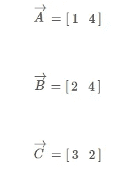

作者图片

并在笛卡尔坐标系中绘制它们:

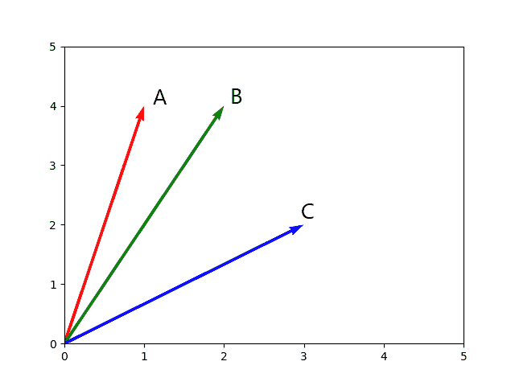

作者图片

例如，从图中我们可以看到，矢量 **A** 比矢量 **C** 更类似于矢量 **B** 。

但是我们怎么知道呢？嗯，通过观察，我们看到它们 **A** 和 **B** 比 **A** 到 **C** 彼此更靠近。从数学上讲，角度 **A0B** 小于 **A0C** 。

回到数学公式(让我们考虑矢量 **A** 和矢量 **B** )，两个非零矢量的余弦可以从欧几里德点积中导出:

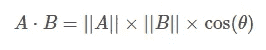

作者图片

这解决了:

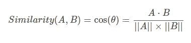

作者图片

## 求解组件

我们来分解一下上面的公式。

**第一步:**

我们将从提名者开始:

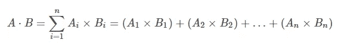

作者图片

其中 *Ai* 和 *Bi* 是向量 A 和 b 的第 *i* 个元素。

对于我们的情况，我们有:

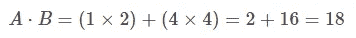

作者图片

很好，我们找到了矢量 A 和 b 的点积。

**第二步:**

下一步是研究分母:

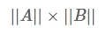

作者图片

我们看到的是向量长度的乘积。简单来说:向量 A 的长度乘以向量 b 的长度。

向量的长度可以计算如下:

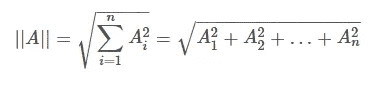

作者图片

其中 *A_i* 是向量 A 的第 *i* 个元素。

对于我们的情况，我们有:

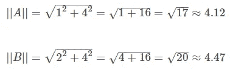

作者图片

**第三步:**

至此，我们已经拥有了原始公式的所有组件。让我们把它们插上电源，看看我们得到了什么:

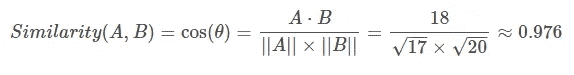

作者图片

这两个向量(向量 A 和向量 B)具有 0.976 的余弦相似性。注意，该算法是对称的，这意味着 A 和 B 的相似性与 B 和 A 的相似性相同。

**加法**
按照同样的步骤，你可以求解向量 A 和 C 之间的余弦相似度，应该得到 0.740。

这证明了我们在看图时的假设:向量 A 更类似于向量 B，而不是向量 c。在本教程创建的示例中，我们正在处理一个非常简单的二维空间，您可以很容易地看到图上的差异。然而，在真实的案例场景中，事情可能没有那么简单。在大多数情况下，您将使用具有两个以上要素的数据集来创建一个 n 维空间，如果不使用一些降维技术( [PCA](https://pyshark.com/principal-component-analysis-in-python/) ， [tSNE](https://pyshark.com/visualization-of-multidimensional-datasets-using-t-sne-in-python/) )，可视化将非常困难。

# 使用 Python 的产品相似性(示例)

向量空间的例子对于我们理解计算余弦相似性的逻辑和过程是必要的。现在，我们如何在现实世界的任务中使用它呢？

让我们把上面的向量数据放到一些现实生活的例子中。假设我们正在处理一些服装数据，我们希望找到彼此相似的产品。我们有三种类型的服装:连帽衫、毛衣和露脐上衣。可用的产品数据如下:

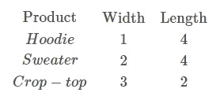

作者图片

请注意，我们使用的数据与理论部分完全相同。但是把它放到上下文中会使事情更容易想象。根据上面的数据，我们认为帽衫更像一件毛衣，而不是一件露脐上衣。事实上，数据告诉我们同样的事情。

为了继续学习本教程，我们需要以下 Python 库:pandas 和 sklearn。

如果您没有安装它，请打开“命令提示符”(在 Windows 上)并使用以下代码安装它:

```
pip install pandas
pip install sklearn
```

我们将采取的第一步是在 Python 中将上述数据集创建为数据框(仅包含包含我们将使用的数值的列):

我们应该得到:

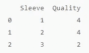

作者图片

接下来，使用 sklearn 库中的 [cosine_similarity()](https://scikit-learn.org/stable/modules/generated/sklearn.metrics.pairwise.cosine_similarity.html) 方法，我们可以计算上述数据帧中每个元素之间的余弦相似度:

输出是数据帧的每个条目之间具有相似性的数组:

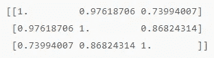

作者图片

为了更好地理解，上面的数组可以显示为:

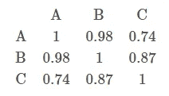

作者图片

请注意，计算结果与理论部分的手动计算结果相同。当然，这里的数据很简单，而且只是二维的，因此结果很高。但是同样的方法可以扩展到更复杂的数据集。

# 结论

在本文中，我们讨论了余弦相似性，并举例说明了它在 Python 产品匹配中的应用。

上述大量材料是复杂推荐引擎和预测算法的基础。

我也鼓励你看看我在[机器学习](https://pyshark.com/category/machine-learning/)的其他帖子。

如果你有任何问题或者对编辑有任何建议，请在下面留下你的评论。

*原载于 2020 年 10 月 27 日*[*【https://pyshark.com】*](https://pyshark.com/cosine-similarity-explained-using-python/)*。*