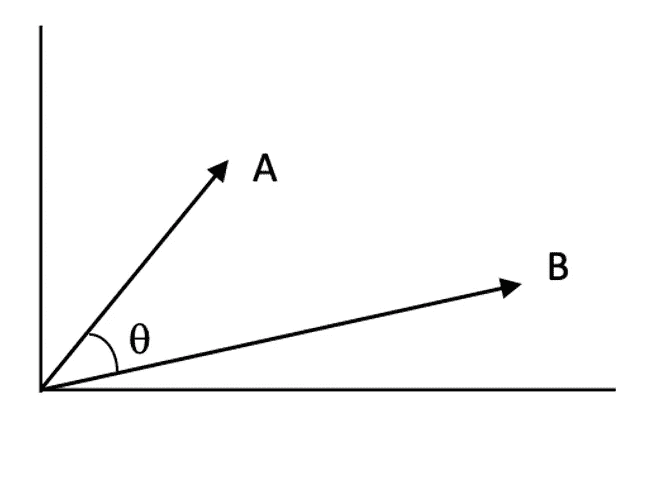
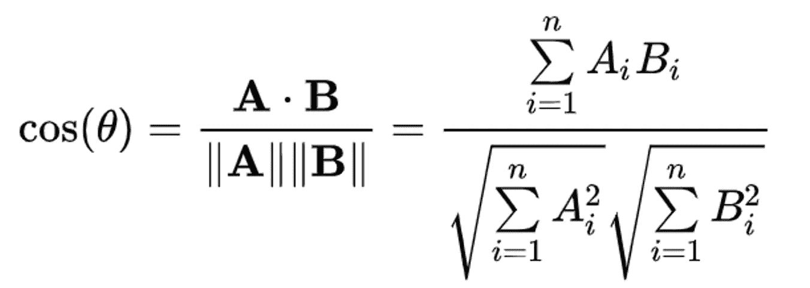
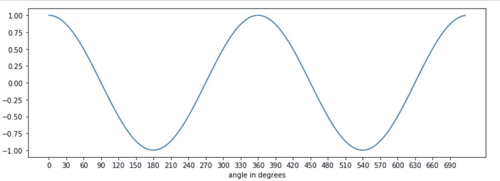
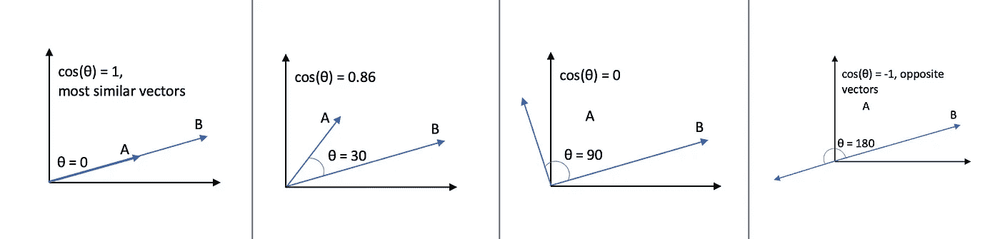
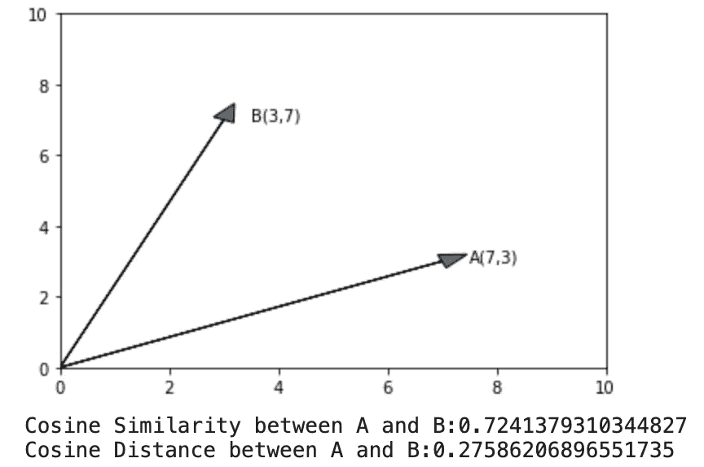
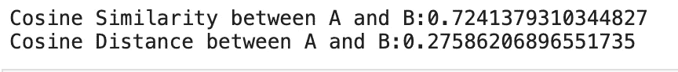
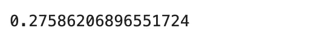
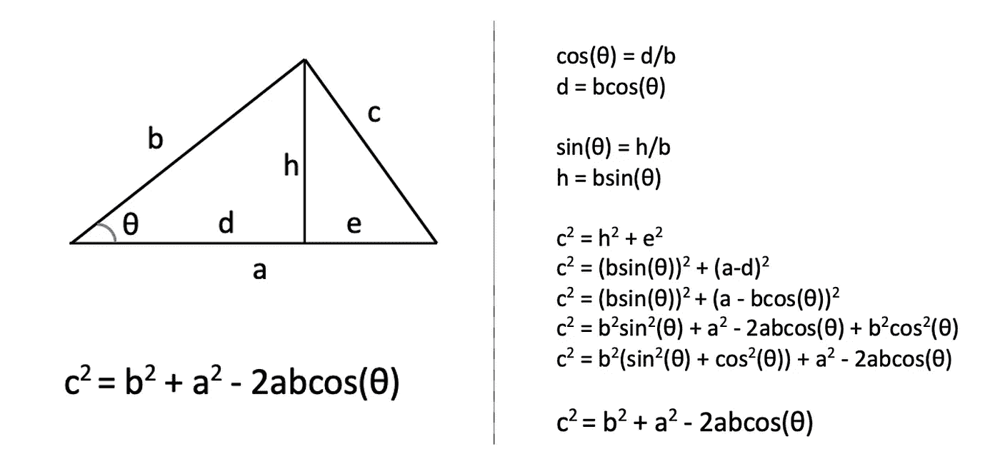
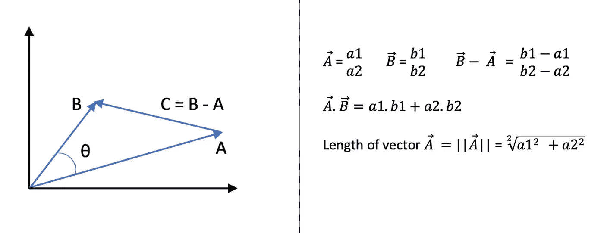
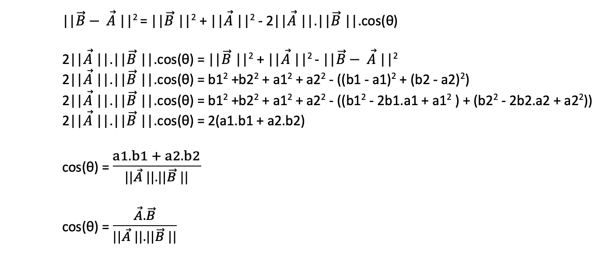

# 余弦相似性:它是如何衡量相似性的，背后的数学原理以及在 Python 中的用法

> 原文：<https://towardsdatascience.com/cosine-similarity-how-does-it-measure-the-similarity-maths-behind-and-usage-in-python-50ad30aad7db?source=collection_archive---------8----------------------->


Artem Kniaz 在 [Unsplash](https://unsplash.com?utm_source=medium&utm_medium=referral) 上拍摄的照片

**什么是余弦相似度？**

余弦相似性通过计算两个向量之间角度的余弦来度量两个向量之间的相似性。

余弦相似性是数据科学中使用最广泛、最强大的相似性度量之一。它被用于多种应用，例如在自然语言处理中寻找相似的文档，信息检索，在生物信息学中寻找与 DNA 相似的序列，检测剽窃等等。

余弦相似度计算如下:



两个二维向量 A 和 B 之间的角度(图片由作者提供)



A 和 B 之间夹角余弦的计算

**为什么 A 和 B 之间的夹角余弦给了我们相似性？**

如果你看看余弦函数，θ= 0°时为 1，θ= 180°时为-1，这意味着对于两个重叠的矢量，余弦将是两个完全相反的矢量的最高和最低值。你可以把 1 余弦当作距离。



余弦(作者图片)



不同角度的余弦值(图片由作者提供)

**用 Python 怎么算？**

公式的分子是两个向量的点积，分母是两个向量的 L2 范数的乘积。两个向量的点积是向量的元素相乘的和，L2 范数是向量的元素平方和的平方根。

我们可以使用 Numpy 库中的内置函数来计算向量的点积和 L2 范数，并将其放入公式中，或者直接使用来自 sklearn.metrics.pairwise 的余弦相似度。考虑二维中的两个向量 A 和 B，下面的代码计算余弦相似度，

```
import numpy as np
import matplotlib.pyplot as plt# consider two vectors A and B in 2-D
A=np.array([7,3])
B=np.array([3,7])ax = plt.axes()ax.arrow(0.0, 0.0, A[0], A[1], head_width=0.4, head_length=0.5)
plt.annotate(f"A({A[0]},{A[1]})", xy=(A[0], A[1]),xytext=(A[0]+0.5, A[1]))ax.arrow(0.0, 0.0, B[0], B[1], head_width=0.4, head_length=0.5)
plt.annotate(f"B({B[0]},{B[1]})", xy=(B[0], B[1]),xytext=(B[0]+0.5, B[1]))plt.xlim(0,10)
plt.ylim(0,10)plt.show()
plt.close()# cosine similarity between A and B
cos_sim=np.dot(A,B)/(np.linalg.norm(A)*np.linalg.norm(B))
print (f"Cosine Similarity between A and B:{cos_sim}")
print (f"Cosine Distance between A and B:{1-cos_sim}")
```



代码输出(图片由作者提供)

```
# using sklearn to calculate cosine similarity
from sklearn.metrics.pairwise import cosine_similarity,cosine_distancescos_sim=cosine_similarity(A.reshape(1,-1),B.reshape(1,-1))
print (f"Cosine Similarity between A and B:{cos_sim}")
print (f"Cosine Distance between A and B:{1-cos_sim}")
```



代码输出(图片由作者提供)

```
# using scipy, it calculates 1-cosine
from scipy.spatial import distancedistance.cosine(A.reshape(1,-1),B.reshape(1,-1))
```



代码输出(图片由作者提供)

**公式的证明**

余弦相似公式可以用余弦定律来证明，



余弦定律(图片由作者提供)

考虑二维的两个向量 A 和 B，例如，



两个二维向量(图片由作者提供)

利用余弦定律，



余弦相似性使用余弦定律(图片由作者提供)

你可以证明同样的 3 维或任何维度。它遵循与上面完全相同的步骤。

**总结**

我们看到了余弦相似性是如何工作的，如何使用它以及它为什么工作。我希望这篇文章有助于理解这个强大指标背后的整个概念。