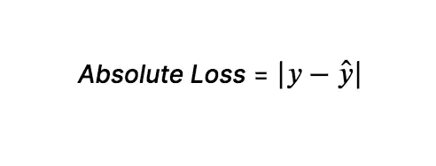
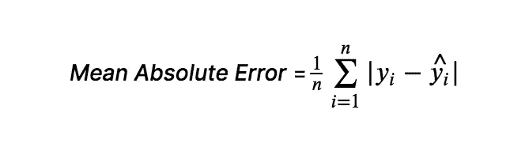
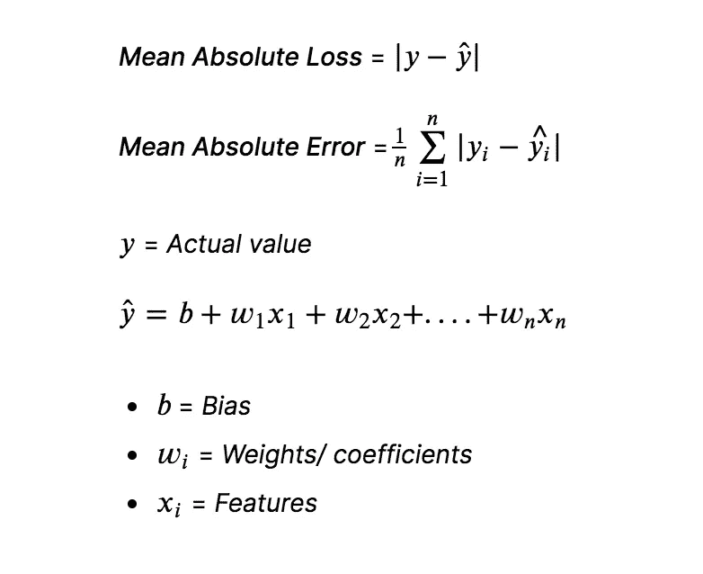
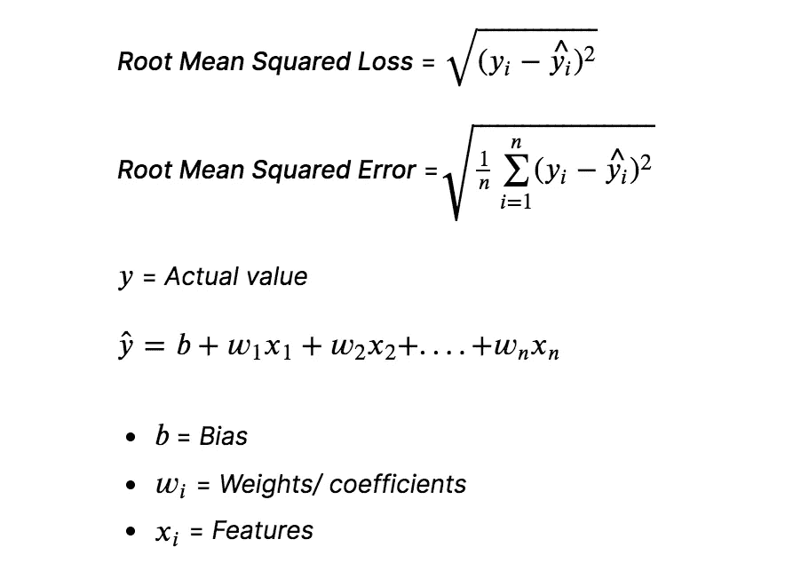
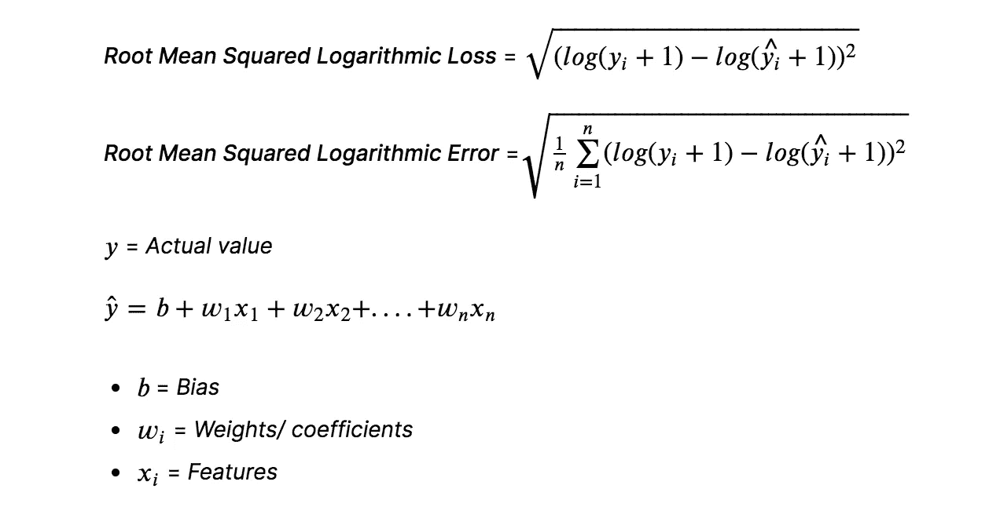
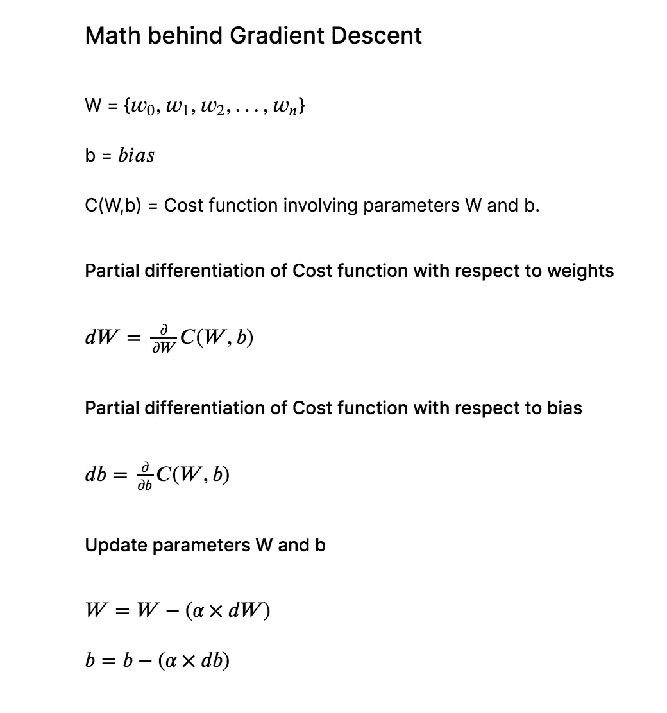
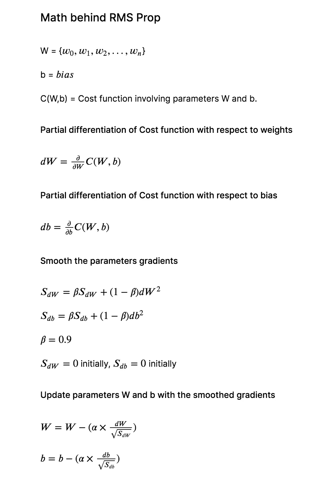
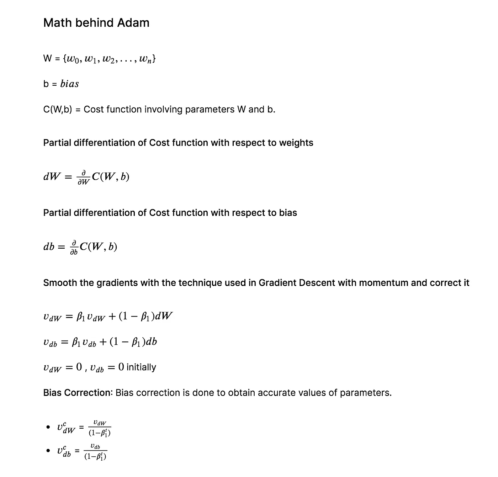
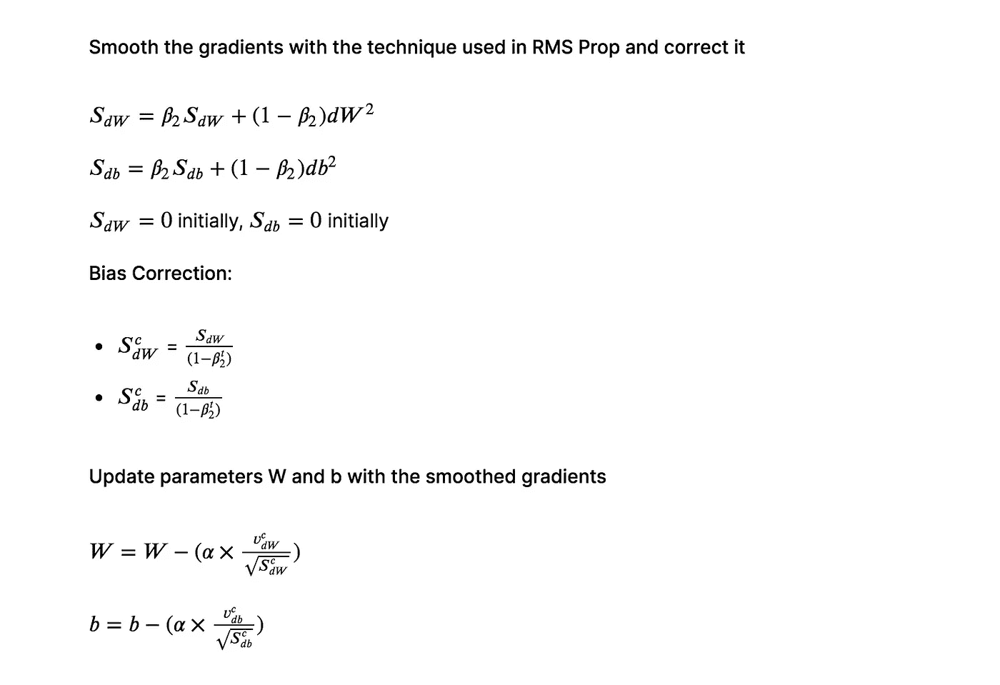

# 机器学习中回归的代价函数及其优化技术

> 原文：<https://towardsdatascience.com/cost-functions-of-regression-and-its-optimization-techniques-in-machine-learning-2f5931cd33f1?source=collection_archive---------13----------------------->

## 深入探讨回归的成本函数及其优化技术:Python 中的漫游

亚历山大·密尔斯在 [Unsplash](https://unsplash.com?utm_source=medium&utm_medium=referral) 上拍摄的照片

# 价值函数

成本函数用于衡量机器学习模型的性能。缺乏成本函数的机器学习模型是无用的。成本函数有助于分析机器学习模型的性能。成本函数基本上将预测值与实际值进行比较。成本函数的适当选择有助于模型的可信度和可靠性。

## 损失函数与成本函数

*   定义在单个数据实例上的函数称为损失函数。

回归的绝对损失

*   在整个数据实例上定义的函数称为成本函数。

回归的平均绝对误差

# 回归的成本函数

回归任务处理连续数据。可用于回归的成本函数有:

*   绝对平均误差
*   均方误差
*   均方根误差
*   均方根对数误差

## 绝对平均误差

**平均绝对误差(MAE)** 是实际值和预测值之间的平均绝对差值。

*   MAE 对异常值更稳健。对异常值不敏感是因为它不会惩罚由异常值引起的高误差。
*   MAE 的缺点是它在零点不可微，并且许多损失函数优化算法涉及微分以找到参数的最佳值。

## 均方误差

**均方差(MSE)** 是实际值和预测值之间的均方差。MSE 通过平方误差来惩罚由异常值引起的高误差。优化算法受益于惩罚，因为它有助于找到参数的最佳值。

*   MSE 的缺点是对异常值非常敏感。当高误差(由目标中的异常值引起)被平方时，它甚至变成更大的误差。
*   MSE 可用于不希望出现高误差的情况。

## 均方根误差

**均方根误差(RMSE)** 是实际值和预测值之差的均方根。RMSE 可以用在我们想要惩罚高错误的情况下，但没有 MSE 那么多。

*   RMSE 对异常值也非常敏感。RMSE 中的平方根确保误差项被罚，但不像 MSE 那么多。

## 均方根对数误差

**均方根对数误差(RMSLE)** 非常类似于 RMSE，但是在计算实际值和预测值之间的差异之前应用对数。大误差和小误差被同等对待。RMSLE 可用于目标未被标准化或缩放的情况。

*   与 RMSE 相比，RMSLE 对异常值不太敏感。它减轻了由于日志的存在而导致的高错误的惩罚。

# 成本函数优化算法

成本函数优化算法试图通过找到成本函数的全局最小值来找到模型参数的最优值。可用的各种算法有，

*   梯度下降
*   RMS Prop
*   圣经》和《古兰经》传统中）亚当（人类第一人的名字

## 加载预处理的数据

你输入给人工神经网络的数据必须经过彻底的预处理，以产生可靠的结果。训练数据已经过预处理。所涉及的预处理步骤是，

*   老鼠归罪
*   对数变换
*   平方根变换
*   顺序编码
*   目标编码
*   z 分数标准化

> 有关上述步骤的详细实现，请参考我的 Kaggle 笔记本上的数据预处理。[笔记本链接](https://www.kaggle.com/srivignesh/data-preprocessing-for-house-price-prediction)

## 用人工神经网络训练模型

更多细节请参考我的 Kaggle 笔记本上[关于 Tensorflow](https://www.kaggle.com/srivignesh/introduction-to-ann-in-tensorflow) 中的 ANN 的介绍。

## 梯度下降

梯度下降算法利用成本函数的梯度来寻找参数的最佳值。梯度下降是一种迭代算法。它试图找到一个全局最小值。

在每次迭代测试中，

*   找到数据的成本。
*   计算成本函数相对于权重和偏差的偏导数。
*   然后通过利用成本函数和学习率𝛼.的梯度来更新权重和偏差𝛼的值可以从 0.0 到 1.0。𝛼的值越大，找到成本函数的全局最小值所采取的步骤就越多。
*   继续上述步骤，直到完成指定次数的迭代或达到全局最小值。

## 均方根误差

RMS Prop 是一种非常类似于梯度下降的优化算法，但是梯度被平滑和平方，然后被更新以很快获得成本函数的全局最小值。

在每次迭代测试中，

*   找到数据的成本。
*   计算成本函数相对于权重和偏差的偏导数。
*   权重和偏差参数被平滑，然后通过利用成本函数和𝛼(学习率)的梯度来更新。
*   继续上述步骤，直到完成指定次数的迭代或达到全局最小值。

## Adam(自适应矩估计)

Adam(自适应矩估计)是通过将梯度下降与动量和 RMS Prop 相结合而出现的算法。

在每次迭代测试中，

*   找到数据的成本。
*   计算成本函数相对于权重和偏差的偏导数。
*   使用 RMS Prop 和带动量的梯度下降中使用的技术来平滑权重和偏差，然后通过利用成本函数和𝛼(学习率)的梯度来更新权重和偏差。
*   继续上述步骤，直到完成指定次数的迭代或达到全局最小值。

# 摘要

*   平均绝对误差对异常值是稳健的，而均方误差对异常值是敏感的
*   梯度下降算法试图找到参数的最佳值，从而找到成本函数的全局最小值。
*   RMS Prop 和 Adam 等算法可被视为梯度下降算法的变体。

**在我的 Kaggle 笔记本里找到这个帖子:**[https://www . ka ggle . com/srivignesh/cost-functions-of-regression-its-optimizations](https://www.kaggle.com/srivignesh/cost-functions-of-regression-its-optimizations)

**参考文献:**

[1]吴恩达，[深度学习专精](https://www.coursera.org/specializations/deep-learning)。

*在*[*LinkedIn*](https://www.linkedin.com/in/srivignesh-rajan-123569151/)*，*[*Twitter*](https://twitter.com/RajanSrivignesh)*上联系我！*

**快乐的机器学习！**

## 谢谢你！