# 营销活动的成本预测(数据清理和特征选择——第二部分)

> 原文：<https://towardsdatascience.com/costs-prediction-of-a-marketing-campaign-data-cleaning-feature-selection-part-ii-6aa5298909b5?source=collection_archive---------35----------------------->

## 预测营销活动最佳目标候选人的数据科学方法


数据清理和特征选择—gon alo GUI mares Gomes

在第一篇文章中，我进行了[探索性的数据分析](https://bit.ly/3lDzknU)，这让我们可以看得更远，超越最初的数据集。

EDA 可能是一项非常耗时的任务，很少是一次性走完的，尽管我们可能会发现自己经常回到早期部分更改和尝试一些不同的方法，但详细的分析通常会有所帮助，并为我们提供大量有关数据和变量行为的信息。

本文只关注第二部分，即**清洁&功能选择**。

你可以在这里熟悉 EDA 部分[。
你可以在这里](https://bit.ly/3lDzknU)找到这个项目[的代码。
可点击](https://bit.ly/3hmI3YS)此处[下载“bank_marketing_campaign.csv”数据集。](https://bit.ly/31a0EAL)


[布拉登·科拉姆](https://unsplash.com/@bradencollum?utm_source=medium&utm_medium=referral)在 [Unsplash](https://unsplash.com?utm_source=medium&utm_medium=referral) 上拍摄的照片

# **数字特征之间的相关性**

在降维的背景下，特征和目标变量之间的相关性分析被证明是双变量数据分析中的基本步骤，因为它帮助我们计算特征的重要性。

让我们从指出皮尔逊和斯皮尔曼的相关系数概念开始。

根据定义，**皮尔逊相关系数**，通常被称为**皮尔逊相关系数*r*，是描述两个随机变量线性相关的程度，它们的统计关系有多强，在哪个方向发生，在二元数据中是否偶然。**

值的范围从-1.0 到 1.0，其中第一个值表示总的负线性相关，而第二个值表示相反的线性相关。值为 0.0 表明没有线性关系。

另一个重要的推论是，皮尔逊相关性只能评估连续变量之间的线性关系，这意味着一个变量的变化意味着另一个变量以恒定的速率成比例地变化，否则它就是非线性关系。仅当变量呈正态分布时，才建议使用这种参数测试。

其中一个输出是相关性的 **p 值，粗略显示了不相关系统产生某一数量级相关值的概率。低 p 值(通常≤0.05)告诉我们，相关性很可能是显著的。具体来说，p 值将揭示特征的预测能力。**

```
# Most correlated against the target (Pearson method)
pearson = df_num.corr()
corr_target = pearson.target
display(corr_target.sort_values(ascending=False))

print("Ordered by rank in absolute values")
display(corr_target.abs().sort_values(ascending=False))
```

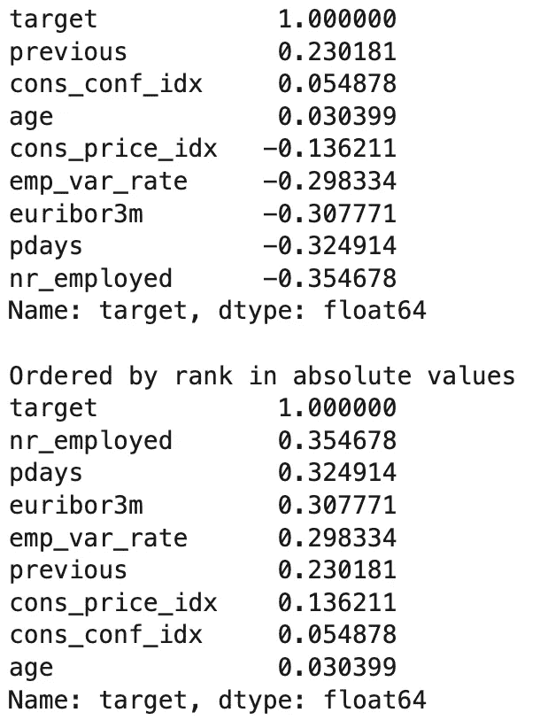

“Nr_employed”与目标最相关，其次是“pdays”、“euribor3m”和“emp_avr_rate”，同时，它们与目标的关系强度较低。下表让我们得出结论，所有特征都具有预测能力。

```
# Subdivision of target
ynum = df_num.target
Xnum = df_num.drop(["target"], axis= "columns")# Identifying variables with predictive power (Pearson p-value)
pd.DataFrame(
    [scipy.stats.pearsonr(Xnum[col], ynum) for col in Xnum.columns],
    columns=["Pearson Corr.", "p-value"],
    index=Xnum.columns,
).round(2).T
```

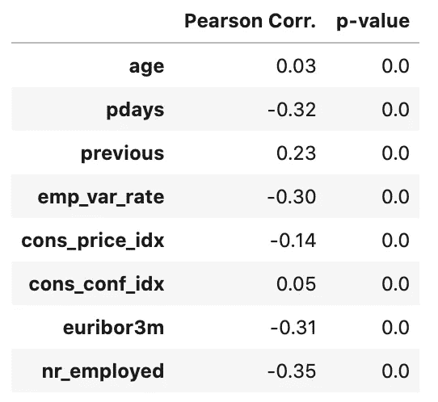

所有变量都有预测能力。

另一方面，**斯皮尔曼相关系数**，或**斯皮尔曼相关系数**，是一种秩序相关性的非参数度量，用于评估两个连续或有序变量之间的单调关系。

当出现以下情况之一时，出现单调关系:

当一个变量的值增加时，其他变量的值也会增加

和

***b)*** 当一个变量的值增加时，其他变量的值就会减少

但是

***a)+b)*** 不是以恒定的速率。

这意味着所有线性变量的关系同时是单调的，但反过来并不总是正确的，因为我们可以同时具有单调的非线性相关性。

```
# Numeric variables with higher monotonicity (spearman)
df_spearman = df_num.copy()
df_spearman.drop(["target"], axis=1, inplace=True)spearman_rank = pg.pairwise_corr(df_spearman, method='spearman').loc[:,['X','Y','r']]
pos = spearman_rank.sort_values(kind="quicksort", by=['r'], ascending=False).iloc[:5,:]
neg = spearman_rank.sort_values(kind="quicksort", by=['r'], ascending=False).iloc[-5:,:]
con = pd.concat([pos,neg], axis=0)
display(con.reset_index(drop=True))mask = np.triu(df_spearman.corr(method='spearman'), 1)
plt.figure(figsize=(19, 9))
sns.heatmap(df_spearman.corr(method='spearman'), annot=True, vmax=1, vmin=-1, square=True, cmap='BrBG', mask=mask);
```

10 个最相关的数字对，Spearman 方法:

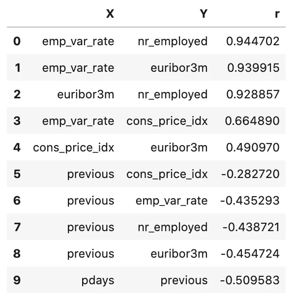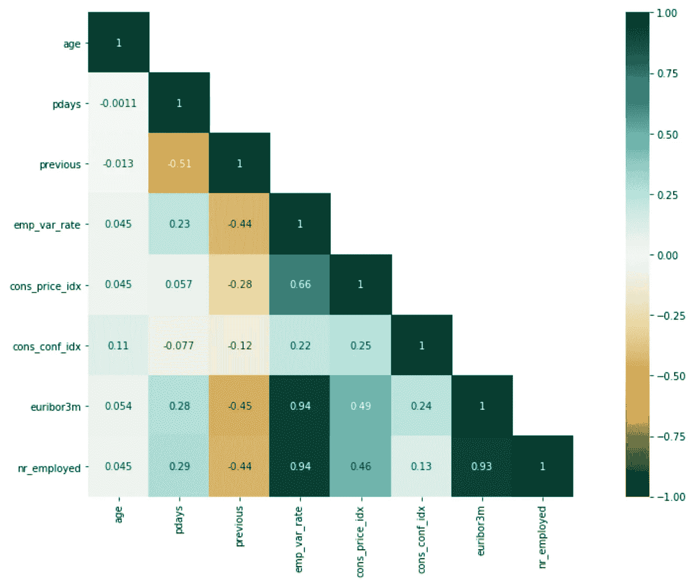

“nr_employed”与目标最相关。变量‘EMP _ var _ rate’，‘NR _ employed’和‘euribor 3m’非常多余，但我相信这并不代表什么大问题。**策略:**暂时保留所有特性。

## **分类变量**

当我们想要检查两个分类变量之间是否存在关系时，使用**卡方独立性检验**(此外，我们正在处理一个二元分类问题，卡方检验非常适合在这里执行)。

首先，我将指定零假设和替代假设来运行测试。

替代假设总是我们试图证明的，而无效假设是我们试图证明证据反对的假设。

*   *(零假设)* H0:特征和目标是独立的
*   *(替代假设)* Ha:特征和目标不是独立的

因此，对于被认为相关的特征，我们希望**拒绝具有最低 p 值(p 值≤0.05)的 H0** (零假设)。

```
# Create categoric subset in order to see correlations results
Xcat = df_cat.select_dtypes(exclude=['int64','float64']).copy()
ycat = df.target# Study chi² for independence:
chi2 = []
p_val = []
for feature in cat_features:
    table = pd.crosstab(df_cat[feature], ycat)
    chi2.append(round(chi2_contingency(table)[0], 2))
    p_val.append(round(chi2_contingency(table)[1], 2))pd.DataFrame([chi2,p_val], columns = cat_features, index = ['chi2', 'p_value'])
```

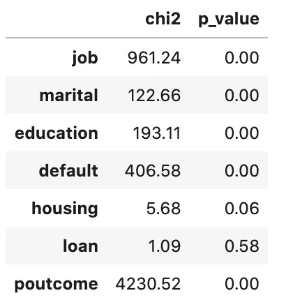

**策略:**去除变量‘住房’和‘贷款’(p 值≥ 0.05)。

# 离群值、缺失值、异常和转换

## 数字特征

```
# Removing Target and creating a copy of the dataset
df_drop = df_num.drop(["target"], axis=1).copy()# Visualization of numerical data dispersion (boxplots)
fig, axs = plt.subplots(ncols=2, nrows=4, figsize=(16, 8))
index = 0
axs = axs.flatten()
for k,v in df_drop.items():
    sns.boxplot(y=k, data=df_drop, ax=axs[index], orient="h")
    index += 1
plt.tight_layout(pad=0.4, w_pad=0.5, h_pad=5.0)display(df_drop.describe().loc[["mean","50%","std"]])
print(f"Any missing values: {df_drop.isnull().values.any()}")
print("")
```

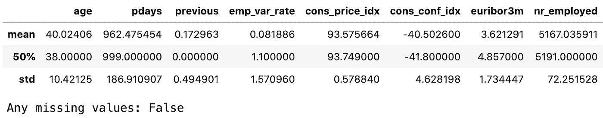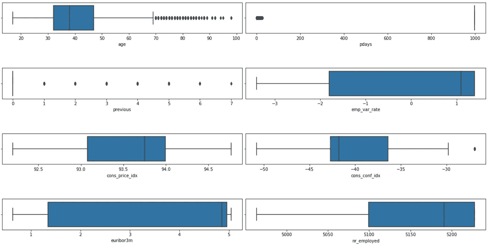

所使用的技术确定了位于中位数的+1.5 IQR 和-1.5 IQR 的值，这是一种非参数方法，可用于我们发现的分布轮廓。

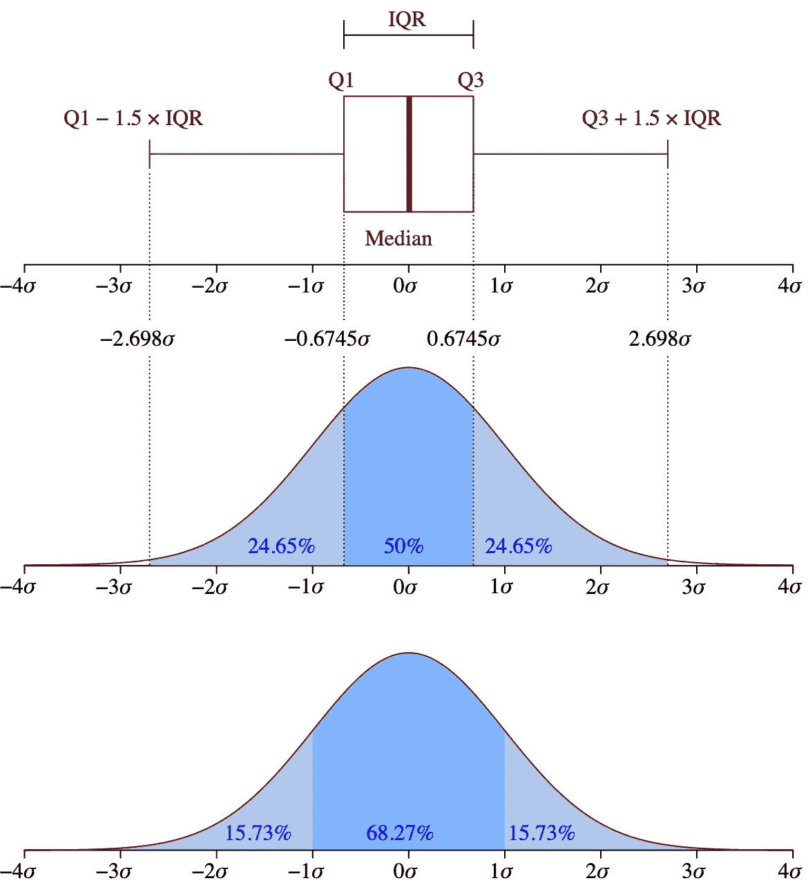

来源:[https://upload . wikimedia . org/Wikipedia/commons/1/1a/box plot _ vs _ pdf . SVG](https://upload.wikimedia.org/wikipedia/commons/1/1a/Boxplot_vs_PDF.svg)

```
for column in df_drop.columns:
    median = df_drop[column].quantile()
    iqr_1_5 = (df_drop[column].quantile(q = 0.75) - df_drop[column].quantile(q = 0.25)) * 1.5
    outliers = df_drop[(df_drop[column]< median - iqr_1_5) | (df_drop[column] > median + iqr_1_5)][column].count()
    outliers_pct = round(outliers / df_drop[column].count() * 100, 1)
    print("'{}' = {} ({}%) outliers".format(column, outliers, outliers_pct))
```

>>输出:
'age' = 910 (2.2%)异常值
'pdays' = 1515 (3.7%)异常值
'previous' = 5625 (13.7%)异常值
'emp_var_rate' = 0 (0.0%)异常值
'cons_price_idx' = 770 (1.9%)异常值
'cons_conf_idx' = 1841 (4.5%)异常值
' EUR

```
# Displaying visuals
fig, ax  = plt.subplots(figsize = (18,10))
ax.axis("off")
v = 1
for column in df_drop.columns:
    ax1 = fig.add_subplot(2,4,v)
    plt.hist(df_drop[column])
    ax1.set_title(column)
    v+=1
    median = df_drop[column].quantile()
    iqr_1_5 = (df_drop[column].quantile(q = 0.75) - df_drop[column].quantile(q = 0.25)) * 1.5
    outliers = df_drop[(df_drop[column]< median - iqr_1_5) | (df_drop[column] > median + iqr_1_5)][column].count()
    ax1.axvline(median - iqr_1_5, color='red', linewidth=2)
    ax1.axvline(median + iqr_1_5, color='red', linewidth=2)plt.show()
```

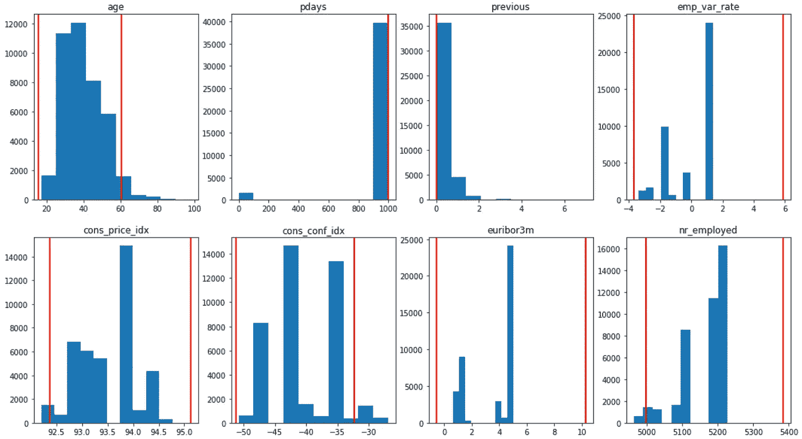

我意识到用于识别异常值的方法选择了许多记录，最严重的情况是前一列中有将近 14%的被选数据。

据我所知，我决定保留所有类别的大部分记录，因为数据似乎已经被正确地测量并反映了现实。

为了强调模型不受异常值数量扩展的影响，我们将只保证我们将使用标准化技术，该技术不会忽略中心值之间距离的细节。

从数值数据的离差分析来看，**似乎没有异常值**。“年龄”的绘制数据具有正常的行为，我假设变量“pdays”中的极端数据点是“超出范围”的值，至于其他的，每个变量似乎都有一个平衡的主体。

关于缺失值和其他异常，我已经分析了所有数值变量的唯一值和各自的计数，并且**似乎没有缺失值**。

## 分类变量

继续讨论分类变量，检查是否有任何缺失值或其他需要处理的异常，以便通过各种技术将这些变量转换为数字特征，并根据降维和信息增益之间的最佳平衡进行逐案分析。

```
# Creating a copy
df_cat_t = df_cat.copy()df_cat.describe() # Describing the categorical dataframe
```

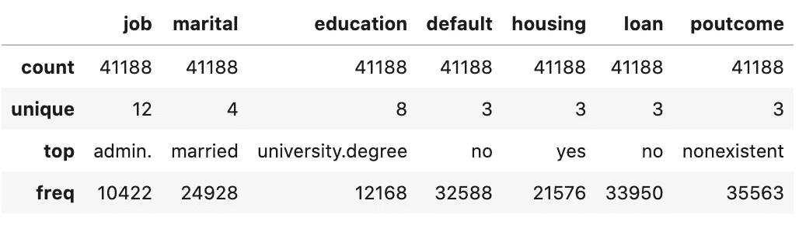

## 变量:**‘作业’**

```
print(f"Unique values: {df_cat.job.nunique()}")# Observations by class
num_obs = df_cat.job.value_counts()
num_o = pd.DataFrame(num_obs)
num_o.rename(columns={"job":"Freq abs"}, inplace=True)
num_o_pc = (df_cat.job.value_counts(normalize=True) * 100).round(decimals=2)
num_obs_pc = pd.DataFrame(num_o_pc)
num_obs_pc.rename(columns={"job":"percent %"}, inplace=True)
n_obs = pd.concat([num_o,num_obs_pc], axis=1)
display(n_obs)
```

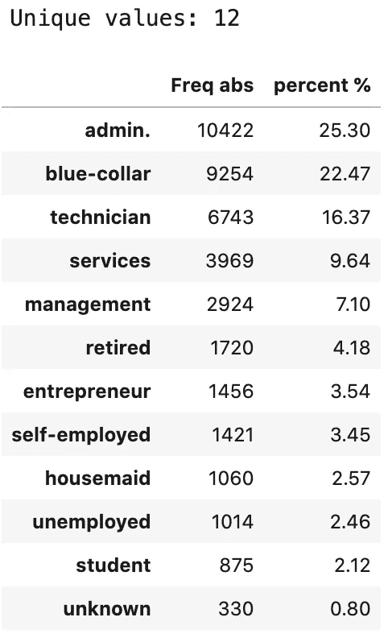

在这种情况下，“未知”是我们缺少的值。这里的策略是用最常见的值——模态值来估算“未知数”。我们先把它转换成 np.nan，然后进行插补。

```
# Replacing 'unknown' by NaN
df_cat_t.job.replace(to_replace="unknown", value=np.nan, inplace=True)# Imputation missing values by the modal value
df_cat_t['job'] = df_cat_t.job.fillna(df_cat_t.job.value_counts().index[0])# Confirming and visualizing of "job"
df_cat_t.job.value_counts(dropna=False).plot(kind='pie', figsize=(10,6), explode=(0.02, 0.02, 0.02, 0.02, 
                 0.02, 0.02, 0.02, 0.02,
                 0.02, 0.02, 0.02));print(f"Unique values: {df_cat_t.job.nunique()}")
```


我还将显示在编码过程中，一个热编码和二进制编码会创建多少额外列的结果。

```
# Encoding 'job' OHE or BIN
df_job = df_cat_t.job
job_ohe = pd.get_dummies(df_job)
binary_encoder_job = BinaryEncoder()
job_bin = binary_encoder_job.fit_transform(df_job)print(f'''
*Results*
job OHE: {job_ohe.shape[1]} columns
job BIN: {job_bin.shape[1]} columns''')>> output:
*Results*
job OHE: 11 columns
job BIN: 5 columns <--- apply
```

**此处要应用的二进制编码**。虽然与 OHE 相比有一些信息损失，但就降维而言，这是一个更好的权衡。

```
# Removing attribute 'job' and concatenation job_bin to df_cat_t
df_cat_t.drop(["job"],axis=1,inplace=True)
df_cat_t = pd.concat([df_cat_t,job_bin],axis=1)
display(df_cat_t.head(2))
display(df_cat_t.shape)
```

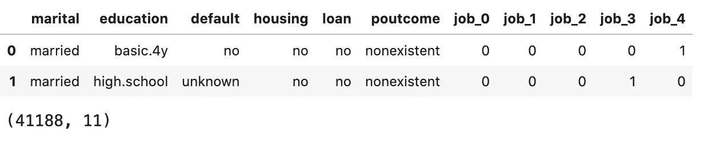

## 变量:**《婚姻大事》**

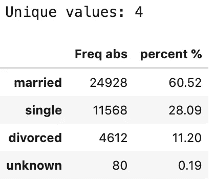

“未知”被解释为缺少值。这与“工作”变量的情况相同。策略是用最常见的值来估算缺失值。

```
# Replacing 'unknown' by NaN
df_cat_t.marital.replace(to_replace="unknown", value=np.nan, inplace=True)# Imputation of missing values by modal value
df_cat_t['marital'] = df_cat_t.marital.fillna(df_cat_t.marital.value_counts().index[0])# Graph "pie"
df_cat_t['marital'].value_counts(dropna=False).plot(kind='pie', figsize=(10,6), explode = (0.02, 0.02, 0.02), autopct='%1.1f%%', startangle=120);print(f"Unique values: {df_cat_t.marital.nunique()}")
```

同样，显示一个热编码和二进制编码将使用编码过程创建多少额外列的结果。

```
df_marital = df_cat_t.marital
marital_ohe = pd.get_dummies(df_marital)
binary_encoder_marital = BinaryEncoder()
marital_bin = binary_encoder_marital.fit_transform(df_marital)print(f'''
*Results*
marital OHE: {marital_ohe.shape[1]} columns
marital BIN: {marital_bin.shape[1]} columns''')>> Output:
*Results*
marital OHE: 3 columns <--- apply
marital BIN: 3 columns
```

**此处应用一种热编码**，因为与二进制编码相比，它保留了更多信息。

```
df_cat_t.drop(["marital"],axis=1,inplace=True)
df_cat_t = pd.concat([df_cat_t,marital_ohe],axis=1)
display(df_cat_t.head(2))
display(df_cat_t.shape)
```

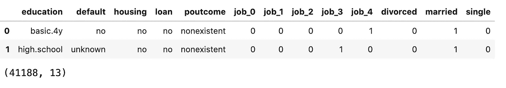

## 变量:“教育”

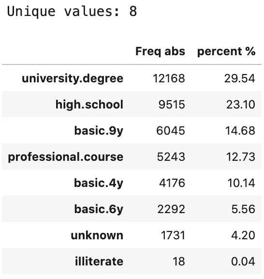

我们看的是同样的情况，其中“未知”被解释为缺少值。采用的策略是按最频繁值进行估算。

```
# Replacing 'unknown' by NaN
df_cat_t.education.replace(to_replace="unknown", value=np.nan, inplace=True)# Imputation of missing values by modal value
df_cat_t['education'] = df_cat_t.education.fillna(df_cat_t.education.value_counts().index[0])# Graph "pie"
df_cat_t['education'].value_counts(dropna=False).plot(kind='pie', figsize=(10,6), explode = (0.01, 0.01, 0.01, 0.01, 0.01, 0.01, 0.01), autopct='%1.1f%%', startangle=0);print(f"Unique values: {df_cat_t.education.nunique()}")
```

教育' '有 8 个服从特定顺序的类，这意味着它将根据相同的等级进行编码。升序为:'文盲'，'基础. 4y '，' nasic.6y '，'基础. 9y '，'高中'，'专业.课程'，'大学.学位'。

为此，我将应用一个地图功能。数据映射用于将一个序列中的一组特定值替换为另一组可能从一个函数、一个字典或一个序列中导出的值。

```
df_cat_t["education"] = df_cat_t.education.map({"university.degree":7, "professional.course":6, "high.school":5, "basic.9y":4, basic.6y":3, "basic.4y":2, "illiterate":1 })display(df_cat_t.education.value_counts())
display(df_cat_t.head(2))
display(df_cat_t.shape)>> output:
7    13899
5     9515
4     6045
6     5243
2     4176
3     2292
1       18
```

## 变量:“默认”

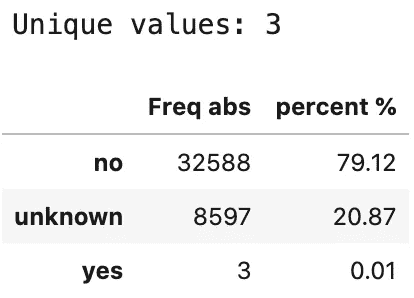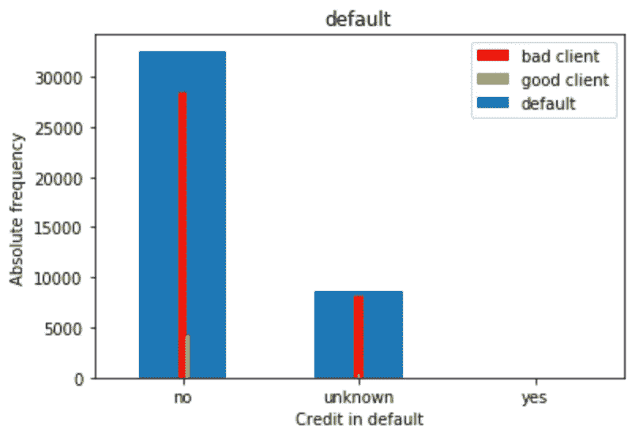

在这种情况下，“未知”值被解释为缺失值。“是”类是没有意义的，任何“未知”值的插补都可能严重损害所有结果。所以，还是去掉这个变量比较好。

```
df_cat_t.drop(["default"], axis=1, inplace=True)
display(df_cat_t.head(2))
display(df_cat_t.shape)
```

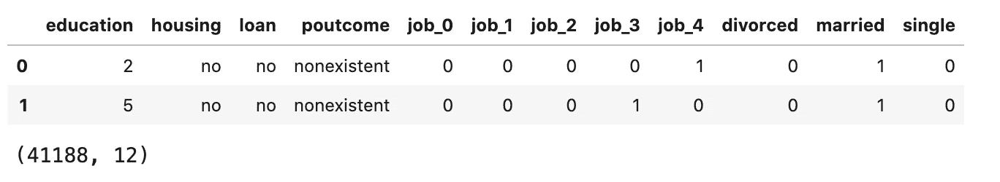

## 变量:“poutcome”

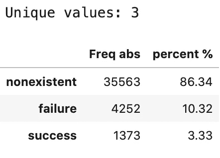

在这种情况下，“不存在”被解释为相关值。要遵循的策略是不对这个变量进行任何转换。

```
# Encoding 'poutcome' OHE
df_poutcome = df_cat_t.poutcome
poutcome_ohe = pd.get_dummies(df_poutcome)
binary_encoder_poutcome = BinaryEncoder()
poutcome_bin = binary_encoder_poutcome.fit_transform(df_poutcome)print(f'''
*Results*
poutcome OHE: {poutcome_ohe.shape[1]} columns
poutcome BIN: {poutcome_bin.shape[1]} columns''')>> Output:
*Results*
poutcome OHE: 3 columns <--- Apply
poutcome BIN: 3 columns# Remove 'poutcome' and concatenation poutcome_ohedf_cat_t.drop(["poutcome"],axis=1,inplace=True)
df_cat_t = pd.concat([df_cat_t,poutcome_ohe],axis=1)
display(df_cat_t.head(2))
display(df_cat_t.shape)
```

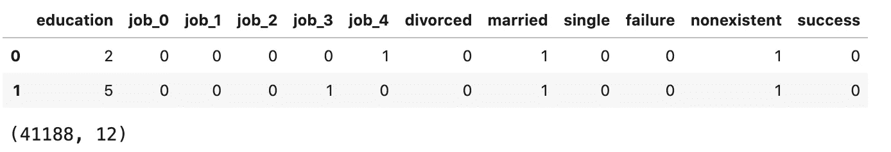

```
# Analysis of the transformed dataset
display(df_cat_t.dtypes)
print("")
print(f"df_cat (original): ........ {df_cat.shape}")
print(f"df_cat_t (transformed): ... {df_cat_t.shape}")
```

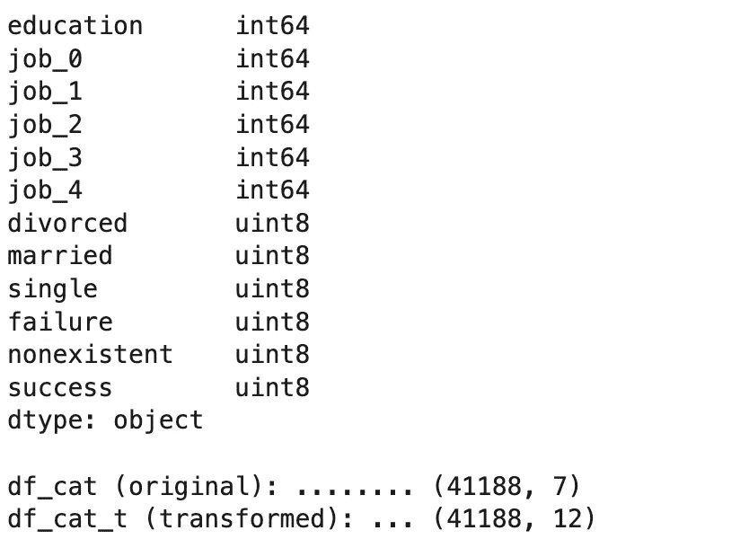

```
# Concatenation of both numeric and categorical datasets
df_numcat = pd.concat([df_cat_t,df_num], axis=1)# Removing any NaN values
df_numcat.dropna(how="any", axis=0)
```

在这一阶段，在处理完所有缺失值和插补并将所有分类特征转化为数字特征后，让我们检查这些特征的相关性，确定并选择没有预测能力的变量。

```
# Subdivision of the target
y_numcat = df_numcat.target
X_numcat = df_numcat.drop(["target"], axis= "columns")# Identifying all variables with great predictive power (Pearson Correlation p-value)
dataframe = pd.DataFrame(
      [scipy.stats.pearsonr(X_numcat[col], y_numcat) for col in X_numcat.columns],
      columns=["Pearson Corr.", "p-value"],
      index=X_numcat.columns,
).round(2).sort_values(by="p-value", ascending=False)display(dataframe)
```

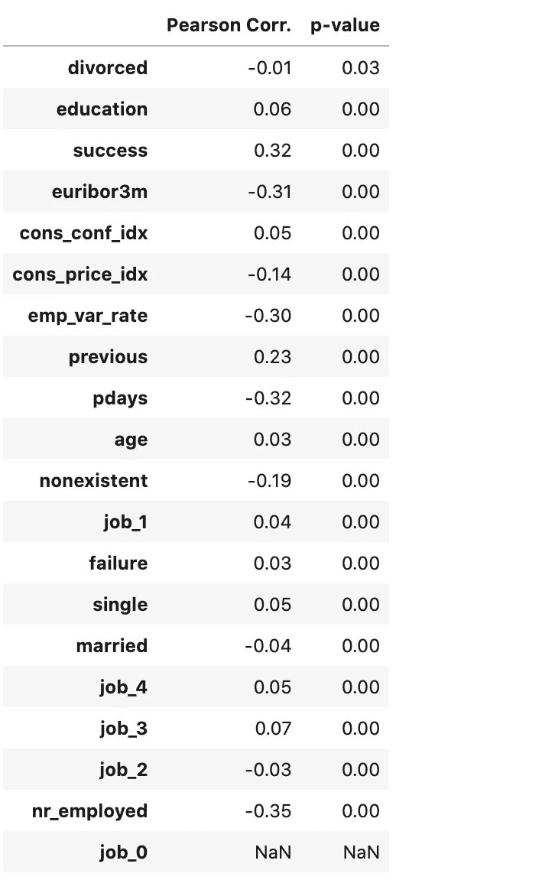

```
# Identifying columns in which p-value > 0.05
column = []
for item in dataframe.index:
    if dataframe['p-value'][item] >= 0.05:
        column.append(item)# Removing statistically non significant columns
df_numcat.drop(column, axis=1, inplace=True)df_numcat
```

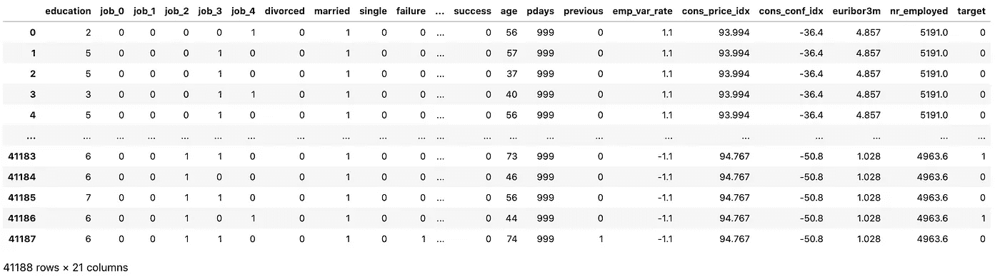

就这样。我们已经准备好进行第三部分，也是最后一部分，肯定是我们项目中最激动人心的阶段，建模部分。在那里见。感谢阅读！

[](/machine-learning-costs-prediction-of-a-marketing-campaign-exploratory-data-analysis-part-i-758b8f0ff5d4) [## 机器学习:营销活动的成本预测(探索性数据分析——第一部分)

### 预测营销活动最佳目标候选人的数据科学方法

towardsdatascience.com](/machine-learning-costs-prediction-of-a-marketing-campaign-exploratory-data-analysis-part-i-758b8f0ff5d4) [](/pandas-made-easy-the-guide-i-81834f075893) [## 熊猫变得容易(指南— I)

### 有许多最常用的函数和方法的例子

towardsdatascience.com](/pandas-made-easy-the-guide-i-81834f075893) 

如果你想回顾这个项目的第一部分，EDA 部分，[点击这里](https://bit.ly/3lDzknU)。
你可以在这里找到这个项目[的全部代码。](https://bit.ly/3hmI3YS)

# 联系人

*   [领英](http://bit.ly/2ybRqYT)
*   [推特](https://bit.ly/3gAwMTP)
*   [中型](https://bit.ly/3gDC5Sp)
*   [GitHub](https://bit.ly/3hHvuHR)
*   [卡格尔](https://bit.ly/31Co038)
*   [电子邮件](mailto:goncaloggomes@gmail.com)

好的阅读，伟大的编码！