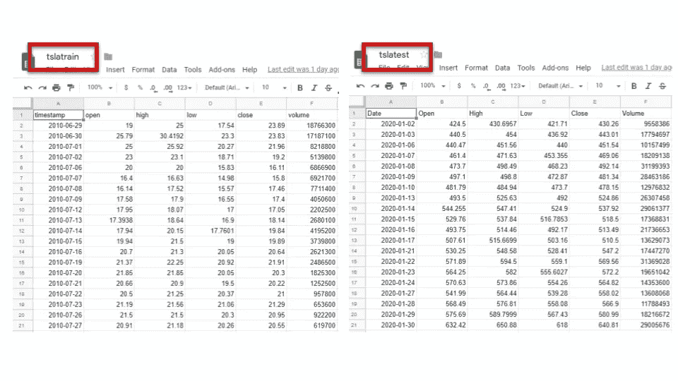
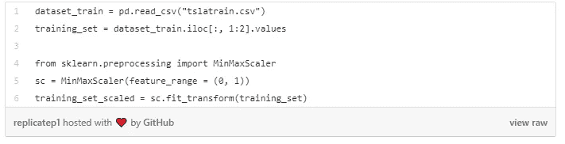
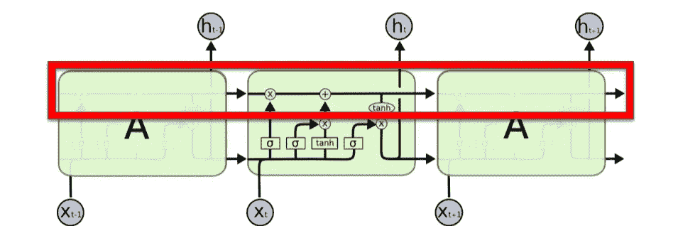
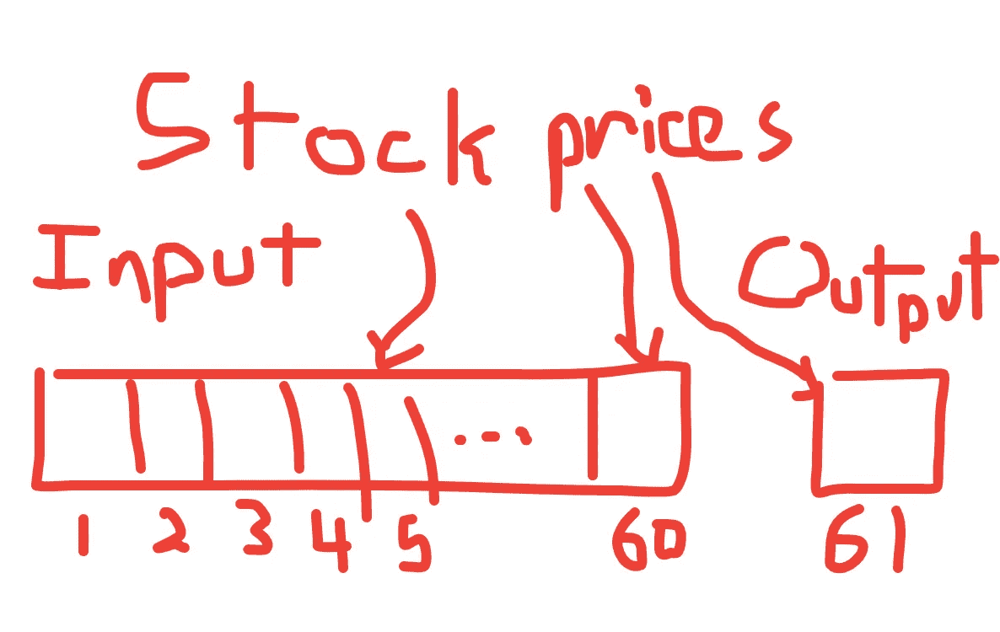
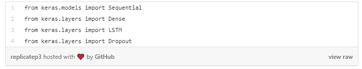
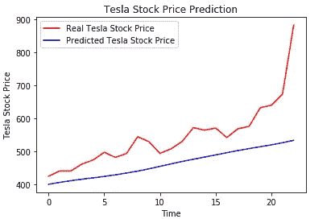

# 神经网络能预测特斯拉的巨大增长吗？

> 原文：<https://towardsdatascience.com/could-a-neural-network-predict-teslas-enormous-growth-648b13d355f9?source=collection_archive---------40----------------------->

## 2020 年 1 月对埃隆·马斯克和他的公司来说是一个重要的月份。


来源: [Unsplash](https://unsplash.com/photos/D1W5QenBzlU)

2020 年对特斯拉来说是意义非凡的一年。今年年初，特斯拉股票的价格为 430 美元，在撰写本文时，其当前价值为 **887 美元。**在 5 周的时间里，这是一个 **106%的增长。🤯**

> 编辑:从那以后就跌了。我将坚持使用这些数字，因为价格不可避免地会不断变化

投资者和华尔街分析师对这种巨大的增长感到困惑。有人说，这是因为股票正在经历卖空挤压，即当股票已经处于良好的反弹时，卖空者(卖出借来的股票并以更低的价格买回的人)被迫回购股票以弥补损失。这导致了有限供给下的过度需求，从而抬高了价格。

其他人说需求增加是因为 FOMO(害怕错过)。所有的投资者都想参与这次突然的上涨。或者这仅仅是因为特斯拉在过去的 6 个月里表现非常好，连续两个季度盈利，并以高于预期的速度开设工厂，并有望成为电动汽车电池行业的重要参与者。

不管惊人增长背后的推理是什么，我认为没有人能够预测到如此巨大的增长。尽管我的一些持有特斯拉股票的朋友坚持说他们从一开始就看到了这一点…

这就引出了一个问题，如果人类不能预测这种事件的发生，那么有没有什么系统能做到呢？**答案是肯定的。**

## 交易中的机器学习

证券交易是目前机器学习最大的应用之一。机器学习就是接受数据，从中得出结论和预测。在金融领域，数据随处可得，许多交易算法都严格依赖于数据处理。事实上，超过 70%的交易是由机器人进行的。


来源: [Unsplash](https://unsplash.com/photos/4fsCBcZt9H8)

具体来说，ML 在金融中的用途是从证券中获取历史数据，然后预测其价格在接下来的 **x** 时间内将如何变化。根据这一预测，你可以决定买入、卖出或持有该证券是否是一个好的决定。

有了这个，我试图创建一个机器学习模型，可以预测特斯拉令人着迷的 1 月份增长。

# 解释模型

我使用的模型将历史价格和交易量(当天交易的股票数量)作为输入。这样做的目的是看股票的走势是否有规律可循。

这种类型的分析在金融学中被称为**技术分析**，正式定义为“根据图表上的价格趋势和模式评估投资的学科。”技术分析师认为，对股票以往走势的洞察有助于预测其未来走势。

为了预测 1 月份的价格，我使用了 Telsa 从 IPO(早在 2010 年)到 2019 年 12 月的历史价格数据作为训练数据。该模型将使用这些数据点来找到模式，然后将它们应用到测试数据，即**一月价格**。我从 [AlphaVantage](https://www.alphavantage.co/documentation/) 下载了 CSV 格式的数据，然后手动将数据分割成训练和测试 CSV 文件。



两个来自 AlphaVantage 的数据集。图片我的电脑截图

## 浏览代码

导入数据集后，构建模型的第一个重要步骤是 ***规范化*** 数据。标准化数据意味着调整值以适应一定的范围，在我们的例子中是 0 到 1。这使得模型可以更容易地学习非异常值。

图中表示的是一个试图通过减少模型损失来达到全局最小值的模型。使用统一的比例，模型更容易做到这一点。对于这个模型的正则化，我使用了 SkiKit Learn 的 MinMaxScaler。



我的主旨截图

## LSTM 建筑

LSTM(长短期记忆网络)是这种模型中使用的神经网络类型。LSTM 模型是一种 RNN(递归神经网络)，rnn 有一个过去的信息向量作为输入，称为隐藏状态，这有助于它稍后进行分类。LSTMs 非常擅长存储长期信息，而 rnn 会因为[消失梯度问题而忘记这些信息。](/the-vanishing-gradient-problem-69bf08b15484)



关键理解:内存流经 LSTM，允许它通过 [Colah 博客](https://colah.github.io/posts/2015-08-Understanding-LSTMs/)使用过去的信息图像

在本文中，我不会深入研究 RNNs 或 lstm 的技术深度，您只需理解一个关键概念，即 lstm 擅长存储长期相关性，这有利于股市预测。你可以在本文[中了解更多关于 LSTMs 的信息。](http://colah.github.io/posts/2015-08-Understanding-LSTMs/)

## LSTM 的时间戳数据结构

时间戳基本上就是股票在那个价格的日期。在我们的训练数据集中，我们有超过 2000 个时间戳(每天一个)，每个时间戳都有开盘价、收盘价、最高价、最低价和交易量值。我们只关心开盘价和交易量。

我们的模型主要做的是查看过去 60 个时间戳(过去 60 天)的开盘价，并预测第二天的价格。



自我创造的形象

通过查看前 60 天，重复这个过程来预测第二天的产量。在代码中构造的方式是，X_train 是所有输入数组的数组，Y_train 是所有输出正确预测的数组(模型将根据其计算损失)。

我的主旨截图

## 建造 RNN

构建 RNN 变得很简单，因为我们使用了一个名为 Keras 的库，这是一个非常高级的 ML 框架。我们正在使用一个名为 Sequential 的 Keras 类，以及来自 Keras 的图层:LSTM、辍学和密集图层。



我的主旨截图

为了使用 Keras 方法，我们必须对输入数据(在时间戳步骤中创建的)进行整形，以满足 Keras 要求。我们使用 NumPy reshape 方法将 X_train 数组转换为 3D 数组。

然后，我们将输入数据传递到由 LSTM 层、漏失层和致密层组成的序列模型中。LSTMs 当然是试图在以前的数据中找到模式的主要层，丢弃层基本上丢弃 20%的神经元以防止过度拟合。最后的密集层产生只有一个节点的输出。

```
X_train = np.reshape(X_train, (X_train.shape[0], X_train.shape[1], 1))regressor = Sequential()regressor.add(LSTM(units = 50, return_sequences = True, input_shape = (X_train.shape[1], 1)))
regressor.add(Dropout(0.2))
regressor.add(LSTM(units = 50, return_sequences = True))
regressor.add(Dropout(0.2))
regressor.add(LSTM(units = 50, return_sequences = True))
regressor.add(Dropout(0.2))
regressor.add(LSTM(units = 50))
regressor.add(Dropout(0.2))
regressor.add(Dense(units = 1))
```

最后，使用 adam 优化器和损失函数的均方误差来编译和训练模型。我用 10 个时期运行该模型，并在训练数据上得到 0.04 的最终损失。

# 关键时刻…

既然已经对模型进行了训练，那么是时候在测试数据上测试模型了。LSTM 模型能预测特斯拉 1 月份的增长吗？



根据我的模型…不😂。

该模型无法非常准确地预测特斯拉股票的准确走势。这可能是因为它需要更多的历元来训练，或者对超参数进行其他调整。这是一次奇妙的学习经历，我学到了很多关于特征工程和 LSTM 网络的知识。

完整代码链接:【https://github.com/lewwwis/tslastockreplicate 

*嘿，你们好！👋我是亚伦，一个 15 岁的孩子，对人工智能和人类长寿之间的交叉有着超级的热情。请随时在*[*Linkedin*](https://www.linkedin.com/in/aaron-lewis-64284a188/)*上与我联系，或者查看我的完整* [*作品集*](https://tks.life/profile/aaron.lewis)