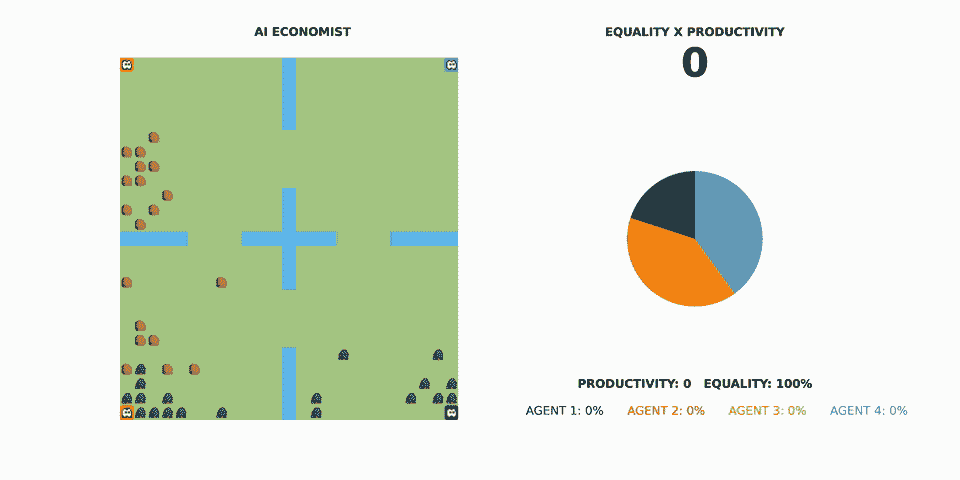
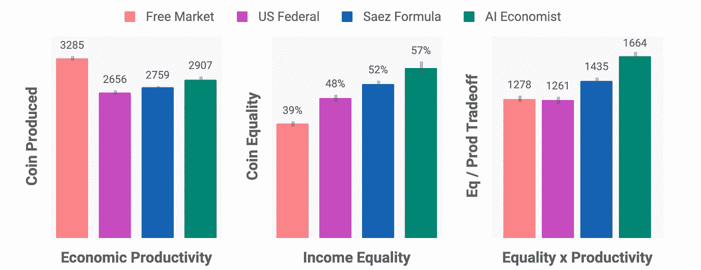

# 人工智能能比政治家更好地管理经济吗？

> 原文：<https://towardsdatascience.com/could-ai-manage-the-economy-better-than-politicians-6b37c6f68190?source=collection_archive---------53----------------------->

## 国会的工作支持率为 18%。算法的门槛很低

[Salesforces 的 AI 经济学家](https://einstein.ai/the-ai-economist)

大多数明智的人会认为，电脑程序可以更好地完成我们选举出来的代表的工作是荒谬的。例如，对任何政府来说，管理经济及其所有运转部分都是一项艰巨的任务。平衡新政策的实施和保持稳定的掌舵手不是一件容易的事，即使有大批公务员随时准备给决策者提供备忘录和白皮书。

另一方面，就在几年前，计算机程序(人工智能)可以写诗的想法是荒谬的。现在，AI 可以写出好到足以愚弄有声望的法官认为这一定是人类写的诗。你可以将[癌症诊断](https://jamanetwork.com/journals/jama/fullarticle/2665774)、[理论力学](https://analyticsindiamag.com/newton-vs-neural-networks-exploring-the-unsolved-three-body-problem-with-ml/)和[职业扑克](https://techcrunch.com/2019/07/11/ai-smokes-5-poker-champs-at-a-time-in-no-limit-holdem-with-ruthless-consistency/)添加到 AI 性能可以超越卑微的智人的令人惊讶的领域列表中。美国软件公司 Salesforce 的一项新举措旨在将“T8”经济政策添加到该列表中。

“人工智能经济学家”研究项目的负责人张(Stephen Zhang)表示，经济学家和政治家所依赖的典型经济模型正面临严峻挑战。为了能够进行可控的数学分析，模型依赖于假设。他们可能只会孤立地关注一个政策杠杆(比如，只关注商品及服务税，而不是所有税收)，并努力应对像新冠肺炎那样的大规模冲击。最重要的是，经济模型依赖于被揭穿的人类是不知疲倦的理性行为者的观念。

张和 Salesforce 认为他们可以用人工智能解决这些问题。通过“强化学习框架”，Salesforce AI 可以制定有效的经济政策，而无需求助于任何经济模型或现有理论。人工智能通过模拟不同经济政策对一个经济体的影响并观察结果来做到这一点。人工智能的任务是实现不同的社会结果，并提出平衡这些目标的最佳经济方案。

“强化学习”指的是他们的人工智能在眨眼之间运行数百万次模拟的方式，每个实例都从上次模拟中“工作”的内容中学习。人工智能没有任何关于经济理论或政策的先验知识——它在观察了一个又一个模拟后，自己想出了要实施什么样的政策。你可以认为人工智能是从一张白纸开始的，它可以只关注结果，不受几十年来通常主导政策讨论的经济理论的阻碍。

人工智能经济学家的早期迭代是为一个称为“收集和构建”的场景而构建的。这个场景反映了一个简单的 2D 经济，不同的“代理人”收集资源，赚钱，建造房屋。人工智能可以按照工人喜欢的方式征税，也可以通过福利重新分配资金。人工智能的任务是最大化代理人的生产力，同时最小化不平等(代理人有不同的技能，改变行为，并倾向于赚不同的钱)。

在无数次模拟中，人工智能经济学家尝试了税收和福利的不同组合，以找到最佳平衡。就像在现实世界中，对代理商征税过多会降低他们的生产力，但不对他们征税意味着没有钱进行再分配。

强化学习阶段的结果令人印象深刻。在结论中，Salesforces 的 AI 计算出了能产生最高生产率和平等综合得分的精确税收和福利体系。

作为与人工智能经济学家的对比，研究科学家在更正统的经济政策体系下运行了这一场景。其中包括没有税收或再分配的自由市场体系、美国税收体系以及经济学家伊曼纽尔·塞兹(Emmanuel Saez)提出的广受欢迎的税收公式。这位人工智能经济学家，尽管在开始时没有税收理论或经济学方面的现有知识，但在最大化生产率和平等方面胜过了所有其他人。

尽管这是人工智能经济政策的一个令人鼓舞的开端，但简化的 2D 情景显然是对复杂混乱的实体经济的苍白模仿。当然，政府需要平衡的目标不仅仅是生产力和平等。然而，为人工智能经济学家提供动力的强化学习技术可以为更复杂的人工智能奠定基础，以管理现实世界的所有复杂性。Salesforce 乐观地认为它可以扩大他们有前途的工作。

考虑到人工智能在设计经济政策方面优于人类的根本潜力，提前思考对政治和政府可能产生的后果是值得的。虽然担心将经济决策权交给人工智能可能会导致民主遭到侵蚀是可以理解的，但情况未必如此。请记住，人工智能并不决定什么结果(生产力、平等等)是可取的，而是决定使用哪些经济杠杆来最好地实现这些目标。可以说，选民可能会被解放出来，专注于他们关心的事情(结果)，而不是需要了解经济政策的细节。

作为这种后人工智能政治的一个例子，政党可以就他们将输入人工智能超级计算机的优先事项进行竞选。民主党人可能会说，他们会让人工智能承担平衡生产率和再分配的任务。共和党人可能会承诺给予人工智能自由，尽一切努力实现经济增长最大化。绿党会将环境保护置于 GDP 之上。诸如此类。无论哪个政党在选举中获胜，都可以向 AI 提供这些优先事项，AI 将据此制定未来三年的经济政策。

这是一个完全不同的政治图景，但至少我们会在经济问题上获得更透明的政治。目前，所有的政党都致力于实现一个“强大”、“公平”以及其他平淡无奇的经济。如果政党组建政府，他们甚至不一定会将自己的竞选立场转化为政策。拥有一个将它设定的社会目标转化为经济政策的人工智能，将迫使各方更清楚地知道他们愿意在优先事项方面做出什么样的取舍。

无论我们是否最终实现该国第二重要政治职位的自动化，人工智能都将在帮助政府制定政策方面发挥越来越重要的作用。凭借设计良好的人工智能的力量和规模，这一趋势应该受到欢迎，因为它是朝着更好的政府迈出的一步。然而，对人工智能的更大依赖确实引发了一些独特的问题。

首先，人工智能框架及其数据的完整性必须是神圣不可侵犯的。特别是如果国家的经济成果处于危险之中，人工智能将不得不受到保护，免受来自外部世界的黑客攻击和内部人士的干扰。与此相关，人工智能处理的数据必须不受目前困扰太多算法的偏见的影响。人工智能工程师往往是白人和富人，应该非常小心，以确保人工智能没有无意识地倾向于那些特权群体。现有的经济政策已经足够了。

最后，人工智能必须是“可解释的”——也就是说，特定的人工智能必须能够显示其政策建议背后的工作，以便专家可以交叉检查。这不是一个简单的技术壮举，因为高级人工智能的推理有时过于复杂，甚至连人工智能的创造者都难以理解。然而，将经济交给一个神秘而不透明的人工智能是一个反乌托邦的噩梦。

部分由于这些技术上的障碍，还没有政治家面临需要使用他们自己的失业计划的风险。但 Salesforces 的人工智能经济学家为人工智能政策设计开辟了一条道路。在吸收了政府掌握的所有大量数据后，一个今天可以用 2D GIF 概括其模拟的人工智能可能在十年后能够模拟整个经济。在那之前很久,“客观”和“最佳”治理的最高准则应该引发一些受欢迎的对话，讨论我们究竟从我们的代表那里寻求什么，以及他们通过的政策。