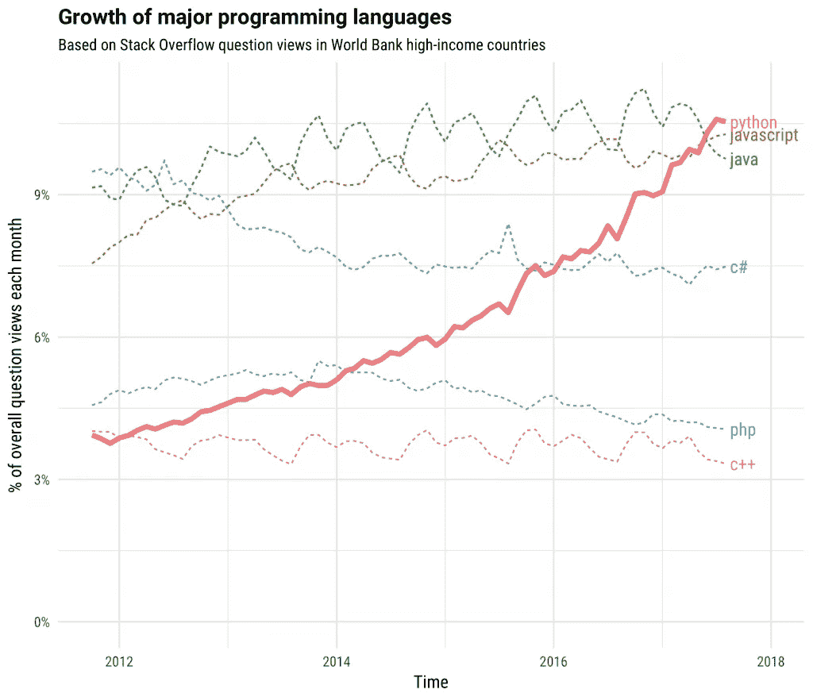

# Nim 能代替 Python 吗？

> 原文：<https://towardsdatascience.com/could-nim-replace-python-547145afcfd5?source=collection_archive---------0----------------------->

## 为什么这种羽翼未丰的计算机语言可能成为新的脚本之王

(src = http://nim-lang.org)

# 介绍

多年以来，没有一种编程语言比 Python 更适合编写脚本。Python 是 Guido Van Rossum 在 20 世纪 80 年代后期用 c 语言编写的一种解释型语言，Van Rossum 和其他许多著名的计算机科学家一样，来自荷兰，他在那里从 Centrum Wiskunde & Informatica 内部编写 Python，或者用粗略的英文翻译，

> 国家数学和计算机科学研究所

P ython 拥有当时计算机中流行的传统低级语言的巨大优势，如 C、FORTRAN、BASIC、C++和 Lisp。首先，Python 的语法简单得多，也容易掌握。这使得最终用户可以很好地使用 Python 来执行他们的系统所需的任务。此外，尽管以今天的标准来看，Python 被广泛认为是“慢”的，但在 1989 年，拥有一种读起来像英语的语言，甚至远不如其竞争对手的性能包装，这是一项相当了不起的成就。

(src = [堆栈溢出](https://stackoverflow.blog/2017/09/06/incredible-growth-python/))

# 计算机编程语言

> 甚至在最近，

随着 Python 变得比 Java 和 Javascript 都更受欢迎，Python 和与其受欢迎程度相应的工作已经超过了“大男孩”。Python 的生态系统绝对是与众不同的，不仅是在一般的编程方面，而且在不断扩大的

> 机器学习

随着 Python 的流行，这种语言的缺陷和问题变得越来越普遍。虽然 Python 确实是一门伟大的语言，但它的速度，我之前提到的速度是它的

> “致命弱点”

虽然这并不是说 Python 对于机器学习来说仍然不可行，但是从地球上最流行的统计语言进行改变肯定会带来一些性能上的好处。这也不一定是 Python 的错，因为这种语言被开发用于机器学习仅仅是因为它非常受欢迎。对于大多数应用程序，Python 工作得非常出色；但是，每当加载许多观察值时，这种情况通常会发生变化。出于这个原因，Scala 通常被选为在美国企业内部推动大数据的语言。Scala 也不是没有问题，尽管 Scala 确实拥有比其他两个竞争对手更好的生态系统，

> r 和朱莉娅

# 介绍:尼姆

尽管 Nim 和 Python 有相似之处，但 Nim 比 Python 年轻得多，12 年前的 2008 年才被呈现出来。这给尼姆带来了一些显著的好处。首先，Nim 比 Python 更快，但仍由同一种语言 c 解释。尽管从技术上讲 Nim 是用解释器运行的，但应该注意的是，Nim 也有自己的编译器。也就是说，有许多很酷的特性使 Nim 成为 Python 的潜在替代者，这可能是你没有预料到的。

# 编译的可执行文件

Python 的一个常见主题是需要 Python 才能运行 Python，这包括应用程序的依赖性。这是有问题的，因为这意味着 Python 应用程序以这样或那样的方式被打包成具有所述依赖性的包。最重要的是，虚拟环境很可能会经常出现。虽然这并不可怕，并且承认大多数统计语言都是这样做的，但是 Nim 通过将可执行文件与运行所需的依赖项打包在一起，在这方面做得更好。这不仅使管理系统间的依赖关系变得轻而易举，还使部署变得容易

> 比 Py 容易(看到我在那里做了什么吗？)

这些编译后的可执行文件还可以通用地兼容 Unix 类系统、Linux、Mac 和 Berkley 软件发行版，以及 Windows NT 内核。编译后的可执行文件解决了依赖性问题，使得发布应用程序变得非常容易，甚至可以用一个简单的“.”来部署 API 或“源”命令。

# 普遍的

Nim 相对于 Python 有一个很大的优势，因为 Nim 不仅可以用 C 编译，还可以用 C++编译，更令人兴奋的是:

> java 描述语言

这意味着 Nim 不仅有潜力担当 Python 作为运行基于数据的 web 后端的脚本语言的角色，而且 Nim 也可以作为类似于 Javascript 的前端。这是 Python 的一大优势。虽然 Python 当然非常适合部署端点，并且通常可以很好地完成工作，但是全面使用单一语言当然有它的优势！

# 特征

Nim 的代码库主要是基于函数范式构建的。这意味着 Nim 可以是一种非常有表现力的语言，而且可以轻松实现比 Python 更酷的特性。其中一个特性是我一直以来最喜欢的特性之一，早在 1958 年，随着 Lisp 的发布，

> 宏。

(我永远不会明白为什么这是 Lisp 的吉祥物，src = [Common Lisp](https://lisp-lang.org/) )

宏和元编程几乎和计算本身一样早就存在了，而且非常有用，尤其是在机器学习领域。

# 速度

众所周知，随着规模的扩大，对所有事情都使用 Python 会很成问题。这是因为许多训练算法利用递归成本或损失函数，该函数对于任何语言都是密集运行的。有很多语言和想法都试图对抗这一点，比如 Julia、Python 中的 Python(这本身就是一个兔子洞)，还有更成功的:Cython。

然而，这些解决方案也带来了自身的问题。虽然事实上，Julia 是我最喜欢的语言，也可能是最有可能取代 Python 的语言，但它没有 Python 所标榜的生态系统。虽然有 PyCall.jl，但使用它时的性能通常会低于 Python，在这种情况下，

> 为什么不用 Python 呢？

Python 中的 Python 是一个有趣的概念，但还没有很好的实现，因为这个概念本身相当复杂。更糟糕的是，Python 中的 Python 比 Julia 或 Nim 这样的解决方案实现起来要困难得多。至于 Cython，与普遍的看法相反，Cython 并不普遍工作，依赖它可能不是一个好主意(去过那里，做过。)

Nim 的优势是比 Python 快。对于脚本来说，Nim 增加的速度肯定会改变系统维护和各种脚本的运行方式。使用 Nim 可能没有 Julia 或 C 那么快，但由于它与 Python 和 Bash 有着简单的相似性，它肯定会容易得多。

# 结论

尽管 Nim 确实是一种非常酷，甚至有用的语言，但我非常怀疑“Python 接管”即将到来。与 Python 相比，Nim 只是一个生态系统的一小部分，而且还需要做更多的工作来适应 Python，这使它在其他编程语言中处于一种边缘状态。尽管 Nim 的特性确实比 Python 的强，但很难与一个大家都知道如何使用的已建立的软件包库相提并论。

我认为尼姆的故事和朱莉娅的相似。Nim 是一种漂亮的语言，既富于表现力，又简单高效，但是如果没有一个稳定的后端，我认为 Nim 不太可能成为脚本领域的佼佼者，对我来说更重要的是:统计领域。但是所有这些并不是说 Nim 不是一种值得学习的语言。Nim 是一种超级酷、易用、快速的高级函数式编程语言。任何结合了所有这些词的东西都很可能对你的编程工具箱有益。

尽管尼姆可能不会成为世界上的下一个大人物，但我确实很享受和它在一起的时光。更令我兴奋的是 Julia 展现出的潜力，而不是 Nim，再多一点开发，我想我们肯定能提高 ML 的速度。在这方面，处理器的类比当然是合适的:在过去的几年里，没有 64 位注册表的处理器，没有时钟速度超过 1 GhZ 的处理器(以今天的标准来看，这完全是一个 slug。)未来是令人兴奋的，我简直迫不及待地想看看它将包括什么技术堆栈。