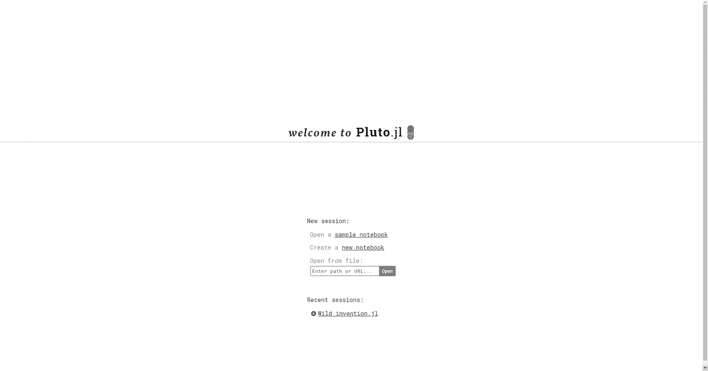
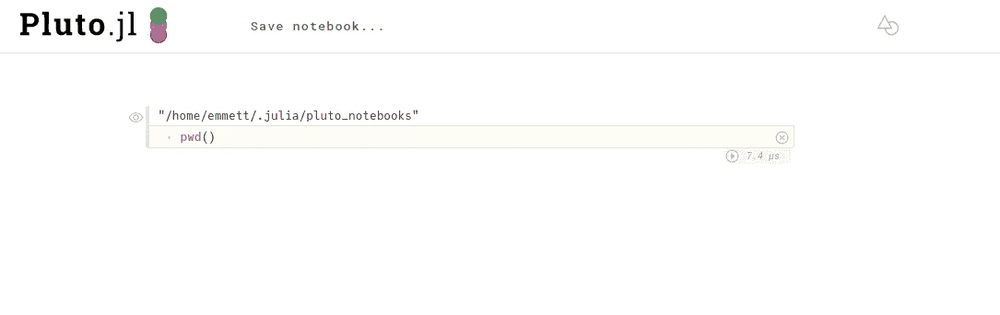
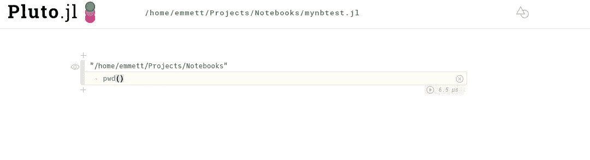
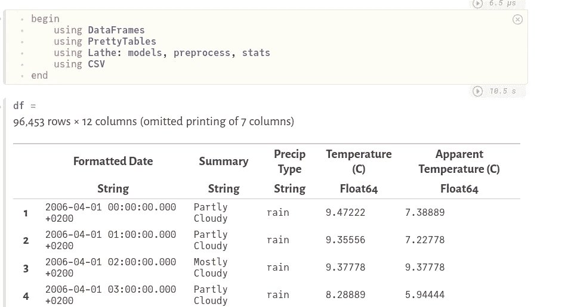
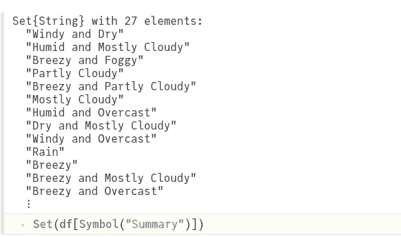
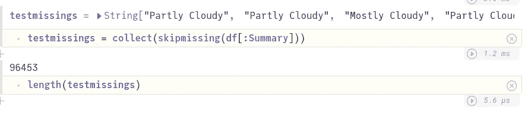

# 冥王星有可能真正取代木星吗？

> 原文：<https://towardsdatascience.com/could-pluto-be-a-real-jupyter-replacement-6574bfb40cc6?source=collection_archive---------15----------------------->

## 意见

## 对 Pluto.jl 笔记本和其他 Julia 编程语言开发解决方案的简要概述和比较。


(图片由作者提供)

你是一个厌倦了 Jupyter Notebook 总是妨碍你编程的 Julia 开发者吗？

> 我没有。

尽管我总体上不需要新的笔记本系统，因为我甚至不经常使用我现有的系统，但由于一位朋友的推荐，我决定看看 Pluto.jl。Pluto.jl 是一个功能齐全的 web/markdown/code 笔记本，以一个简单的 Julia 包的形式出现。它拥有你可能从典型的 Jupyter 笔记本电脑中期待的所有优秀功能。有一段时间，我其实是用一个用 Scala 写的笔记本来写 Scala 的，它让我怀念 Jupyter，坦白说，它的替代品，

> Spylon 内核

在 Scala 的数据分析坟墓上放一个新的墓碑。所有这些都是说，虽然我是朱莉娅的大力支持者，但我不确定这是否会改变我的想法——这个主题可能会变成一个问题，

> 为什么不用 Jupyter？

# 回答我的问题

尽管我会说我认为自己对此类事情持怀疑态度，但我当然愿意给 Pluto.jl 一个机会。首先，我想看看冥王星和木星之间的一些关键区别。如果使用冥王星有什么改进的话，那么它对我来说可能是一个更好的选择——因为我写了很多 Julia。

当然，我决定检查信息的第一个地方是 Pluto.jl Github README markdown 文件。就在这时，我意识到我对 Pluto.jl 的批评是完全没有根据的。这个笔记本实际上非常智能，它会不断地分析你写的代码。例如，如果我有一个州外代码，它还没有运行过我试图在其中使用的依赖项，那么 Pluto 将自动为我运行该代码。

此外，每当变量或函数发生变化时，Pluto 会自动运行与之相关的所有其他代码单元。这很方便，而且完全省去了转到笔记本顶部和垃圾邮件 shift+enter 活动。这是一个很大的节奏变化，也不用担心我的笔记本的可复制性。Julia 有很好的方法来管理包，因此大多数时间依赖性问题不会被其他程序员感觉到。除此之外，还有让代码运行内核状态的努力。

直接引用 Pluto.jl 自述文件，

> *在任何瞬间，程序状态完全由你看到的代码描述。*

这是我的一个大问题。使用 JIT 会使情况变得更糟，当您不需要一直重启和运行所有单元时，JIT 会工作得更好。如果你想了解更多关于可重复研究和我在 Jupyter 遇到的基本问题，这里有两篇我写的关于这个主题的文章！：

[](/the-data-scientists-guide-to-reproducible-research-ea1a512be3e5) [## 数据科学家可重复研究指南

### 你的假设还是假设！

towardsdatascience.com](/the-data-scientists-guide-to-reproducible-research-ea1a512be3e5) [](/jupyter-notebook-the-killer-of-portfolios-8fb70638491) [## 笔记本——投资组合的杀手

### 为什么不应该将笔记本电脑作为数据科学投资组合的主要特征。

towardsdatascience.com](/jupyter-notebook-the-killer-of-portfolios-8fb70638491) 

这对于分析来说非常酷的一个很好的例子是，我可以主动改变一个单元格中的数据，同时在另一个单元格中可视化它。仅仅改变 Jupyter 处理内核和状态的方式实际上是令人难以置信的令人耳目一新的。另一件很棒的事情是 Pluto.jl 解释器可以读取 Julia 代码——就像在真正的 Julia 代码中一样。没有。仅 ipynbs。jl 文件。这意味着在 Pluto 中开发的任何东西都可以在 Julia 的整个范围内使用，并且任何程序员都可以在任何会话中使用相同的代码非常容易地进行工作。

# 尝试一下

我想如果我要给 Pluto.jl 一个体面的尝试，我也可以用它投入到一个经典的数据科学项目中。对于我的技术堆栈，我将使用 DataFrames.jl 数据框架，牛虻. jl 用于可视化，而车床. jl 用于统计分析和机器学习——令人兴奋！当然，为了测试冥王星，我们需要首先添加它:

```
julia>]
pkg> add Pluto
```

添加 Pluto 后，可以使用 Pluto.run()函数运行它。

```
using Pluto;Pluto.run()
```



(图片由作者提供)

每当您第一次启动 Pluto 时，都会看到这个页面。我认为你必须在文本框中手动输入一个路径来打开一个笔记本有点乏味。进入这些笔记本的第一件事就是运行 pwd()来查看我在文件系统中的位置。



(图片由作者提供)

有趣的是，我在我的。Julia 目录位于~/。这是不幸的，因为我希望加载一些。CSV 数据输入。让我们看看当我们保存笔记本时，这种情况是否会发生变化。



(图片作者

> 好消息！

因此，在这个笔记本上，我有几个关于完成项目的主要问题。首先，每当我 ctrl+enter 时，它不会创建一个新的单元格。其次，stdout 在这些笔记本上不工作。我无论如何也不明白这是为什么，但你不能打印()或 println()。我跑题了，让我们实际上得到一些数据读入。我最近挑选的另一个很酷的包(Emmett 去购物了)是 PrettyTables.jl，所以希望我的数据框至少看起来不错。


(图片由作者提供)

这需要一些时间来适应。我确实喜欢笔记本的外观，当然也有一些方面我很喜欢，比如漂亮的输出。



(图片由作者提供)

我渴望得到一个分类问题，所以在这个小小的特性列表中,“Precip Type”分类确实吸引了我的注意。然而，就我所知，这个数据框架只能是雨天的分类。幸运的是，我们可以使用 Set 类型检查给定数组中唯一值的数量。

```
length(Set(df[Symbol("Precip Type")]))
```

返回 3。当然，对于一个分类问题来说，这是大量的类别，然而，其中一个类别碰巧是空的——这意味着我们可能应该清理这些数据，而不是将我们的手伸入机器学习饼干罐。幸运的是,“Summary”特性在这个包含大约 96，000 个观察值的数据集上有大约 27 个不同的分类。

```
Set(df[Symbol(“Summary”)])
```



(图片由作者提供)

在 Julia 语言中，检查缺失观测值的一个很好的方法是收集缺失观测值，并将其与数据帧的原始长度进行比较。

```
testmissings = collect(skipmissing(df[:Summary]))
length(testmissings)
```



(图片由作者提供)

好消息——是同一个号码！我不是天文学家或天气预报员，但如果要我猜的话，我会说这些描述很有可能与湿度有关。不过，为了确保万无一失，让我们过滤数据并进行测试。

老实说，这正是我对笔记本感到恼火的地方。很多事情都是我无法习惯的。很容易，最恼人的事情是我一次删除三个单元格，试图删除一些文本。在使用了这么长时间之后，我仍然没有找到如何添加 markdown。

我也最终迷失在如何修复我不小心改变了数据框的复制错误上。笔记本不允许我重新定义变量，这使得使用这些相对基础的代码变得非常乏味。尽管如此，我还是得到了一个模型拟合——它有 40%的准确率。在那之后，我想也许这些特征并不像我之前想的那样相关…无论如何，他们的统计测试并没有显示出很大的意义。

我对 Pluto 的另一大抱怨是文档浏览器，它甚至可能不存在，至少允许一个人运行常规的帮助功能。我认为这是一个伟大的想法，但是，也许只是需要一些熨平——可能一些 NLP 提示文本。

我跑题了，总的来说我是这个项目的粉丝，但肯定不会很快使用它。总的来说，我不是笔记本的忠实粉丝，但它们确实有它们的用途！如果我必须在 Pluto.jl 和 Jupyter 之间选择，我可能会选择 Jupyter 和 IJulia。然而，我希望这种情况在未来会有所改变。再加上这里和那里的一些东西，我确信这可能是一个有前途的开发环境。然而，在这一点上，我当然不能建议这样做…奇怪的是，这令人沮丧，而且坦率地说——感觉 IDE 对我的阻碍多于它对我的帮助。

希望以后 Pluto.jl 会更好。也有可能我不是目标观众，或者其他人可能比我更喜欢他们。虽然在引擎盖下确实有一些伟大的想法和真正非常酷的东西，但我有点兴奋地想看看未来会是什么样子。不过现在，我肯定会坚持使用 Atom 和 IJulia。