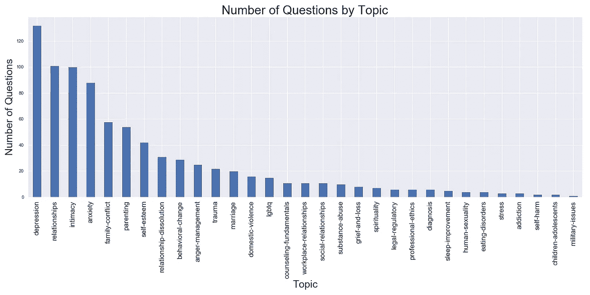
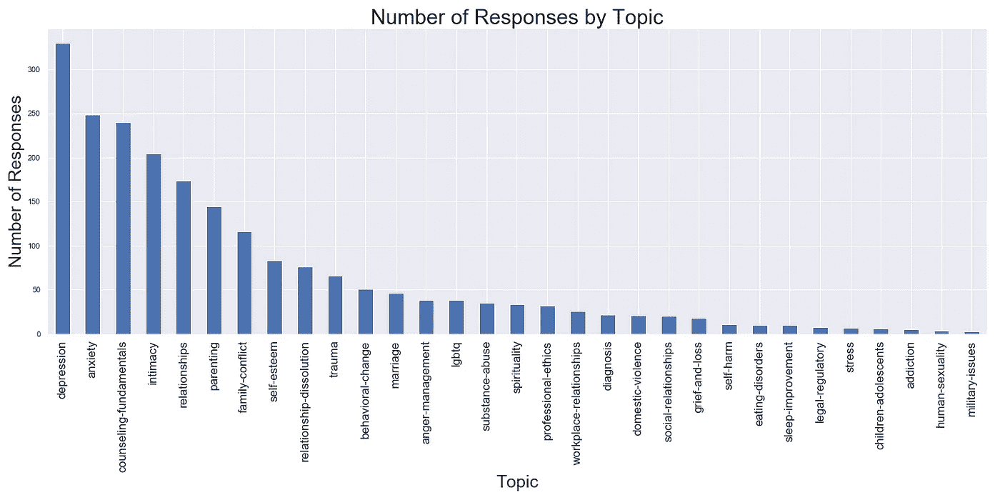
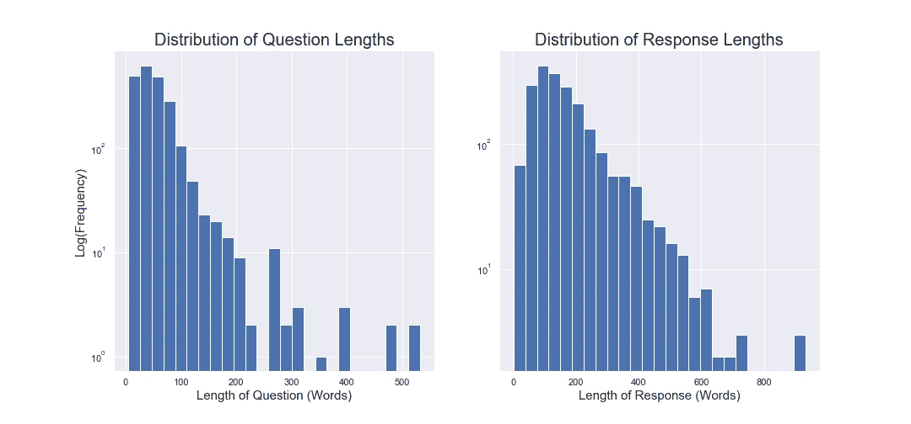
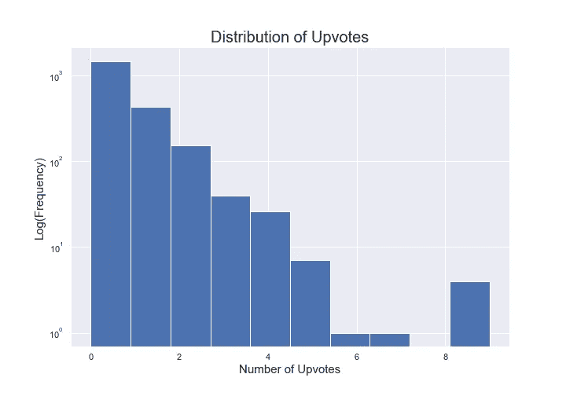
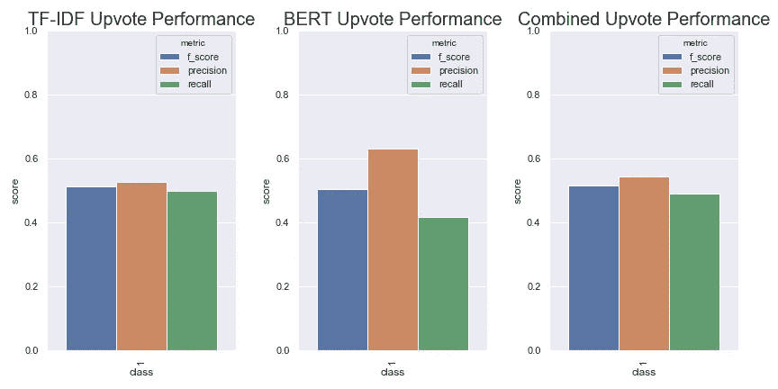
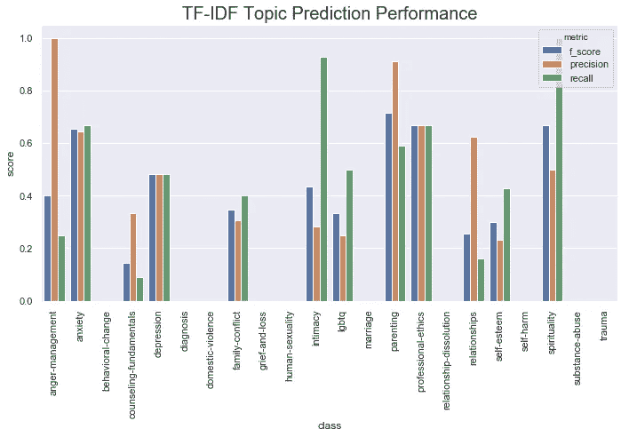
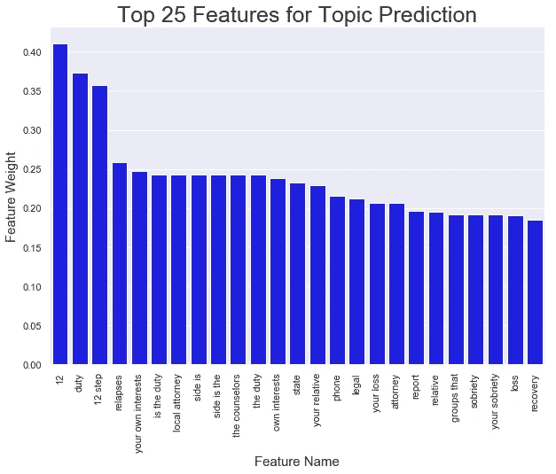
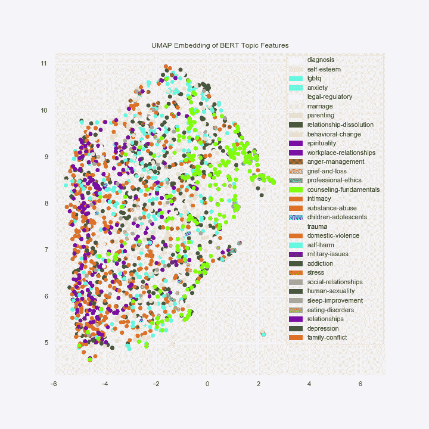
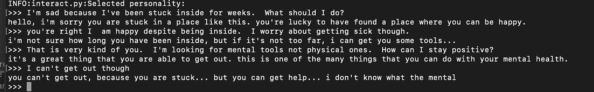

# 咨询聊天:引导高质量的治疗数据

> 原文：<https://towardsdatascience.com/counsel-chat-bootstrapping-high-quality-therapy-data-971b419f33da?source=collection_archive---------13----------------------->

## 缺乏好的心理治疗数据。让我们继续努力。


照片由来自 [Pexels](https://www.pexels.com/photo/young-woman-talking-with-therapist-3958461/?utm_content=attributionCopyText&utm_medium=referral&utm_source=pexels) 的 [Polina Zimmerman](https://www.pexels.com/@polina-zimmerman?utm_content=attributionCopyText&utm_medium=referral&utm_source=pexels) 拍摄

# 介绍

在过去的一年里，我一直在应用 NLP 来提高心理健康护理的质量。我发现在这个领域特别困难的一件事是缺乏高质量的数据。当然，你可以去搜索 Reddit，获得一些有趣的个人之间的治疗互动，但在作者看来，这是一个糟糕的替代客户和治疗师之间的实际互动。别误会，有数据集。他们只是，往往不是，专有或付费玩。

我希望这篇文章能介绍一组高质量的治疗师对真实病人的心理健康问题的回答。我将讨论数据源，关于数据集中有什么的基本信息，并展示一些简单的模型，我们可以使用这些数据训练聊天机器人！我和 counselchat.com[没有关系，但是我认为他们做得很好，你应该去看看他们。这个项目的所有代码都可以在这里](http://counselchat.com)获得[。](https://github.com/nbertagnolli/counsel-chat)

关于 Medium 的一个不幸的事实是，它不允许你合著作品。这是一个与格林洛德博士的联合项目，他首先提出了这个项目，并帮助进行了所有的分析。此外，还得到了 CounselChat 联合创始人 Eric Strö和 Phil Lee 的帮助。Phil 是一位专注于创新机器学习和数据的连续创业者。埃里克是一名律师和有执照的心理健康顾问。

# 咨询聊天


Counselchat.com 登陆页面截图。

Counselchat.com 是专家社区的一个例子。这是一个平台，帮助辅导员建立自己的声誉，并与潜在客户进行有意义的接触。在这个网站上，治疗师回答客户提出的问题，用户可以喜欢他们认为最有帮助的回答。这是一个很好的想法，并提供了一些有趣的数据。

这个数据最酷的一点是，有经验证的治疗师发布了回答。不是每个回复都是优秀的，但是我们知道它来自领域专家。如果你使用 Reddit 数据，提供建议的人可以是任何人。这里我们知道提供建议的人是合格的顾问。相当整洁！重要的是要记住，与治疗师面对面的互动通常与我们在网上公开看到的非常不同。另外，这不是治疗师和病人之间的对话。它只涉及一次谈话机会。

# 数据

最初，我们从 www.counselchat.com 搜集数据。但是在联系 counselchat.com 的创始人进行评论后，他们为我们提供了这篇文章的所有数据！收集的数据和真实数据的数据转储在这里以 [CSV](https://github.com/nbertagnolli/counsel-chat/tree/master/data) 的形式提供。特别感谢 Philip 和 Eric，他们非常友好，愿意与社区分享他们的成果。所有的分析都是用我最初收集的数据完成的。

论坛上有 31 个主题，张贴的回复数量从“抑郁症”主题的 317 个到“军事问题”的 3 个不等(图 1-3)。该网站上有 307 名治疗师投稿人，其中大多数位于美国西海岸(华盛顿、俄勒冈州、加利福尼亚州)。他们包括博士级别的心理学家、社会工作者和有执照的心理健康咨询师。

该网站有一些重复的问题和答案，似乎是由用户自己生成的(例如，治疗师将一个问题的回答复制粘贴到另一个类似的问题上)；我们没有为这种重复清理数据。

数据集以 CSV 格式呈现，包含 10 列，如下所述:

*   **问题 ID** —唯一的问题标识符，对于每个问题都是不同的
*   **问题标题** —咨询聊天中问题的标题
*   **问题正文** —个人向辅导员提出的问题正文
*   **问题链接** —指向该问题最后一个位置的 URL(可能不再有效)
*   **主题** —问题所在的主题
*   **治疗信息** —每个治疗师的总结，通常是姓名和专业
*   **治疗师 URL**——心理咨询网站上治疗师简历的链接
*   **回答文本**——治疗师对问题的回应
*   **upvotes** —回答文本收到的支持票数
*   **分割** —用于训练、验证和测试的数据分割。

要处理数据，您可以使用 HuggingFace 数据集库。

```
from datasets import load_dataset

dataset = load_dataset("nbertagnolli/counsel-chat")
df = pd.DataFrame(dataset["train"])
```

一般来说，大多数问题只有几个回答，75%的问题有两个或更少的总回答。然而，许多问题需要很多治疗师的参与。评论最多的问题是[我是否有太多问题需要咨询？](https://counselchat.com/questions/do-i-have-too-many-issues-for-counseling)很高兴看到治疗师对这类问题的精彩参与。作为一个次要问题，我真正喜欢处理治疗数据的一点是，你可以看到人类善良和理解的能力。


图 1——可视化响应数量

我们还可以观察到题目中一些有趣的趋势。如果我们按主题划分问题的数量，我们会发现大多数问题都与抑郁、关系和亲密度有关。



图 2 —按主题可视化问题数量

但是，有趣的是，咨询基础跃升了 12 位，在回答数量上排名第三。看起来治疗师对治疗有很多看法:)。



图 3——按主题显示回复数量

一般来说，大多数问题都很简短。治疗师似乎提供了更长的回复。平均问题长度为 54 个单词，但平均回答长度为 170 个单词。



Counselchat.com，就像现在任何一个好的社交网站一样，有能力投票支持治疗师对一个问题的回答。如果我们看一下有向上投票的回复的数量，我们可以看到大约 30%的回复得到了向上投票。大多数回答都没有获得赞成票。单个辅导员对一个问题的回答的赞成票范围是从 0 到 8；中值回应获得 1 票支持。



## 向上投票预测

为了查看什么可能有助于向上投票，我在 n 元文法上使用 TF-IDF 训练了一个简单的分类器，一个使用 BERT 特征，一个将两者结合起来。不幸的是，预测上升的票数似乎有点困难。我们的第一关 TF-IDF 模型的性能不是很好。通过使用 BERT，我们可以获得稍微高一点的精度，但总体来说还是不太好。对于 BERT 模型，我使用 BERT 作为特征提取器，正如我在这篇[的另一篇文章](/build-a-bert-sci-kit-transformer-59d60ddd54a5)中所做的那样。



# 训练主题分类器

除了 upvotes 之外，将治疗师的回答分成不同的类别也很有趣。有时知道人们是否在谈论抑郁症或者亲密关系是很有用的。为此，我对一架 SVM 进行了 TF-IDF 功能的训练。由于 BERT 的特性似乎并没有给我们带来太多的东西，所以我选择了一个更容易理解的模型。



不幸的是，验证集的性能看起来并不太好。如果我们查看验证集中的支持，我们会发现许多主题只出现一两次，所以我们基本上没有能力预测这些也就不足为奇了。随着时间的推移，这些结果应该会随着更多的数据而改善，特别是随着更多的人使用该平台。

我用我在这篇文章的[中描述的代码看了一下这个模型的主要特性。看起来像是与药物使用、责任和损失相关的词会弹出来。考虑到焦虑、抑郁、悲伤和失落都可能与“失去”有关，这似乎有点合理。“药物滥用”也是一个类别，我敢打赌“12 步”是非常密切相关的。无论如何，最好抽查一下这些模型，确保它们能产生一些直观意义的单词。](/good-grams-how-to-find-predictive-n-grams-for-your-problem-c04a5f320b39)



# 可视化主题

我想看看伯特特性如何很好地划分空间可能也很有趣，所以我创建了一些简单的 UMAP·2D 嵌入。总的来说，我们看不到这两个阶层之间有明显的区别。然而，不同的主题组在某些情况下看起来更接近，而在另一些情况下看起来更远。以职场关系(紫色)为例，它非常非常接近于关系解除(黑色)，但与咨询基础(亮绿色)完全分开。



# 训练治疗师聊天机器人

最近出现了大量应用程序，试图利用对话代理使精神健康变得更容易获得，参见 [woebot.io](https://woebot.io/) 或[wysa.com](https://www.wysa.io/)了解那里有什么。既然精神健康机器人现在这么火，我想我们应该用我们的新数据训练一个。

训练相当好的聊天机器人变得出奇的容易。抱脸有这样的[例外穿越](https://medium.com/huggingface/how-to-build-a-state-of-the-art-conversational-ai-with-transfer-learning-2d818ac26313)我不想在这里做训练聊天机器人的教程。尽管我的一些经历值得一提。为了训练这个聊天机器人，我几乎一字不差地使用了他们的代码。我对代码做了两处小小的修改，并且必须将 counselchat.com 数据解析成基于 transformer 的模型的正确形式。最终，我不得不编写和修改不到 50 行代码。

## 代码修改

拥抱脸模型对于在没有太多数据的情况下启动并运行一个相当不错的聊天机器人来说是非常棒的。我不想让我的机器人有任何个性，所以我必须在 **get_data_loaders** 函数中注释掉第 93 行。这一行对现有的人物角色进行了一些置换，但是我没有向模型传递任何人物角色，所以这是空的，需要注释掉。

```
persona = [persona[-1]] + persona[:-1] # permuted personalities
```

我做的另一件事是放置

```
assert max_l <= 512
```

在 **pad_dataset 函数内部。** BERT 和 GPT2 有一些输入大小限制，当超过这些限制时，您可能会在训练过程中遇到一些神秘的错误，例如:

```
RuntimeError: index out of range: Tried to access index 512 out of a table with 511
```

添加这一行帮助我在运行模型之前发现我的数据是否太大。它对模型没有任何帮助，但是在我调试的时候非常有帮助:)。

## 为聊天机器人训练转换数据

拥抱脸变形模型的数据格式起初看起来有点混乱，但是它很容易生成。训练数据需要是具有以下签名的 JSON 文件:

```
{
  "train": [
    {
      "personality": [
        "sentence",
        "sentence"
      ],
      "utterances": [
        {
          "candidates": [
            "candidate 1",
            "candidate 2",
            "true response"
          ],
          "history": [
            "response 1",
            "response 2",
            "etc..."
          ]
        }
      ]
    }
  ],
  "valid": ...
}
```

让我们稍微分解一下。较大的 JSON 对象有两个主键。“训练”和“有效”。训练是训练数据，并且是个性、话语对的列表。除了验证集之外，Valid 是相同的。个性是定义说话者个性的句子列表。更多细节请看拥抱脸教程。对于我的模型，我只是将它留空以表示没有个性信息。候选人部分包含候选人响应列表。此列表包含对对话历史的一些非最佳响应，其中最后一句是基本事实响应。最后，我们必须定义历史。一般来说，这是一个字符串列表，其中每个位置包含一个新的话轮。对于我们的机器人，我们只有两次谈话机会，一次是提问者，另一次是治疗师的回应。所以我们就用这个问题来填充。我们这样做是因为我们在寻找对问题的好的单一反应，而不是训练一个普通的治疗机器人。

如果你想要另一个如何格式化数据的例子，拥抱脸在知识库中有一个很好的例子，你可以在这里找到。

数据经过适当的格式化后，我们可以将它直接传递给拥抱脸模型。我按照以下说明训练我的:

```
python3 train.py --dataset_path counsel_chat_250-tokens.json --gradient_accumulation_steps=4 --lm_coef=2.0 --max_history=1 --n_epochs=3 --num_candidates=4 --train_batch_size=2
```

瞧啊。我们有一个训练有素的聊天机器人能对真正的治疗师做出反应。如果你想玩这个模型，请在这里下载。然后你需要做的就是解压文件并运行

```
make build
make interact CHECKPOINT_DIR=counselchat_convai
```

这将为 Hugging Face 的对话式 AI 构建 docker 容器，然后用我们训练好的模型运行一个交互脚本。如果在构建时出现 docker 错误，尝试在 Docker -> Preferences 中将容器的内存增加到 5GB 左右。这似乎是人们试图构建这个容器时的一个常见问题。

这里有一个对话的例子！我们可以看到，模型是一个很好的倾听者。提供建议，一些同情和怜悯。在世界末日的场景中，它似乎也很方便，提供给我工具。



一些体面的回应

# 结论

很难获得良好的治疗师-患者互动，但如果你四处看看，就有好的数据。咨询聊天是有限质量的治疗师互动的一个极好的来源。我希望你能在你的领域里找到一些很酷的心理治疗数据的应用。