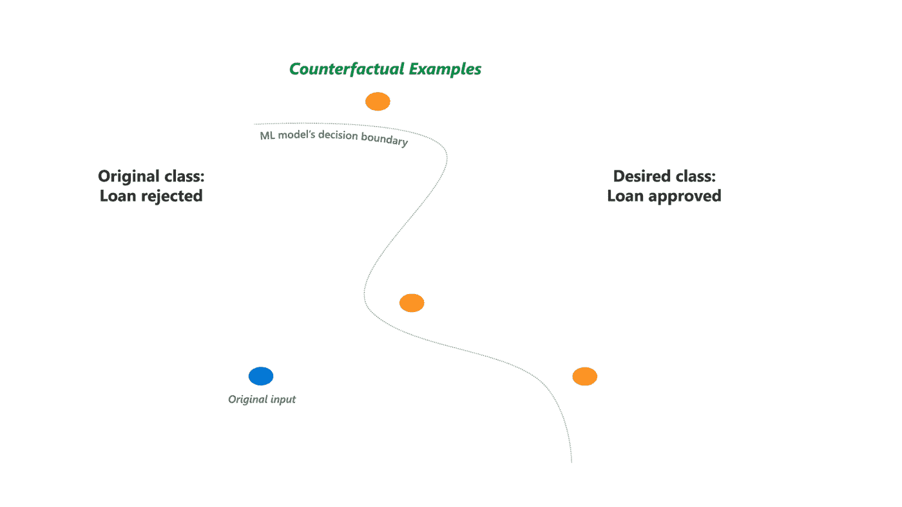
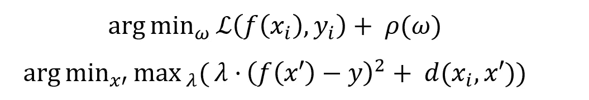
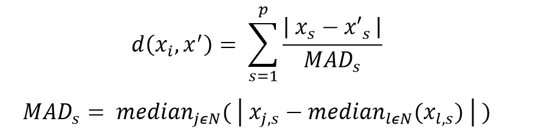
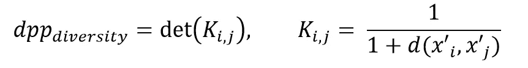
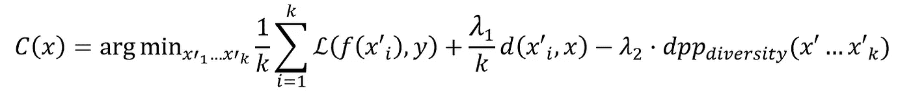
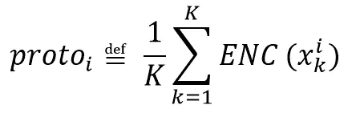

# 模型解释中的反事实解释

> 原文：<https://towardsdatascience.com/counterfactual-explanations-in-model-interpretations-a73caec5b74b?source=collection_archive---------23----------------------->

## *我们回顾了从模型中产生可操作的解释和见解的方法*

由[乔尔·菲利普](https://unsplash.com/@joelfilip?utm_source=medium&utm_medium=referral)在 [Unsplash](https://unsplash.com?utm_source=medium&utm_medium=referral) 上拍摄的照片

对比涉及特征属性的模型解释方法[如前一篇文章](/exploring-methods-for-model-agnostic-interpretation-816304cb6e71)中所讨论的，反事实是解释的一个有趣部分，它允许对机器学习模型进行事后解释。

在这篇文章中，我讨论了几种反事实解释方法的一些背景，包括那些非常注重多样性的方法以及另一种由原型引导的方法。这篇文章是对我和他人参考的概念的直觉练习。

讨论的主题:

*   **反事实解释和基本形式**
*   **不同的反事实解释(骰子)**
*   **原型引导的反事实**

# 反事实解释和基本形式

在它的核心，反事实允许我们采取行动，以导致某种结果。就机器学习而言，动作是模型特征的变化，而结果是期望的目标响应。数据基本上被扰乱，直到返回对应于远离原始模型的模型预测类的新实例。因为有各种方法可以达到相同的结果，所以可能有多种反事实。

一个常见的例子和用例是贷款审批。客户可能需要增加他们的收入或教育的一些数额，以批准某些类型的贷款。

来源:微软研究博客

由于反事实可能性的空间相当大，评估有效性的度量标准通常分为三个主要方面:稀疏性、多样性和接近性。

*   稀疏性与需要更改以达到输出类的要素数量相关联
*   多样性处理生成的反事实之间的距离，并用于确保不同的方式改变到输出类跨度很大
*   接近度与输出和原始实例之间的相似性有关。从概念上讲，这是一个衡量做出改变有多容易的标准

## 基本形式

为了更好地理解这个主题，我们从一个标准的分类器及其反事实目标函数的修改开始

f 是模型。xi 是最初的例子。易是最初的目标反应。p 是在损失函数上优化的权重上的正则化。“x”是反事实的例子。y 是所需的目标类。d 是距离函数。λ是平衡/正则化参数。

后一个目标函数的第一项实质上引导对新输出的搜索。第二项是距离函数 *d* ，它描述了原始实例和反事实之间的差异。这包括所有要素之间的距离，其中连续和分类要素以特定方式处理。这一项由中位数绝对偏差(MAD)来衡量。正则化参数 *λ* 平衡了两项之间的距离。

p 是特征计数。MAD 是中位数绝对偏差。s 是特色。n 是一些数据集。

MAD 值对异常值相当稳健，但对某些数据集仍有限制。下面几节提到了处理这个问题的不同方法。一种方法使用修改的 MAD 阈值，另一种方法简单地找到在扰动技术中使用 MAD 的替代方法。

从这里开始，工作变成了寻找反事实的优化问题。作者提到了 ADAM，尽管也可以使用其他优化器。由于问题的非凸性质，不同的最小值被用作生成多种反事实的不同集合的方法。

以下章节中讨论的方法提供了一些处理目前为止所涉及的策略的替代方案，并且总体上，还提供了对反事实目标函数的一般形式的扩展和改进。

下面我们来回顾一下:

*   **多样的反事实解释(骰子)**
*   **原型引导的反事实**

# 不同的反事实解释(DiCE)

多样性是反事实的一个重要属性。毕竟，根据使用案例和业务需求，太少和太相似的选项可能会成为瓶颈。以贷款为例，拥有选择与你的位置、收入、职业或教育相关的变化的选择权，对客户和贷方都有好处。

多样化的反事实解释方法试图提供一种平衡多样性和可行性的途径。如果没有如上所述的适当考虑稀疏性和邻近性，多样性本身可能并不总是有用的。可能有这样的情况，需要改变的特性数量可能太多，或者需要的改变太大而不可行。此外，在不提供域约束的情况下，可能存在这样的场景，其中反事实接近原始实例，但是仍然在真实世界域之外。最终，理想的选择将为个人提供不仅多样而且可行的变化，这些变化是可行的并且在他们的能力范围内。

作者用来提升这一属性的策略导致了多样性度量，决定性点过程(DPP ),它考虑了邻近性和约束。

k 是核矩阵。d 是距离函数。“x”是反事实的例子。

耦合 *dpp_diversity* 以及调整上述反事实的基本形式，我们在所有生成的反事实上建立以下优化框架:

x 是一个反事实。x 是原始实例。k 是反事实的总数。λ1 和λ2 是平衡参数。y 是期望的目标响应。

第一项和第二项类似于在基本形式中发现的那些，其中前者涉及将搜索导向期望的结果，而后者涉及反事实和原始实例之间的距离。第三项是我们刚刚引入的 *dpp_diversity* 以及一个额外的平衡超参数 *λ* ₂.

对于连续变量，距离函数 *d* 由类似于基本形式的 MAD 引导；然而，对于分类变量，这种方法就不那么简单了(毕竟，我们如何定义像职业这样的特征中类别之间的距离呢？)这种方法更多地采用二进制类型的赋值:如果特征与原始实例匹配，则距离取为 1，否则取为 0。

与上一节一样，从这里开始本质上是一个优化问题，作者使用带有指定搜索参数的梯度下降。

# 原型引导的反事实

另一种寻找可解释的反事实解释的方法涉及到类原型的指导。这样做的一个重要目的是加速反事实搜索过程。我们可以考虑在与实时决策相关的场景中对快速计算的需求。

原型基本上是一个代表数据集的实例。作者通过使用 k-NN 实例与数据集的代表性部分耦合的编码器或者通过使用 k-dd 方法来选择原型。第 3.3 节提供了更多详细信息。

为类别 I、类别数量 K 和编码器型号 ENC 定义的类别原型

在高层次上，这种方法的主要概念包括将一个额外的损失函数项整合到第一节的基本反事实方程的修改版本中，该损失函数项说明了这些原型。这为反事实搜索过程中的原型提供了指导。

这在计算上要求较低，尤其是在我们只能访问模型预测函数的情况下。而不是传统地仅使用与预测相关联的损失函数来偏离原始类别；该方法可以避开该项，而简单地使用对应于原型的损失函数。

正如多样化的反事实方法一样，在搜索过程中处理分类特征的想法有点模糊。第一节和第二节中介绍的方法都应用了某种类型的二进制，这里的策略稍微复杂一点，使用嵌入技术将分类变量投影到数值空间中。这是通过考虑特征之间的不相似性的度量以及它们的预测概率来实现的。附录 C 对此进行了更详细的描述。

再次，从这里我们可以继续优化，以产生反事实的解释。

值得注意的是，这个方法总体上提供了几个有趣的属性，以便提供快速的结果。首先，优化使用快速迭代收缩阈值算法(FISTA)作为快速收敛到结果的手段。其次，自动微分可以利用深度学习架构和权重进行显式评估。最后，如前所述，增加原型损失项可以灵活地绕过计算瓶颈。这对于黑盒用例尤其重要。

# 摘要

总之，反事实解释可以通过允许我们改变个别实例作为达到预期结果的途径，从而为模型预测提供可操作的见解。

*   我们首先回顾了模型解释中反事实背后的一般思想及其一般形式
*   然后，我们讨论在此基础上构建的扩展、修改和优化策略，探索强调多样性的方法以及原型提供的指导

# 参考

[1]s .沃希特、b .米特斯塔特和 c .拉塞尔(2017)“不打开黑盒的反事实解释:自动化决策和 GDPR。”

[2] Mothilal，R. K .，Sharma A .，和 Tan，C. (2020)“通过不同的反事实解释来解释机器学习分类器。”

[3] Arnaud，V. L .和 Klaise，J. (2019)“原型指导下的可解释的反事实解释”