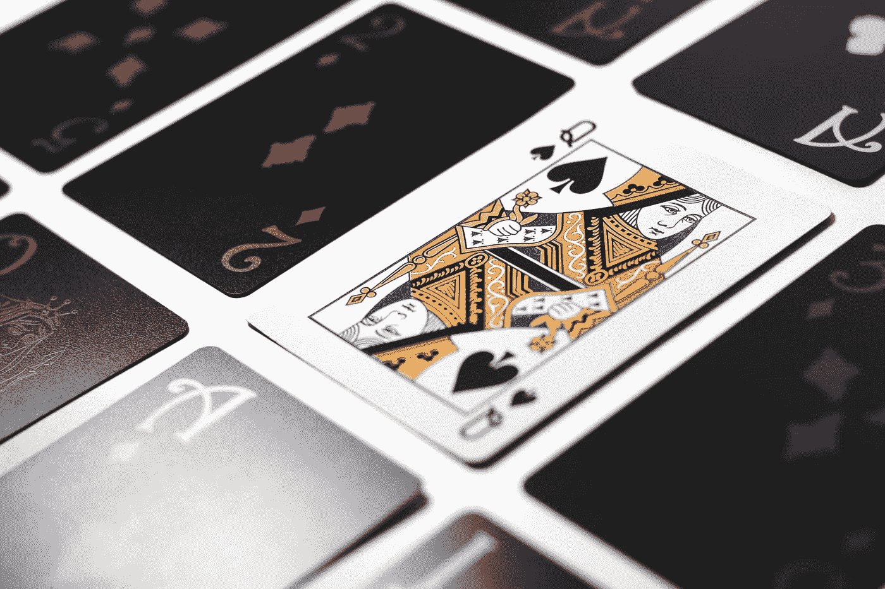
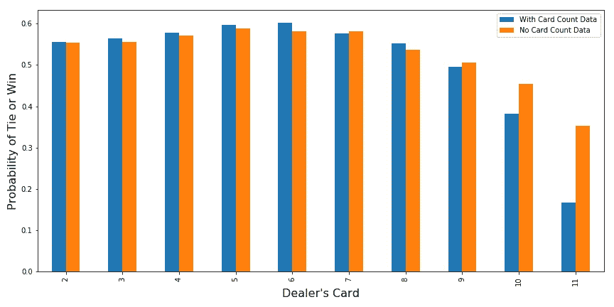
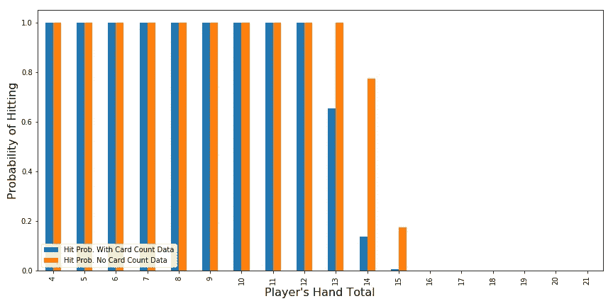
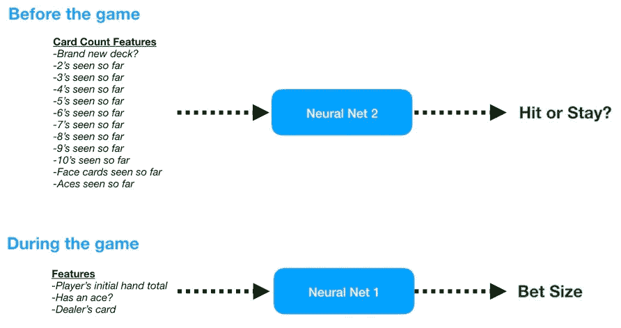
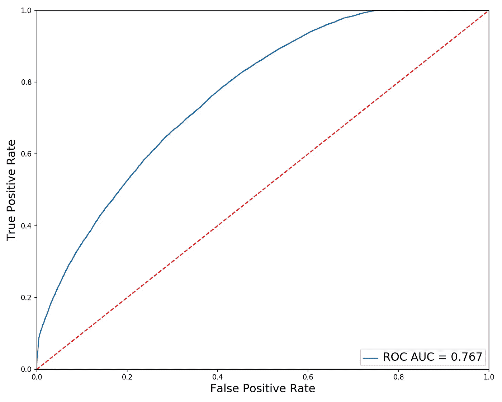
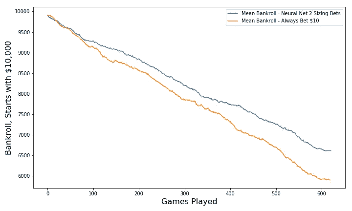
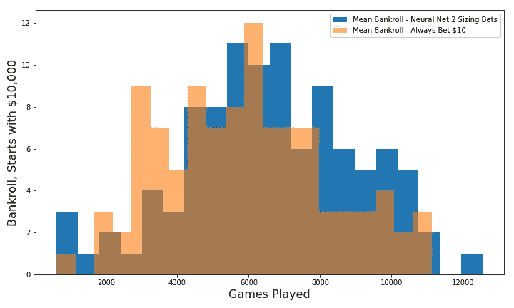

# 用神经网络计算纸牌

> 原文：<https://towardsdatascience.com/counting-cards-with-a-neural-net-ce426c2b6e57?source=collection_archive---------24----------------------->



埃斯特万·洛佩兹在 [Unsplash](https://unsplash.com?utm_source=medium&utm_medium=referral) 上的照片

## 机器学习能成功扳倒房子吗？

你可以在我的 Github 上找到我的代码。

这里是我以前在 21 点上的帖子的链接。我使用了我的旧 21 点模拟器的修改版本(在链接的帖子中详细讨论)。如果你想知道更多关于我是如何编码的，或者只是需要复习一下基本的 21 点策略，你可以先看看这些:

[](/lets-play-blackjack-with-python-913ec66c732f) [## 让我们玩 21 点(用 Python)

### 我们用 Python 实现了一个 21 点模拟器，以便更好地理解去拉斯维加斯的风险

towardsdatascience.com](/lets-play-blackjack-with-python-913ec66c732f) [](/teaching-a-neural-net-to-play-blackjack-8ec5f39809e2) [## 教神经网络玩 21 点

### 我们训练一个神经网络，看看应用深度学习是否可以改善我们的 21 点策略

towardsdatascience.com](/teaching-a-neural-net-to-play-blackjack-8ec5f39809e2) 

去年，当我训练一个神经网络玩 21 点时，令我困惑的一件事是，当我向它提供算牌信息时，为什么我的神经网络没有做得更好。算牌难道不会给玩家带来显著的优势吗？

对于那些不熟悉这个概念的人来说，算牌是一种跟踪牌组中剩余大牌(10 张，杰克，皇后，国王，王牌)数量的方法。这个想法是，当一副牌中剩下很多正面牌时，这对玩家有利(因为我们更有可能拿到大牌，庄家也更有可能破产)。因此，如果我们的算牌提示我们剩下的牌更有可能是高牌，我们应该利用这一点，比正常情况下下更大的注。

当我去年试图将算牌集成到我的 21 点代码中时，它没有添加任何东西，因为我做得不对。我之前建立的模型接受玩家手中的牌和庄家正在展示的牌等信息，并决定是继续击球还是留下。

我试图通过向模型提供迄今为止作为其训练数据一部分的所有牌的详细计数来扩充我的模型(每次洗牌时计数都会刷新)。我认为，这个计数将允许神经网络预测交易商可能破产的时间——这些额外的信息将改善它的击中/停留决策。

令人惊讶的是，事实并非如此。表演居然变差了！**赢的概率从没有算牌数据的 42%下降到有了算牌数据的 38%。**平局概率也从 9%下降到 5%,暗示着更激进的打法。

# 有时候机器会学错东西

正如您在下面看到的，当给定牌数数据时，神经网络能够在庄家显示低牌时在赢或平的概率方面做得稍微好一点，但在庄家显示 10 或 a(11 表示 a)时明显不如其更简单(无牌数数据)的前身。以下图表中的概率是通过模拟大约 250，000 个 21 点游戏产生的，训练有素的神经网络决定是击中还是留下。



赢或平的概率，有和没有卡计数数据馈入神经网络(图片由作者提供)

如果我们只分离出庄家出 10、面牌或 a 的游戏，我们就能看到表现不佳的原因。我们被认为更聪明的神经网络(有卡片计数数据的那个)正在做一些非常愚蠢的事情。看下图中的蓝色条，我们可以看到，即使它已经持有 17 或更多的高手牌总数，它也选择频繁命中(它甚至在已经 20 的情况下偶尔命中)。相比之下，我们的模型更简单，它正确地知道停留在 17 手或更多。


当发牌人出示 10、脸牌或 a 时击中的概率(图片由作者提供)

也不全是坏事。前面我们已经看到，当庄家亮出低牌(6 张或更少)时，增加牌数数据可以提高获胜概率。直观地说，这样做的原因是，当发牌人亮出一张低牌时，发牌人肯定要打出一手牌，直到他的牌总数至少达到 17(或者他或她破产)。因此，在这种情况下，知道交易商何时更有可能破产应该会有所帮助。正如我们所见，我们的算牌神经网络的行为是不同的。它更有可能停留在总计为 13、14 和 15 的牌上，并且基于更高的获胜概率，在这些情况下，它似乎平均做出了正确的决定。



当庄家显示 2、3、4、5 或 6 时的命中概率(图片由作者提供)

尽管如此，获胜概率的整体下降令人失望。当我们的牌已经是 19 或 20 时，选择去打是一个大牌面。根据我们对神经网络的行为如何改变的检查，一旦我们添加了纸牌计数数据，看起来虽然额外的数据嵌入了一些信号，但它也导致了我们的模型变得过度拟合并做出了一些愚蠢的决定。所以让我们尝试解决这个问题。

# 试图修复我们的模型

当我回去回顾算牌实际上是如何工作的时候，我意识到我想错了。附加功能在帮助我们的模型知道是打还是留方面提供了有限的帮助。事实上，正如我们看到的，增加的特性更有可能混淆模型，而不是帮助它。但是牌数数据也许能帮助我们决定下多少注。如果我们知道一副牌中还有很多大牌，我们应该下更多的注，因为 21 点(由一张 a 和一张 10 或一张脸组成的两张牌手)的概率更高。相反，如果我们知道剩下的牌主要是低牌，我们应该只下最小注。

为了做到这一点，我们可以划分责任，而不是将所有东西都塞进一个单一的模型中。我们可以让已经运行良好的旧模型来处理“打还是留”的决定**，并建立一个新模型，该模型使用纸牌计数数据来决定下注多少**。它看起来会像下面的图片。关于纸牌计数功能的一个注意事项——我记录了到目前为止我看到的每种纸牌类型的数量，当庄家重新洗牌时，我将所有计数重置为 0。



两个模特各司其职(图片由作者提供)

当然，这一切都取决于纸牌计数数据是否真的有助于我们预测 21 点。让我们检查一下。我们可以使用 ROC 曲线来检查神经网络 2 的功效(如果您需要复习什么是 ROC 曲线，请查看以下链接)。

[](/roc-curves-and-the-efficient-frontier-7bfa1daf1d9c) [## ROC 曲线和有效前沿

### 解释如何用一点金融来解释 ROC 曲线

towardsdatascience.com](/roc-curves-and-the-efficient-frontier-7bfa1daf1d9c) 

根据 ROC 曲线(蓝线)下的较高区域判断，神经网络 2 似乎增加了价值(相对于随机决定):



试图预测黑杰克的神经网络 2 的 ROC 曲线(图片由作者提供)

因此，让我们用它来衡量我们的赌注，看看我们的表现是否有所改善。我模拟了 100 副 21 点纸牌(就像在赌场度过一个漫长的夜晚)100 次，比较了以下两种下注策略的平均结果和分布:

1.  每次最小下注 10 美元。
2.  当点数有利时，根据我们的自信程度下注更多(公式如下)。否则下注 10 美元。

以下是我如何决定下赌注的(完全公开——我并不认为这个决定规则有多难):

```
Using the training data, calculate the mean and standard deviation of the probabilities (of a blackjack) generated by neural net 2.Z-score neural net 2’s output prediction:
**Z_prob = (prediction - mean)/std_dev****if Z_prob > 0:
    bet = 10*(1 + Z_prob)
else:
    bet = 10**
```

基本上，如果得到 21 点的预测概率高于平均水平，我会下更多的注，而我下的额外赌注取决于预测概率比平均水平高多少。

酷，让我们看看我们是否能提高我们的赌博成绩。下面的情节比较了有和没有神经网络 2 的赌博表现。虽然看起来我们仍然无法持续赚钱，但动态下注规模确实提高了我们的表现。采用动态下注规模的平均期末资金比未采用时高 12%。



动态下注规模确实有帮助(图片由作者提供)

最后，让我们比较一下我们期末资金的分布，以确保我们的动态(和更大的)下注不会给我们的下注结果带来过度的波动。分布的形状看起来相当相似，动态下注大小(蓝色)稍微向右移动，这很好。



赌博结果直方图(图片由作者提供)

# 结论

我希望有更大的提升，但哦好吧。看起来更多的修补是必要的，但至少看起来我们正在做一些事情。它还表明，尽管深度学习模型可能很酷，也很灵活，但考虑周到并(尽可能多地)检查我们模型的工作方式仍然是值得的。最后，在不利的情况下获胜是很困难的！干杯！