# 数数很有趣

> 原文：<https://towardsdatascience.com/counting-is-fun-7204fcb1f392?source=collection_archive---------20----------------------->

## 用数学和代码解决一些现实世界的问题

由[罗马法师](https://unsplash.com/@roman_lazygeek?utm_source=medium&utm_medium=referral)在 [Unsplash](https://unsplash.com?utm_source=medium&utm_medium=referral) 上拍摄的照片

我最近开始了 MITx 的概率[课程](https://www.edx.org/course/probability-the-science-of-uncertainty-and-data),发现它非常有助于更新我对一些基本计数原理的知识。

这些原则适用于许多现实世界的场景，例如计算出 A/B 测试的复杂性、赌博(掷硬币、掷骰子、扑克)、你为旅行打包的服装组合和座位安排难题，如下所示:

我将回顾我在课程中学到的计数原理，以及数学和 Python 代码中排列、组合和划分的应用。

还会有一些有趣的例子，希望你能像我一样喜欢学习或更新数学。

# 离散统一定律

我将首先在这里展示一个公式，因为在它的名字旁边没有火箭科学，我们在频率主义者的世界中知道它是:

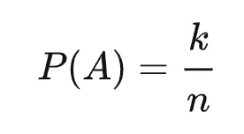

这只是意味着，给定一个由 *n* 个元素组成的集合，并且事件`A`被定义为从 *n* 个元素中选择任意`k`个元素**同等可能**，那么概率就是简单的`k`除以`n`。

计数有助于找出 k 和 T21 分别是多少。

# 基本计数原理

我经常遇到这样的问题:计算出一次旅行要带多少衣服。

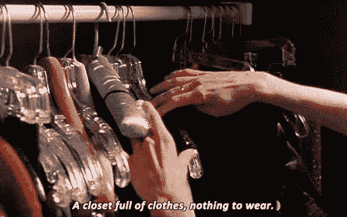

是的，就像凯莉一样，via [Giphy](https://media.giphy.com/media/gikLMw5rlmARq/giphy.gif)

所以我首先考虑我有多少天假期(这导致我每天想要多少种不同的风格)，然后拿出几件衬衫、外套、连衣裙和牛仔裤来搭配——这是有趣的时光😳。

现在假设我不在乎衬衫和牛仔裤是否相配，但我想为两周的旅行准备足够多的不同服装，我至少需要打包多少衣服？

它可以是:

*   👚x 7 和👖x 2 (14 种不同的组合，但可能有点单调)
*   👚x 3 和👖x 3 和🧥x 2 (18 种组合，也许更好？)
*   👚x 3 和👖x 3 和🧥x 2 和🥿👟👠👢x 4 (72 个选择，哇)

这个清单可以一直列下去…

所以计数原理说，如果你有`r`步和`n`步可能的选择，选择的总数可以概括为:

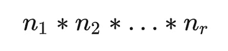

然而，现实从来没有这么简单，因为一些衬衫的颜色与另一种颜色不匹配，或者某些类型的鞋子在某些服装上不好看。但是是的，越多越好😏。

# 排列和组合

排列给出了**排序** `n`元素的方式的数量。这里顺序很重要。`n!`阶乘代表可能排列的数量:

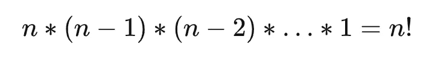

如果我们只有`k`的位置要填补:

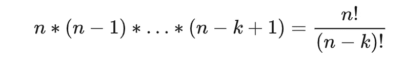

相比之下，组合中的顺序并不重要。它有助于回答给定`n`选择和`k`元素子集的问题，有多少种方法可以做到这一点。

从根本上来说，这与填充上面的`k` 插槽是一样的。因为顺序不再重要，所以我们除以`k`元素的可能顺序数，即`k!`。

用`n choose k`或`C(n, k)`表示:

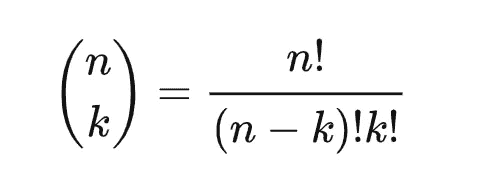

有一天我们可能会面临另一个问题(或者如果你已经经历过，恭喜你！).

假设你想确保一对夫妇坐在一张有 6 个座位的桌子上，有多少种方法可以让他们坐在一起？

怎么安排座位？？？(用 [Canva](http://www.canva.com) 制成)

由于`AB`或`BA`的顺序在这里并不重要，该对可以被放置在任意两个空槽中，即`6 * 2 = 12`。一旦两个座位被他们占了，就剩下 4 个空位由另外 4 个客人来填补，这就是`4!`。因此，安排座位让这对夫妇坐在一起的方法总数是`6 * 2 * 4! = 288`🤯。

组合的一个扩展是找出一个集合`{1, ..., n}`可以有多少个可能的子集，即

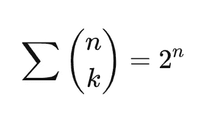

这里的逻辑是，对于集合中的每个元素，有两种选择，要么将它包含在子集中，要么不包含。一个简单的例子是一个集合`{1}`，它有两个 1 的子集和一个空集。

# 划分

这计算了我们将给定的一组项目划分成规定大小的子集的方法的数量:

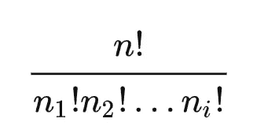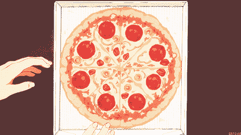

通过 [Giphy](https://media.giphy.com/media/F6Ngh55u1Xc2s/giphy.gif) 切披萨

假设有 9 种不同口味的披萨分发给 3 个人(他们都不在乎得到哪种口味)，A 得到 2 种，B 得到 3 种，C 得到 4 种。根据上面的公式，有

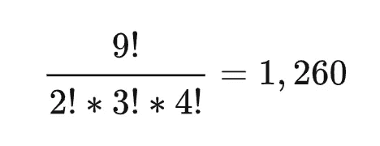

向 A、B 和 C 分配口味的方法！

# 回到 Twitter 的问题

我将尝试用分析的方式，通过 Python 代码的模拟来解决这个问题。

## 分析的

1.  第一个人有 1/100 的机会获得最后一个座位
2.  有 1/100 的机会，第一个人坐在第一个座位上，所有人都跟着坐
3.  有 98/100 的机会坐在别人的座位上，他们坐在第一个或最后一个人的座位上的概率是 1/2

因此，最后一个人获得指定座位的概率是

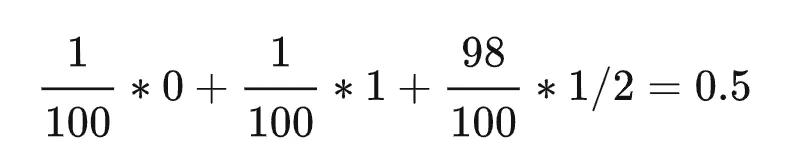

## 模拟

或者，我们可以使用模拟来找出事件发生的概率，即最后一个人坐在最后一个座位上。

下图显示了模拟的高斯核密度，以及拟合的正态分布。它的平均值为 0.5，标准偏差为 0.01。

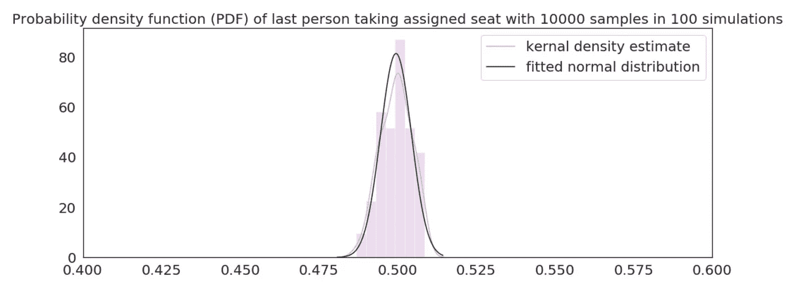

解决这个问题有多种方法，我在这里找到了其他解决方案以及在最初的[推文中的讨论](https://twitter.com/wolfejosh/status/1020322139134668800?s=20)。

# 最后的想法

组合学的概念不仅对数学和物理学的其他领域很重要，而且与我们的日常生活相关——数学无处不在！理解组合、排列和分割的一些基本概念肯定能帮助我们在现实世界中操纵无限的可能性。

如果你觉得这篇文章有帮助，请告诉我！如果您感兴趣，这里有一些关于此主题的参考资料:

*   [汗学院的计数、排列和组合](https://www.khanacademy.org/math/statistics-probability/counting-permutations-and-combinations)
*   [更好解释的简单排列和组合](https://betterexplained.com/articles/easy-permutations-and-combinations/)
*   [来自 Wolfram MathWorld 的组合学](https://mathworld.wolfram.com/topics/Combinatorics.html)

*帖子最初发表于此:*[*https://www.chuxinhuang.com/blog/counting-is-fun/*](https://www.chuxinhuang.com/blog/counting-is-fun/)