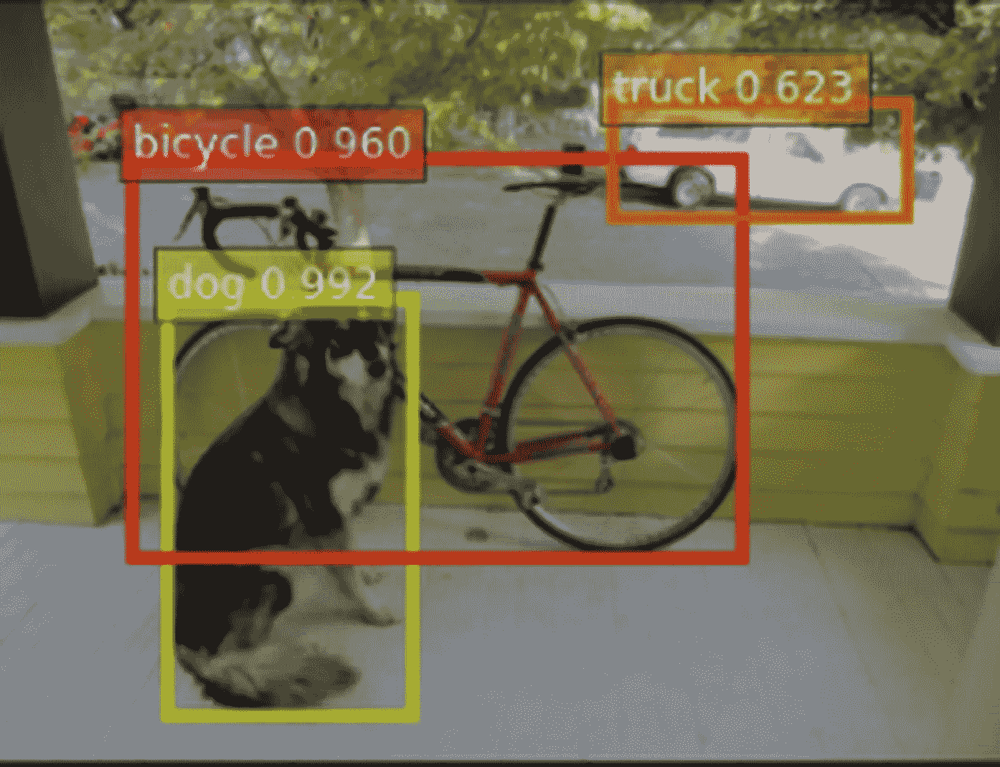

# 使用 GluonCV 和 MxNet 计算网络摄像头上的人数

> 原文：<https://towardsdatascience.com/counting-people-on-your-webcam-using-gluoncv-and-mxnet-d1a9f05c427d?source=collection_archive---------56----------------------->

## [现实世界中的数据科学](https://towardsdatascience.com/data-science-in-the-real-world/home?gi=ea0e55878a54)

## 基于 YOLOv3 目标检测模型


由[斯蒂芬·伯纳德](https://unsplash.com/@stephanebernardphotography?utm_source=medium&utm_medium=referral)在 [Unsplash](https://unsplash.com?utm_source=medium&utm_medium=referral) 上拍摄的照片

## **简介**

在图像中计数是计算机视觉最常见的任务之一，有许多用例。在本教程中，我们使用了 GluonCV 工具包来支持我们这样做。GluonCV 在计算机视觉任务中提供了深度学习模型的前沿实现。它由用于图像分类、对象检测、语义分割、实例分割、姿态估计、对象跟踪和动作识别的最先进的预训练模型组成。你可以在格鲁恩科夫模型动物园看看其他模型。

```
[https://gluon-cv.mxnet.io/model_zoo/index.html](https://gluon-cv.mxnet.io/model_zoo/index.html)
```

通常，在对象检测任务中，我们有要检测的类、每个类的置信度得分以及图像中检测到的对象的边界框。

## **检测**

例如，考虑包含狗、自行车和类似卡车的汽车作为突出对象的给定图像。


我的 colab 笔记本截图

当我们对图像应用对象检测模型时，我们的网络检查图像中的对象，将它们与地面真实标签进行比较，并返回置信度得分。边界框坐标是元组的形式，包括边界框的左上坐标、框的高度和宽度。



我的 colab 笔记本截图

为了检测图像中的人，我们在 COCO(上下文中的公共对象)类的集合中检查 person 类。COCO [数据集](http://mscoco.org/)是一个奇妙的对象检测数据集，有 80 个类、80，000 幅训练图像和 40，000 幅验证图像。我们的模型“yolo3_darknet53_coco”在该数据集上进行了预训练。

为了流式传输我们的网络摄像头数据，我们使用开源计算机视觉库 OpenCV


OpenCV 是一个用于计算机视觉任务的开源机器学习库，来源:“OpenCV”，via: wikipedia

## **先决条件**

在安装以下软件之前，在 Anaconnda 中创建一个虚拟环境(首选)

1.  OpenCV

要在您的系统中安装 OpenCV，请在您的终端或命令提示符中键入**pip install OpenCV-python**。我已经在 Anaconda 中使用了 Spyder 来完成这个任务，所以我已经在 conda 虚拟环境中安装了依赖项。

```
pip install opencv-python
```

2.MXNet 和胶子

要安装 mxnet 和 gluon，请在您的终端或提示符中键入**pip install mxnet-Cu 101 gluonvv**。我在我的虚拟环境中也做了同样的事情。如果您的虚拟环境中没有 CUDA，您可以安装不基于 CUDA 的 mxnet

```
pip install mxnet-cu101 pip install gluoncv
```

## 开源代码库

如果您熟悉 GitHub，请查看下面的资源库。

[](https://github.com/sid0312/people_counter) [## sid 0312/人 _ 计数器

### 这个库是作为我的中型博客 git 克隆 https://github.com/sid0312/people_counter…的源代码维护的

github.com](https://github.com/sid0312/people_counter) 

让我们看看我给定的对象检测任务的源代码

*   **导入我们的依赖关系**

*   **定义要使用的型号**

*   **添加实用功能**

a)将我们的帧从一个 NumPy ndarray 转换成一个 mxnet ndarray

b)将变换应用于 mxnet 阵列，以将其提供给网络

c)通过将网络应用于数据来获得 class _ ids、置信度得分和边界框

```
def detect(network,data):
  prediction = network(data)
  class_ids, scores, bounding_boxes = prediction
  return class_ids, scores, bounding_boxes
```

count _ object 函数，其对给定对象标签中超过给定阈值的对象数量进行计数

*   **创建一个 People_Counter 类，依次使用所有的效用函数和返回预测，以及 People，在单独的函数中计数**

__init__ 方法从 GluonCV model zoo 中导入预训练为‘true’的网络，因为我们使用的是预训练模型。使用 hybridize()加快网络速度。

set_threshold 方法设置对象置信度得分的阈值。置信度低于阈值的检测将不予考虑。

count_people 方法在实用函数的帮助下计算一帧中的人数

detect_people 方法返回对帧的检测。

class_names 返回 COCO 数据集中的所有 80 个类，这些类也是网络的类，因为它是在该数据集中预先训练的。

*   **为 People_Counter 类创建一个对象，并将阈值设置为 0.5。置信度低于 0.5 的检测将被考虑。**

*   **加载网络摄像头处理程序，让网络摄像头自动对焦一秒钟**

*   **使用 gluoncv.utils.viz 库**设置循环，对每一帧进行检测和计数，并在窗口中显示结果

video.read()返回两个值，第一个被丢弃，第二个成为我们的帧。

使用计数器对象的 count()和 detect_people()

获得预测，并在每一帧上绘制边界框。将计数文本放在框架上。使用 cv2.imshow()显示帧

如果在窗口上下文中按下“q”键，则退出循环。

*   **释放网络摄像头，销毁所有窗口**

**结果**


检测的单个帧


在我按下“q”之前的特定时间内的一些日志

> 非常感谢您的耐心。快乐的计算机视觉和快乐的深度学习。