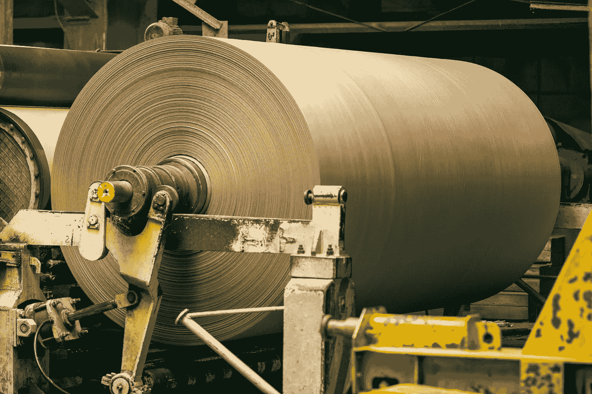
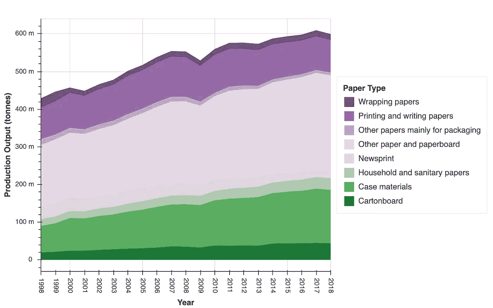
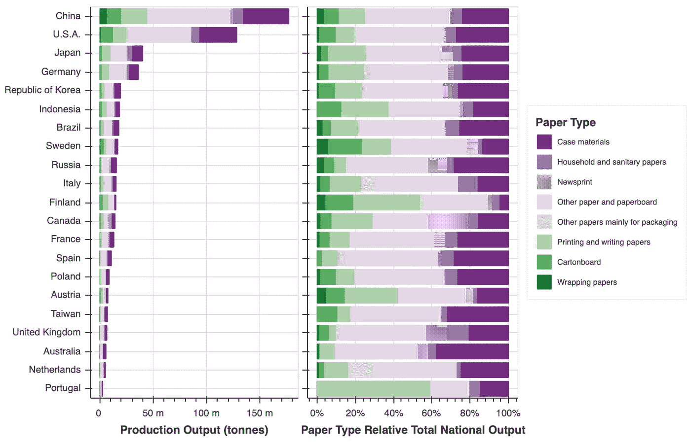
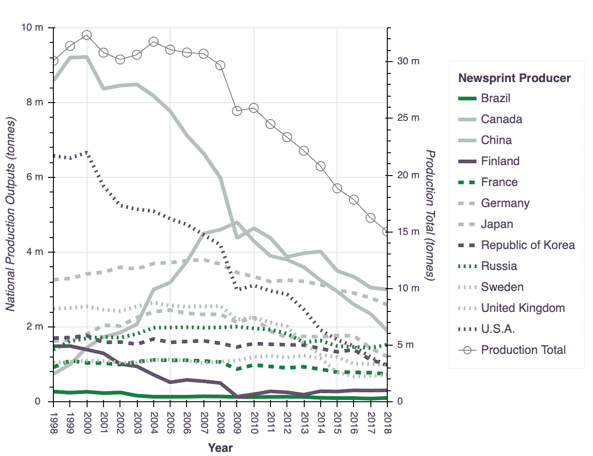
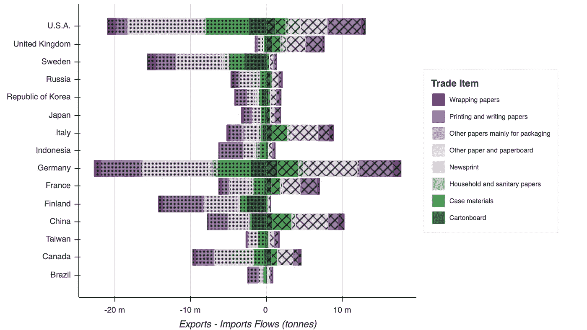
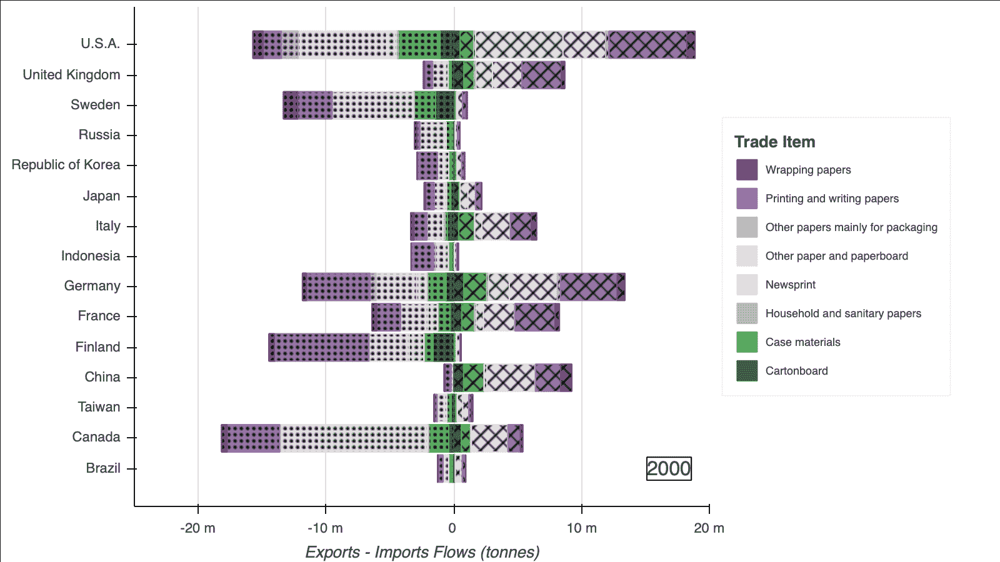
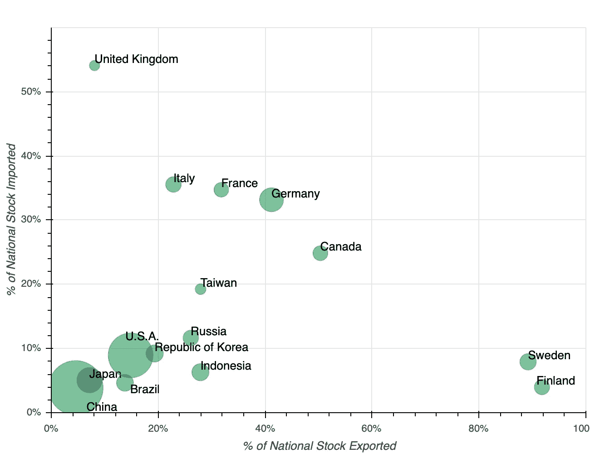
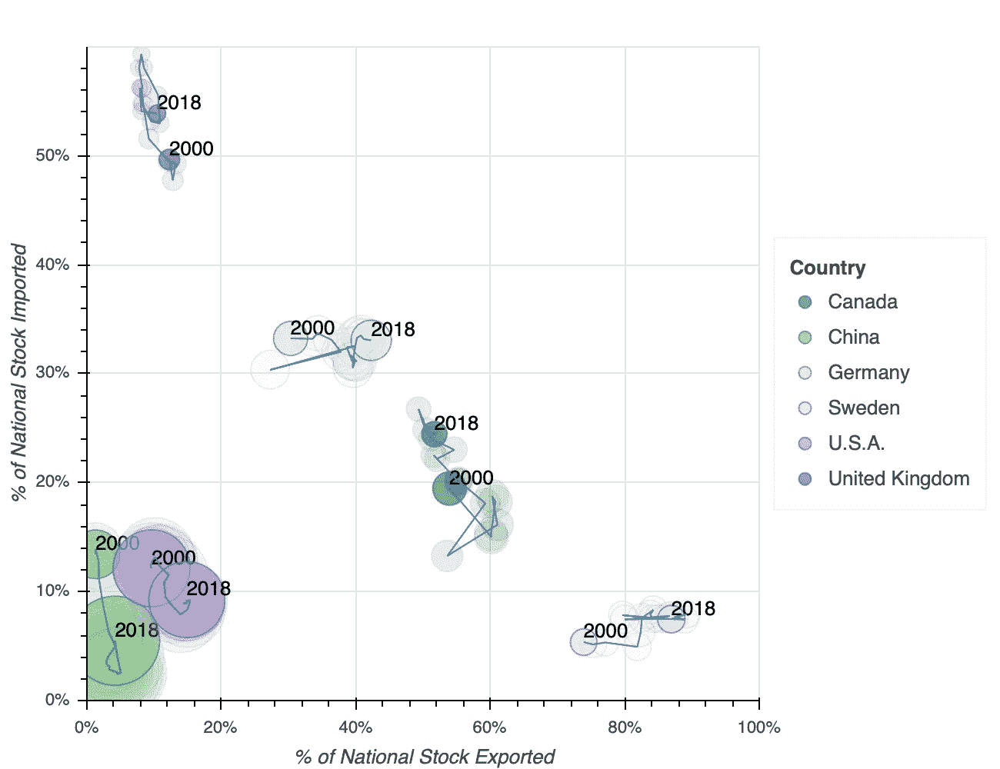
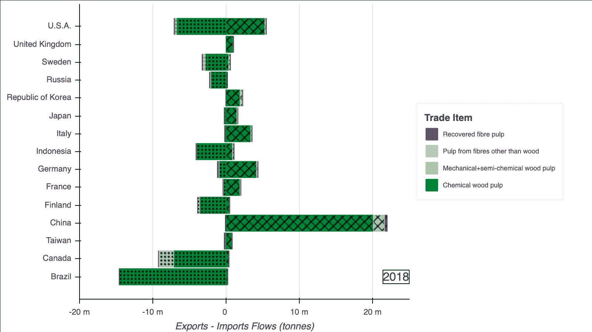
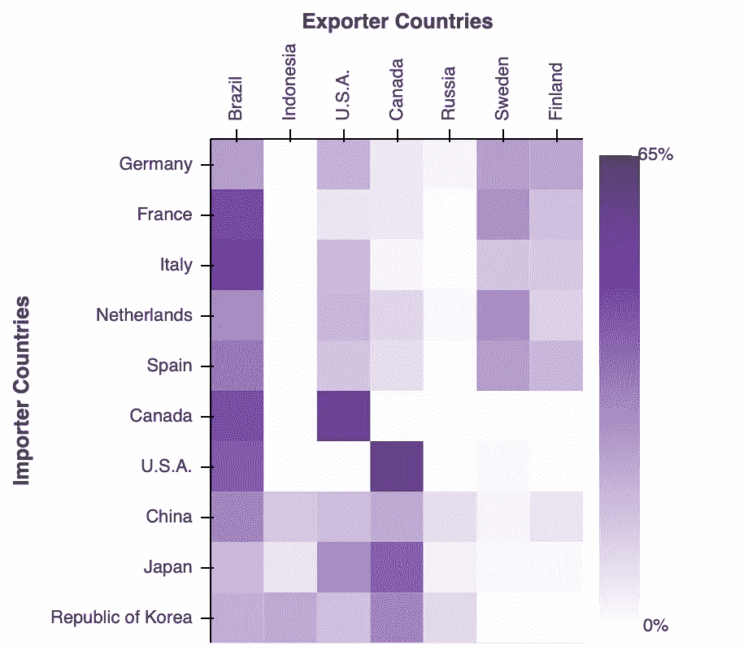

# 制造和交易纸张的国家

> 原文：<https://towardsdatascience.com/countries-that-make-and-trade-paper-bfd31b809f4c?source=collection_archive---------20----------------------->

## 1998–2018 年全球主要行业的数据可视化发现

简单地说，纸是由纸浆制成的。纸浆是由木材生产的，其次是稻草、竹子、棉花和其他天然纤维。在大规模生产的每一步，变异和多样化都是有意创造的，因此相对无差别的原材料——木材——变成了高度专业化的产品，用于书写、运输鞋子或擦拭溢出的乳制品。

化学和材料转化的进程可以理解为一个价值链。每一步都会创造价值。纸张或中间纸浆可以交易，并与其他价值链互动，如食品或消费电子产品。

因为纸无处不在，但制造复杂，而且基于天然原材料，在我们的星球上分布不均匀，所以价值链和贸易必然是全球性的。不同国家的工业必然会对这种全球交换纸和纸浆采取不同的关系，或者更一般地说，这些产品所体现的价值。

因为造纸是一个主要的行业，并且因为它依赖于重要的自然资源，所以这个行业需要进行大量的研究。在这篇文章中，我将现代数据可视化和分析的强大工具箱部署到 1998 年至 2018 年间全球造纸和纸浆生产和贸易的数据集。纸张价值链中的关系和趋势不仅仅是一些数字的函数，可以用这个工具箱来发现。

在这篇文章中，我将说明这个可视化工具箱可以做什么，并在这个过程中使纸张价值链，纸张贸易，纸张生产更好地理解。数据和方法的细节放在最后一节，还有一些代码片段。

## 纸张生产差异化

首先，我采取全球观点。

在下面的*堆积面积图*中，我展示了 1998 年至 2018 年间全球纸张生产总量，以及总量中包含的纸张类型。

在这 20 年间，总产量在增加。2008 年和 2009 年的金融危机在图表中表现为增长曲线的轻微下降。

纸张类型的类别定义非常广泛。毕竟不是所有的书写纸或包装纸都是一样的。尽管如此，分组还是捕获了一些不同的实用程序，我将在这个细节层次上执行数据分析。

从第一次观察上图中各区域的相对大小，可以明显看出纸的生产程度。用来装东西的纸显然是一个主要的使用案例。

将全球总量分解为国家总量是有益的，从字面上讲是为分析增加了另一个层面。我选择了一个特定的年份，并对每个国家(或至少是主要生产国)的纸张产量进行了举例说明。下面的*堆叠横条*是 2018 年的。

左边的图表显示了绝对数量。人口众多的主要制造业国家出现在顶部，就像许多其他制造业产出一样。

右边的图表显示了任何一个国家不同种类纸张的相对数量。从这个角度来看，国内生产的比例差异更加明显。其中，芬兰因其高比例的印刷和书写纸和低比例的案件材料而突出，而加拿大因其相对较高比例的新闻纸而突出。

为了进一步挖掘数据，可以选择一种特定类型的论文，并将几个国家随时间变化的趋势放入数据可视化中，以便进行时间和空间上的比较。在下面的*多线图*中，已经对新闻纸进行了上述操作。

彩色线条与左边的轴相关，显示了少数几个主要生产国的趋势；灰色线与右手轴相关，显示了全球新闻纸生产总量的趋势。

20 世纪 90 年代末两个最重要的生产国是加拿大和美国。然而，他们的产量在 20 年间一直在下降，现在还不到原来的一半。最初，全球总量没有下降。产量的减少被中国产量的增加所替代。然而，在 2000 年中期左右，所有国家的趋势明显是下降的。显而易见的原因是数字新闻媒体降低了纸张的特殊价值。

## 全球造纸贸易

一旦在某个国家生产，纸张就会在国内消费，或者进入该国不同的价值链，比如其他制成品的包装。纸张本身也可以跨境交易，这是专业化价值链的另一个共同特征。

2018 年的出口和进口，被理解为流出和流入一个国家，如下所示。(文章末尾提供了代码片段。)

在左手边，负向流动，堆叠的虚线显示了国家出口的文件类型。在右边，正向流动，交叉的条显示了国家进口的文件类型。

对可视化的检查揭示了不同的国家与全球票据市场存在不同的关系。

*   例如，芬兰、瑞典、加拿大、印度尼西亚相当倾向于负向流动，换句话说，它们是净出口国。
*   中国、美国、法国，特别是德国，作为进口国和出口国，都与纸张进行大量贸易。以这种方式进行交易是有意义的，这在一定程度上反映了并非所有的纸张都是相同的，而且，比方说一个德国用例更适合来自一个精轧机而不是德国轧机的纸张。此外，这表明重商主义已经今非昔比。
*   英国(以及图中省略的许多国家)进口他们使用的大部分纸张。

为了可视化贸易流中的*趋势*，在国家类别和纸张类型类别仍然完全解析的情况下，与上面相同类型的图像被动画化。图像中的每一帧都显示了 2000 年至 2018 年期间的贸易流量。

在这种数据可视化中，与之前类似的趋势是显而易见的。加拿大减少的足迹和中国增加的足迹在全球贸易中非常突出，这从以前的可视化中可以理解为与新闻纸效用的减少有关。不变的特征也很明显，比如瑞典和芬兰一直是主要的净出口国。

另一个有意义的对比是国家贸易流量相对于总产量的差异。下面的*散点图*可视化了 2018 年的相关数量。

国家纸张存量被定义为某一特定国家当年生产或进口的所有纸张的数量。横轴表示出口的国家储备的百分比，纵轴表示通过进口获得的国家储备的百分比。最后，圆盘的面积表示相应国家的纸张生产总量。

圆盘的位置和大小揭示了与纸张价值链及其全球贸易的多种不同关系:

*   瑞典和芬兰(右下)主要生产出口纸张。
*   左下角的中国和日本是主要生产国，但主要是为了满足国内对纸张的需求。
*   左上角的英国(以及许多被忽略的国家，它们生产的纸很少)通过进口满足了大部分的国内用纸需求。
*   对角线上的德国、法国、意大利和加拿大通过生产和进口来满足国内需求，它们将很大一部分产品出口到全球市场。

这些关系在研究的这些年里大多是稳定的。除了动画之外，说明趋势的另一种方法是将圆盘的*轨迹*可视化为叠加图。在 2000 年至 2018 年间，下图中的一小部分国家已经这样做了。(文章末尾提供了代码片段。)

## 全球纸浆贸易

到目前为止，纸被认为是。但是造纸需要纸浆作为原料。纸浆也是一种可以生产、出口和进口的物品。纸张价值链的这一部分的特征体现在以下数据可视化中。

然而，必须首先注意数据集的局限性。

有些工厂既生产纸浆又生产纸张。这种造纸厂生产的一部分纸浆可以干燥后卖给国内外的其他造纸商。纸浆的另一部分可以在工厂内输送到相邻的造纸机，并在那里转化成纸。数据集只考虑了前一部分，而忽略了后一部分。这是一个可以理解的省略，因为后一部分完全是在一个工厂内进行的。

就目前的分析而言，这一遗漏意味着无法获得某个国家生产多少纸浆的总价值，因为可能有很大一部分没有计算在内。然而，全球纸浆贸易包含在数据中，因此可以按照与上述纸张贸易相同的思路进行分析。

2018 年纸浆进出口流量的相同类型的堆积条形图如下所示。

首先要注意的是，数据中纸浆的类别较少，这反映了部分中的*在价值链的这个阶段，产品的变化较少。然而，正如上面提到的纸张类型，这些类别在内部并不统一(一个缺失的区别是由针叶树或非针叶树木材制成的纸浆，前者在北方国家更常见)。*

其次，出口大量纸浆的国家较少:巴西、加拿大、美国、印度尼西亚、芬兰、瑞典和俄罗斯。毫不奇怪，这些国家境内都有大量森林。树很重，不容易运输。纸浆生产供应链中的一个常见现象是，工厂中转化的木材主要是从工厂周围相对较小的地理区域收集的。

显而易见，中国进口了大量纸浆。如上所述，中国是主要供国内使用的纸张的主要生产国。然而，相当数量的纸是用进口纸浆制造的。

另一个与纸面数据分析形成对比的是巴西。在早期的散点图中，与巴西相对应的圆盘属于主要为国内使用而生产纸张，较少用于全球贸易的国家类别。然而，纸浆出口量很大。显然，与瑞典和芬兰不同，巴西选择在价值链的不同阶段参与全球贸易:将纸浆而非纸张货币化。

图表的动画版本如下所示。

应该注意的是，用于造纸的纸浆可以由部分回收或再生纸制成。尽管在过去的某个阶段，纤维必须来源于由木材(或其他天然来源)制成的纸浆，但直接来源可以是其他纸张。此处未显示的数据表明，中国造纸生产的很大一部分直接来源于回收纸。因此，进口纸浆量和生产的纸张量之间的差异不一定是来自天然来源的国产纸浆。

贸易数据可以进一步分为双边交易，即出口国和进口国的网络。使用*热图*可以很好地可视化与一对类别相关的数量。以下数据为 2017 年木浆全球贸易。

进口木浆的国家的子集显示为行，出口最大量木浆的国家的子集显示为列。热图中任何给定单元格的颜色饱和度显示了来自相应出口国的进口占相应进口国总进口的百分比。

换句话说，看着一排颜色，向对应于所述排的国家供应纸浆的国家变得非常清楚。将行与行之间进行比较，可以看出果肉获取方式的差异和相似之处。

一些观察结果:

*   欧洲大陆各国的纸浆进口也有类似的相对分布，它们从巴西、瑞典和芬兰进口大量纸浆，从加拿大和美国进口一些，但从俄罗斯和印度尼西亚进口很少或没有。
*   东亚进口商从出口国(不包括瑞典和芬兰，它们的供应量相对较少)获得的木浆分布更加均匀。
*   加拿大和美国互相贸易木浆，也从巴西进口。
*   巴西是全球木浆出口国。

为了向下钻取和查看趋势，一种方法是选择特定的国家并沿水平维度显示时间。以下是对意大利进口的处理。

已经讨论过的全球纸浆贸易的总体趋势是显而易见的，其中来自巴西的数量增加，来自加拿大的数量减少。更微妙的是，从印度尼西亚的进口尽管总是相当适度，却减少了。然而，从以前的图表中可以看出，印度尼西亚的出口总量有所增加。中国需求的增长很可能是因为印尼纸浆的转向。

## 那些树呢？

如上所述，大部分纸浆是在上述工厂附近的森林中伐木生产的。木材的全球贸易是可能的。然而，木材的不同可能用途，如家具、建筑、能源，都必须纳入分析。那超出了我在这里要做的事。

此外，砍伐和改造森林有许多原因。正如在别处所讨论的[，全球森林面积正在减少。另一方面，减少并不一致，事实上，在同一时期，欧洲的森林覆盖面积比这篇文章中的](https://e360.yale.edu/features/conflicting-data-how-fast-is-the-worlds-losing-its-forests)[要大。](https://ourworldindata.org/grapher/forest-area-percent)

可以说，纸张价值链以及造纸和纸浆的过程都很先进，对全球经济的新兴特征具有指导意义，并且丰富的数据足迹正在变得可用。生态互动网络的额外连接创造了更多的探索空间。

## 数据和方法说明

*   数据来自联合国粮食及农业组织(粮农组织)。特定的数据主要基于不同国家的官方数据。粮农组织投资建立了一个[易于访问的开放数据门户](http://www.fao.org/faostat/en/#data)。
*   所有可视化都是使用 [Python 库 Bokeh](https://docs.bokeh.org/en/latest/index.html) 完成的。这个库为可视化及其设计提供了大量的灵活性和控制，尤其是当数据处理与 [Python 库 Pandas](https://pandas.pydata.org) 结合时。为了指导使用散景的编码工作，使用 [Microsoft Power BI](https://powerbi.microsoft.com/en-us/) 完成快速数据概述。
*   多维数据本来就很难研究，人类的视觉感知限制了可视化所能捕捉的内容。来自数据库的概念，如 [OLAP 立方体](https://en.wikipedia.org/wiki/OLAP_cube)，以及切片、切块和下钻的规范操作，有助于构建数据探索。[数据可视化原则](https://www.edwardtufte.com/tufte/)也很有帮助。
*   写在介质上的文本不能利用与图表的交互。动画图是一个相关的变体，说明了如何在可视化中分解连续变量或顺序变量，而不需要空间轴。
*   GIF 动画是用 [Python 库 imageio](http://imageio.github.io) 制作的。
*   造纸和纸浆制造是一门复杂的工程科学，包含许多化学和机械步骤。YouTube 上有介绍这个过程的视频。同样，作为一个行业，造纸是古老的。至少有一种历史观点认为纸是最重要的 50 项创新之一——这种观点认为，如果书写的文字一直印在动物的皮肤上，而不是更便宜、更柔韧的纸张上，印刷机的革命性潜力永远不会实现。

***代码片段:磁盘轨迹图*** 的内循环

***代码片段:创建导出-导入流程图*** 的主要部分