# 使用 Spotify 的 API 和 Python 中的 Seaborn 对音乐品味进行国别可视化分析

> 原文：<https://towardsdatascience.com/country-wise-visual-analysis-of-music-taste-using-spotify-api-seaborn-in-python-77f5b749b421?source=collection_archive---------16----------------------->

## 你知道哪个国家喜欢欢快的音乐，哪个国家喜欢喧闹的音乐吗？

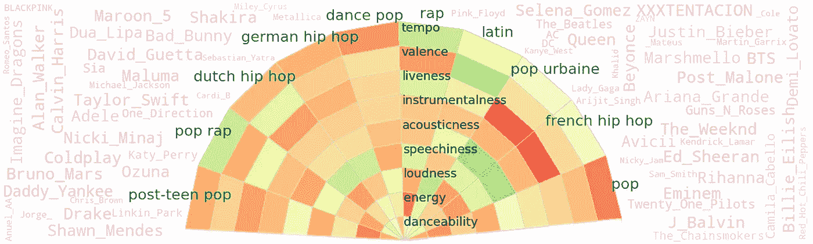

我最近开始使用 Spotify，并对驱动 Spotify 基于协同过滤和 NLP 的推荐系统的复杂技术感到惊讶。

在这个项目中，我调查了特定国家的音乐偏好。

**数据采集:**

我删除了 Spotify 每周地区图表的数据。这是包括“全球”在内的 64 个国家的每周排名前 200 的热门歌曲。图表中的数据从 16 年 12 月开始。

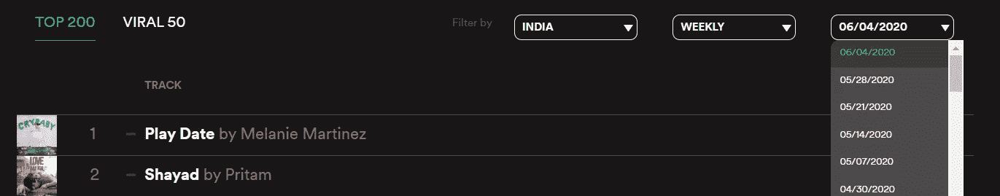

我已经从 11286 个‘page _ URLs’中删除了这个列表，得到了一个有 210 万行和以下属性的数据集:歌曲名称，歌曲 URL，艺术家，流，歌曲位置(前 200 名之内)，国家和星期。数据集中有 48261 首独特的歌曲、9805 位艺术家和 1579 种风格。与您分享样本数据的快照:

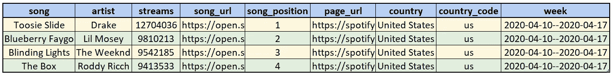

*“音乐的一个好处是，当它击中你时，你不会感到痛苦。”——鲍勃·马利*

我用 Spotipy 获取了报废歌曲的其他相关音乐数据。Spotipy 是 Spotify Web API 的轻量级 Python 库，它允许完全访问 Spotify 平台提供的所有音乐数据。

我从曲目 URL 中获取了详细信息，如曲目流行度(得分在 0-100 之间)、艺术家 URL、艺术家流行度(0-100)、艺术家追随者和艺术家流派。

对于每首歌，我还使用 Spotipy 提取了音频特征。

**音频特性简述:**

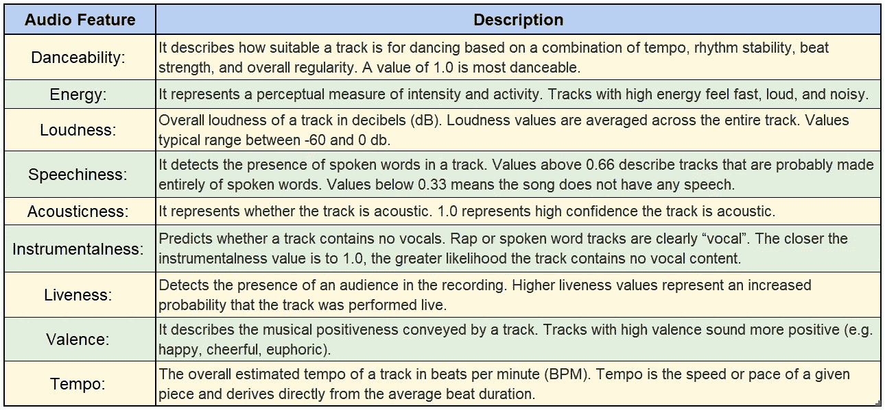

除了响度和速度之外，所有特性的值都在 0-1 的范围内。

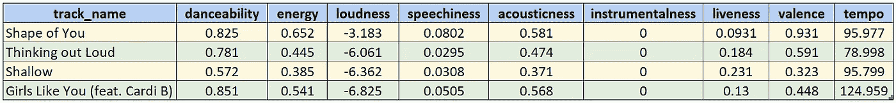

**最具特色的 25 位艺人:**

*   Plot 显示了一位艺术家在所有国家数周内出现在前 200 名榜单中的次数。
*   y 轴上的特色数字以百为单位，例如艾德·希兰已经被特色了 48，000 次。
*   在前 200 名列表和前 30 名中出现的特定艺术家的独特歌曲的数量(从歌曲位置计算)也绘制在 y 轴上。

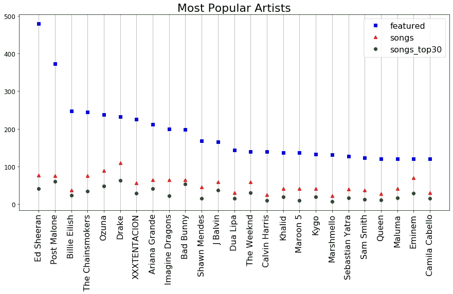

这是对印度的独家分析，因为我是印度人。

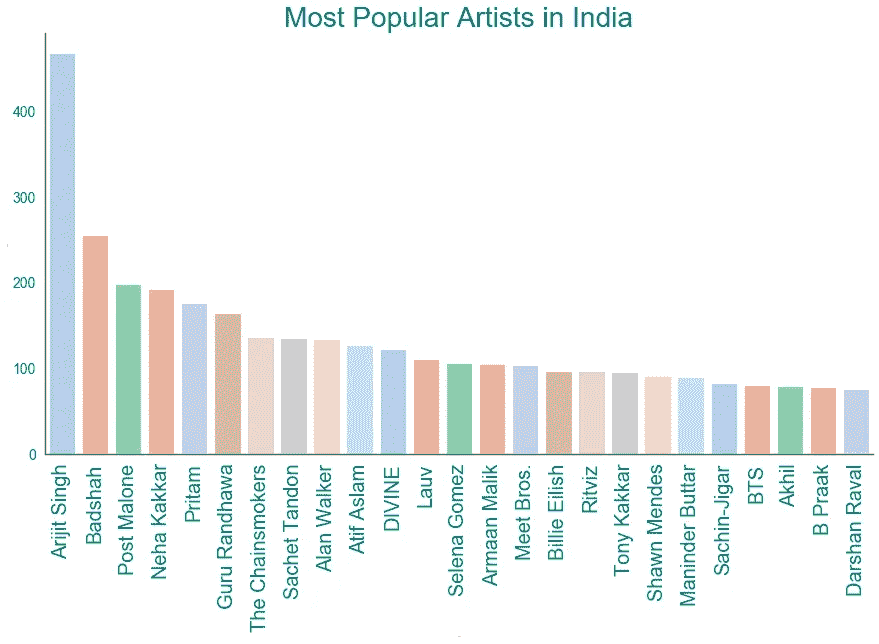

**25 大流派剧情:**

*   每首歌曲都与一个艺术家相关联，并且每个艺术家可以有多个流派。
*   48.2k 独特歌曲中的前 25 个流派绘制如下。
*   它显示了与特定的数据科学流派相关的歌曲和艺术家的数量。

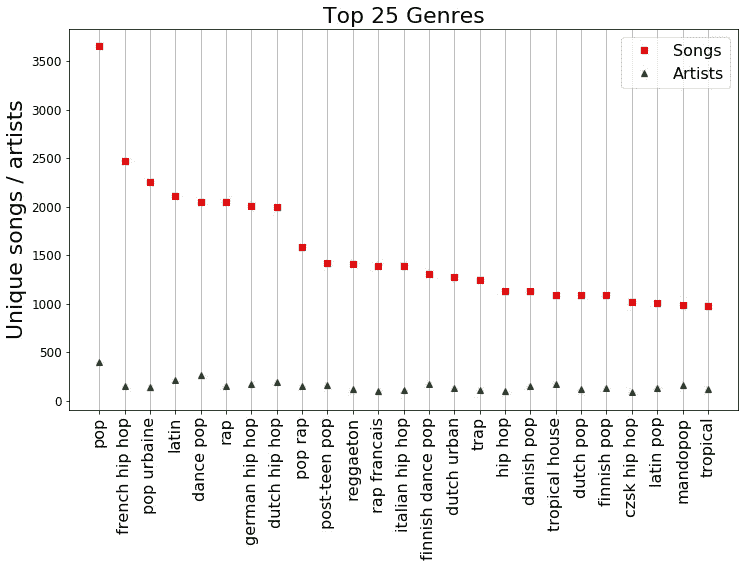

**艺人人气博闻剧情:**

各流派中艺人人气得分分布的箱线图(经典箱线图的增强版)如下所示:

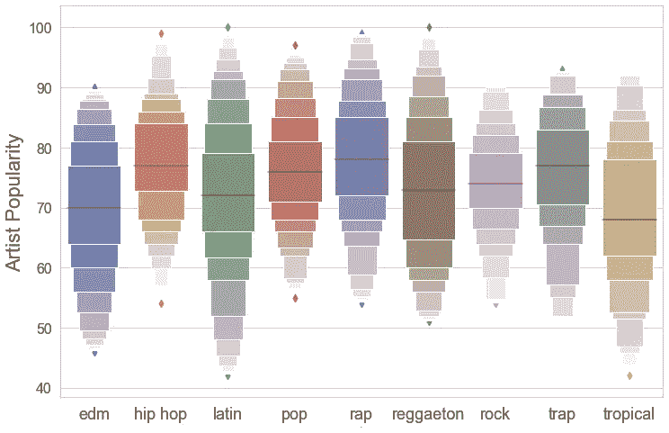

*   在说唱流派中，Median artist 的受欢迎程度(由中间的黑线表示)最高。
*   与其他流派相比，流行艺术家一开始就有很高的受欢迎程度。
*   拉丁艺术家的受欢迎程度最高。
*   摇滚和 EDM 艺术家不能获得 90 以上的受欢迎分数。
*   Trap 艺术家的受欢迎程度从 52-93 不等，他们中的大多数位于这个范围的高端，而在其他流派中分布更加均衡。

让我分享一些对一些最受欢迎的流派的有趣见解。

**流派艺术家追随者蜂拥图:**

在下面的蜂群图中，每个点代表一个艺术家。我已经标记了每个流派中最受关注的艺术家。

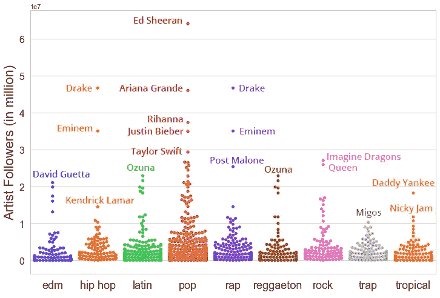

**200 强最具特色歌曲:**

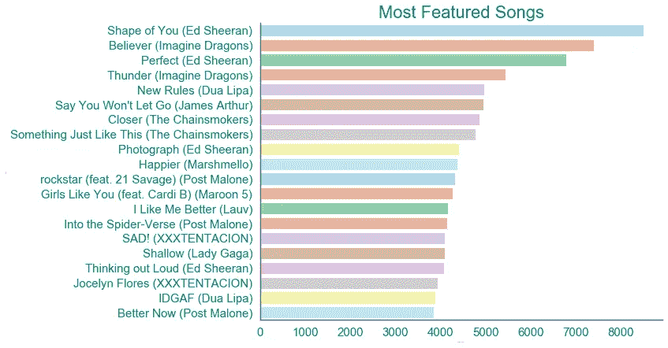

**按流派来看，一首歌出现在前 30 名的次数:**

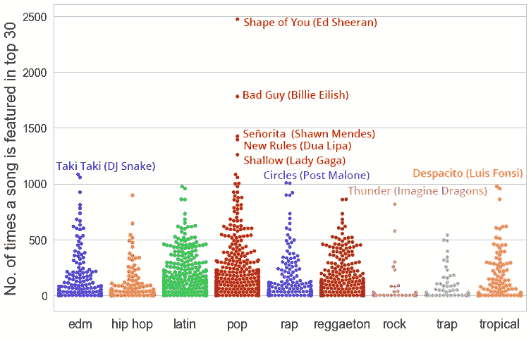

*   这里每个点代表一首歌。
*   流行歌曲名列榜首。
*   只有几首摇滚歌曲设法长期保持在前 30 名。

**我最喜欢的流派:**

我在 Spotify 中保存的歌曲的前 12 种风格的饼状图如下所示。检查这个[链接](http://organizeyourmusic.playlistmachinery.com/#http://organizeyourmusic.playlistmachinery.com)来分析你的。我听的大多数歌曲都是流行舞曲。

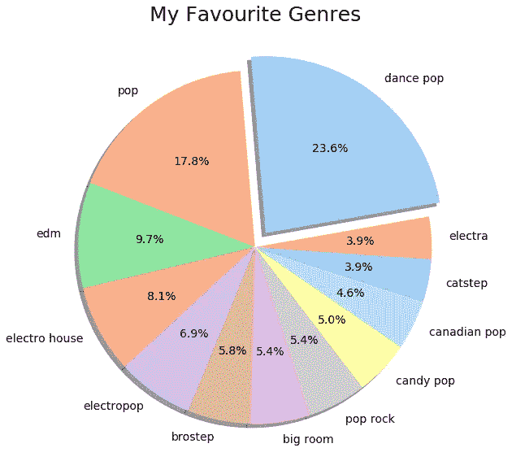

让我们探索一些主要流派的顶级艺术家，包括我最喜欢的。这些是提到的流派中最有特色的艺术家的词云。

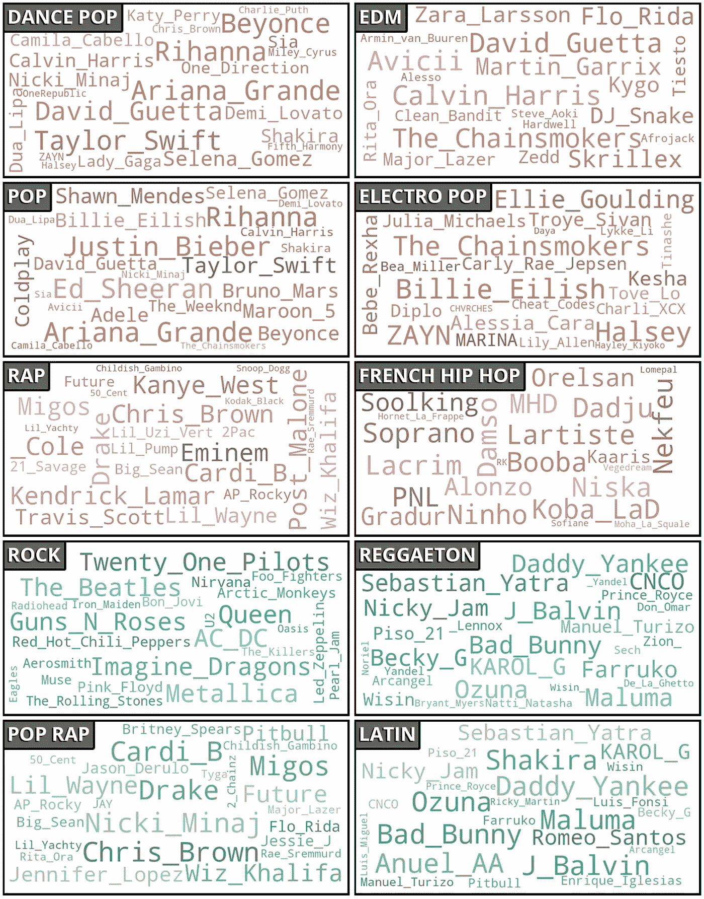

在这个过程中，我可以在我最喜欢的流派中探索顶级艺术家最受欢迎的歌曲，并扩展我的播放列表。

**音频特征相关性分析:**

现在来说说我提取的音频特征。

*皮尔逊相关系数(r)是衡量两个变量之间线性关联强度的指标。它的取值范围从+1 到-1。值 0 表示无关联，大于 0 的值表示正关联；也就是说，随着一个变量的值增加，另一个变量的值也增加。*

这是音频特征之间的关联热图。

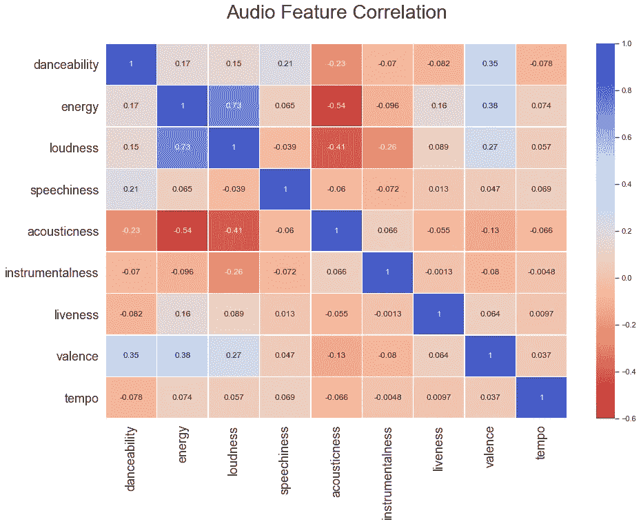

*   蓝色表示正相关，红色表示负相关。
*   联想越强，阴影越深。
*   响度和能量有很强的正相关性，这是有道理的。
*   与其他配对相比，声音和能量具有更强的负关联。
*   化合价与可跳舞性、能量和响度有轻微的正相关。

**音频特写联合 KDE 剧情:**

我们可以进一步分析这些对，比如说能量和响度，使用如下所示的联合核密度估计图。

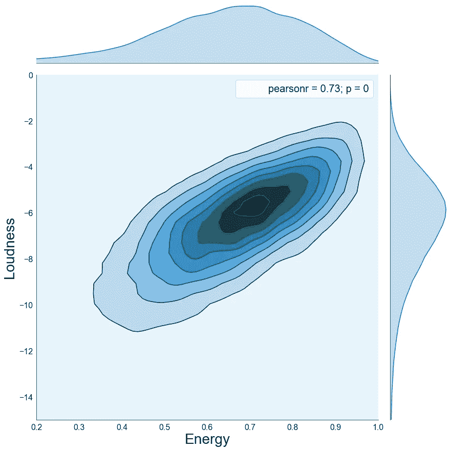

*   两者都与皮尔逊 r 值 0.73 呈正相关。
*   这两个特征的分布是左偏的，这意味着大多数歌曲具有这些特征的较高值。请注意，轴标签不是从 0 开始的。
*   大多数歌曲的音频特征具有接近 6 的响度值和接近 0.7 的能量值，如较暗的轮廓阴影所示。

**音频特色 vs 流派泡泡剧情:**

这里是另一个查看数据的视图。在下面的气泡图中，我用他们的平均速度和平均语速分别在 x 轴和 y 轴上标出了这三个流派的艺术家。气泡的大小决定了他们的受欢迎程度。

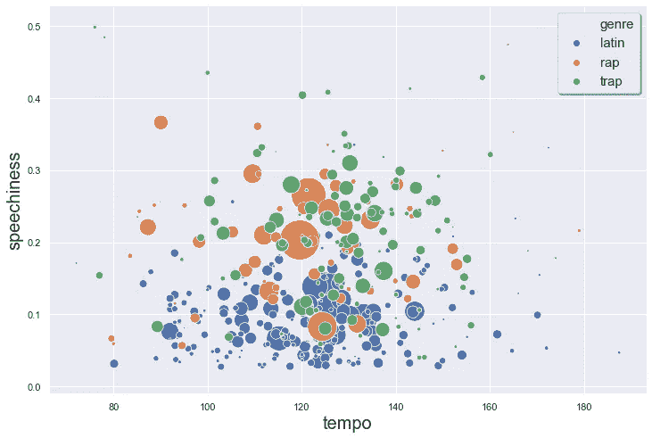

*   语速是区分拉丁歌曲和其他流派的一个很好的标准。
*   顶级说唱艺人的人气比其他人多。
*   大多数受欢迎的说唱艺术家在他们的歌曲中有一个非常明确的平均速度范围(大约 120 bpm)。

**音频特征分布分析**

几种音频特征在不同体裁中的分布分析。

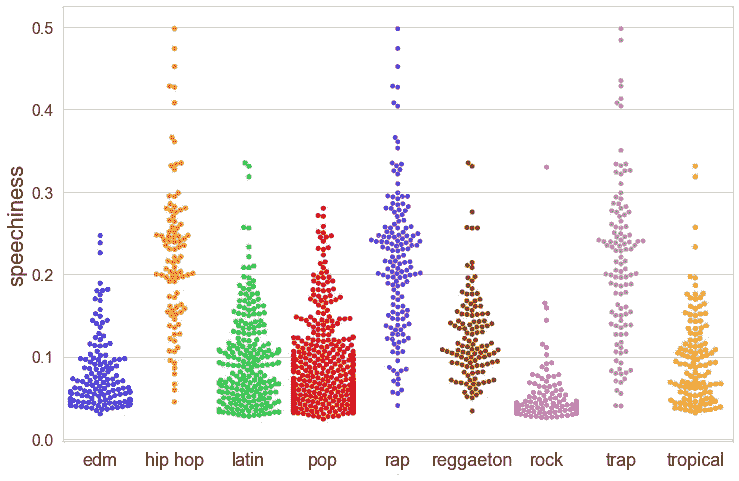

*   Hip hop，rap 和 trap 在 speechiness 中排名很高。
*   摇滚歌曲的语速最低。

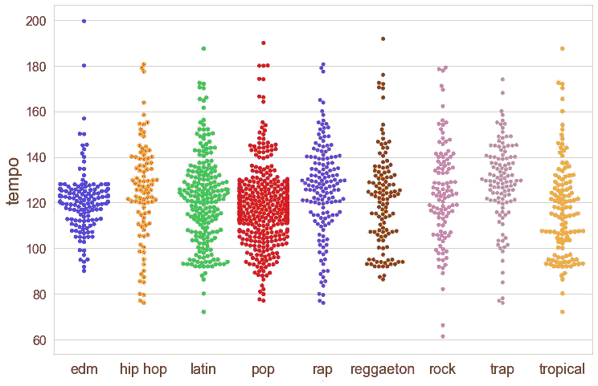

*   EDM 歌曲有一个非常明确的速度范围。
*   通常，所有流派的节奏都在 90-160 BPM 之间。

**音频特色 vs 流派径向热图:**

在下面的流派-特征径向热图中，我采用了标准化后每个流派所有歌曲的平均特征值。

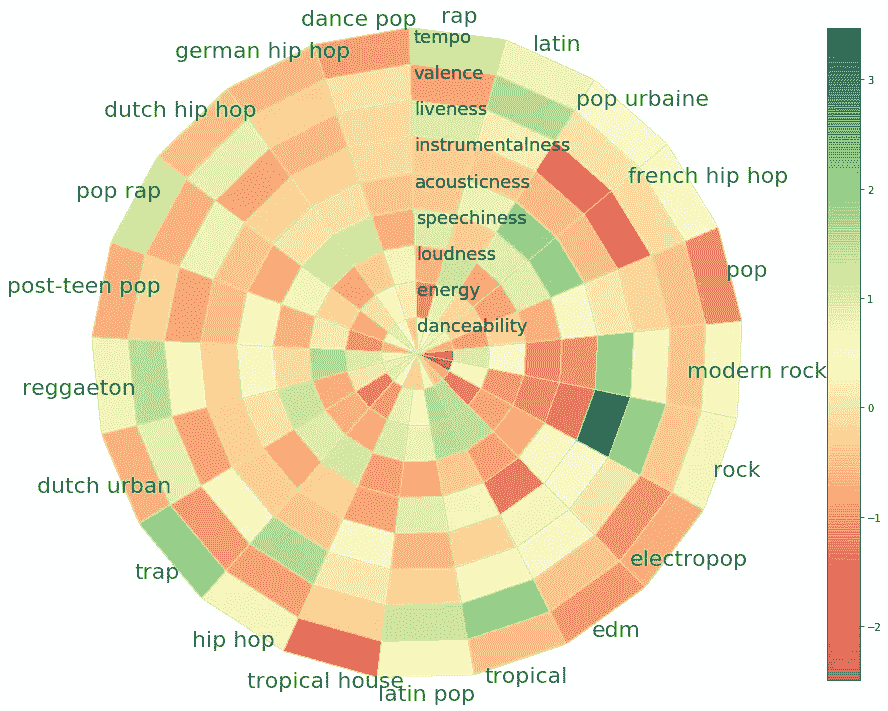

平均特征值越绿。摇滚在工具性方面排名最高。

为了更好地理解数据，我在每个同心圆(即每个特征)中突出显示了(21 个国家中的)前 7 个国家。我将每个特性中高于 66%的值标记为 1，其他值标记为 0，然后创建了热图。

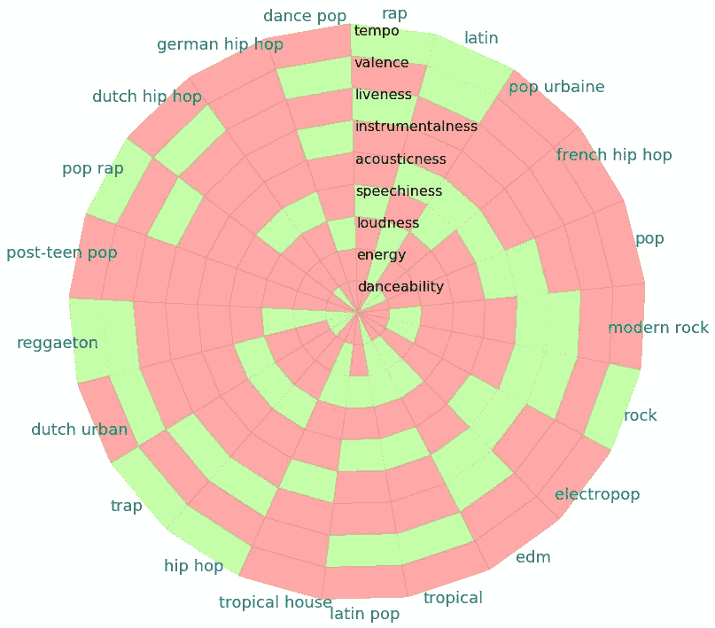

如果我们看看标有价数的同心圆，平均价数得分最高的前 7 个流派是舞蹈流行、荷兰嘻哈、雷鬼音乐、荷兰城市、拉丁流行、热带和拉丁。

我最喜欢的舞蹈流派——流行音乐并不像它的名字所暗示的那样，在可跳性方面位列前七。😅

**国家级分析:**

再说国家，我拿了一些顶级音乐国家的样本。

每个国家的十大流派列表:

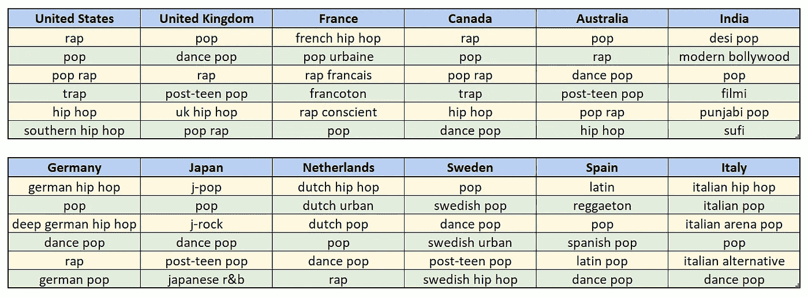

如果我们看下面的图表(整个图表包含总共 64 个国家的 64 个条)，在 48.2k 首歌曲中，34.7k 首歌曲出现在一个国家，4.3k 首歌曲出现在两个国家。

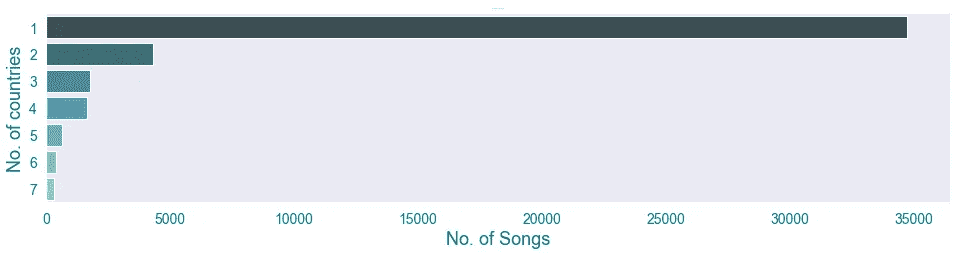

迄今为止，共有 32 首歌曲在全球 64 个国家播放。在前 30 名中，只有一首歌在所有国家都有播放。

**最多国家排名前 30 的歌曲列表:**

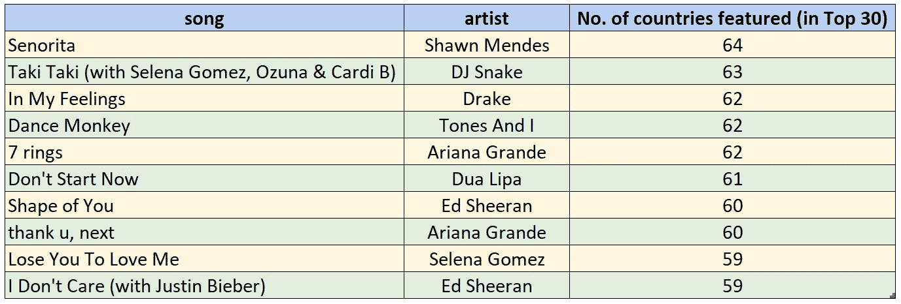

**一个国家的地域歌曲比例:**

如果我们再深入一点，分析这些 34.7k 只在一个国家精选的歌曲，我们就可以知道哪些国家的地域歌曲在那个国家的前 200 名榜单中占据主导地位。

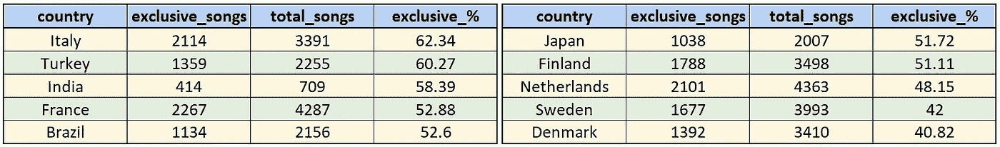

意大利、印度和法国在地区歌曲占主导地位的国家名单中排名靠前。如果我们看看这些国家的顶级流派，大多数都是地区性的。

在意大利，排名前六的流派包括像意大利嘻哈和意大利流行音乐这样的地区性流派。令人惊讶的是，印度的歌曲数量明显较少，这可能是因为当我们痴迷于一首歌时，我们不允许其他歌曲长时间出现在列表中。😜

**特定国家的音乐偏好:**

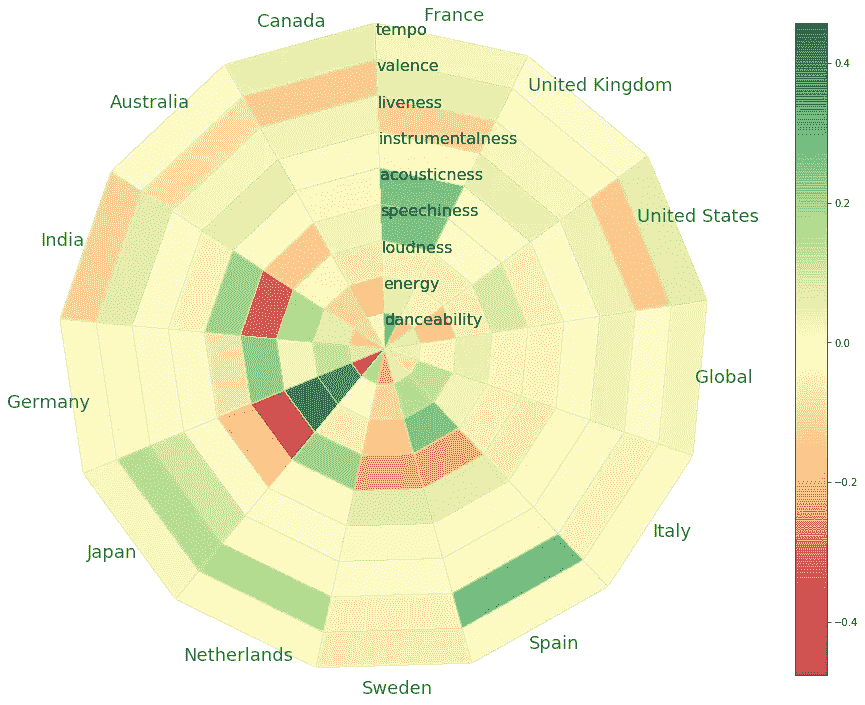

*   西班牙的化合价很高。拉丁和瑞格顿是西班牙最流行的两种音乐类型(见上表),这两种音乐类型的价值都很高，如风格特征热图所示。
*   法国也是如此，法国嘻哈音乐和都市流行音乐是两种最突出的流派，在可跳舞性方面排名都很高，因此法国在可跳舞性方面排名最高。法国的声音和语音也是如此。
*   印度在声学方面排名很高。声学音乐主要使用通过声学手段产生声音的乐器，而不是电子手段。
*   日本人更喜欢充满活力和喧闹的音乐，因为 j-pop 和 j-rock 是突出的流派。但是他们更喜欢其他流派的充满活力的歌曲吗？

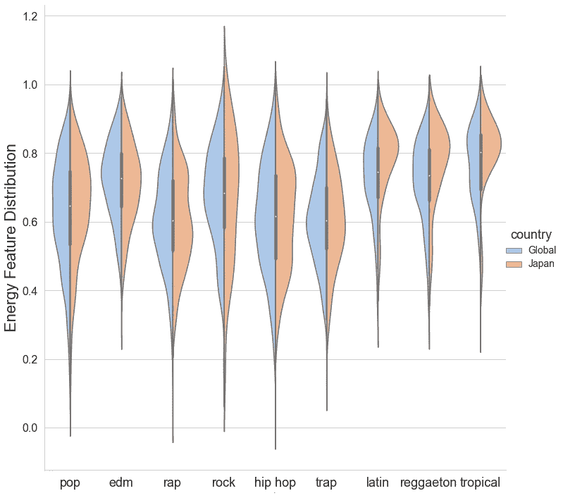

该图显示了音频特征“能量”在每个提到的流派中的分布。左侧是国家/地区被选为“全球”的分布，右侧是日本。

在上面的“分裂小提琴情节”中，与全球音乐相比，他们对活力音乐的品味在拉丁、雷鬼音乐和热带音乐等流派中非常明显。

在下面的表格中，我选取了 Spotify 上 200 位最受关注的艺术家，并根据他们在歌曲中的音频特征的平均分，对他们的每个音频特征进行了排名。正如我们在 acousticness 中看到的，Arijit Singh，Armaan Malik 和 AR Rahman 都在前 15 名。此外，来自印度的 Neha Kakkar 在响度方面排名第一。(我太骄傲了🤩)

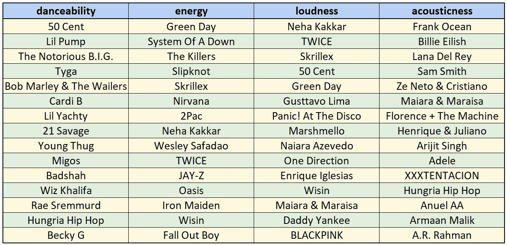

因此，如果你想制作一个播放列表来跳舞，你可以看看上面的 danceability 顶级艺术家名单。

其他方面的顶级艺术家:

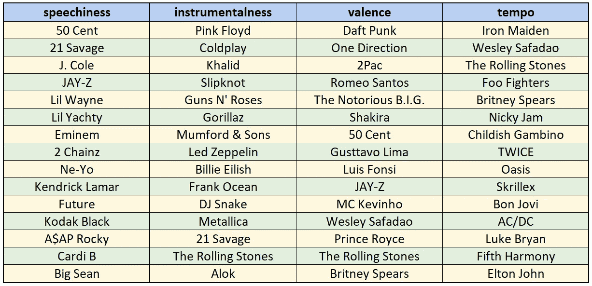

p！nk Floyd，Coldplay 和 Khalid 都是器乐方面的顶级艺术家。如果你正在寻找有积极氛围的歌曲，你可以查看价栏中的艺术家名单。

**全国十大最具特色艺人名单:**

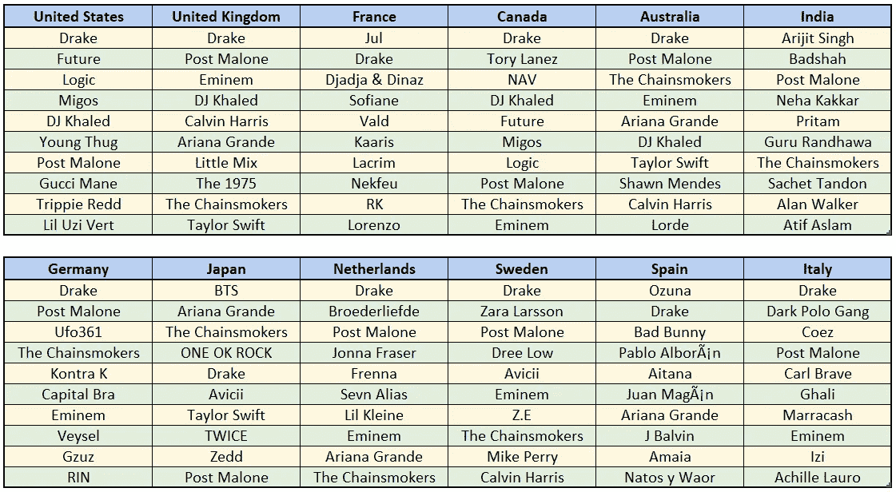

**Spotify 上关注最多的艺术家:**

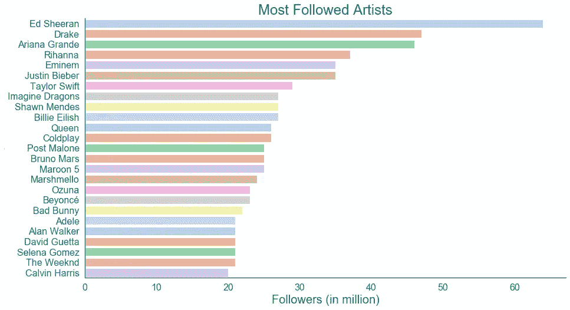

**使用 t-SNE 可视化数据:**

让我们检查一下某一特定流派的歌曲是否有相似之处。这是 2D 空间中 9 维数据(9 个音频特征)的 t-SNE 投影。t-分布式随机邻居嵌入(t-SNE)是一种非线性技术，它将多维数据映射到一个低维空间，并试图通过基于具有多个特征的数据点的相似性识别观察到的聚类来发现数据中的模式。

我放映了所有属于这些流派的歌曲:法国嘻哈、流行舞曲和雷鬼音乐。我将模型运行了 10000 次迭代，困惑值为 75。

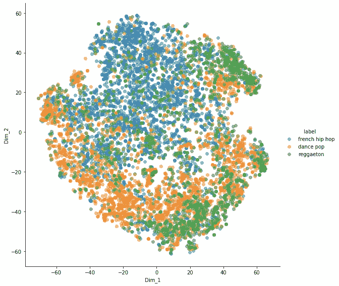

正如你所注意到的，SNE 霸王龙试图将不同的点分开，并将相似的点聚集在一起。

**音频特征雷达图:**

这是 3 种类型的雷达图。我们可以比较它们的音频特征，例如法国 hip hop 具有最高的语音值。音频功能在绘图前已标准化。

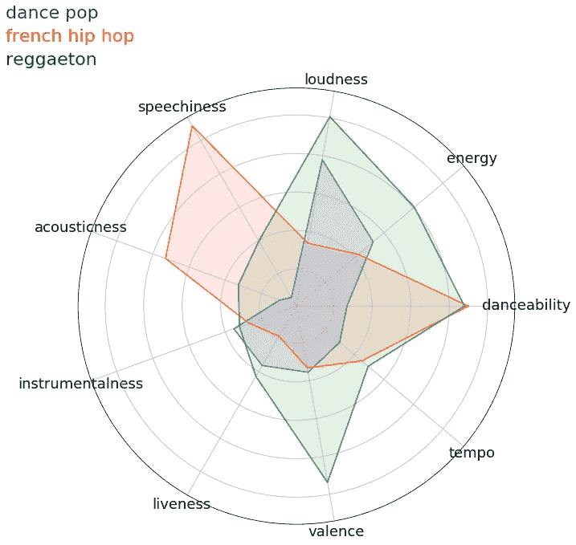

**利用逻辑回归和线性 SVM 的体裁分类:**

让我们看看机器学习算法使用音频特征进行流派分类的效果如何。我选择了 3 个流派的所有歌曲(流行舞曲、法国嘻哈音乐和雷鬼音乐)。我用 OneVsRest 分类器和线性 SVM 应用了逻辑回归，两者都在 alpha 上调整了超参数。

我在随机选择的 70%数据(训练数据)上训练模型，并在剩余的 30%测试数据上用 5 重交叉验证(cv=5)测试其准确性。我在阿尔法上做了超参数调整，也应用了线性 SVM。

逻辑回归模型表现稍好，准确率为 70.1%。微观平均 F1 分数被用作性能指标。我将在下一篇博客中讨论这个话题的细节。我们在这里可以得出的结论是，音轨的音频特征是将歌曲分类到其各自流派的重要属性。

**代码片段:**

感谢您的阅读！我希望你喜欢这篇文章。如果你想了解我的文章，请关注我。

快乐聆听！🎧

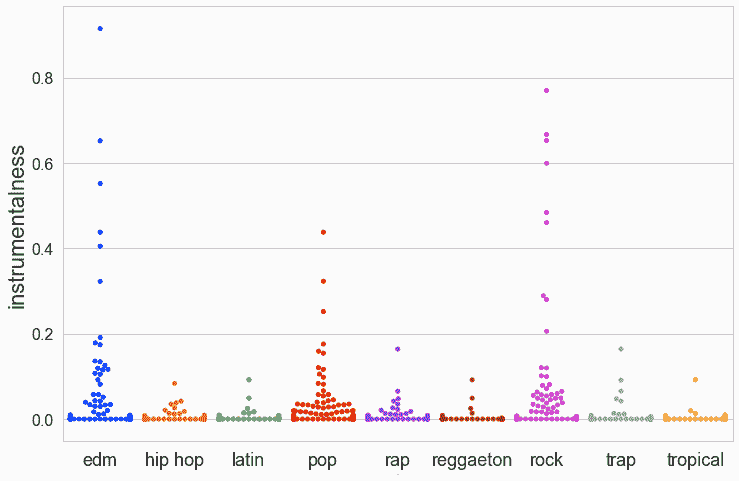

**参考文献:**

 [## 一个机器学习对我的 Spotify 数据的深度挖掘。-开放数据科学-人工智能的新闻来源…

### 这是我们关于使用无监督和有监督机器学习技术的两部分系列的第二篇文章…

opendatascience.com](https://opendatascience.com/a-machine-learning-deep-dive-into-my-spotify-data/)  [## 欢迎来到 Spotipy！- spotipy 2.0 文档

### 编辑描述

spotipy.readthedocs.io](https://spotipy.readthedocs.io/en/2.11.2/)  [## 获取音轨的音频功能|面向开发者的 Spotify

### 需要路径参数授权。来自 Spotify 帐户服务的有效访问令牌:参见 Web API…

developer.spotify.com](https://developer.spotify.com/documentation/web-api/reference/tracks/get-audio-features/)  [## Spotify 的“这是”播放列表:50 位主流艺术家的终极歌曲分析

### 每个艺术家都有自己独特的音乐风格。从献身于木吉他的艾德·希兰，到德雷克…

towardsdatascience.com](/spotifys-this-is-playlists-the-ultimate-song-analysis-for-50-mainstream-artists-c569e41f8118)  [## Python Seaborn 初学者教程

### 让别人理解你的观点的最好但也是更具挑战性的方法之一是将它们可视化:这样，你可以更多地…

www.datacamp.com](https://www.datacamp.com/community/tutorials/seaborn-python-tutorial#sm)  [## Matplotlib | FC Python 中的雷达图

### 在足球分析和视频游戏中，雷达图已经在许多地方得到普及，从国际足联系列…

fcpython.com](https://fcpython.com/visualisation/radar-charts-matplotlib)  [## Spotify 音乐分析

### 使用 Kaggle 笔记本探索和运行机器学习代码|使用来自 Spotify 歌曲属性的数据

www.kaggle.com](https://www.kaggle.com/aeryan/spotify-music-analysis)