# 基于县的新冠肺炎数据集和分析趋势

> 原文：<https://towardsdatascience.com/county-based-covid-19-dataset-and-analytical-trends-ff1617030ba8?source=collection_archive---------69----------------------->

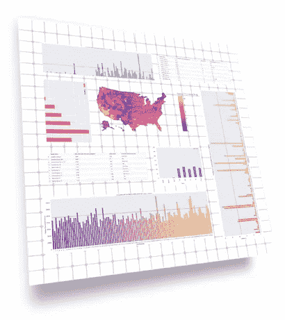

县级，新冠肺炎数据科学( [Kabir Moghe](https://towardsdatascience.com/@kabirmoghe) ，2020)

***来自《走向数据科学》编辑的提示:*** *虽然我们允许独立作者根据我们的* [*规则和指导方针*](/questions-96667b06af5) *发表文章，但我们不认可每个作者的贡献。你不应该在没有寻求专业建议的情况下依赖一个作者的作品。详见我们的* [*读者术语*](/readers-terms-b5d780a700a4) *。*

作为一名关心学年和大学体育运动的高三学生，我很好奇新冠肺炎对特定县的影响。许多关于学年、室内运动和口罩要求的决定都是在当地做出的，但我意识到没有简单的方法来探索和分析县数据。总的来说，捕捉病毒影响的数据集和可视化数据并不缺乏，无论是来自约翰霍普金斯大学还是疾病预防控制中心。《纽约时报》也发表了令人印象深刻的分析历史数据的作品，麻省理工学院的德尔福项目构建了一个深度模型来预测未来几个月的趋势。然而，这些研究和数据集通常以国家或州为重点，对于县一级的分析来说过于粗略。

在过去的几个月里，我一直致力于在县一级汇编一个粒度数据集，它汇集了来自各种来源的不同属性。我的目标是提供有用的信息，帮助县工作人员、学校管理人员、政府官员以及家长和学生简化决策过程。虽然还有很多工作要做，但迄今为止，我已经搜集了在线资源并补充了许多新属性，以创建一个全面的县级新冠肺炎数据集，其中包含美国 3144 个县中的 3106 个县的信息。(除了少数缺乏完整信息的县，99%的县都包括在内。)

该数据集将每日新冠肺炎数据组织成每月每个县的新增病例和死亡人数，以及死亡率和死亡率，但它还包括每个县的重要属性:人口密度、教育、种族构成等。数据集是自我更新的，每天都有新的信息输入，它和代码本身都可以在这里访问。

总体而言，数据集包括以下内容:

*   FIP 代码和县
*   每月新新冠肺炎病例
*   新新冠肺炎每月相关死亡人数
*   感染率
*   致死率
*   人口
*   失业人口的百分比
*   家庭收入中位数
*   近似人口密度(根据面积和人口计算)
*   种族人口统计
*   教育水平
*   社交距离政策，特别是全州范围内的面具规定(“是”、“否”或“某些部分”)

用于创建上述属性的数据来自各种来源(USAFacts、美国农业部、人口普查网站、masks4all 和 ArcGIS)，所有这些都在底部链接。

# 分析学

用户可以多种方式利用数据集。可视化图表很简单，数据集还包括 FIP 代码，这使得在县和州级别上创建地图变得很容易。下面是一个示例，其中为数据集中包含的 3106 个县绘制了 8 月份的新病例。显示了病例的自然记录(即 48，505 个病例映射到 10.8)，以强调各县之间的差异。(空白点是数据集未包括的县。)

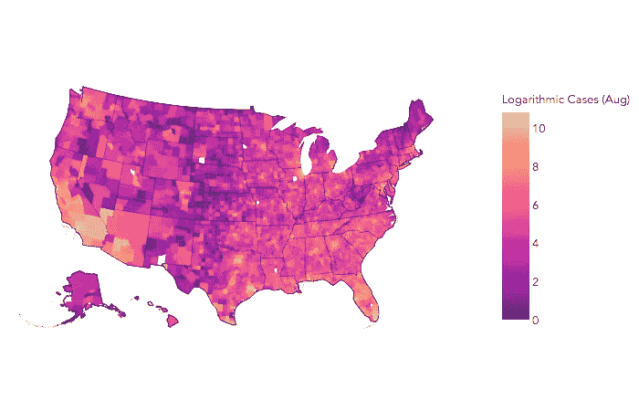

每个县都显示了 8 月份新增病例的自然对数(0-10.9 分)。

该地图描绘了 2020 年 8 月每个县的新感染水平的彩色编码趋势。例如，洛杉矶县显示了较高的感染人数，因此我们可以进一步探索其趋势。尽管该地图仅描述了病例，但数据集也包含了死亡信息。下图显示了洛杉矶县每月的病例和死亡人数。

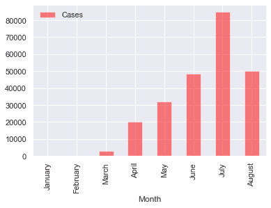

加利福尼亚州洛杉矶县每月案例

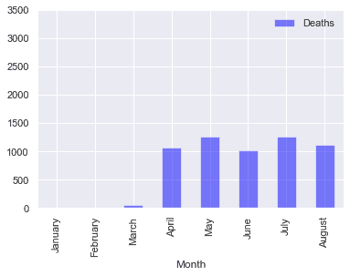

加利福尼亚州洛杉矶县每月死亡人数

我们可以更深入地挖掘和分析县的具体属性如何可能或可能不与新冠肺炎的影响相关。在以下各节中，研究了 2020 年 8 月的影响，但该框架可以扩展到一组特定的月份或更长的时间段(即过去 3 个月与过去 6 个月)。

# 新冠肺炎教对少数民族的影响

为了了解少数民族如何受到新冠肺炎的影响，我将数据集分类为**本月感染率最高和最低的前 100 个县，分别用 C-max 和 C-min 表示，**并绘制了新冠肺炎对这些县各种种族人口统计的影响。

(注:在本节和以下各节中，我使用了**加权** **平均值**作为集中趋势的主要衡量指标，由下图中的水平线表示，以说明各县之间的人口差异，而不是使用常规平均值或中值，这可能会扭曲数据。对于每个属性，我将各县的单个属性乘以其各自的人口，并计算这些新的缩放数字的总和，然后除以各县的总人口，以获得加权平均值。)

## C-max 和 C-min 县的非裔美国人百分比与感染率

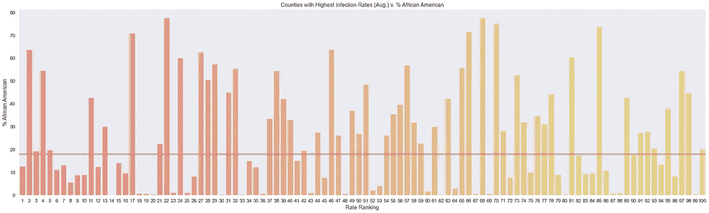

C-max 县

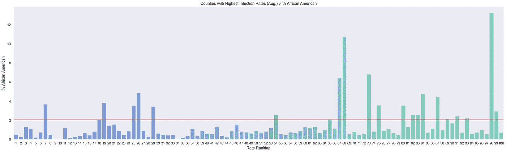

C-min 县

平均而言，3106 个县平均有 13%的非裔美国人。然而，在 C-max 县，非裔美国人平均占人口的 18%，而在 C-min 县，非裔美国人仅占人口的 2.1%:**相差近 9 倍。**

## C-max 和 C-min 县的西班牙裔百分比与感染率

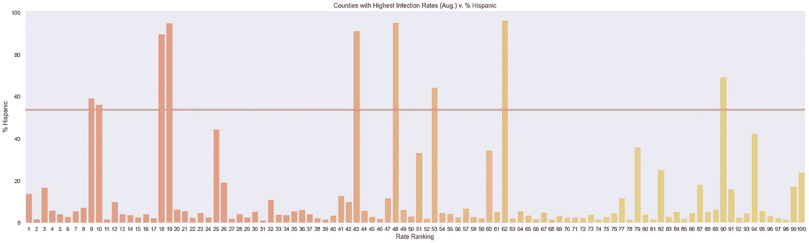

C-max 县

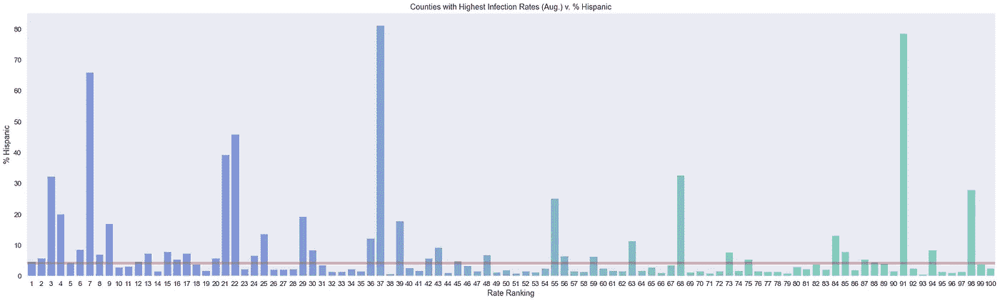

C-min 县

在美国各地，数据集中的县平均约有 19%是拉美裔。我们在 C-max 县看到这个数字的巨大跳跃，在那里西班牙人占人口的 54%。相比之下，C-min 县的拉美裔占 4.2%，也就是说**感染率最高的县的拉美裔是感染率最低的**县的 13 倍。

## C-max 和 C-min 县的白人百分比与感染率

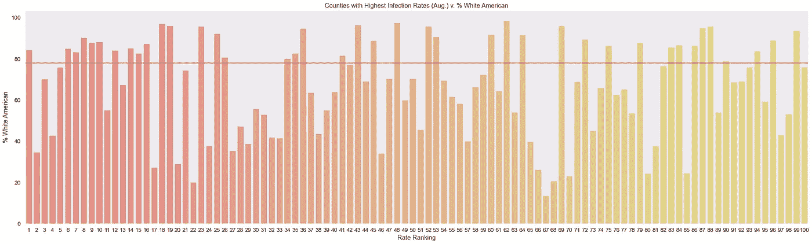

C-max 县

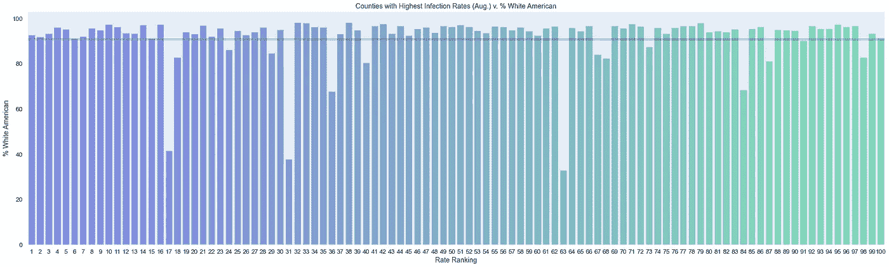

C-min 县

另一方面，美国白人占 C-max 县人口的 78%，与 77%的全国加权平均水平相似。然而，有趣的是，C-min 县几乎全是白人，平均 91%: **与少数民族的相关性相反**。

简而言之，数据显示对少数民族，特别是非洲裔美国人和西班牙裔美国人高度集中的社区产生了不成比例的影响。此处也提供了其他少数族裔群体(即美洲原住民、亚裔美国人)的可视化数据[，尽管它们并未显示出与感染率的显著相关性。](https://github.com/kabirmoghe/COVID-19-Dataset)

# 新冠肺炎和其他县属性

除了种族之外，该数据集还允许我们探索新冠肺炎的影响如何与其他县的属性相关联。(下面，我指的是我在上面使用的与种族相同的 C-max 和 C-min 县。)

## C-max 和 C-min 县的教育与感染率

数据集中的教育启发由每年获得大学同等学力或大专文凭(在县一级)的人的大致百分比决定。下面，您可以看到 C-max 和 C-min 县各自的试探法。

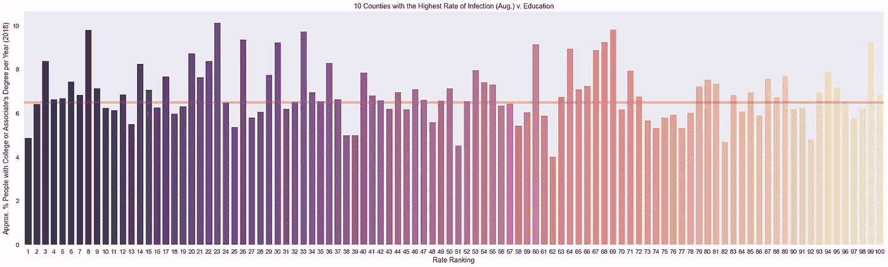

C-max 县

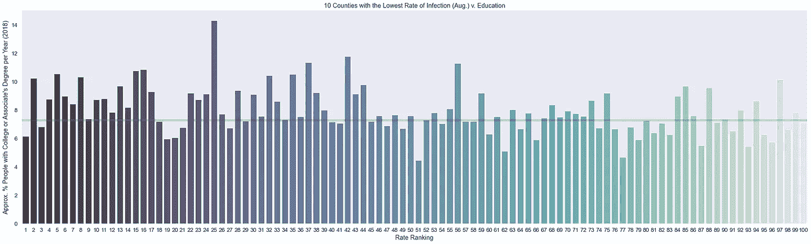

C-min 县

在 C-max 县，教育指标平均为 6.5%，在 C-min 县，约高出 0.8%，为 7.3%。这可能意味着这种启发和感染率之间可能存在相关性，但肯定需要进一步的研究来验证这一点。

## 人口密度

使用 C-max 和 C-min 县作为 x 轴，我在下图的 y 轴上绘制了近似的人口密度(每平方英里的人口数)。

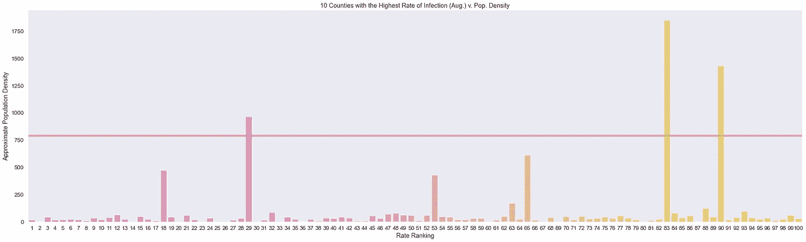

C-max 县

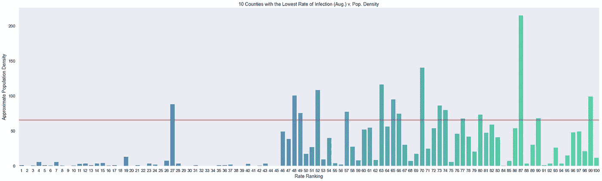

C-min 县

C-max 县的平均人口密度为每平方英里 791 人，而 C-min 县仅为 66 人，这意味着**感染率和人口密度**之间存在明显的相关性。

## 收入

作为收入的衡量标准，我使用了中等家庭收入，这是我为 C-max 和 C-min 县绘制的图表。

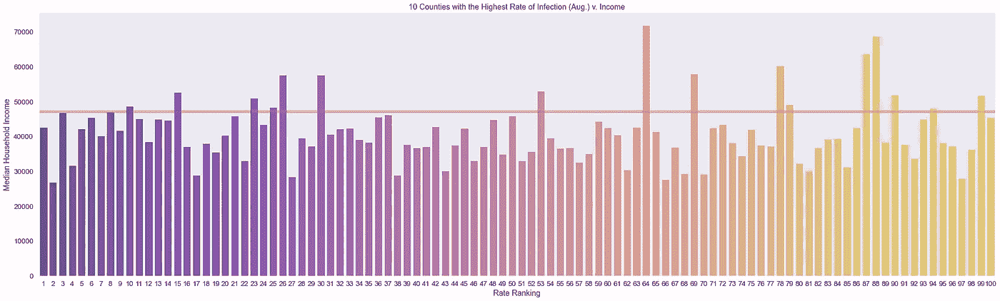

C-max 县

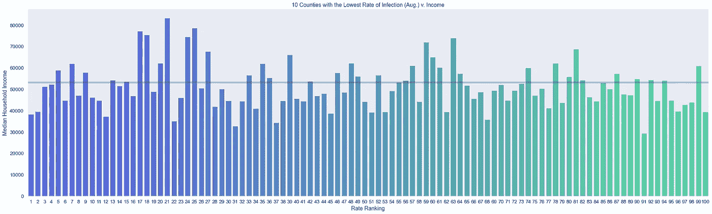

C-min 县

C-max 县的平均收入为 47 138.10 美元，而 C-min 县的收入约为 53 235.80 美元:相差 6 097.70 美元。虽然这可能表明感染率较低的县比感染率高的县收入高，但数据的差异不足以让我们确定收入是否确实在感染率中起作用。

## 失业

为了确定各县的失业率，我收集了最新的数据，并与 C-max 和 C-min 县进行了比较。

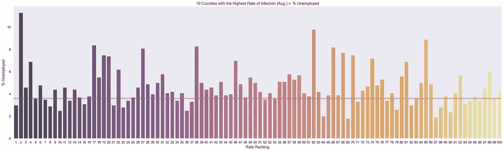

C-max 县

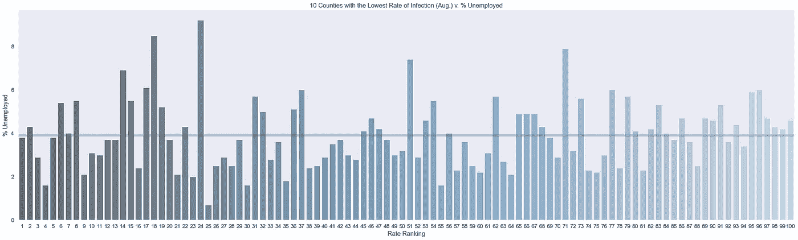

C-min 县

C-max 县和 C-min 县的平均失业率分别为 3.6%和 3.9%。尽管这可能看起来与人们的预期相反，但同样，像这样的小规模差异不能单独决定失业率和感染率之间是否存在相关性。

## 掩模要求

虽然目前没有关于县级口罩需求的数据，但有全州范围内的数据。在下面的表格中，我将 C-min 县和 C-max 县的感染率放在一起，为了简单起见，每个县都减少到 10 个县。

此外，对于 C-min 县，我使用了阳性感染率**最低的 10 个县**来关注口罩相关政策实际上可能对感染产生影响的县。

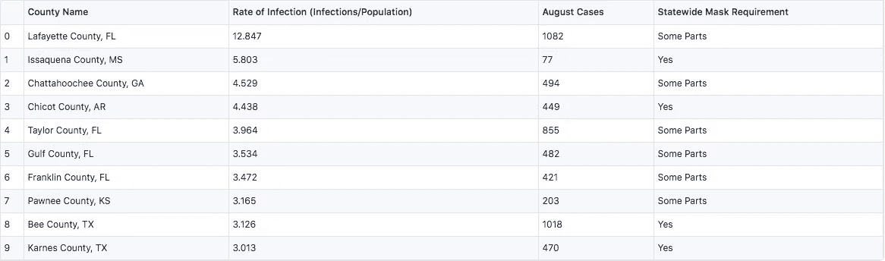

C-max 与全州面罩要求

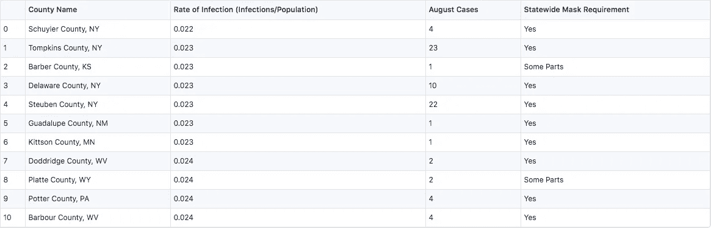

C-min 与全州面罩要求

在 C-max 县中，4 个县有全州范围的口罩要求，其他 6 个县是仅在部分地区要求口罩的州的一部分。另一方面，10 个 C-min 县中有 8 个要求戴口罩，而包含另外 2 个县的州在某些地方要求戴口罩。虽然这似乎不是一个值得注意的差异，但我们需要在做出声明之前进一步解读一些国家的“某些部分”特征。

如果我们看看 C-max 县，根据 [WBSTV](https://www.wsbtv.com/news/local/full-list-what-counties-cities-are-requiring-face-masks/VJQ3BQH2TBEMZICWXZQ5DIM5XE/) 、[密西西比州今日](https://mississippitoday.org/2020/07/09/as-cases-surge-governor-mandates-masks-in-13-counties/)、[县口罩](https://www.kansaschamber.org/county-face-masks/)和[佛罗里达州政治](https://floridapolitics.com/archives/342364-beyond-the-veil-what-face-mask-requirements-are-in-place-in-florida)的报道，在“某些部分”有全州范围口罩要求的县完全被排除在强制规定之外，所以 10 个县中有 6 个根本不需要口罩。然而，在 C-min 县，普拉特县(WY)和巴伯县(KS)都很小，不需要口罩，很可能是因为他们缺乏病例(根据 [AARP](https://www.aarp.org/health/healthy-living/info-2020/states-mask-mandates-coronavirus.html#:~:text=Nebraska,-Statewide%20order%3A%20No&text=Masks%20are%20required%20for%20both,general%20population%20when%20in%20public.) 和[县口罩](https://www.kansaschamber.org/county-face-masks/))。一般来说，**感染率最高的县有 60%不需要口罩，阳性率最低的县有 80%需要口罩**。

一般来说，教育、收入、失业和口罩需求等县属性仅表现出与感染率的名义关系，值得进一步研究。然而，人口密度似乎与感染率密切相关，这进一步证明了人与人之间的距离确实会影响新冠肺炎病毒的传播。

# 结论

我希望该数据集对郡工作人员、学校管理人员和公共卫生官员有用，让他们更好地了解趋势和郡属性，从而确定风险并做出与新冠肺炎相关的适当决策。数据集将每天更新，除了可视化，数据还将作为方便用户的工具发布在网站上。将来，我计划在县一级拟合一个模型来帮助预测未来的新冠肺炎数据。如果有任何想法或意见，请在 kabirmoghe@gmail.com[留言给我！](mailto:kabirmoghe@gmail.com)

## **参考文献:**

[1]约翰·霍普金斯大学医学系，[新冠肺炎美国各县病例](https://coronavirus.jhu.edu/us-map) (2020)，约翰·霍普金斯冠状病毒资源中心

[2]美国疾病控制和预防中心，[美国疾病控制和预防中心 COVID 数据追踪器](https://covid.cdc.gov/covid-data-tracker/) (2020)，美国疾病控制和预防中心

[3]《纽约时报》，[冠状病毒在美国:最新地图和病例统计](https://www.nytimes.com/interactive/2020/us/coronavirus-us-cases.html) (2020)，纽约时报

[4]麻省理工学院， [COVIDAnalytics](https://covidanalytics.io/) (2020，COVIDAnalytics

[5] USAFacts 研究所，[美国冠状病毒病例和死亡](https://usafacts.org/visualizations/coronavirus-covid-19-spread-map/) (2020)，USAFacts

[6]美国农业部，[县级数据集](http://www.ers.usda.gov/data-products/county-level-data-sets/) (2020)，美国农业部经济研究局

[7]美国人口普查局，[/programs-surveys/popest/datasets/2010–2019/counties/asrh 索引](https://www2.census.gov/programs-surveys/popest/datasets/2010-2019/counties/asrh/) (2020)，美国商务部

[8] ArcGIS Hub，[县](http://hub.arcgis.com/datasets/usdot::counties/data?geometry=107.191%2C-16.811%2C-106.560%2C72.126) (2020)，ArcGIS Hub

【9】Howard，Jeremy，et al .[美国哪些州要求在公共场合戴口罩？](https://masks4all.co/what-states-require-masks/) (2020)，#Masks4All

[10]WSBTV.com 新闻工作人员，[完整列表:哪些城市和县要求戴口罩？](https://www.wsbtv.com/news/local/full-list-what-counties-cities-are-requiring-face-masks/VJQ3BQH2TBEMZICWXZQ5DIM5XE/) (2020)，北京电视台

[11] Harrison，Bobby 等人，[随着病例激增，州长在 13 个县强制推行口罩](https://mississippitoday.org/2020/07/09/as-cases-surge-governor-mandates-masks-in-13-counties/) (2020)，今天的密西西比州

[12]堪萨斯商会，[郡面面具—堪萨斯商会](https://www.kansaschamber.org/county-face-masks/) (2020)，堪萨斯商会

[13]雅各布·奥格尔斯(Ogles，Jacob)，[面纱之后:佛罗里达州对戴口罩有什么要求？](https://floridapolitics.com/archives/342364-beyond-the-veil-what-face-mask-requirements-are-in-place-in-florida) (2020)，佛罗里达政治

[14]马克维茨，安迪，[各州面罩要求指南](https://www.aarp.org/health/healthy-living/info-2020/states-mask-mandates-coronavirus.html#:~:text=Nebraska,-Statewide%20order%3A%20No&text=Masks%20are%20required%20for%20both,general%20population%20when%20in%20public.) (2020)，美国退休人员协会