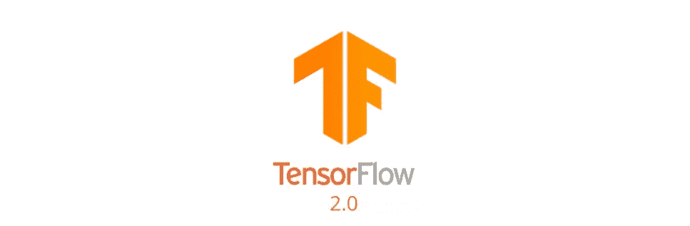

# TF 2.x 中的 Coursera DL 专业化课程

> 原文：<https://towardsdatascience.com/coursera-dl-specialization-course-in-tf-2-x-18a1189e2a4?source=collection_archive---------24----------------------->

## Coursera 课程转换为 TF 2.x

TF 2.x 是新的规范！

[deeplearning.ai](http://deeplearning.ai) (可在 Coursera 上获得)的深度学习专业化非常出色，我会向任何对这一领域感兴趣的人强烈推荐它。在本课程中，首先学习如何在没有任何库的情况下从头开始编写神经网络代码，然后继续学习 TensorFlow 库的高级功能。不幸的是(在撰写本文时)所有的编码练习都是在 TF < 2.0 中实现的。在不久的将来，TF 2+将成为标准，TF 2.x 与 TF1 有很大的不同。大多数练习都需要完全重写代码。

由于本课程的编程练习非常出色，我决定将练习版本 2.x 兼容。我在下面([链接](https://drive.google.com/drive/folders/1a9A9O04ODfYJgslYbklFqR58GDuoOeYQ?usp=sharing))维护练习转换后的 TF2.x 代码。这篇文章假设读者对 TF 有些了解。

在这篇博文中，我将回顾将 TF1.x 代码(尤其是本课程中的代码)转换成 TF2+代码的基础知识。我已经在 TF1=( [链接](https://github.com/sol0invictus/Blog_stuff/blob/master/DL%20Coursera/TF%201.x/TensorFlow_Tutorial_v3b.ipynb))和 TF2 =( [链接](https://github.com/sol0invictus/Blog_stuff/blob/master/DL%20Coursera/TF%202.x/TensorFlow_20_version.ipynb))的第 7 周练习中实现了深度神经网络。下面我将解释两种代码的一些关键区别。其他练习的 TF2+版本请访问我的 Github repo : ( [链接](https://drive.google.com/drive/folders/1a9A9O04ODfYJgslYbklFqR58GDuoOeYQ?usp=sharing))

> **1) *Session()消失=进入急切执行***

让我们首先看看下面的简单代码片段，它计算 TF 1.x 中的平方误差损失，

TF2+摆脱了会话和图形构建。在 TF 1.x 中，你通常会定义变量之间的关系(创建一个图),然后一个会话执行路径。***session . run()***以输入为参数运行路径，并输出输出。在 TF2+中，默认情况下启用快速执行。这意味着变量是自动和并发执行/计算的，而不需要会话/图形。

转换后的 TF 2+代码为:

**区别:**不需要创建会话对象或者***TF . GLO abal _ variable _ initializer()***。解释器一点击 ***loss=*** 命令，就执行。

> **2)急切执行(另一个例子)**

这里我将使用 TF1 和 TF2+实现两个张量(标量)的乘法。

TF 1.x 中的乘法

c 在通过 ***tf.session()*** 运行时，只会输出一个张量(20)。在 TF2+中，缺省情况下启用急切执行，下面的代码将自动输出一个张量(20)。

TF 2.x 中的乘法

> **3)占位符不见了**

占位符是 ehh..TF <2\. They are basically a container for input variables. These have been removed in TF2+. Let us first look at this example of a function that calculates the sigmoid of input variables/tensor. Here x is a placeholder variable that stores the argument of the function and then sigmoid is acted on it.

Placeholder in TF 1.x

In TF2+ placeholders are not required and sigmoid can be directly applied to the input variable.

Working without placeholder in TF2.x

> **4)中的井占位变量执行梯度下降**

如果使用 ***tf.keras*** 建立模型，可以直接使用 ***tf.train()*** 用预定义的损失函数训练你的数据集。然而，要定制任何东西，你必须从头开始实现梯度下降。让我们首先回顾 TF < 2 中的梯度下降。

TF1.x 中的梯度下降

撇开所有的 ***。session()*** 业务梯度下降通过***TF . train . adamoptimizer(learning _ rate = learning _ rate)实现。*** 最小化(成本)功能。 ***最小化*** 功能尝试最小化自变量，并相应地调整参数。在 TF2+最小化功能不存在，需要在低得多的水平上实现梯度下降。这给了整个过程更多的控制。

TF2.x 中的梯度下降

我们首先定义一个函数(***【get _ grad()***)来计算参数的梯度。此功能使用**的 *tf。GradientTape()*** 用于梯度的自动微分和计算。关于它的更多细节可以在:[链接找到。](https://www.tensorflow.org/guide/eager#computing_gradients)我们使用函数应用渐变:***optimizer . apply _ gradients(zip(grads，list(parameters . values())))***。这基本上是对 ***的啰嗦替换。最小化*功能。**

> **5)其他细微变化**

除了下面这些，还有很多小的改变，比如重新安排库。让我列举一些简单的例子

a)所有预定义的图层都被移动到:
***TF . keras . layers . ****

b)一些数学功能移入子类:
***TF . math . ****

c)更多信息请访问:[https://www.tensorflow.org/guide/migrate#top_of_page](https://www.tensorflow.org/guide/migrate#top_of_page)

> ***底线***

本文的目的是提供 TF <2 and TF2+ especially focusing on Coursera Deep Learning Specialization. I have converted all the exercises of the specialization into TF2+ code and have uploaded them on ( [link](https://drive.google.com/drive/folders/1a9A9O04ODfYJgslYbklFqR58GDuoOeYQ?usp=sharing) 之间代码差异的快速总结。我希望这个博客是有用的

> ***参考文献***

1.  关于移民的 TF 文件:【https://www.tensorflow.org/guide/migrate#top_of_page】
2.  TF2 DL 专精:
    [https://drive . Google . com/drive/folders/1a 9 a9 o 04 odfyjgslybklfqr 58 gduooeyq？usp =共享](https://drive.google.com/drive/folders/1a9A9O04ODfYJgslYbklFqR58GDuoOeYQ?usp=sharing)