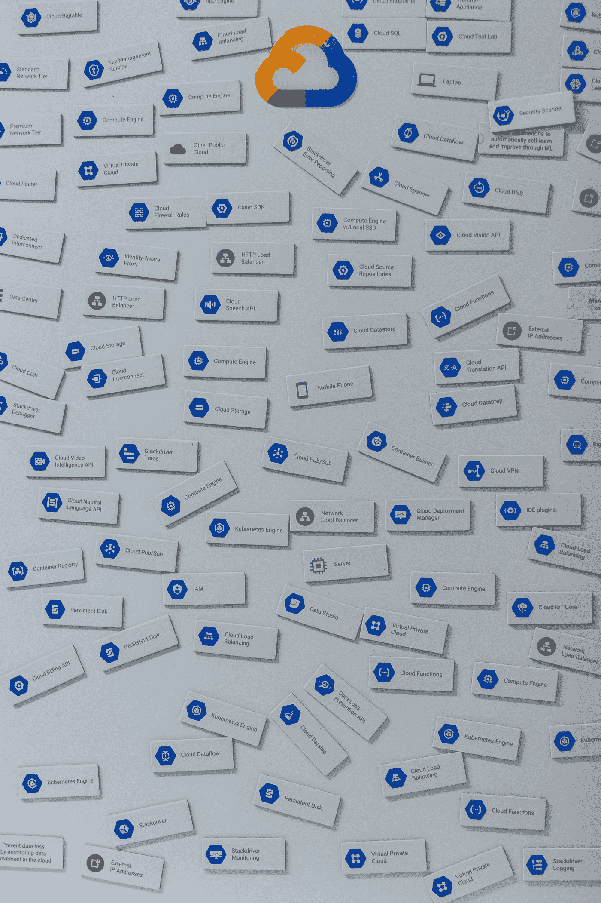
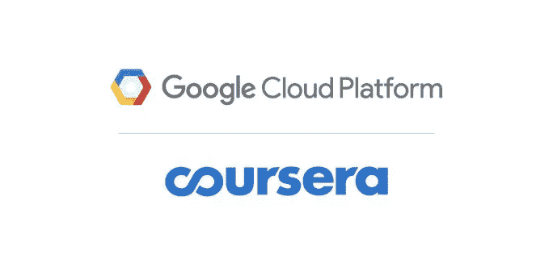

# Coursera 的 GCP 专业证书数据工程:更好的内容还是更好的营销？

> 原文：<https://towardsdatascience.com/courseras-data-engineering-with-gcp-professional-certificate-better-content-or-better-marketing-6159bc95e7f5?source=collection_archive---------31----------------------->

## 来自最近认证的数据学生的诚实评论

照片由[米切尔罗](https://unsplash.com/@mitchel3uo?utm_source=medium&utm_medium=referral)在 [Unsplash](https://unsplash.com?utm_source=medium&utm_medium=referral)

*(注:所有观点均为本人)*

# 介绍

我最近参加并完成了由 GCP 在 Coursera 上提供的谷歌云专业证书 组成的 [**数据工程的 5 门主要课程(链接到证书**](https://www.coursera.org/specializations/gcp-data-engineering)**[这里](https://www.coursera.org/account/accomplishments/specialization/certificate/Y2Q84UMZVHA9)**

我一直想在 2020 年 Covid 疫情期间提升云技术技能，因此当我发现 GCP 在著名的电子学习平台上发布了一个大规模目录时，我抓住了参加这一系列课程的机会。

来源:谷歌云

# 总体体验

参加证书考试绝对是一次积极的经历，让我对 GCP 数据栈的一个很好的部分有了坚实的概念理解，并允许我亲自参与个人项目，我写了一篇相关的文章( [**如何使用 API 和 Google Cloud**](/how-to-automate-financial-data-collection-with-python-using-tiingo-api-and-google-cloud-platform-b11d8c9afaa1) 用 Python 自动收集金融数据)。

尽管如此，我觉得整个课程和课程结构的真正目的更多的是围绕向潜在的企业客户推销 GCP 套件，而不是培养学生对该工具及其潜在应用的深入理解。

我认为这对于一个组织来说是非常好的，事实上有许多软件公司利用他们的培训项目来推动采用和公司合作。我确实参加了 AWS、Tableau 和 Alteryx 等公司的课程，列举了分析领域一些非常著名的提供商，这些公司自然都在努力增加其工具的市场份额，并将培训计划和认证工作作为实现这一目标的额外途径。

然而，对于 GCP Coursera 的目录，我感到有点吃惊，因为我经常看到这种总体营销努力从后门偷偷溜进来，夺走了一门原本令人惊叹的课程的深度、内容和学习重点。

当一位同事在谷歌云平台专业化 **(** 也是 GCP Coursera 目录的一部分)上使用 TensorFlow 进行 [**机器学习时，他对他所覆盖的课程表达了类似的抱怨，这进一步证实了这一观点。**](https://www.coursera.org/specializations/machine-learning-tensorflow-gcp)

需要强调的一个重要方面是，大多数学生对在线课程的质量和享受程度的看法主要取决于两个因素:

1.  学生在参加课程之前在该科目上的技术能力水平
2.  学生选修这门课程的内在动机

考虑到这一点，我也有可能不适合最适合利用学习资源并从课程中获得最大程度的知识和乐趣的学生。从这个意义上来说，我并不是一个成功的 AWS 数据工程师，我并没有试图将 GCP 加入到我可以合作的云提供商的名单中，因此，也许我没有掩盖许多其他入门级别的课程和实验，在这些课程和实验中，我发现上面提到的营销工作有点太过侵扰。

为了让你自己判断，我在下面总结了如果你决定在 Coursera 上参加 GCP 的数据工程专业证书考试将会发生什么，以使你能够决定是否继续进行时间和投资(*39/月订阅直到完成-价格可能会根据你所在的位置*而有所不同)

# 结构和课程主题

GCP 数据工程专业证书分为 6 门课程，为期 2 周(指示性期限)。课程列表如下:

1.  [**谷歌云平台大数据与机器学习基础**](https://www.coursera.org/learn/gcp-big-data-ml-fundamentals?specialization=gcp-data-engineering)

**2。** [**用 GCP 实现数据湖和数据仓库的现代化**](https://www.coursera.org/learn/data-lakes-data-warehouses-gcp?specialization=gcp-data-engineering)

**3。** [**在 GCP 建设批量数据管道**](https://www.coursera.org/learn/batch-data-pipelines-gcp?specialization=gcp-data-engineering)

**4。** [**在 GCP 上构建弹性流分析系统**](https://www.coursera.org/learn/streaming-analytics-systems-gcp?specialization=gcp-data-engineering)

**5。** [**智能分析、机器学习、AI 上 GCP**](https://www.coursera.org/learn/smart-analytics-machine-learning-ai-gcp)

**6。** [**备考谷歌云专业数据工程师考试**](https://www.coursera.org/learn/preparing-cloud-professional-data-engineer-exam)

作为先决条件，谷歌的团队建议拥有*“大约一(1)年以下一项或多项经验:*

*   *SQL 等通用查询语言*
*   *提取、转换、加载活动*
*   *数据建模*
*   *机器学习和/或统计*
*   *用 Python 编程*

事后看来，可以公平地说，即使你对上述所有要点有了较高的认识，你也应该能够跟上并完成整个课程，因为你不会进行深入的机器学习或建模。了解这些概念确实有助于更好地理解 GCP 如何使您能够使用其堆栈和服务来服务于您的项目目的，并将其服务与市场上其他主要的云提供商进行比较。

总的来说，专业证书在 Coursera 上被归类为中级系列，我想大概就在这里。

# 赞成者

1.  **品牌名称和职业机会**

在 GCP 完成认证有明显的职业好处，可以打开许多项目和就业机会。在咨询行业，随着谷歌在与 AWS 和微软 Azure 日益激烈的云市场份额争夺战中推进其在该平台的投资，客户项目越来越多地需要 GCP 技能熟练的从业者。

甚至在某些情况下，你需要获得 GCP 认证才能参与某个项目(如果你在该领域活跃的大型咨询公司工作，并且该公司可能已经制定了这样的资源政策)。在这种情况下，如果你热衷于参与其中，在谷歌云中获得认证真的可以让你与众不同。

展示您的证书表明您已经对学习该平台产生了浓厚的兴趣，以便作为云从业者迈出第一步，他们可以通过为各种公司和项目构建数据管道来增加价值。

**2。动手实验**

通过 Coursera 分发的这一证书和其他 GCP 证书有一个很大的好处，即通过让学生积极参与实验任务，让你学习平台的架构、用户界面和组件，学生可以通过**Q**[**wiki labs**](https://www.qwiklabs.com/)平台参与实验任务。

所有课程主题都包含在实验中，这给了你一个熟悉产品并开始构建解决方案的机会。

学习团队在为您提供有效完成实验所需的所有信息和资源方面做得很好，对我来说，这是证书最令人兴奋的方面，因为它在将理论和实践结合在一起方面使体验变得非常互动和有凝聚力。

**3。足够的知识，通过 GCP 的免费等级账户开始个人项目**

如果实验室仍然不能让你满意，你想直接构建自己的解决方案，那么你可以通过注册一个 GCP 免费层帐户(你可以使用你现有的谷歌帐户来注册)来立即开始，并利用[大量免费资源](https://cloud.google.com/free)来立即玩。

在这方面，数据工程专业证书是一个很好的方法，可以向学生灌输足够的知识，让他们直接在 GCP 控制台中从事自己的项目。

你甚至可以中途停下来，自己开发一些东西，然后回到 Coursera 的资源上，继续你的学习，推进你的个人项目。

**4。GCP 专业数据工程师考试优秀备考**

如果你真的想重新学习技能并获得谷歌云专业认证，那么 Coursera 的证书是成功通过谷歌云专业数据工程师考试的绝佳准备资源。该系列的课程 6 实际上完全致力于给你成功通过考试的提示。

这项考试是公认的作为数据工程师熟练使用 GCP 控制台的官方行业标准，肯定比简单地参加 Coursera 上的专业证书更能促进你的职业前景。

# 坏处

1.  **缺乏深度**

这些课程很好地向你概述了在 GCP 成为一名有效的数据工程师所需的主要工具，但我更希望看到一些更深入的探讨和某些数据工程主题的更强的概念化。

相反，课程的一些相关部分从 GCP 工具跳到 GCP 工具，没有必要详细查看每一个工具以及它们如何在一个潜在的项目中组合在一起。

因此，肯定需要通过其他资源整合一些相关知识，因为你将从这个专业证书中对工具 X 和工具 Y 的功能有一个很好的了解，但很可能必须开始自己构建，以建立一个更好的不同部分如何适应 GCP 控制台难题的理论意识。

**2。不一致的课程**

作为一名数据工程证书，我原本希望材料只关注数据摄取、处理、自动化和流程等主题，而不是偶尔与处理机器学习或数据可视化的 GCP 工具(如 AutoML 和 Data Studio)一起展示。

如果我想学习这些，我会选择他们目录中提供的其他专业证书。相反，有一整个课程(课程 5)致力于不太相关的主题，以及更多的视频分钟，旨在展示谷歌在控制台中的人工智能能力。

总的来说，我真的看不出一个合适的，最重要的是，浏览那些与未来的数据工程师不太相关的材料是有好处的，这些材料从最重要的概念中带走了更多的深度。

**3。偶尔不要脸的自我推销**

如果你一直读到现在，你可能会发现这是对我来说最有问题的方面；偶然发现名为“*为什么客户重视数据流*”的讲座确实暴露了一个事实，即有些讲座并不是真正针对学生的，而是将观众视为向其销售云解决方案的潜在客户。

这一点与课程缺乏深度有很好的联系，因为重点从深入学习数据工程等转移到展示 GCP 的工具伞和它承诺为客户解决的用例，而不是只关注用户的纯学习体验。

# 定论

总而言之，如果您符合以下条件，我仍然建议您参加本课程:

1.  一位有成就的云开发人员/数据工程师，有兴趣了解 GCP 数据工程堆栈能为您做些什么
2.  希望获得认证并准备 GCP 数据工程师专业考试
3.  从概念角度而非技术角度快速了解 GCP 数据堆栈

如果您符合以下条件，我仍然建议您参加本课程:

*   完成 Coursera 的专业证书后，希望成为一名数据工程师或 GCP 专家
*   寻找对 GCP 的深入了解适用于所有与数据工程相关的事情:从你自己的项目开始，深入研究 GCP 非常详细的文档可能会证明对你更有效。

**访问我的免费数据科学资源清单** [**这里**](https://landing.mailerlite.com/webforms/landing/k1n3r2)

 [## 通过我的推荐链接加入 Medium-Edoardo Romani

### 作为一个媒体会员，你的会员费的一部分会给你阅读的作家，你可以完全接触到每一个故事…

edo-romani1.medium.com](https://edo-romani1.medium.com/membership)