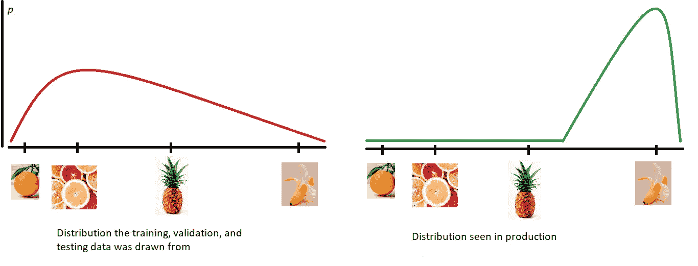
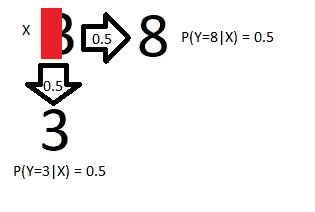
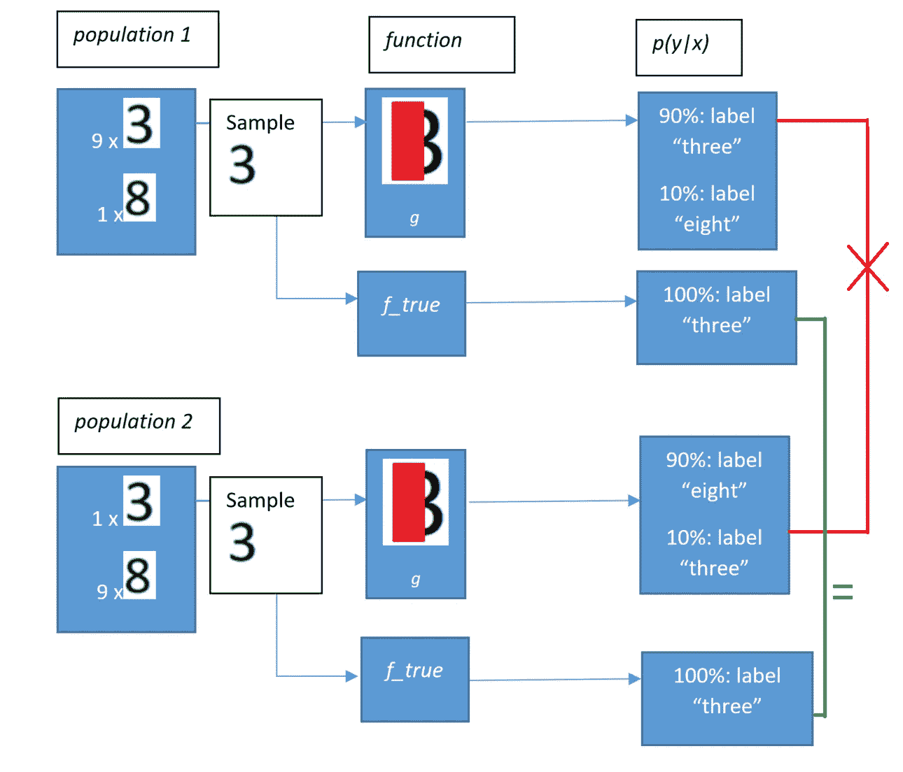
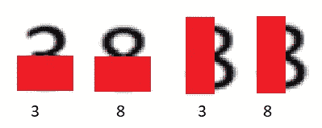
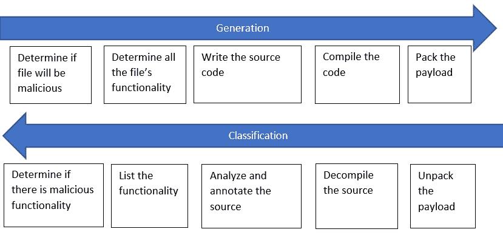
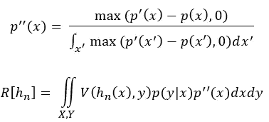
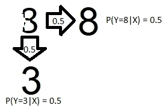

# 恶意软件分类中的协变量转移

> 原文：<https://towardsdatascience.com/covariate-shift-in-malware-classification-77a523dbd701?source=collection_archive---------60----------------------->

## 快速变化环境中的分类器需要超越泛化

在恶意软件分类中忽略 PE 文件的大部分就像在人脸识别中忽略主要的面部特征一样:两者都可能导致性能问题，即使模型的训练误差很小。但是，对于 PE 文件，性能差距可能在测试数据集和真实数据集之间，而不是在训练和测试数据集之间。

# 介绍

[数据生成分布中的协变量移动](https://rtg.cis.upenn.edu/cis700-2019/papers/dataset-shift/dataset-shift-terminology.pdf)降低了泛化误差作为模型性能度量的有用性。通过解包定义，前面的句子翻译成“我们从其采样训练集的文件分布的高精度(不包括训练集本身)并不总是意味着其他重要分布的高精度(即使样本与其标签之间的真实关系没有改变)。”如果一个水果分类器的训练集中只有一个香蕉的例子，那么该分类器在仅包含 10，000 个变异香蕉的样本集上可能表现不佳，即使它在从与其训练集相同的分布中采样的一个保持测试集上表现非常好(在该测试集中，香蕉可能很稀少)。这种性能差距可能是一个问题，因为用一个伸出的测试集来逼近泛化误差是衡量模型性能的标准方法。

在实际的机器学习中，快速变化的输入分布是一个共同的挑战

这一概念对于恶意软件分类至关重要，许多[论文](https://ieeexplore.ieee.org/document/8681127)在采样偏差的背景下讨论了这一概念，其中用于训练的样本不是从与用于测试的样本相同的分布中随机采样的。有趣的是，我曾与许多恶意软件分析师合作过，包括那些几乎没有 ML 经验的分析师，他们的直觉是，具有良好泛化能力的模型在部署后可能会表现不佳——这是由于模型被训练的文件和它扫描的文件之间的差异。然而，并不总是清楚如何识别和修复与协变量移位相关的问题:当良好的泛化能力不够时，提高泛化能力的传统正则化技术可能没有帮助。在花了 5 年时间对恶意软件进行逆向工程和分类(使用传统的、非基于 ML 的技术)后，我对恶意软件分类有了很多直觉，但在我对机器学习产生热情之前，我无法表达这些直觉。我写这篇博客的目的是在机器学习的更正式的背景下解释这些观点。由于一些正式解释的尝试是不精确的(可能是不正确的)，这个博客的另一个目的是征求讨论、反馈和纠正。我加入了许多不同的概念和背景，因为我觉得将概念相互关联有助于增进理解，尤其是如果它们可以与恶意软件分类等实际目标联系起来。

我希望任何对协变移位感兴趣的人都可以从这篇博客中受益，但目标受众是在机器学习方面有一些经验的人，他们希望将其应用于计算机安全相关的任务，特别是“静态”恶意软件分类(我们希望在给定文件在磁盘上的字节数的情况下对文件进行分类，而不运行它)。我希望这篇博客支持的一个关键结论是，将先验知识整合到恶意软件分类模型中的重要性。我相信在分类步骤之前，当讨论模型可能表示其输入的方式时，先验知识是特别相关的。例如，我在本文中详细介绍了一些我认为与 CNN 恶意软件分类模型相关的领域知识:[https://towardsdatascience . com/malware-analysis-with-visual-pattern-recognition-5a 4d 087 c9d 26 # 35f 7-d 78 fef 5d 7d 34](/malware-analysis-with-visual-pattern-recognition-5a4d087c9d26#35f7-d78fef5d7d34)

我在附录中回顾了主要部分中使用的一些核心概念(如归纳偏差、一般化和协变量移位)，提供了额外的背景知识

# 恶意软件分类中的协变量转移

我不认为在大样本集上表现出良好概括能力的模型是无用的。如果一个模型在它被训练的发行版上表现不好，那就是一个问题。安全行业中有大量的经验证据表明，一个能够很好地概括但对输入分布的变化不是非常鲁棒的模型仍然能够提供价值，特别是如果经常重新训练并针对特定的客户环境。然而，在这一点上，行业中使用的许多模型在保留的测试集上表现出高精度。我相信，提高来自重要新发行版的样本的性能，比如在模型被训练一个月后创建的文件，比在测试集准确性上做微小的边际改进具有更实际的影响。接下来的几节将介绍为什么这些新分布是必要的，以及为什么它们是“协变量转移”的一个例子。如果你不熟悉协变量移位的概念，我建议你浏览一下附录中的背景部分。

## 为什么 p(x)会改变

在恶意软件分类的情况下， *p(x)* 是模型分析的二进制文件的分布。实用的恶意软件分类器从未被应用于它们被训练的发行版；他们需要在不断发展的生产环境中的样本集上表现良好。对于许多反病毒软件供应商来说，这意味着对每台装有该反病毒软件的机器上的文件以及提交给 VirusTotal 和 antivirus review 测试等其他服务的样本都要表现良好。概化性能不能很好地预测模型在这些样本上的表现，主要有两个原因:

**样本选择偏差:**在安全行业中，根据模型在部署时遇到的随机选择的文件来训练模型是很少见的。这是因为准确的标签是昂贵的:它通常需要某种程度的人工分析，并且需要访问所有扫描的文件。包含分析师出于其他原因标记的文件是正常的，例如为了客户的直接利益或由第三方提供和标记的文件。如果不涉及人工分析，在多个自动化分析系统之间就有反馈循环的危险。因为我们无法在目标分布的真正随机样本上可行地训练模型，所以样本选择过程是有偏差的。从技术上来说，我们可以通过随机采样扫描仪遇到的文件，并用人类分析师标记它们来解决这个问题，但这将导致一个小样本集，其中大部分是干净的文件。我把在模型被部署后扫描程序遇到的文件的分发称为“生产中的分发”

**环境变化:**每次您复制、编辑、更新、下载或删除文件时，您都会修改恶意软件扫描程序遇到的分发。当在每台机器上求和时，分布的变化可能足够显著，这意味着上周表现良好的分类器可能在本周显著下降。恶意软件分类器也存在于敌对的环境中，攻击者故意修改输入以避免正面分类。缓解这个问题的一个典型策略是不断地重新训练，但是不可能对实际的生产中的发行版进行训练(即使我们有它们的标签),除非我们从不扫描在收集我们的训练集之后创建的文件。这种场景产生了一种无法克服的样本选择偏差:我们无法在未来创建的样本上进行训练。

## 为什么 p(y|x)不变

协变移位要求*p(y =恶意| x =文件)*不变，而 *p(x)* 变(见附录)。在恶意软件分类的情况下， *p(y =恶意|x)* 是给定文件 *x* 是恶意的概率。如果 *p(y|x)* 和 *p(x)* 都改变，可能无法保持精度。我无法证明 *p(y|x)* 不会改变，但我认为，改变一般是，对于某些类别的模型，独立于 *p(x)* 。这里的 *p* 指的是真实的数据生成分布，而不是概率分类器试图逼近 *p(y|x)。*

*p(y =恶意|x)* 不是 1 或 0 有两个主要原因:

A.输入中的不确定性: *y* 是某个表示 *x'* 的确定性函数，但模型使用的输入 *x* 并不包含 *x '的所有相关部分。*这一概念在附录的“确定性分类与随机分类”一节中有所涉及，但这是一个关键案例，所以我将在下一节中详述。我使用 *x'* 来指代可以确定地映射到标签的输入，使用 *x* 来指代可以或不可以确定地映射到标签的输入。

B.标签中的不确定性: *y* 的定义没有完全考虑所有输入(灰色软件是恶意软件分类中的一个例子)。我将把完整的解释留到附录部分“为什么 p(y|x)不变:标签中的不确定性”

## 输入的不确定性

在这一部分，我认为文件中的字节对应于*x’。*

这里有一个简单的例子。我精确地将“八”定义为图 1 所示的特定形状

图 1:“八”的定义

而“三”是图 2 所示的形状

图 2:“三”的定义

如果我们可以访问整个输入( *x'* =图 1 或图 2)，我们就可以非常确定地知道标签应该是什么。但是，我们可能无法访问完整的输入，如下图所示，其中一些输入用红框隐藏:

图 3:数据可以隐藏，在这个例子中是通过一个红框

图 4:隐藏数据导致的不确定性

在这种情况下，我们的输入 *x* (图 3)随机映射(图 4)到两个不同的 x’*(图 1，2)，它们确定性地映射到 *y* 值‘8’和‘3’。我将映射函数称为 *g* ，在本例中， *g* 添加了一个红色框，隐藏了 8 和 3 之间的区别。我将映射 *x'* 到 *y* 的函数称为 *f_true* ，它是一个有效的完美分类器，通过访问所有相关信息来避免随机性。有关更多详细信息，请参见附录中的“确定性分类与随机分类”部分。*

*如果训练集包含标记为“3”的图 3 的 90 个副本和标记为“8”的 10 个副本，并且我们有一个统一的先验，那么*p(y = 8 |图 3) = 0.1* 和*p(y = 3 |图 3) = 0.9* 。如果测试集是从相同的分布中抽样的，那么它很可能具有相似的 3 与 8 的比率，因此我们的模型将具有良好的泛化能力。然而，一个新分布的测试集可能 8 出现的次数平均是 3 的 9 倍。如果我们对来自该分布的样本进行测试，我们可能会得到糟糕的性能。除非我们可以取消隐藏某些数据，否则获得良好的泛化误差和新分布误差可能是不可行的。在这篇博客中，我使用新分布误差来表示当模型应用于不同于其训练集采样的分布时的泛化误差(在附录的协变量移位一节中有更多相关信息)。实际上，试图找到生产中分布的新分布误差可能是比一般化误差更好的恶意软件分类器的性能度量。图 5 展示了这个例子。一个关键要点是，当我们从总体 1 过渡到总体 2 时，在考虑我们的原始样本(两种情况下的图 2)和由 *f_true* 定义的 *p(y|x)* 时，我们会经历协变量移位。然而，当我们考虑隐藏相关信息的中间表示时，我们遇到的变化类型 *(* 图 3)不是协变量变化:它比协变量变化更糟糕。这是因为*p(y =标签“三”| x =图 3)* 从人口 1 的 90%到人口 2 的 10%。*

**

*图 5: *p(y|x)* 对于 f_true 是常数，但是在被 *g* 变换时发生变化。“总体”框表示我们从中取样的总体(9x[image]表示总体中有 9 个该图像)，“样本”框表示我们从总体中抽取的样本(两种情况下都是“3”)，而“函数”框表示我们对样本应用什么函数，p(y|x)框表示给定总体的函数输出时可能标签的条件分布。*

*总之:如果信息是隐藏的(输入是*g(x’)*，那么 *p(y|x)* 可能随着 *p(x)* 而改变，因为对 *p(x)* 的改变是由基础分布*p(x’)*的改变引起的。当存在采样偏差或环境变化时，会发生这种 *p(y|x)* 的变化，这两种情况在恶意软件分类中很常见。*

*例如，假设您的数据集包含许多最近的恶意样本，以及来自不同日期的干净样本。考虑到恶意样本比干净样本变化更频繁，这是一种常见的情况。假设模型使用( [PE](https://docs.microsoft.com/en-us/windows/win32/debug/pe-format#file-headers) )文件的时间戳值对文件进行分类( *g* 隐藏除时间戳之外的所有信息)。该特性同样适用于从同一发行版中采样的训练集和测试集，因为在这两种情况下，恶意软件往往比干净文件更新。该功能在技术上概括得很好，但是当数据集包含最近的干净文件时，例如在刚刚进行了软件更新的任何机器上，任何完全基于时间戳的分类器都不会执行得很好。将此与附录的确定性与随机分类部分联系起来， *y=f_ideal(x = PE 时间戳)*与*y = f _ true(x’=文件中的所有字节)*非常不同，其中*x = g(x’)*和 *g* 是提取 PE 文件时间戳的特征提取器。注意，这是假设恶意样本不会故意修改 PE 时间戳，这种情况是可能发生的。*

## *保持 p(y|x)不变所需的假设*

*恶意软件的定义是精确的，不变的，完全依赖于一个文件的字节数( *x'* )，所以 *y* 是 *x* : *p(y =恶意|x') = 1 或 0 = f_true(x' =一个文件中的所有字节)。这里有另一种方式来思考这个问题:假设实际上可以表示的文件空间是有限的(尽管大得不可思议)，我们可以给这个空间中的每一个点一个标签。这种假设要求我们在依赖关系的上下文中考虑文件，因为某些类型的恶意软件有多个组件。**

*在下一部分中，我将讨论尝试和确定一种方法是否更容易受到输入分布变化的影响的方法。总是存在一些漏洞，因为我们的分类器[需要](https://en.wikipedia.org/wiki/Curse_of_dimensionality)降维，并且我们没有降维技术不会丢失至少一些与从*x’*到 *y (f_true)* 的确定性映射相关的信息。*

# *减轻因协变量转移引起的问题*

*在做了一些假设之后，上一节确立了协变量移位是一种描述当我们考虑文件中的所有字节以及文件的分布变化时会发生什么的好方法。与 *p(x)* 和 *p(y|x)* 都改变的场景不同，我们有一个创建有效分类器的方法:找到一个尽可能接近 *f_true* 的函数。这里有另一种方式来看待它:概率分类器试图找到*p(y = label | x ' =文件中的字节)。*数据生成分布有一个 *p(y|x') = f_true* ，当 *p* (x ')变化时，该分布不变。如果我们发现 *f_true，*那么我们模型的 *p(y|x'* )不会随着 *p(x ')的变化而变化。**

*另一种选择可能是试图准确预测输入分布将在哪里变化，但我怀疑这在一个高度动态、充满敌意的环境中能起多大作用。在简介*中的水果分类器示例中，*尝试对 *f_true* 建模意味着创建一个模型，该模型理解每种水果的定义，并且能够将任何输入与该定义进行比较:当数据集转向大部分香蕉时，这种方法将会起作用。预测输入分布的变化可能意味着在训练中更加重视某个特定的类。如果我们选择了香蕉以外的类，那么在输入分布转变为主要是香蕉之后，我们的模型仍然会表现不佳。*

## *是什么使一个模型容易受到协变量变化的影响，如何解决这个问题？*

*假设从部署的模型扫描的文件中随机采样的新分布数据集可以用于测量相关的新分布误差。给定测试集错误，接收比预期更多的假阳性报告也可能暗示高的新分布错误。然而，由于完美的泛化不能保证对输入分布变化的鲁棒性(参见上一部分中的 PE 时间戳示例)，可用于提高泛化能力的策略(如常见的正则化技术)将不会有助于超过某一点(尽管如果我们的模型不能泛化，这对新分布性能来说是个坏消息)。一旦我们有了一个低的泛化误差，我们需要找到一个新的旋钮来改善新分布误差。我认为最好的方法之一是找到结合先验知识的方法，以获得最佳归纳偏差。有几种方法来限制我们的学习者的假设空间，以排除在新分布测试集上概括良好但表现不佳的模型。在时间戳被用作产生模型的特征的示例中，该模型是一般化的，但是对于输入分布中的变化不是鲁棒的，排除依赖于 PE 时间戳的假设可以帮助减少新分布误差。这种排除是基于先前的知识，即干净的和恶意的文件可能是新的或旧的。对于 PE 文件，可能需要排除大量的特征，并且我们想要保留的特征可能难以计算(尽管对于更复杂的函数，可以使用神经网络作为特征提取器)。*

*在极端情况下，如果我们事先知道函数*y = f _ true(x’)*，该函数在*x’*的整个域上将*x’*映射到 *y* ，那么我们可以排除所有不是*f _ true(x’)*的假设。虽然该功能通常不太容易找到，但恶意软件分析师需要能够在心理上近似 *f_true* 才能对他们看到的所有文件进行分类，即使他们以前没有看到过类似的文件。这有助于在实践中，我们不需要考虑所有可能的文件，只需要考虑现代人和我们的工具创建的所有文件。*

*我们可以(或许应该)在每一步都引入归纳偏差:使用什么数据，如何预处理，使用什么模型，如何选择架构、特性、超参数、训练方法等等。每个例子都超出了本博客的范围；相反，我将重点讨论特征提取，这是引入感性偏差的最常用方法之一。*

## *实现对输入分布变化的鲁棒性*

*特征工程对于许多类型的模型来说是至关重要的一步，因为特征直接导致了模型的归纳偏差:如果特征排除了部分输入数据，则模型不能将该数据用作学习假设的一部分。将数据转换为低维特征集也非常重要，因为寻找 *f_true(x')* 的主要挑战之一是 *x'* 是非常高维的:这是许多类型的分类器的[主要问题](https://en.wikipedia.org/wiki/Curse_of_dimensionality)。对于随机森林等一些模型来说，手工设计的特征是常见的，而卷积神经网络等其他模型会自动提取特征。对于手工设计和自动提取的特征，模型倾向于遵循图 6 所示的架构:*

**

*图 6:许多机器学习模型中的通用架构*

*每个盒子完全依赖于前一个盒子。前三个框包含特征组或“表示”右边的框不能比左边的框包含更多的输入信息。通常，像这样的体系结构的目标是丢弃与分类无关的信息。较少的不相关信息允许分类器处理比*x’*更低维度的表示，同时保持性能。具体情况取决于模型，例如，神经网络比基于决策树的模型有更多的表示层。关键的细节是，每个表示法倾向于比前一个表示法具有更少的关于输入的信息，并且如果丢失的信息与*f _ true(x))*相关，那么模型的所有下游部分必须处理“不确定输入”的情况，其中我认为 *p(y|x)* 可以随着 *p(x)* 而改变。因此，我们希望确保低维表示仍然包含足够的信息来计算*f _ true(x’)(*参见图 7)，即使它包含较少的关于原始输入的信息。不幸的是，我们在实践中通常无法做到这一点，所以当考虑模型的输入的中间表示时，我们不再处理协变量移位。也就是说，我们仍然可以通过 *p(x)* 来减少*p(y | x =中间表示)*的数量变化。*

**

*图 7:先验知识告诉我们，如果我们必须隐藏信息，当分类 3 对 8 时，隐藏下半部分比左半部分更好:左边的两幅图像仍然可以被完美地分类，而右边两幅图像的分类器取决于保持恒定的 3 和 8 的比例*

*正如论文[“为什么深度廉价学习效果好”](https://arxiv.org/abs/1608.08225)中所讨论的，这个概念与数据处理不等式有关:*

**

*> =替换为=如果 *g(x)* 是 *y.* 互信息( *I)* 是分布特定的，那么即使 *g(x)* 是给定*p(x)*的 *y* 的充分统计，当分布转移到 *p'(x)* 时也可能不是。为了对输入分布的变化具有完美的鲁棒性，我们需要 *y* 是 *g(x)的确定性函数。*如果是这种情况， *g(x)* 对于 x 上的所有分布来说都是 *y* 的充分统计量。我们已经确定这是数据生成分布的情况:协变量移位意味着 *p(y|x')* 不随 *p(x ')变化。**

*分类在“深度和廉价学习”论文中被讨论为基于马尔可夫链的生成过程的逆过程，这对于恶意软件分类具有直观的意义:文件的作者将知道他们编程的功能是否是恶意的，作为创建过程的早期步骤。图 8 显示了针对恶意软件的反向流程示例:*

**

*图 8:代表恶意软件生成和分类的马尔可夫链*

*分析师使用一些快捷方式来加快分类速度，但这个图表与恶意软件创建和人工分析的工程和逆向工程并不太遥远(如果分析师想要最准确的结果并且有很多时间)。不幸的是，这些步骤中的每一个都很复杂，创建一个健壮的函数在它们之间转换在今天可能是不切实际的——恶意软件打包程序仍然是躲避防病毒产品的默认方式。我们需要一个替代方案，但它有助于记住这个大致理想化的马尔可夫链:请注意，在分类过程中，任何一步都不会丢失与恶意功能相关的信息。在后面的博客中，我可能会讨论受恶意软件分析师用来加速分类的捷径启发的替代方案，重点是恶意软件打包程序。*

*关键要点是，如果模型在任何时候使用的表示不包含与文件是否恶意直接相关的信息，则模型可能更容易受到输入分布变化的影响。例如，安全行业中的一些模型主要使用从 PE 头中提取的值作为特征。然而，这种表示排除了与*f _ true(x’)*相关的大量信息，因为现有知识告诉我们 PE 头值并没有给出关于文件行为的太多指示，而这是确定文件是否是恶意的所必需的。更糟糕的是，躲避防病毒签名的默认方式——自定义恶意软件打包程序——可以将 PE 头设置为他们想要的任何值。完全依赖于 PE 头值的模型可能在检测其训练集中存在的恶意软件打包程序打包的文件方面做得很好，但是当出现新的恶意软件打包程序时可能会做得更差。然而，包括文件的可能行为的表示不会丢弃与*f _ true(x’)*相关的信息。这在静态检测(不执行文件的检测)的环境中很难做到；但是，我们仍然可以使用先验知识来尝试和提取比 PE 头数据与 *f_true(x')* 更密切相关的特征。这方面的一个例子是检测混淆数据的功能，因为混淆通常用于使防病毒检测更加困难:只有恶意软件才需要这样做。*

*丢弃与数据生成分布的*p(y | x’)*相关的信息的问题也在图 5 中进行了说明:通过用函数 *g* 隐藏重要数据，构建在 *g 的*表示之上的模型通常会在原始输入分布*p(x’)*改变时具有*g(x’)*和标签之间的关系。*

# *结论/未来工作*

*鉴于有许多工具专注于提高泛化能力，考虑如何将泛化误差与提高输入分布变化的鲁棒性联系起来可能会有所帮助。如果我们的样本以某种方式表示，使得来自新发行版的恶意文件看起来与来自原始发行版的恶意文件相同，那么降低泛化错误可能就是所有必需的。我计划在另一篇博客中讨论一些方法来实现对输入分布变化的鲁棒性，重点是表示。一个例子是使用卷积神经网络来专门检测文件中的视觉特征，人类分析师可以在任何文件分发中立即识别这些视觉特征为恶意的，但是对于这些视觉特征，很难手动编程启发式。我还想找到测量新分布误差的好方法，以便更好地进行模型比较。在测量新分布误差方面，一些分布明显优于其他分布，而找到所有生产样本的真实标签这一实际问题仍然阻碍着该分布在实践中的应用。例如，一个替代方案可以是为一个小的子集(<1000) of samples from the in-production distribution and calculating accuracy (or precision) along with a confidence interval that accounts for the limited sample set. Precision is often easier to work within the security industry due to difficulty in finding in-production false negatives in an unbiased way (due to the number of true negatives), and the fact that false positives on average negatively impact more people than false negatives (clean files are much more likely to appear on more than one machine). I would also like to consider adversarial machine learning in the context of covariate shift.*

*In summary: In any situation where our data generating distribution undergoes covariate shift, we can potentially find a model that is robust to changes in the input distribution *p(x’)找到真正的标签。*一种方法是使用领域知识来确保我们的模型使用的每个中间表示不会丢弃与 *p(y|x)=f_true 之间的真实关系相关的信息。**

*******************************************************************

# *附录*

# *背景*

*在这一部分，我回顾了一些相关的背景概念。这里有一个简短的总结:*

*训练误差衡量模型对其训练数据的表现有多差，样本外(泛化)误差衡量模型对来自与训练数据相同分布的样本的表现有多差。新分布误差衡量模型对来自不同分布的样本(而不是训练数据)的表现有多差。*

## *确定性分类与随机分类*

*给定输入空间 *X* 和标签空间 *Y* ，分类的最理想结果通常是找到一个函数 *f_ideal* ，该函数完美地将输入映射到标签: *y = f_ideal(x)* (其中 *x ∈ X，y ∈ Y* )用于我们的输入分布。该函数将对应于贝叶斯误差为 0 的贝叶斯最优分类器。除非我们能以某种方式证明我们找到了 *f_ideal* ，否则我们只能使用一个近似它的假设函数 *h* 。稍后我将在测量误差的背景下详细讨论这一点。*

*在很多情况下， *Y* 和 *X* 之间的关系是不确定的:对于同一个 *x* ，可能会有不同的 *y* 值。在这种情况下，我们得到的概率分布不是 *y = f_ideal(x)* ，而是 *y* ~ *p(y|x)* 。如果这个条件分布是伯努利分布——例如对于*x*=输入文件，恶意( *y* =1)对干净(*y*= 0)——如果 *p(y=1|x) > 0.5* 则我们可以让我们的分类器输出 1，否则输出 0。这产生了贝叶斯最优分类器，但是由于不可约的不确定性，贝叶斯误差不为 0。对于为什么相同的 *x* 具有不同的 *y* 值，一个常见的解释是因为我们没有足够的信息。也就是说，*x = g(x’)*其中*x’*是我们确定性地计算 y 所需的数据。 *g* 是一个潜在地隐藏关于 x 的信息的函数:例如，一个有损压缩器。这个场景意味着有一个函数 *f_true* 使得*y = f _ true(x’)*。 *f_true* 和 *f_ideal* 之间的主要区别在于 *f_true* 在整个输入域内都非常精确，而不仅仅是输入的单一分布。在这种情况下，我们有一个基础分布 *p(x')* ，我们从其中采样 *x'* ，然后使用确定性的多对一函数 *g* 转换为 *x* 。相同的 *x* 可能具有不同的 *y* 值的原因是因为 *x* 的单个样本代表具有不同 *y* 值的*x’*的多个样本。*

*一个简单的例子是，如果我们想要确定一幅图像( *x'* )的平均颜色( *y* ，但是我们只得到(与 *g* )像素的子集( *x* )。在某些情况下，我们无法访问 *x'* ，只能访问 *x* ，例如，推荐系统可能需要模拟一个人的大脑( *x'* )来 100%确定推荐什么，因此它们使用一组行为特征来代替( *x* )。然而，在其他情况下，我们确实可以访问 *x'* ，但是我们创建 *g* 作为我们模型的一部分，因为 *x'* 有[太多的维度](https://en.wikipedia.org/wiki/Curse_of_dimensionality)供我们的分类器处理。这个场景是我理解是什么使恶意软件分类器易受输入分布变化的影响的核心，本博客的大部分内容都在这方面展开。在我认为输入决定性地决定输出的情况下，我使用*x’*；否则，对于 *x* 和 *y* 之间的关系可能确定也可能不确定的情况，我将使用 *x* 。注意，如果我们的归纳偏差没有将贝叶斯最优分类器从我们的假设空间中排除，我们只能学习贝叶斯最优分类器；否则，我们希望学习一个在给定限制条件下尽可能逼近它的函数。*

## *归纳偏差研究综述*

*作为机器学习中最重要的主题之一，归纳偏差与大多数机器学习相关的讨论相关，但对于本博客来说是必不可少的。[归纳偏差](http://A review of generalization)指的是学习者对其输入和输出之间的关系做出的一系列假设，这些假设用来防止学习者形成一些(希望是不希望的)假设。我们今天使用的所有模型都有一定程度的感应偏差，这是有用的必要条件。但是，如果假设与问题不完全匹配，模型可能无法很好地工作。传统正则化方法的一些观点将它们框定为简单函数的归纳偏差(奥卡姆剃刀)。*

*例如:*

*   *如果学习者在输入和输出之间假设一个简单的关系，而实际的关系是复杂的，这可能会导致拟合不足(在训练数据上表现不佳)*
*   *如果一个学习者假设了一个复杂的关系，而实际的关系很简单，这可能会导致过度拟合(在保留的测试数据上表现不佳)*
*   *如果学习者假设某个关系适用于分布的变化，而事实并非如此，则可能会使模型易受输入分布变化的影响(在新分布测试集上的性能很差)*

*在下一节中，我将回顾一般化:讨论协变量转移的最终先决条件。*

## *概括的回顾*

*泛化是机器学习中的一个基本概念，但要理解模型在协变量移位下的性能，了解协变量移位与样本外测试集(估计泛化的一种常用方法)上的性能有何不同是有帮助的。*

*分类模型通常通过在一组标记样本上训练模型来创建。给定这些数据，创建一个对其训练数据执行完美的(非参数)模型是很容易的:对于数据集中的每个输入，返回该输入的标签(记忆)。对于不在数据集中的每个输入，返回一些任意的标签。虽然该模型在训练数据上表现得非常好，但在任何其他数据上，它可能不会比随机猜测更好。考虑到我们通常想要标记其他数据，我们需要一种方法来区分两个模型，这两个模型具有完美的训练准确性，但对看不见的数据具有不同的准确性。*

*通俗地说，泛化通常指的是模型对来自与训练数据相同分布的看不见的输入*表现良好的能力。例如，如果我们在猫和狗的照片上训练两个模型，并且两个模型在训练数据上都有出色的表现，我们通常会希望使用在不在训练集中的猫和狗的照片上表现最好的模型。我们可以(很可能)通过比较我们从训练过程中随机选择的“样本外”测试集的性能来找到这是哪个模型。使用随机保留测试集可以确保测试集和训练集都是从同一分布中采样的。**

*然而，就像具有相同训练精度的两个模型可能不相等一样，在样本外测试集上具有相同精度的两个模型也可能不相等。例如，如果其中一个模型除了照片之外还可以正确分类人类绘制的猫和狗的图像，即使我们只在照片上训练它，它也可能比只能对照片进行分类的模型更可取。该评估标准也适用于设计用于产生不正确分类(对立示例)的样本:如果模型没有在任何对立示例上训练，良好的概括并不意味着它将正确地分类已经被对立修改的新示例。*

## *恶意软件打包程序和泛化*

*在某些情况下，通过对抗性机器学习绕过恶意软件分类器是矫枉过正的:创建一个新的恶意软件包装器(在模型的训练分布中以极低的概率产生样本)通常会获得与对抗性机器学习相同的结果(FN ),用于许多类型的概括良好的恶意软件分类器。攻击者多年来一直在创建新的恶意软件打包程序，以避免传统防病毒软件采用的算法检测。恶意软件打包程序将恶意有效负载隐藏在一层或多层加密/混淆之后，只留下可执行的解密存根供静态分析使用。可以使存根连同其他文件属性与以前的恶意软件打包程序几乎没有关联。结果，由打包程序隐藏任何有效载荷，按照大多数标准测量，将不同于现有模型已经利用的任何训练或测试集中的文件。因此，泛化能力良好的恶意软件分类器不需要攻击者改变他们的高级策略来避免检测:他们可以不断推出新的恶意软件打包程序来躲避传统的反病毒技术和基于 ML 的静态检测。对输入分布的变化(在这种情况下是由新的打包程序的创建引起的)具有一定鲁棒性的恶意软件分类器可能更难以绕过。请注意，恶意软件打包程序不同于 UPX 等商业打包程序，后者不是为了躲避防病毒软件的检测而设计的。*

## *协变量移位*

*在泛化的情况下，我们从输入和标签上的相同数据生成分布 *p(x，y)=p(y|x)p(x)* 中获取训练集和样本外集。协变量移位通常被定义为输入分布 *p(x)* 变化，但 *p(y|x)* 不变的场景。 *p(y|x)* 发生变化，而 *p(x)* 没有变化的情况称为概念转换。如果生成数据的 *p(y|x)* 发生变化，近似原始 *p(y|x)* 的统计模型将不再有效。*

*这里有一个例子:假设我们有一个由单个例子组成的训练集， *x* = 5.02，对于一个回归问题，标签为 *y* = 10.04。如果我们的归纳偏差是 *x* 和 *y* 之间存在线性关系，我们可能得到模型 *y = 2x* 。如果这是实际的关系，那么这个模型适用于整个域 *x* 。如果 *x* 的分布是具有单位方差和 5.0 均值的高斯分布，我们的测试集可能包含示例 *x* = 4.4， *y* = 8.8，我们将获得完美的测试精度。然而，即使我们将 *x* 的分布改为 10 亿到 20 亿之间的均匀分布，该模型仍然有效。该模型对于输入分布的变化是鲁棒的，这通过找到 *y = f_true(x)* 来实现。然而，如果 *y* 和 *x* (随机情况下的 *p(y|x)* )之间的关系除了*p(x)*之外还发生变化，比如说在一个数据集 *x* =5.02 中始终产生 *y* =10.04，而在另一个数据集 *x* =5.02 中产生 *y，那么我们就不走运了因此， *p(y|x)* 不变是很重要的。**

*在某些情况下，可以将“对输入分布变化的鲁棒性”视为一般化的扩展。以 3 个不同的数据集为例。第一个是训练集，第二个是来自与训练集相同分布的测试集(用于测试泛化)，第三个是新分布测试集，其中成员来自与其他两个数据集相同的域，但使用不同的分布进行采样(用于测试对输入分布变化的鲁棒性)。*

*   *如果一个学习者的归纳偏见导致它对训练数据进行欠拟合，它将(可能)在所有 3 个数据集上表现不佳。*
*   *如果一个学习者的归纳偏差导致它过拟合训练数据，它将(可能)在测试集和新分布测试集上表现不佳。*
*   *如果一个学习者的归纳偏差允许它在它的训练数据被采样的分布上表现良好，而没有其他分布，它将(可能)在新分布测试集上表现不佳。*

*在这里，我将尝试从数学角度将通用性和鲁棒性与输入分布的变化联系起来。我粗略地从 https://en.wikipedia.org/wiki/Generalization_error 的中提取了这里使用的概括公式*

**V* 被定义为我们的损失函数， *h_n* 是我们在 *n* 训练样本上训练的分类器。 *x* 是输入，比如二进制文件， *y* 是标签，比如干净/恶意。*

*训练误差可以通过在训练样本上平均损失函数来计算:*

**

*概化误差通过对整个输入分布的损失函数取期望值来计算:*

**

*泛化差距或采样误差被计算为训练误差和泛化误差之间的差:*

**

*假设对于协变量 shift *p(y|x)* 为常数，并且 *p(x)* 变为新的分布*p’(x)*，我们可以重写 *I_G[h_n]* 来创建一个“新分布误差”:*

**

*概括间隙被公式化为训练和概括误差之间的差，因此将分布间隙表达为 *I_R[h_n]* 和概括误差之间的差可能也是有帮助的。这种差异可以用简单的减法来计算，就像在[https://arxiv.org/abs/1902.10811](https://arxiv.org/abs/1902.10811)(但为了一致性，要反过来): *I_R[h_n]-I_G[h_n]* 。如果新的分布更难分类，那么差距就是正的；如果更容易，差距为负，如果同样的难度，差距为 0。分布差距和泛化差距之间的一个显著区别是泛化差距总是正的，但是对于新的分布，可能所有的样本都在分类器的“容易”区域中。因为训练误差是乐观偏向的，所以对于在其上训练的分类器来说，训练数据很可能处于“容易”区域，保持泛化差距大于或等于 0。*

*如果分布没有显著差异，则检查可能出现在新分布中但不太可能出现在原始分布中的样本可能会有所帮助，从而更好地测试对输入分布变化的稳健性。下一部分是非常非正式的，但是一种方法可以是改变 *p'(x)* 以从可能在 *p(x)* 下的区域中移除概率质量，以便我们只评估更可能在 *p'(x)* 下而不是 *p(x)* 下的样本。这种方法产生的误差更集中在新分布中可能性更大的样本上。这里有一个 pdf *p''* ，它从 *p'(x)* 中减去*p(x)*(max 防止负概率密度，分母保持总面积为 1)*

**

*这个等式可能并不复杂，但我的假设是使用从*p’(x)*采样的新分布测试集会有所帮助，就像使用样本外测试集有助于测量泛化误差一样。可能需要先验知识来确认来自*p’(x)*的样本是否也可能在 *p(x)* 中。例如，为了更好地逼近 *R[h_n]* 而不是 *I_R[h_n]* ，关注被确认为在 *p(x)* 中概率为 0 的新恶意软件家族的样本的误差可能是值得的。在照片与手绘的情况下(来自“概括的简要回顾”部分)，当对手绘图像进行采样时，应该可以安全地假设猫和狗的自然图像是罕见的(照片真实感渲染除外)，因此来自*p″(x)*(手绘的猫和狗的图像，不包括那些相似的猫和狗的自然图像)的样本应该与来自*p′(x)*(手绘的猫和狗的图像)*的样本相似。**

# *为什么 p(y|x)不变:标签中的不确定性*

*图 9 显示了“为什么 p(y|x)不变”一节中情况 B 的一个简单例子。在这种情况下，我们可以访问整个输入，但是我们将标签“八”定义为应用于任何看起来像八的东西，将标签“三”定义为应用于任何看起来像三的东西。*

**

*图 9:定义导致的不确定性*

*出现不确定性是因为图 9 左上角的输入看起来既像 8 又像 3。*

*通常有一个确定性的范围，靠近中间的例子可能更容易受到定义变化的影响，如图 10 所示:*

**

*图 10:从“看起来像 8”到“看起来像 3”的范围*

*因为恶意软件的定义并不精确，所以同样类型的不确定性也会出现。与图 10 类似的恶意软件示例如下所示:*

**

*图 11:恶意频谱*

*由于定义的不确定性，行为更接近中间值的文件(有时称为潜在的有害应用程序或灰色软件)可能更难分类。利用“软标签”——大于 0 小于 1 的标签——是处理标签定义不确定性的一种方法。*

*恶意的定义可能会改变，这意味着 *p(y|x)* 的改变。然而，有几个原因使我认为我们在实践中可以忽略这一点:*

*1.关于“为什么 p(x)变化”部分，导致 *p(x)* 变化的两个主要原因——样本选择偏差和环境变化——不应改变我们的定义。*

*2.实际上，我们最关心的是极端情况，在这种情况下，改变定义不太可能产生影响。专为在用户不知情或未经其许可的情况下窃取用户信用卡信息而设计的文件将始终被视为恶意文件，而重要的操作系统文件将始终被视为干净文件。在行业中，我们认为值得检测的变化通常是由围绕某个行为是干净的还是“潜在不需要的”的争论引起的*

*显然，一些未来的程序可能变得非常难以分类，可能需要伦理哲学来解决:例如*p(y =恶意| x = AGI 代码)。**