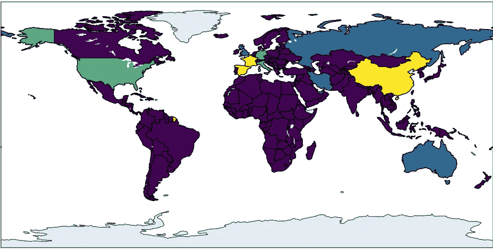
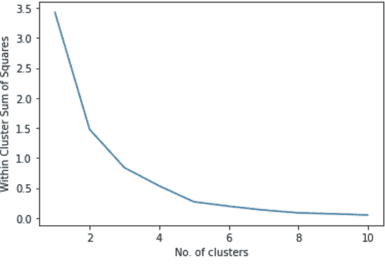
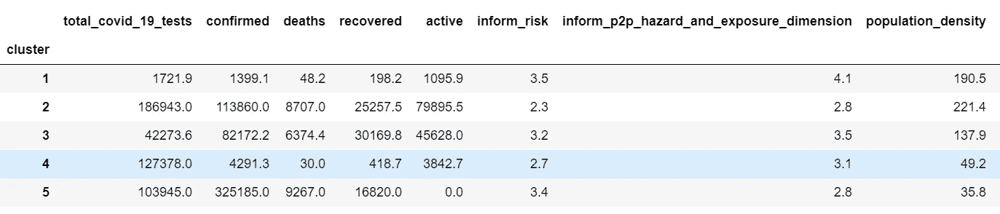
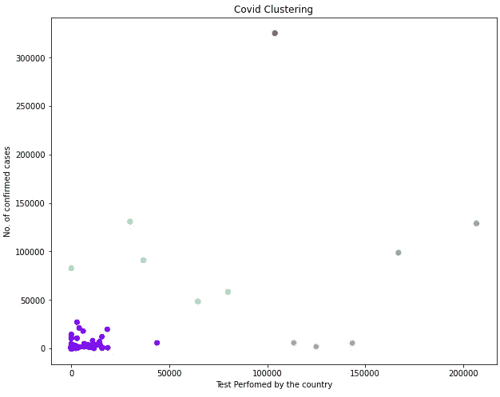
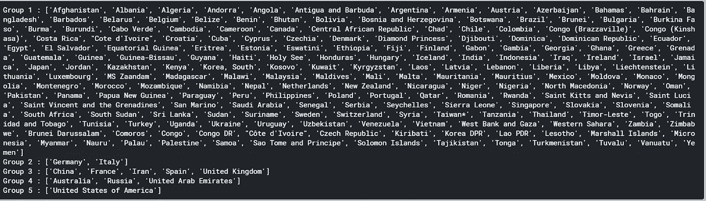
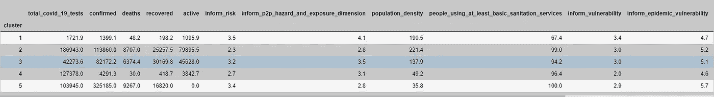
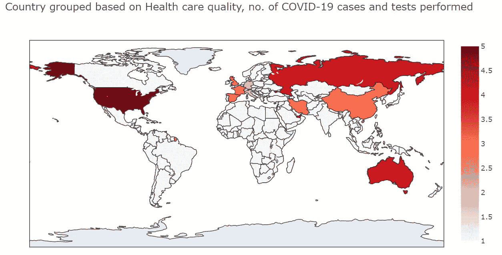
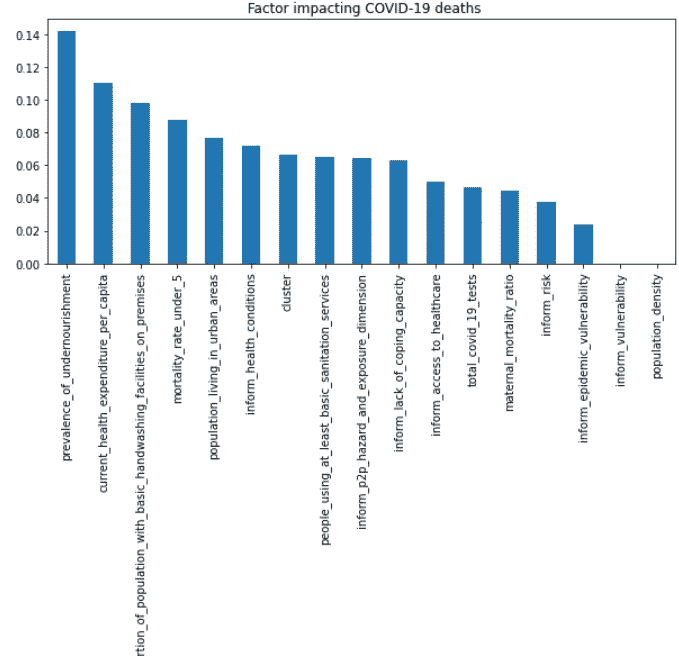

# 新冠肺炎与国家卫生保健质量

> 原文：<https://towardsdatascience.com/covid-19-and-health-care-quality-in-countries-be3855c2521f?source=collection_archive---------37----------------------->

## 一种无监督的 K-means 算法，用于根据不同的医疗质量、进行的新冠肺炎检测数量和确诊的新冠肺炎病例数量对国家进行分组

***编者按:*** [*走向数据科学*](http://towardsdatascience.com/) *是一份以数据科学和机器学习研究为主的中型刊物。我们不是健康专家，这篇文章的观点不应被解释为专业建议。*



在本帖中，我们尝试使用 K-means 根据卫生保健质量对不同国家进行分组，如基本卫生条件、营养不良的患病率、人均卫生保健支出、医生密度、新冠肺炎确诊病例、为新冠肺炎进行的测试数量等。

我使用了来自 Kaggle 的数据，Kaggle 由来自约翰·霍普金斯大学、哈佛大学、世卫组织大学和许多其他机构的新冠肺炎相关数据集组成。

我使用了三个数据集

*   inform-COVID-indicators.csv:该文件包含不同国家的健康指标，如人口密度、使用基本卫生服务的人口、营养不良的患病率、当前人均医疗支出、获得医疗保健的机会、医生密度、城市人口、孕产妇死亡率等。,
*   total-新冠肺炎-检测-按国家执行. csv ":国家执行的新冠肺炎检测次数
*   约翰斯-霍普金斯-新冠肺炎-每日仪表板-病例。csv:包含该国新冠肺炎确诊病例、死亡、康复病例和活跃病例的数量

加入了三个基于国家的数据集，我必须清理一些数据以匹配所有三个数据集中的国家名称。

使用 K-means 无监督学习根据健康指标、执行的测试和新冠肺炎病例特征对国家进行分组。

> K-means 聚类算法将使用最佳的可能特征，对具有相同健康指标、人口密度等的相似国家进行分组。一起。

k-均值聚类是一种

*   **一种无监督的机器学习算法**
*   **一种迭代算法**
*   **在给定的未标记数据集中寻找组**
*   它有助于将相似的数据点归类成一个簇。
*   **除了有助于数据点聚类的输入特征外，不需要预先分类**

> 为了选择正确的聚类数，使用了肘形法。

肘方法针对不同数量的聚类运行 K-means 算法，并找到每个数据点到聚类质心的平方距离之和，也称为类内**平方和**



K-Means 算法根据卫生保健质量、检测次数、确诊病例、死亡和康复病例将国家分为五个不同的组。

```
*# Fitting K-Means to the dataset*
**kmeans = KMeans(n_clusters = 5, init = 'k-means++', random_state = 42)
y_kmeans = kmeans.fit_predict(data_k)***#beginning of  the cluster numbering with 1 instead of 0*
**y_kmeans1=y_kmeans
y_kmeans1=y_kmeans+1***# New Dataframe called cluster*
**cluster = pd.DataFrame(y_kmeans1)**# Adding cluster to the Dataset
**data_k['cluster'] = cluster**#Mean of clusters
**kmeans_mean_cluster = pd.DataFrame(round(data_k.groupby('cluster').mean(),1))
kmeans_mean_cluster**
```



按 K 均值聚类的国家



按 K 均值聚类的国家



聚集在不同集团中的国家

# 根据卫生保健条件、进行的新冠肺炎检测和新冠肺炎病例数，将国家分为 5 组



国家的分类详细信息

**第一组:印度、丹麦、加拿大、厄瓜多、巴西、南非等国家。**

代表以下国家

*   低数量的测试，
*   确诊病例较少，
*   死亡人数最少
*   高人口密度
*   营养不良率更高，基本卫生条件差

**第二组:德意**

代表以下国家

*   执行的最高测试次数
*   活动案例的最高数量
*   大量的死亡
*   最高人口密度
*   更好的保健条件

第 3 组:中国、法国、伊朗、西班牙和英国
代表

*   执行的最高测试次数
*   相对较高数量的有效案例
*   相对较高的死亡人数
*   相对较高的人口密度
*   更好的保健条件

**第 4 组:澳大利亚、俄罗斯、阿联酋**
代表国家

*   执行的高测试次数
*   活动案例的最少数量
*   最低的死亡人数
*   相对较低的人口密度
*   良好的保健条件
*   **第 5 组:美国**
    代表
*   执行的高测试次数
*   最高数量的确诊病例
*   最高的死亡人数
*   最低人口密度
*   最佳保健条件

在世界地图上绘制族群



基于数据集中有限的数据点，希望了解哪些特征会影响新冠肺炎的死亡率。使用互信息分析特征重要性。

```
# considered heath indicators and test perfomed to understand the impact on confirmed COVID-19 cases
**names = ['total_covid_19_tests',  
       'inform_risk', 
       'inform_p2p_hazard_and_exposure_dimension',
       'population_density', 
       'population_living_in_urban_areas',    'proportion_of_population_with_basic_handwashing_facilities_on_premises',
       'people_using_at_least_basic_sanitation_services',
       'inform_vulnerability', 
       'inform_health_conditions',
       'inform_epidemic_vulnerability', 
       'mortality_rate_under_5',
       'prevalence_of_undernourishment',       
       'inform_lack_of_coping_capacity',
       'inform_access_to_healthcare',   
       'current_health_expenditure_per_capita',
       'maternal_mortality_ratio', 
       'cluster']****from sklearn.feature_selection import mutual_info_regression, mutual_info_classif
from sklearn.feature_selection import SelectKBest, SelectPercentile
mi = mutual_info_regression(data_k[names], data_k['deaths'] )
mi = pd.Series(mi)
mi.index = names
mi.sort_values(ascending=False)
mi.sort_values(ascending=False).plot.bar(figsize=(10, 4))
plt.title(" Factor impacting COVID-19 deaths")**
```



用于分析的数据最后一次更新是在 2020 年 4 月 11 日，美国中部时间上午 10 点，代码可在 [Kaggle](https://www.kaggle.com/ashren/countries-grouped-by-risk?scriptVersionId=31820564) 获得

***编者按:*** [*走向数据科学*](http://towardsdatascience.com/) *是一份以数据科学和机器学习研究为主的中型刊物。我们不是健康专家或流行病学家，本文的观点不应被解释为专业建议。想了解更多关于疫情冠状病毒的信息，可以点击* [*这里*](https://www.who.int/emergencies/diseases/novel-coronavirus-2019/situation-reports) *。*