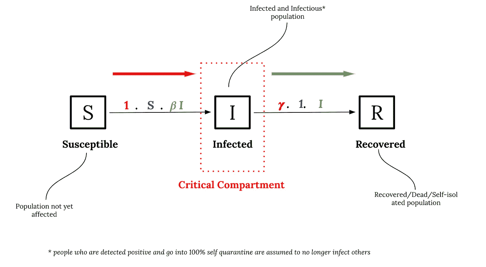
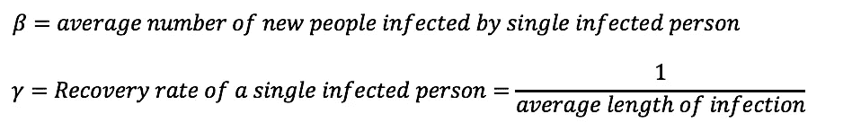
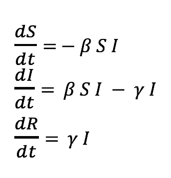
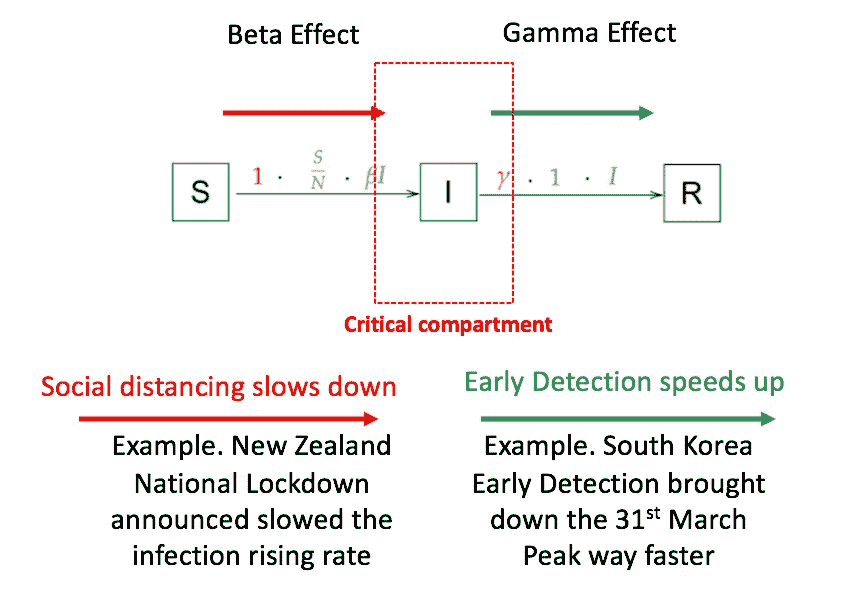
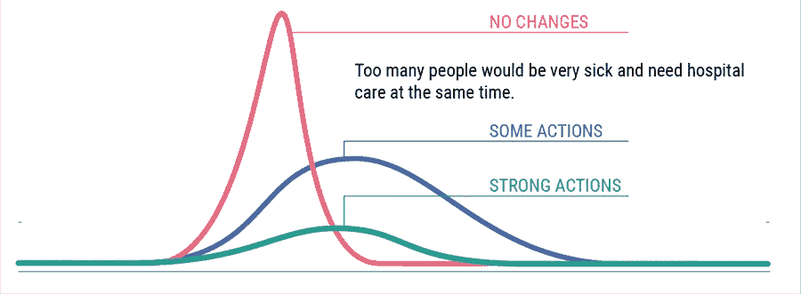
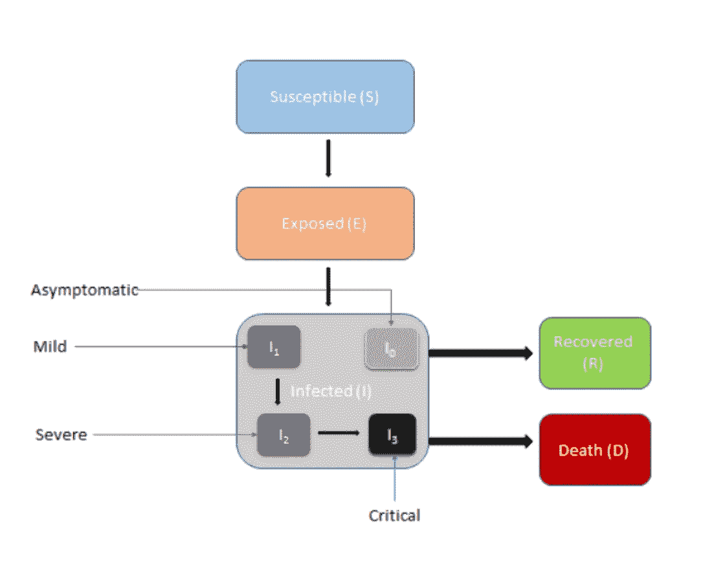
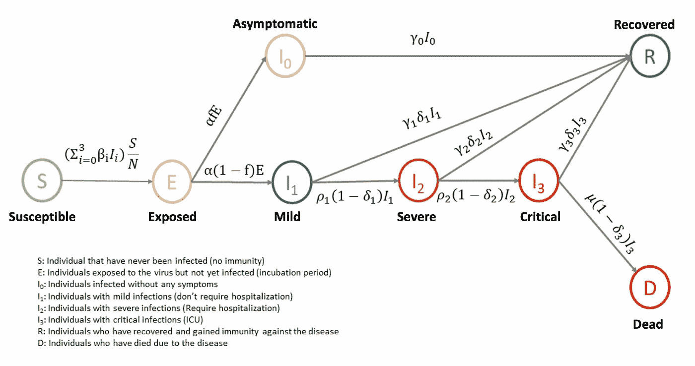
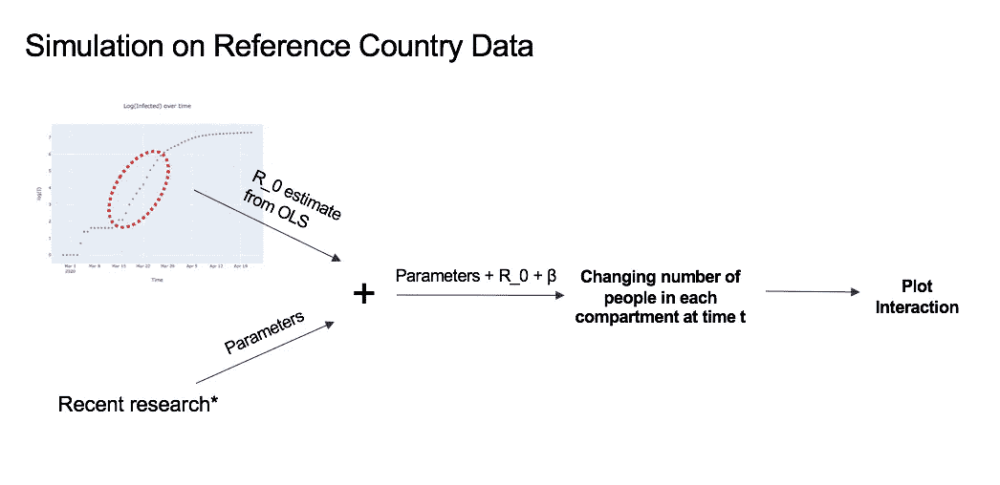

# 新冠肺炎和干预——简单解释

> 原文：<https://towardsdatascience.com/covid-19-and-interventions-simple-explanation-fd7d5b89e20d?source=collection_archive---------81----------------------->

> 本文由哥伦比亚大学的阿迪蒂·加格、伊莎·古普塔、尼拉杰·拉姆库马尔、赛·瓦伦·查拉和萨希尔·楚塔尼撰写。

## ***这篇文章给读者提供了 3 样东西:***

1.  ***根据 SIR 模型*** 对新冠肺炎价差的简单解释
2.  ***对模型的修改和干预措施的影响***
3.  ***Live Tableau 仪表盘和交互式展平曲线便于理解***

> 特别感谢教授。丹尼尔·盖塔来自哥伦比亚大学，他意识到了这个话题的重要性，于是上了额外的课来教授我们同样的内容。在这里，我们分享我们知道的一切，我们都需要了解新冠肺炎！

> 本文通过可视化冠状病毒的传播、实施的干预措施的影响以及对改进的 SIR 模型的模拟来解释新冠肺炎。

*现在，整个地球已经被封锁了将近两个月了！*感觉如何？随着疫情的进程在全球移动，我们正在学习生活在这种新常态中。增长不应该停止，相反，它应该是一个更加集体和协作的努力，以掩盖积压。随着新发现的揭露、新爱好的发现和新技能的掌握，我们哥伦比亚大学的学生更深入地研究了已发表的关于新冠肺炎的文献，以探索和预测干预对病毒传播的影响。

*根据我们对这篇文章的研究，我们创建并整理了一些有趣的资源，让你们以最简单的方式理解冠状病毒背后的数学原理！*

图片来自 [Pixabay](https://pixabay.com/?utm_source=link-attribution&utm_medium=referral&utm_campaign=image&utm_content=4948866) 的[米洛丝拉娃·克里斯诺娃](https://pixabay.com/users/MiroslavaChrienova-6238194/?utm_source=link-attribution&utm_medium=referral&utm_campaign=image&utm_content=4948866)

从人类生活到全球经济，一切都受到冠状病毒的影响(新冠肺炎)。它起源于 2019 年的中国武汉市，几乎没有一个国家没有它。*(是的！一些国家很幸运，如汤加、帕劳共和国(截至 2020 年 4 月 26 日)*。虽然整个世界被这种病毒所分隔，但这种病毒也把我们紧密地联系在一起。伟大的流行病学家、研究人员和科学家正在努力寻找解决方案。每个国家都选择了自己的方式来对抗致命的冠状病毒。无论是韩国的早期检测和接触者追踪，新西兰和印度的全国封锁，还是意大利的未受控制的传播——每一个撞击事件都有值得借鉴的地方。更深入一点，了解差异，并通过交互式图表可视化影响是令人兴奋的。参考最近发表的一些惊人的研究论文，我们试图通过任何人都可以玩的图表来解释 COVID 传播、干预的影响以及它们对治疗个体的影响。

**基本 SIR 型号**

SIR 模型是理解新冠肺炎对全球影响的最简单和最常用的模型之一。它把人口分成三个主要部分——

易感*(还没有被感染的那部分人群)*

受感染的*(人口中受感染的部分)*和

康复的*(康复或死亡的那部分人口)*

根据病毒的**传播速度**和人口的**恢复速度**，人们以不同的速度从一个隔间移动到另一个隔间。这些比率还受到该国疫情的总体性质、所采取的干预措施以及这些干预措施的成功率的影响。

作者对罗纳德·罗斯爵士的[爵士模型](http://mat.uab.cat/matmat/PDFv2013/v2013n03.pdf)进行了注释

让我们解释一下这些著名的变量，它们被用来计算从一个车厢移动到另一个车厢的人数。

作者对罗纳德·罗斯爵士的[爵士模型](http://mat.uab.cat/matmat/PDFv2013/v2013n03.pdf)进行了注释

然后，可以使用这些简单的等式来评估人的运动:

SIR 模型方程

由罗纳德·罗斯爵士在[爵士模型](http://mat.uab.cat/matmat/PDFv2013/v2013n03.pdf)上的作者注释

很明显，从易受感染的**移动到受感染的**隔间的人数与β成正比，从受感染的**移动到恢复的**隔间的人数与γ成正比。

这让我们理解了主要干预的影响—

1.国家封锁和

2.早期发现，

减轻现成冠状病毒的影响。

**干预如何影响这些运动？**

作者图片

***贝塔效应:*** *国家封锁减少了单个人类接触的平均人数。因此，导致接触率的降低。因此，单个感染者接触的平均人数也减少了。因此，* ***国家封锁或社会距离减少了β，即从易感人群转移到受感染人群的人数。***

***伽玛效应:*** *早期检测确保尽早检测出每一个疑似阳性病例。一旦一个人被检测为阳性，她/他就进入 100%的自我隔离状态，因此不能再感染任何其他人。由于 SIR 模型使用 I(感染病例数)作为“传染性”病例数，因此此人不再具有传染性，可以假定他已被转移到恢复室——最终要么恢复，要么死亡。因此，* ***早期检测增加了γ，即从受感染区室移动到恢复区室的人数。(基本上，小雅和小雅的人都在传播病毒)***

让我们引入另一个重要参数 r0**，它是描述传染病爆发强度的再生数。因此，R_t 是描述在时间 t 时人口中传染病强度的再生数。显然，它只不过是β和γ的比率，因此受到干预本身的影响。阻止传播的干预力度越大，人口的 R_t 下降得越快。**

**这是我们为你制作的一个互动图表的视频，用来检查如何改变β和γ，使曲线变平。**

**β、γ和δ对曲线展平的影响**

*****请随意查看下面网站上的这张图！*****

 **[## 破折号

### 编辑描述

dash-app-ba.herokuapp.com](https://dash-app-ba.herokuapp.com/)** 

****为什么展平曲线如此重要****

**正如我们在图中看到的，描绘“受感染”人员的曲线峰值越大，医院对病床和呼吸机的需求就越大。由于没有国家对这种程度的疫情做好准备，有限的资源是最大的担忧，特别是在像纽约、新泽西这样疫情最严重的地方。因此，在疫苗或真正的治疗方法被发现或发明之前，使曲线变平是控制死亡人数最简单的方法之一。**

****

**来源:[健康方面](https://www.healthwise.org/blog/slowing-the-spread-of-covid-19.aspx)**

****改装型号****

**正如我们所料，被感染的区域并不像听起来那样同质。这个 SIR 模型有几个版本，增加了各种不同假设的区间。我们的分析是通过添加两个独立的隔间进行的——暴露和死亡。最重要的是，受感染的部分根据严重程度分为 4 个部分——无症状、轻微、严重和危急。**

****

**作者图片**

***添加相应的移动速率后，看起来是这样的:***

**因此，根据疫情的强度，一部分易感人群会受到感染。暴露人群要么进入无症状状态，要么进入轻度状态，然后要么进入恢复状态，要么进入重度状态，如此等等。最终，来自危险舱人要么进入恢复舱，要么不幸进入死亡舱。**

****模拟****

****

**作者图片**

**在最近发表的大量研究论文中，参数参考了其中一个来源，引用如下。为了预测社交距离的影响，beta 来自新西兰的 COVID 数据集。同样，为了预测早期探测的影响，伽马射线是从韩国的 COVID 数据集得出的。**

****

**模拟结构|作者图片**

**这个最终的参数集与纽约州的 COVID 数据集一起用于绘制纽约的曲线。**

**纽约的模拟结果**

***请随意查看我们为你们制作的以下资源***

*   ***[*新冠肺炎追踪器*](https://public.tableau.com/profile/aditi8708#!/vizhome/BAProject_15876700805870/COVID-19Cases?publish=yes)*——*一个* ***世界*** *tableau 仪表盘，描绘前四个月全国确诊病例和死亡人数*****
*   ****[*新冠肺炎追踪器*](https://public.tableau.com/profile/neeraj4906#!/vizhome/BAIEOR-Covid-19/Dashboard1?publish=yes) *—一个* ***国家*** *tableau 仪表盘描绘了美国的确诊病例和死亡病例*****
*   ****[*贝塔和伽玛效果浮动滑块*](https://dash-app-ba.herokuapp.com/)****
*   ****[*Github 资源库*](https://github.com/sahil350/BA-project)****

> ******注意:**这个项目包括阅读大量的文献，不断更新每天发布的新研究，以及探索每小时发布的新数据集。我们探讨了更多领域，如新冠肺炎对经济的影响，特别是供应链、就业、医疗保健行业和人们的情绪。虽然这些主题在未来的探索中非常令人兴奋，但截至 2020 年 4 月，它们并没有提供可靠的资源。最受欢迎和最可靠资源的数据集最近一次更新是在一月份。我们通过用新研究中发布的影响参数外推供应链或就业的旧数据集进行了试验，但由于新冠肺炎极其动态和不稳定的局势，我们正在等待更可靠的数据集发布，而不是基于几个假设做出一个数据集。研究这个主题是令人兴奋的，虽然一个人的研究可能很早就过时了，因为有成千上万的人在流传，我们希望每个人都能够探索这个主题，并在需要的情况下随时寻求我们的帮助。 [**在这里**](https://drive.google.com/open?id=17UsVjzubZ8AWZYHgb2aN7DLMErdrrWVRlSGCROXpLn0) **，**我们分享了一份我们进行的所有研究和探索的文献的简明链接列表！这个话题听起来可能有点吓人，但是这个世界需要更多的数据科学家来研究它！一定要联系我们中的任何一个人，以防有需要！****
> 
> ****[阿迪提](https://www.linkedin.com/in/aditigarg12/)，[伊莎](https://www.linkedin.com/in/ishagupta36)，[尼拉杰](https://www.linkedin.com/in/neerajramkumar/)，[萨希尔](https://www.linkedin.com/in/sahilchutani/)，以及[瓦润](https://www.linkedin.com/in/varun-challa-223153141/)！****

*****感谢以下参考资料:*****

> ****[MIDAS 2019 新型冠状病毒库](https://github.com/midas-network/COVID-19)****