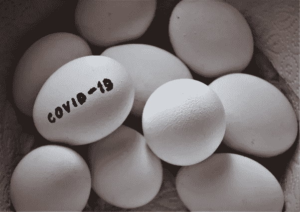
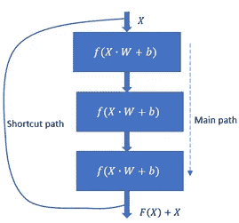
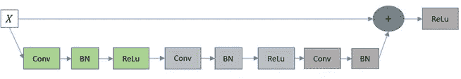
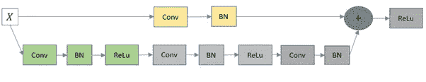
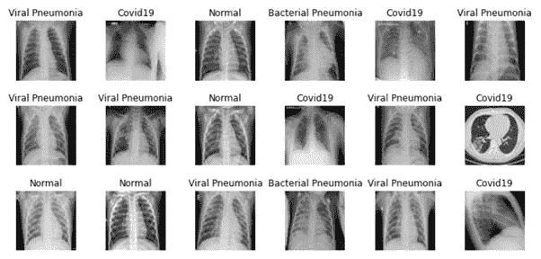
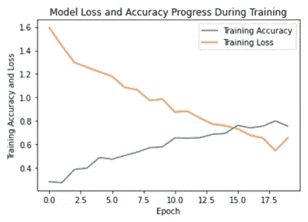
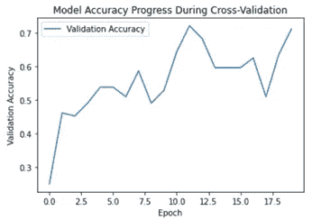
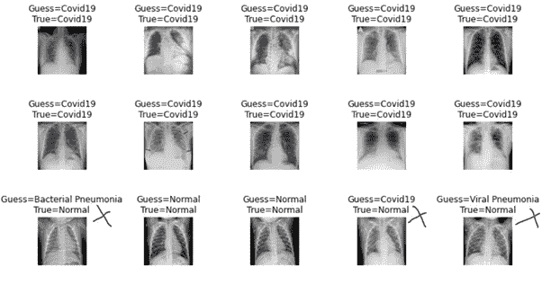
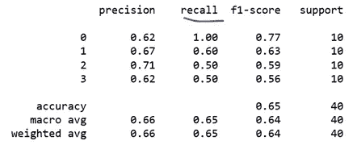

# 利用迁移学习进行新冠肺炎和肺炎检测

> 原文：<https://towardsdatascience.com/covid-19-and-pneumonia-detection-with-transfer-learning-400a8150268?source=collection_archive---------33----------------------->

## 用于新冠肺炎和肺炎检测的具有网格搜索优化参数的 ResNet50 转移学习



来自 pixabay 的 Img 通过[链接](https://pixabay.com/photos/easter-eggs-virus-covid-19-4978337/)

在以前的帖子中，我们为商业问题创建了几个 CNN 网络，从时尚设计，癌症检测，到动物检测等等。在本帖中，我们将重温 CNN 的话题。但是，我们将使用迁移学习，并在著名的 CNN 架构 ResNet50 上构建网络，而不是从头开始创建模型。

> "如果说我看得更远，那是因为我站在巨人的肩膀上."艾萨克·牛顿在 1675 年

像平常一样，拆分成如下:

1.  **背景&问题**
2.  **ResNet 概述**
3.  **数据审核**
4.  **列车型号**
5.  **外卖**

让我们开始旅程吧🏃‍♀️🏃‍♂️!

**1。背景&问题**

人工智能和人工智能已经彻底改变了医疗保健和医药行业。根据发表在《自然》杂志上的一项研究，在从乳房 x 光片中诊断乳腺癌方面，人工智能比医生更准确。最近，来自谷歌健康和伦敦帝国理工学院的研究人员根据近 29000 名女性的 x 光图像训练了一个模型。该算法在阅读乳房 x 光片方面胜过六名放射科医生👏👏。

在这里，我们的目标是自动检测和分类胸部疾病的过程，并减少检测的成本和时间。

**2。ResNet 概述**

ResNet50 是何等人在他们 2015 年的论文[图像识别的深度残差学习](https://arxiv.org/abs/1512.03385)中介绍的一种 50 层深度残差网络。它以剩余学习为基础，与 ResNet101 和 ResNet152 等公司使用的架构相同。

那么，什么是剩余学习呢？通常，在创建神经网络时，“越深越好”。随着图层越来越多，网络往往会学习到更多具有更好的泛化能力的要素。然而，这是有限度的。随着模型的深入，神经网络的训练变得困难，模型性能开始饱和甚至下降。这主要是由臭名昭著的消失梯度问题造成的。当梯度反向传播到更早的层时，导数的重复乘法使得梯度无限小，这使得不可能更新更早的层的权重。剩余学习是解决这一问题的突破口之一。

与学习输入图像特征的 CNN 相反，残差学习学习“残差”(这不是很明显吗？🤭🤭).好吧，如果不是，残差可以理解为从输入图像中减去特征。ResNet 通过引入所谓的“**标识快捷连接**来实现这一点，它跳过了一个或多个中间层。换句话说，如图 1 所示，早期层的输出被提供给更深的层，而没有任何转换



图 1 剩余框图(图片由作者提供)

使用捷径连接，期望的映射是 ***F(X) + X*** 。所以，残差块只需要专注于残差学习 ***F(X)*** ，因为它至少可以通过强制 ***F(X)*** 为零来学习 X。跳过连接背后的直觉是，它比任何其他直接映射更容易学习残差。这驱使更深层去学习不同于输入已经编码的东西。同时，它允许训练非常深的网络，而不用担心退化问题。

ResNet 架构包含两种剩余块:**身份块和**conv 块。图 2 示出了身份块。主分支有一个卷积层，后面是批量归一化和一个激活层，通常使用 *ReLu* 。在这之后，另一个单位的卷积层，批量标准化和激活层。然后，我们添加第三卷积层和批量标准化。激活前，批量定额的输出与原始输入相加。当输入 X 的形状与主分支的输出相同时，恒等块工作良好。



图 2 身份框图(图片由作者提供)

第二种类型是 Conv 块，如图 3 所示。唯一的区别是在快捷路径中添加了卷积层和批量归一化，以匹配主分支的输出形状。



图 3 Conv 框图(图片由作者提供)

总之，ResNet50 架构包括 4 个 Conv 块和 12 个身份块，以及 1 个正常卷积层和 1 个密集层。

**3。数据回顾**

每一类给我们 133 张图片:健康的；新冠肺炎；细菌性肺炎；病毒性肺炎。图像保存在本地驱动器中，所以我们将使用 Keras 的 *flow_from_directory()* 方法来读取图像。具体来说，

```
image_generator = ImageDataGenerator(rescale = 1./255, validation_split= 0.2)train_gen = image_generator.flow_from_directory(batch_size = 8,directory= train_data_dir,shuffle = True,target_size = (256, 256), class_mode = ‘categorical’,subset= ‘training’)validation_gen = image_generator.flow_from_directory(batch_size = 8,directory= train_data_dir,shuffle = True,target_size = (256, 256),class_mode = ‘categorical’, subset= ‘validation’)
```

让我们来接触一下各个班级的形象。图 4 显示了灰度图像。像我这样的人一点也看不出他们的区别😭😭。但是不用担心😎😎！这是模特的工作。



图 4 数据样本图像

**4。列车型号**

如前所述，我们将从预先训练的 ResNet50 模型进行迁移学习。它是在 ImageNet 数据集上训练的，该数据集包含 1100 万张图像和 11000 个类别，与我们在这里获得的数据集相比是巨大的。

4.1 负载模型

首先，让我们加载模型，并指定如何根据我们的目的使用它。

```
basemodel = ResNet50(weights = ‘imagenet’, include_top = False, input_tensor = Input(shape = (256, 256, 3)))
```

注意，我们没有包括顶级分类层，因为我们将创建自己的分类器头。我们将输入张量形状定义为与图像生成器中的相同。

一般来说，迁移学习有不同的策略。如果预训练数据集和新数据集相似，并且数据集很小，我们可以冻结早期的层并训练其余的层。如果您的任务是处理大型数据集，您可能需要使用预训练模型中初始化的权重来重新训练整个模型。

在我们的例子中，我们的数据集非常小，允许我们冻结早期的层。所以，

```
for layer in basemodel.layers[: -10]:
    layer.trainable = False
```

4.2 创建和训练模型

我认为这一节是有趣的部分，因为你将看到如何“站在巨人的肩膀上”。

仔细看下面的建筑。我们将 ResNet50 模型输出作为其后续层的输入。在为输出添加最后一个密集层之前，我们堆叠了 3 个带有 dropout 的密集层。

包括神经元数量和辍学率在内的参数在网格搜索中进行了实验，以显示最佳结果，尽管这里没有详细说明。

另请注意，我们使用两个指标来评估培训:F1 得分和准确性。根据我的大量实验，该模型在某种程度上倾向于将细菌性肺炎错误分类。因此，使用 F1 分数将使我们有一个平衡的模型性能。

```
headmodel = basemodel.output
headmodel = AveragePooling2D(pool_size = (4,4))(headmodel)
headmodel = Flatten(name= ‘flatten’)(headmodel)
headmodel = Dense(256, activation = “relu”)(headmodel)
headmodel = Dropout(0.4)(headmodel)
headmodel = Dense(128, activation = “relu”)(headmodel)
headmodel = Dropout(0.4)(headmodel)
headmodel = Dense(64, activation = “relu”)(headmodel)
headmodel = Dropout(0.4)(headmodel)
headmodel = Dense(4, activation = ‘softmax’)(headmodel)model = Model(inputs = basemodel.input, outputs = headmodel)model.compile(loss = ‘categorical_crossentropy’,optimizer = optimizers.RMSprop(lr = 1e-4, decay = 1e-6),metrics = [f1, ‘accuracy’])
```

此外，我们使用早期停止来监控进度，并使用检查点来保存权重文件。

```
earlystopping = EarlyStopping(monitor = ‘val_loss’, mode = ‘min’, patience = 10)
checkpointer = ModelCheckpoint(filepath = ‘weights.hdfs’, verbose = 1, save_best_only=True)
```

太好了。时段数(20)和批次大小(8)经过优化，可产生最佳结果。为了训练这个模型，

```
history = model.fit_generator(
train_generator, steps_per_epoch= train_generator.n//8, 
epochs = 20, validation_data= val_generator, 
validation_steps= val_generator.n//8, callbacks=[checkpointer, earlystopping])
```

4.3 评估模型

图 5 示出了模型精度逐渐增加到大约 0.75，并且损失减少到大约 0.65。还有一点就是训练过程是稳定的，没有突兀的波峰或波谷。



图 5 训练过程中的模型损失和精度曲线

图 6 显示了验证过程中的模型精度。该模型达到了大约 0.65 到 0.7 的验证精度，表明轻微的过度拟合。



图 6 验证期间的模型精度曲线

最后，让我们看看测试数据集上的模型性能。

```
evaluate=model.evaluate_generator(test_generator,steps=test_generator.n//4, verbose = 1)
```

图 7 示出了 15 幅图像的预测和实际类别。该模型对新冠肺炎的预测非常准确。如图 8 所示的分类报告表明，对于✨✨.，该模型对新冠肺炎的召回率为 100%这意味着在 10 幅新冠肺炎图像中，它成功地全部预测正确。对于肺炎，回忆并不理想，大约有 50%到 60%的预测正确。当然，这种模式还有改进的空间。



图 7 标有实际和预测类别的模型预测



图 8 模型分类报告

**5。外卖**

我们演示了如何使用迁移学习来创建新冠肺炎/肺炎预测的定制模型。只有大约 500 张图像，我们设法取得了不错的结果，特别是在新冠肺炎检测上。

接下来有趣的是，如果你想弄脏你的手，只在正常和新冠肺炎图像上改装模型。创造一个新冠肺炎探测模型将是一件美妙的小事，我们可以为对抗它做出贡献。

太好了！这是所有的旅程。希望你喜欢它。如果你需要代码，请访问我的 Github [repos](https://github.com/luke4u/CNN-Image-Classification) 💕💕。