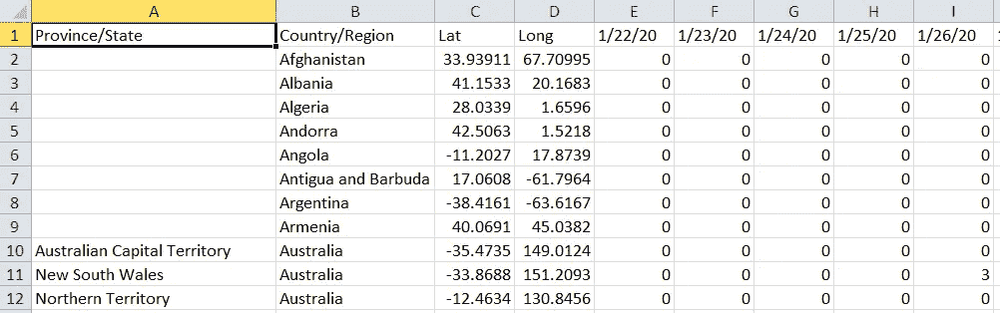

# 如何创建一个酒吧比赛图表使用蓬勃发展的应用程序

> 原文：<https://towardsdatascience.com/covid-19-bar-race-chart-using-flourish-89136de75db3?source=collection_archive---------50----------------------->

## 利用新冠肺炎数据制作条形图的简易无代码方法

竞赛条形图是一个非常简单的工具，可以用来比较随时间变化的数量。简单来说，它是一个包含时间轴的条形图。

在本文中，我将解释如何准备一个新冠肺炎可视化使用蓬勃发展的应用程序。最终产品如下所示:

# 第一步:在蓬勃发展应用上注册

注册“蓬勃发展”是非常简单的程序一样，注册任何其他服务。
和 *Tableau* 一样，fluore 有免费和付费两个版本，免费版本的坏处，就和 *Tableau* 或者 *GitHub* 免费版本的情况一样，就是数据需要公开。如果你有高度敏感的信息，考虑注册付费版本。
格式的文件 *excel* 或 *csv* 格式的文件可以上传到蓬勃发展。
注意，制作*酒吧比赛图*时，列标题应为时间(日期、年份、回合等。)
除了条*标签*之外，*类别*和*图像*也可以并入到 fluore 中，这是可选的。
如果*类别*可用，则可以根据类别进行条形着色。
用于添加图像(国旗/球员图像、俱乐部徽章等。)，需要提供图片网址。
[报名蓬勃](https://app.flourish.studio/register?noredirect=true)(非附属链接)。

# 步骤 2:数据收集

所有国家的新冠肺炎每日统计数据可在约翰·霍普斯金大学 Github repo 获得。
我们对回购中可用的每日全球时间序列数据感兴趣，如下所示。

数据来自约翰·霍普斯金大学 Repo(图片由作者提供)

# 第三步:数据预处理

来自 *JHU* 的数据有时间作为 blower 所需的列标题。但是，请注意，还有类似于 *Lat* 和 *Long* 的列，它们不是必需的。
此外，对于某些国家/地区，数据是基于省/州进行分离的，需要基于国家/地区进行汇总。
因此，需要对数据进行预处理以实现繁荣。
此外，*图像 URL* (国旗 URL)和*地区名称*也在预处理过程中被添加。

GitHub Gist 预处理

查看下面我的 Kaggle 笔记本中的另一个例子:

 [## FPL 最佳射手:繁荣的比赛图表

### 使用 Kaggle 笔记本探索和运行机器学习代码|使用来自 Fantasy Premier League 21 Full Player 的数据…

www.kaggle.com](https://www.kaggle.com/abhijithchandradas/fpl-top-scorers-flourish-race-chart) 

# 第四步:在花体中准备视觉化

登录蓬勃发展应用程序，点击“*新可视化*”。
它将带你进入所有可用模板的列表(他们有一个非常容易使用的数据可视化模板的详尽集合)。
向下滚动并点击“*条形图比赛*”。它将显示一个带有一些虚拟数据的示例条形图。
点击可视化左上角的*数据*，查看当前可视化使用的数据。
要上传数据，点击*上传数据*，选择要上传的文件，点击*确定*。
将模式改为*预览。瞧吧！你的视觉化准备好了！*

# 步骤 5:自定义图表

条形图有许多方面可以定制，如条形的数量、条形的颜色、图表的布局、时间线的长度等。
这些选项在可视化右侧可用。

# 步骤 6:发布可视化

一旦您对可视化感到满意，只需点击*导出并发布*即可发布。你也可以获得嵌入链接，它可以用来在你的网站中嵌入可视化。

来自蓬勃发展应用程序的 Covid 比赛图表

Net net，这很简单！fluore 不仅仅是唯一一个可以用来制作比赛图表的应用程序，它也是我见过的最简单的一个。
Race 条形图可以用 python 或 r 编写，这涉及到大量的编码。在 Tableau 中，还可以准备比赛图表，在我看来，这对于初学者来说是非常困难的。如果你有合适格式的 excel/csv 文件，用它来制作比赛图表简直是小菜一碟。

如果你对视觉教程感兴趣，你可以看看这个 YouTube 视频，我在里面解释了如何制作比赛图表。

## 资源

所有代码和资源都可以在[这个 GitHub repo](https://github.com/abhijith-git/Publications/tree/main/FLOURISH-BAR-RACE) 中访问。

## 成为会员

我希望你喜欢这篇文章，我强烈推荐 [**注册*中级会员***](https://abhijithchandradas.medium.com/membership) 来阅读更多我写的文章或成千上万其他作者写的各种主题的故事。
[你的会员费直接支持我和你看的其他作家。你也可以在媒体上看到所有的故事。](https://abhijithchandradas.medium.com/membership)

## 这里有一些我写的其他故事，你可能会觉得有趣。
干杯！

 [## 如何使用值从 Python 字典中提取键

### 从 python 字典给定值中提取键的四种方法

towardsdatascience.com](/how-to-extract-key-from-python-dictionary-using-value-2b2f8dd2a995)  [## 如何在 Matplotlib/ Seaborn 中向散点图添加文本标签

### 使用 Seaborn 或 Matplotlib 库时，如何在 python 中向散点图添加文本标签的分步指南。

towardsdatascience.com](/how-to-add-text-labels-to-scatterplot-in-matplotlib-seaborn-ec5df6afed7a) 

照片由[贾科莫·卡拉](https://unsplash.com/@giacomocarra?utm_source=medium&utm_medium=referral)在 [Unsplash](https://unsplash.com?utm_source=medium&utm_medium=referral) 上拍摄