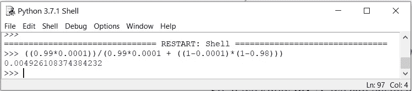
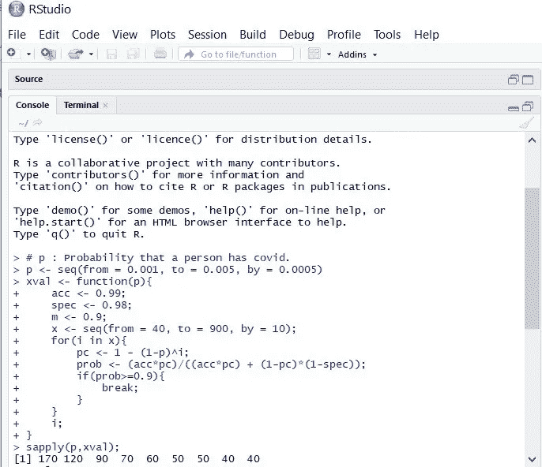
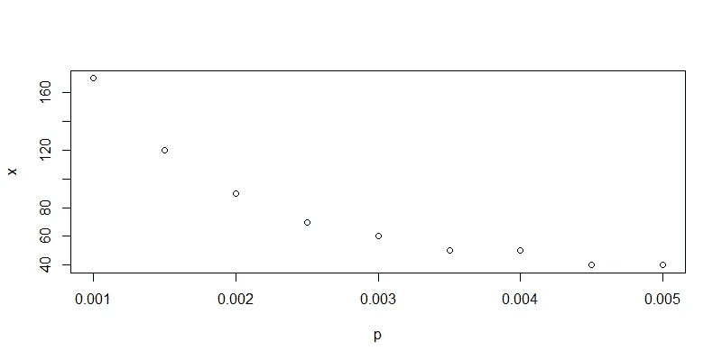

# 新冠肺炎，贝叶斯定理和概率决策。

> 原文：<https://towardsdatascience.com/covid-19-bayes-theorem-and-taking-data-driven-decisions-part-1-b61e2c2b3bea?source=collection_archive---------49----------------------->


来源: [geralt](https://pixabay.com/illustrations/coronavirus-virus-mask-stamp-china-4817450/) ，via [Pixabay 许可](https://pixabay.com/service/terms/#license)

***编者按:*** [*走向数据科学*](http://towardsdatascience.com/) *是一份以数据科学和机器学习研究为主的中型刊物。我们不是健康专家或流行病学家，本文的观点不应被解释为专业建议。想了解更多关于疫情冠状病毒的信息，可以点击* [*这里*](https://www.who.int/emergencies/diseases/novel-coronavirus-2019/situation-reports) *。*

没有一种测试能百分之百准确地检测出新型冠状病毒！然而，当我们被告知这些测试在检测 COVID 感染方面有 98.5%的准确性时，我们感到满意。但是这种准确性实际上意味着什么呢？

在回答这个问题之前，我们先来复习一些基本概念。

1.  **真阳性:**一个人*同*新冠肺炎检测*阳性*为新冠肺炎
2.  **假阳性:**一个人*没有*新冠肺炎检测*阳性*为新冠肺炎
3.  **假阴性:**一个人*同*新冠肺炎检测*阴性*为新冠肺炎
4.  **真阴性:**一个人*没有*新冠肺炎检测*阴性*为新冠肺炎

现在，让我们回顾一下准确度、精密度、灵敏度和特异性的含义。

> **准确度** =(真阳性+真阴性)/所有结果
> 
> **精度** =真阳性/(真阳性+假阳性)
> 
> **灵敏度** =真阳性/(真阳性+假阴性)
> 
> **特异性** =真阴性/(真阴性+假阳性)

现在假设有 200 个病人。假设 100 名患者被感染，100 名患者未被感染。假设 100 个被感染的患者中有 99 个被检测为阳性，并且 2 个健康的患者也被检测为阳性。也就是说，99 人是*真阳性*，2 人是*假阳性*。1 名感染者*假阴性，98 名未感染者*真阴性*。现在我们来计算一下刚刚学的内容。*

```
**Accuracy** = (99 + 98) / 200 = 0.985**Precision** = 99 / (99 + 2) = 0.98**Sensitivity** = 99 / (99 + 1) = 0.99**Specificity** = 98 / (98 + 2) = 0.98
```

看起来不错，对吧？现在让我们试着了解更多关于特异性的知识。这意味着，在 100 名未感染新冠肺炎病毒的患者中，只有 98 人检测结果呈阴性。所以，假设一个人没有携带病毒，他检测结果为阴性的概率是 0.98。

现在让我们潜得更深！概率，即给定一个人已经有了 covid，测试阳性将由条件概率给出，
**【p(+|c⁺)=灵敏度= 0.99。** 同样，健康患者检测阴性的概率将为
**【p(-|c⁻)=特异性= 0.98。**

我们得到了条件概率，但这有什么用呢？现在假设我们从人群中随机挑选一个人并对他进行测试。他检测呈阳性，但他真的感染了新型冠状病毒的概率有多大。换句话说，在这里我们有兴趣找到 **P(C⁺|+)** 。

> 现在根据贝叶斯定理，
> P(A | B)= P(A)P(B | A)/(P(A)P(B | A)+P(非 A)P(B |非 A))

因此，如果我们知道 **P(C⁺)** ，我们可以通过代入上式中的值来轻松计算 **P(C⁺|+)** 。所以，为了计算**p(c⁺】**，你可以用你所在国家的病例数除以总人口数。在我的例子中，它小于 0.0001，这是非常罕见的。让我们来计算一下 P(C⁺|+).



**p(c⁺|+)——贝叶斯定理在起作用。**

0.005!你猜到了吗？我打赌不会！这意味着，即使一个随机的人被检测为阳性，也有不到 0.5%的几率他真的感染了病毒。

现在，让我们说，你生活在一个更容易发生的地区，现在你感染冠状病毒的机会增加了 10 倍。即使这样， **P(C⁺|+)** = 0.047，也就是说，如果*检测结果为阳性*，那么你实际被感染的几率小于 5%。

这是所有罕见病的问题。

好了，我们明白了为什么随机测试新冠肺炎是个愚蠢的想法。此外，如果你生活在一个更容易感染病毒的地区，检测结果仍然呈阳性意味着你被感染的几率低于 5%。但是等等，混合测试呢？

假设住在红区的人有新冠肺炎的概率是 0.001 到 0.005。最近有消息称，在新病例开始出现后，武汉正计划对所有 1100 万居民进行检测。根据[当前方案](https://www.thehindu.com/sci-tech/science/a-protocol-for-pooled-rt-pcr-testing-of-covid-19/article31489428.ece)，16 次 RT-PCR 检测可检测 40 个样本(最多 3 个阳性)。这可以在 93 个 RT-PCR 测试中测试多达 961 个样本(最多 10 个阳性)。

假设我们收集了 x 个样本，一个人拥有 Covid 的概率为 p。那么，至少一个人拥有 Covid 的概率由下式给出

```
P =  1 - (1-p)^x 
```

现在，让我们制定一些规则。我们希望选择 x，这样如果一个 x 样本池被检测为阳性，我们希望至少有一个人患有新冠肺炎的概率大于 90%。我会用 R 作为编程工具。



我们应该选择多少样品进行混合测试

这里， *pc* 表示 x 个样本中至少一个被感染的概率。
*prob* 是 **P(C⁺|+，**利用贝叶斯定理计算得出。现在，我们绘制 x(样本数量)对 p(一个人拥有 covid 的概率)。



因此，在调查了一个地方的确诊病例数后，如果我们想测试整个人群的新冠肺炎，我们可以使用这个模型来选择样本数进行混合测试。

因此，这有助于我们采取概率决策来选择样本数量。我选择了 90%的 p 值，这可能会让医生们更有信心。另一方面，增加样本数量会引发其他问题。因此，专家在做出最终决定之前可以调整参数。感谢阅读！

.