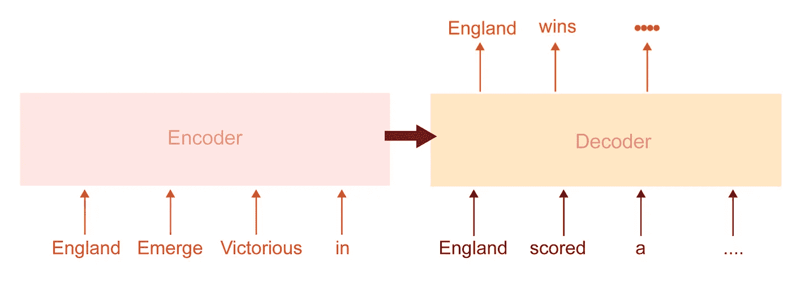
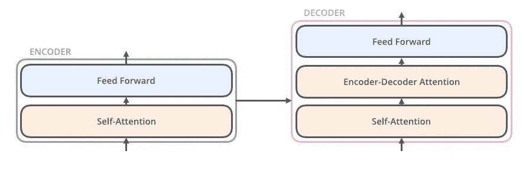
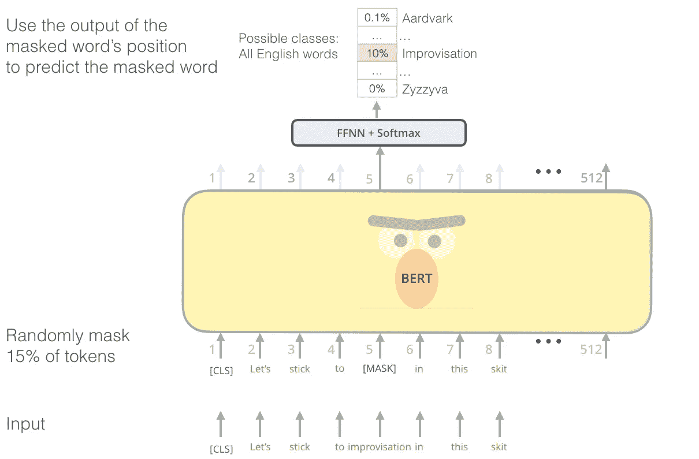
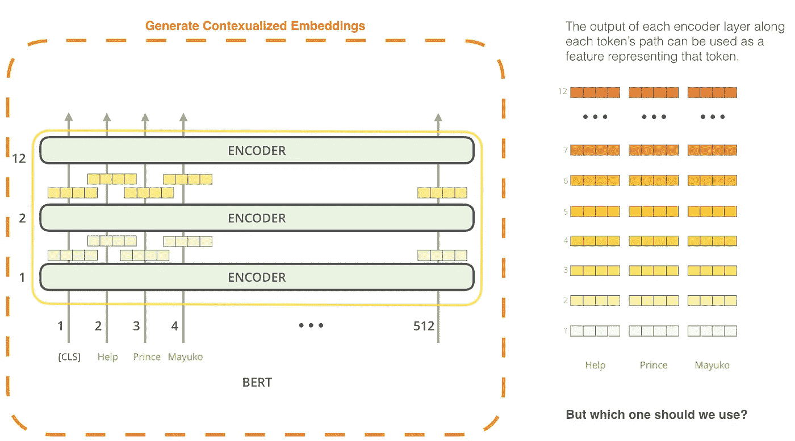
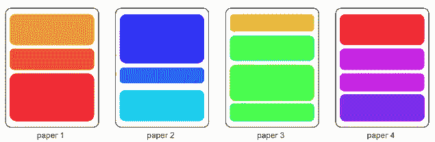
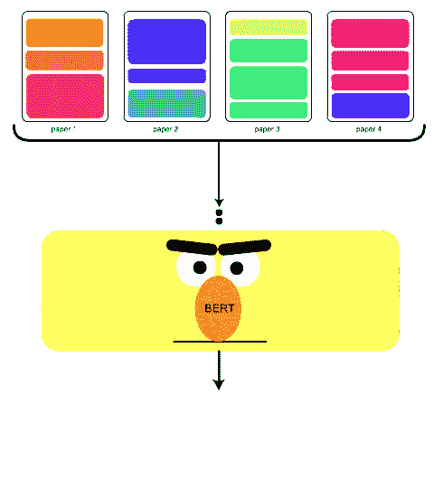
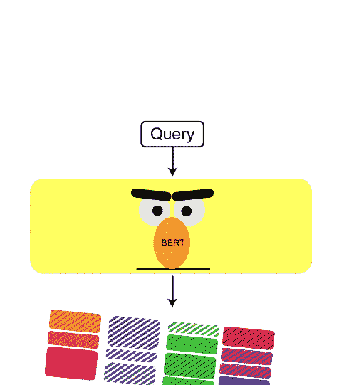

# 新冠肺炎伯特文学搜索引擎

> 原文：<https://towardsdatascience.com/covid-19-bert-literature-search-engine-4d06cdac08bd?source=collection_archive---------28----------------------->

在过去的几周内，研究工作和研究论文的数量在持续增加，以对抗这种冠状新冠肺炎邪恶病毒。组织这些海量的数据现在是最重要的，这是这项工作([代码](https://www.kaggle.com/theamrzaki/covid-19-bert-researchpapers-semantic-search)，[数据](https://github.com/theamrzaki/COVID-19-BERT-ResearchPapers-Semantic-Search#data-links))试图实现的，作为[一个 Kaggle 竞赛](https://www.kaggle.com/allen-institute-for-ai/CORD-19-research-challenge/tasks?taskId=568)的一部分，该竞赛试图找到智能的解决方案来组织大量不断增加的研究知识。

我们的方法是嵌入研究论文的段落，嵌入查询，然后运行余弦相似性来获得最相似的段落


我们构建了这个[代码](https://www.kaggle.com/theamrzaki/covid-19-bert-researchpapers-semantic-search)以在 google colab 上无缝运行，与 google drive 连接，并使用 [kaggle api](https://github.com/Kaggle/kaggle-api) 将数据直接下载到 google colab，因此没有数据被下载到您的设备，也不需要强大的 GPU，因为所有这些都是通过 google colab 免费完成的，您可以在这里找到处理后的数据和结果嵌入[。](https://github.com/theamrzaki/COVID-19-BERT-ResearchPapers-Semantic-Search#data-links)

在本教程中，我们的目标是通过一种使用 BERT 构建搜索引擎的方法，您可以向它提供一个问题( **query** )，比如

*   关于医疗保健已经发表了什么？
*   在实时医疗保健服务中使用人工智能，以人工无法完成的方式评估干预措施、风险因素和结果
*   动员增援医务人员解决不堪重负的社区的短缺问题。
*   等问题。

**我们的方法是**

1.  提取每篇研究论文的段落([处理过的数据](https://github.com/theamrzaki/COVID-19-BERT-ResearchPapers-Semantic-Search#data-links) ) ( [代码段](https://www.kaggle.com/theamrzaki/covid-19-bert-researchpapers-semantic-search#Data-Processing))
2.  从预训练的 BERT 中获得上下文化嵌入，该 BERT 在自然语言推理(NLI)数据([代码段](https://www.kaggle.com/theamrzaki/covid-19-bert-researchpapers-semantic-search#BERT))上进行了微调
3.  对查询应用上下文嵌入([代码段](https://www.kaggle.com/theamrzaki/covid-19-bert-researchpapers-semantic-search#BERT)
4.  对段落和查询应用余弦相似度，得到最相似的段落，然后返回这些段落的论文([代码段](https://www.kaggle.com/theamrzaki/covid-19-bert-researchpapers-semantic-search#BERT))


BERT 用于嵌入，然后余弦相似度得到相似段落

# 伯特是什么？

已经提出了多种语言建模方法，它们可以分为两大类

*   基于递归的 seq2seq 模型
*   基于变压器的模型(BERT)

## 基于递归的 seq2seq 模型

使用[LSTM(RNN 的改进)](http://bit.ly/eazysum_tu4)，用于[编码器解码器](https://hackernoon.com/tutorial-3-what-is-seq2seq-for-text-summarization-and-why-68ebaa644db0)架构



**编码器**使用[双向 LSTM](https://medium.com/@theamrzaki/multilayer-bidirectional-lstm-gru-for-text-summarization-made-easy-tutorial-4-a63db108b44f) 构建，对输入文本进行编码，构建内部编码，

**解码器**接收生成的内部编码和参考字，解码器还包含 [LSTM](https://medium.com/@theamrzaki/multilayer-bidirectional-lstm-gru-for-text-summarization-made-easy-tutorial-4-a63db108b44f) ，能够一次生成一个字的输出。


你可以在我们的[系列](https://github.com/theamrzaki/text_summurization_abstractive_methods)中了解更多关于使用基于 seq2seq LSTM 的模型进行[文本摘要](https://hackernoon.com/text-summarizer-using-deep-learning-made-easy-490880df6cd?source=post_stats_page---------------------------)的方法，在那里我们将详细介绍这些模型是如何构建的。

## 基于变压器的模型

另一项研究工作试图在不使用递归模型的情况下建立语言模型，以使系统在处理长句时更加强大，因为 LSTM 发现很难表示长序列的数据，因此很难表示长句。

变压器依赖于注意力模型，特别是**自我注意力**，这是一种神经网络，用于理解如何关注输入句子中的特定单词，变压器也内置于编码器/解码器结构中。



来自 http://jalammar.github.io/illustrated-transformer/[的](http://jalammar.github.io/illustrated-transformer/)

编码器和解码器各自包含一组块，

**编码器:**包含一个块堆栈，每个块包含(自关注，前馈网络)，在这里它接收输入，并以双向方式关注来自输入的所有文本，前一个和下一个单词，然后将其传递给前馈网络，这个结构(块)根据编码器中的块数重复多次

**解码器:**然后在编码完成后，编码器将这个内部编码传递到解码器步骤，解码器步骤也包含多个块，其中每个块都包含相同的*自关注*(带有 catch)* 和一个编码器解码器关注，然后是一个前馈网络。自我关注的不同之处在于，它只关注前面的单词，而不是整个句子。因此解码器接收编码器的参考和内部编码(在概念上与 seq2seq 编码器-解码器循环模型的[编码器相同)](https://hackernoon.com/tutorial-3-what-is-seq2seq-for-text-summarization-and-why-68ebaa644db0?source=post_stats_page---------------------------)

你可以在 jalammar 的博客中了解更多关于 Transformer 架构的信息

## 现在伯特来了

结果是，[我们不需要整个 Transformer 采用一个可微调的语言模型来完成 NLP 任务](http://jalammar.github.io/illustrated-bert/)，我们可以只使用解码器，就像 [OpenAI 提出的](http://jalammar.github.io/illustrated-bert/)一样，然而，由于它使用解码器，模型只训练一个正向模型，而不考虑前面和后面(因此是双向的)，这就是为什么引入了 BERT，我们只使用 Transformer 编码器。

BERT 是对原始转换器的修改，它只依赖于编码器结构，我们只使用编码器块来应用双向方式，这看起来很不直观，事实就是如此！！，由于双向条件反射将允许每个单词在多层上下文中间接看到自己(这里有更多关于它的信息)，所以 BERT 在训练中使用了使用面具的巧妙方法。



来自 http://jalammar.github.io/illustrated-bert/[的](http://jalammar.github.io/illustrated-bert/)

在给定大量文本的情况下训练 BERT，对 15%的单词应用掩码，然后训练它预测被掩码的单词。

我们主要使用一个预训练的 BERT 模型，然后使用它作为我们任务的基石，这些任务主要分为两种类型

1.  任务具体任务(**问答，文本摘要，分类，单句标注**，……。)
2.  构建一个**语境化的单词嵌入**，*这就是我们今天的目标*。

所以让我们建立一个**语境化的单词嵌入**



来自[http://jalammar.github.io/illustrated-bert/](http://jalammar.github.io/illustrated-bert/)

实际上有多种方式从 BERT 编码器块(在这个例子中是 12 个块)生成嵌入


来自[http://jalammar.github.io/illustrated-bert/](http://jalammar.github.io/illustrated-bert/)

在本教程中，我们将专注于使用预训练的 BERT 构建句子嵌入的任务，我们将简单地将我们的句子传递给预训练的 BERT，以生成我们自己的上下文嵌入。

# B-我们的方法:

## 1.将冠状病毒新冠肺炎的文献数据集分成段落，数据集[可以在这里找到](https://www.kaggle.com/allen-institute-for-ai/CORD-19-research-challenge)在 kaggle 竞赛中，([代码段](https://www.kaggle.com/theamrzaki/covid-19-bert-researchpapers-semantic-search#Data-Processing)



处理过的数据集可以在[这里](https://github.com/theamrzaki/COVID-19-BERT-ResearchPapers-Semantic-Search#data-links)找到，读取和处理 json 文件的步骤可以在[这里](https://www.kaggle.com/theamrzaki/covid-19-bert-researchpapers-semantic-search#Data-Processing)找到，在这里我们将 json 文件转换成 csv，我们使用与 [maksimeren](https://www.kaggle.com/maksimeren/covid-19-literature-clustering) 相同的过程

## 2.对句子进行编码([代码段](https://www.kaggle.com/theamrzaki/covid-19-bert-researchpapers-semantic-search#Data-Processing))



我们使用由 [UKPLab](https://github.com/UKPLab) 提供的名为[句子转换器](https://github.com/UKPLab/sentence-transformers)的库，这个库使得使用 BERT 和其他架构如 ALBERT 和 XLNet 进行句子嵌入变得非常容易，它们还提供了简单的接口来查询和聚集数据。

```
!pip install -U sentence-transformers
```

然后，我们将下载预训练的 BERT 模型，该模型根据自然语言推理(NLI)数据进行了微调([代码部分](https://www.kaggle.com/theamrzaki/covid-19-bert-researchpapers-semantic-search#BERT))

```
**from** **sentence_transformers** **import** SentenceTransformer
**import** **scipy.spatial**
**import** **pickle** **as** **pkl**
embedder = SentenceTransformer('bert-base-nli-mean-tokens')
```

然后我们将对段落列表进行编码([处理后的数据可以在这里找到](https://github.com/theamrzaki/COVID-19-BERT-ResearchPapers-Semantic-Search))

```
corpus = df_sentences_list
*corpus_embeddings = embedder.encode(corpus,show_progress_bar=True)*
```

## 3.编码查询并运行相似性([代码段](https://www.kaggle.com/theamrzaki/covid-19-bert-researchpapers-semantic-search#BERT))



查询是我们需要找到答案的句子，或者换句话说，在段落数据集中搜索相似的段落，从而找到相似的文献论文

```
*# Query sentences:*
queries = ['What has been published about medical care?', 'Knowledge of the frequency, manifestations, and course of extrapulmonary manifestations of COVID-19, including, but not limited to, possible cardiomyopathy and cardiac arrest', 'Use of AI in real-time health care delivery to evaluate interventions, risk factors, and outcomes in a way that could not be done manually', 'Resources to support skilled nursing facilities and long term care facilities.', 'Mobilization of surge medical staff to address shortages in overwhelmed communities .', 'Age-adjusted mortality data for Acute Respiratory Distress Syndrome (ARDS) with/without other organ failure – particularly for viral etiologies .']query_embeddings = embedder.encode(queries,show_progress_bar=**True**)
```

然后，我们将运行嵌入的查询和先前嵌入的段落之间的余弦相似性，并返回 5 个最相似的段落，以及它们的论文的细节

```
*# Find the closest 5 sentences of the corpus for each query sentence based on cosine similarity*
closest_n = 5
print("**\n**Top 5 most similar sentences in corpus:")
**for** query, query_embedding **in** zip(queries, query_embeddings):
    distances = scipy.spatial.distance.cdist([query_embedding], corpus_embeddings, "cosine")[0]

    results = zip(range(len(distances)), distances)
    results = sorted(results, key=**lambda** x: x[1])

    **for** idx, distance **in** results[0:closest_n]:
        print("Score:   ", "(Score: **%.4f**)" % (1-distance) , "**\n**" )
        print("Paragraph:   ", corpus[idx].strip(), "**\n**" )
        row_dict = df.loc[df.index== corpus[idx]].to_dict()
        print("paper_id:  " , row_dict["paper_id"][corpus[idx]] , "**\n**")
        print("Title:  " , row_dict["title"][corpus[idx]] , "**\n**")
        print("Abstract:  " , row_dict["abstract"][corpus[idx]] , "**\n**")
        print("Abstract_Summary:  " , row_dict["abstract_summary"][corpus[idx]] , "**\n**")
```

# C-结果

```
=========================================================
==========================Query==========================
=== What has been published about medical care? =========
=========================================================
Score:    (Score: 0.8296)
Paragraph:    how may state authorities require persons to undergo medical treatment
Title:    Chapter 10 Legal Aspects of Biosecurity----------------------------------Score:    (Score: 0.8220) 
Paragraph:    to identify how one health has been used recently in the medical literature
Title:    One Health and Zoonoses: The Evolution of One<br>Health and Incorporation of Zoonoses =========================================================
==========================Query==============================
=== Knowledge of the frequency, manifestations, and course of extrapulmonary manifestations of COVID-19, including, but not limited to, possible cardiomyopathy and cardiac arrest =====
=========================================================Score:    (Score: 0.8139) 
Paragraph:    clinical signs in hcm are explained by leftsided chf complications of arterial thromboembolism ate lv outflow tract obstruction or arrhythmias capable of
Title:    Chapter 150 Cardiomyopathy------------------------------------
Score:    (Score: 0.7966) 
Paragraph:    the term arrhythmogenic cardiomyopathy is a useful expression that refers to recurrent or persistent ventricular or atrial arrhythmias in the setting of a normal echocardiogram the most commonly observed rhythm disturbances are pvcs and ventricular tachycardia vt however atrial rhythm disturbances may be recognized including atrial fibrillation paroxysmal or sustained atrial tachycardia and atrial flutter
Title:    Chapter 150 Cardiomyopathy=========================================================
==========================Query==========================
=== Use of AI in real-time health care delivery to evaluate interventions, risk factors, and outcomes in a way that could not be done manually 
=========================================================
Score:    (Score: 0.8002) 

Paragraph:    conclusion several methods and approaches could be used in the healthcare arena time series is an analytical tool to study diseases and resources management at healthcare institutions the flexibility to follow up and recognize data patterns and provide explanations must not be neglected in studies of healthcare interventions in this study the arima model was introduced without the use of mathematical details or other extensions to the model the investigator or the healthcare organization involved in disease management programs could have great advantages when using analytical methodology in several areas with the ability to perform provisions in many cases despite the analytical possibility by statistical means this approach does not replace investigators common sense and experience in disease interventionsTitle:    Disease management with ARIMA model in time<br>series -------------------------------------------
Score:    (Score: 0.7745) 
Paragraph:    whether the health sector is in fact more skillintensive than all other sectors is an empirical question as is that of whether the incidence of illness and the provision and effectiveness of health care are independent of labour type in a multisectoral model with more than two factors possibly health carespecific and other reallife complexities the foregoing predictions are unlikely to be wholly true nevertheless these effects will still operate in the background and thus give a useful guide to the interpretation of the outcomes of such a modelTitle:    A comparative analysis of some policy options<br>to reduce rationing in the UK's NHS: Lessons from a<br>general equilibrium model incorporating positive<br>health effects
```

有关完整结果，请参考[我们的准则笔记本](https://www.kaggle.com/theamrzaki/covid-19-bert-researchpapers-semantic-search)

# D-评论

我们对两者都印象深刻，

*   简单易用的[句子转换器](https://github.com/UKPLab/sentence-transformers)库，这使得应用 BERT 嵌入和提取相似性变得非常容易。
*   结果的质量给我们留下了深刻的印象，因为 BERT 是建立在表示文本上下文的概念上的，使用它可以得到真正相关的答案
*   我们相信，通过使用段落本身，而不仅仅是论文的摘要，我们不仅能够返回最相似的论文，而且能够返回论文中最相似的部分。
*   我们希望通过这一点，我们正在帮助构建一个不断增加的文献研究工作的世界，以对抗这种冠状新冠肺炎病毒。

# 电子参考文献

*   我们使用由 [UKPLab](https://github.com/UKPLab) 提供的名为[句子转换器](https://github.com/UKPLab/sentence-transformers)的库，这个库使得使用 BERT 和其他架构如 ALBERT、XLNet 进行句子嵌入变得非常容易，它们还提供了一个简单的接口来查询和聚集数据。
*   我们使用了来自 [maksimeren](https://www.kaggle.com/maksimeren/covid-19-literature-clustering) 的代码进行数据处理，我们真心感谢他。
*   我们使用了画伯特的概念，在这里讨论 [Jay Alammar](http://jalammar.github.io/) 在说明我们的建筑如何工作时，我们也参考了他所做的多个插图和解释，他的博客信息量非常大，很容易理解。
*   我们使用 Conneau 等人在 2017 年讨论的预训练模型，在 InferSent-Paper(从自然语言推理数据中监督学习通用句子表示)中显示，对自然语言推理(NLI)数据的训练可以产生通用句子嵌入。
*   [**注意就是你所需要的**](https://arxiv.org/abs/1706.03762)**变压器纸**
*   **[伯特](https://arxiv.org/abs/1810.04805)，[伯特代码](https://github.com/google-research/bert)**

**本教程的代码可以在这里找到[这里](https://www.kaggle.com/theamrzaki/covid-19-bert-researchpapers-semantic-search)，代码被构建为在 google colab 上无缝运行，使用其免费使用的 GPU，我们还使用 kaggle API 将数据直接下载到 google colab，因此不需要既在本地运行代码也不需要在本地下载数据集。**

**我们还提供了所有经过处理的数据集和嵌入的段落(1GB)，这些都需要一些时间来嵌入(所以你可以简单地使用它而无需再次运行嵌入)，链接[这里](https://github.com/theamrzaki/COVID-19-BERT-ResearchPapers-Semantic-Search)，这些都托管在 google drive 上，我们已经构建了[代码](https://www.kaggle.com/theamrzaki/covid-19-bert-researchpapers-semantic-search)，以无缝连接到 google drive，(了解更多有关连接 google drive [这里](https://hackernoon.com/begin-your-deep-learning-project-for-free-free-gpu-processing-free-storage-free-easy-upload-b4dba18abebc))**

**我们真的相信，通过本教程，您已经对 BERT 有了更多的了解，以及如何方便地使用它，我们也希望通过本教程，我们能够帮助研究界对抗冠状病毒(新冠肺炎)。**

**希望你们都平安无事。**