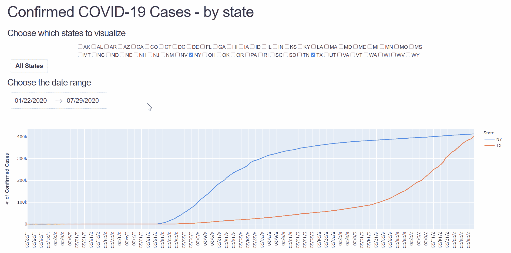
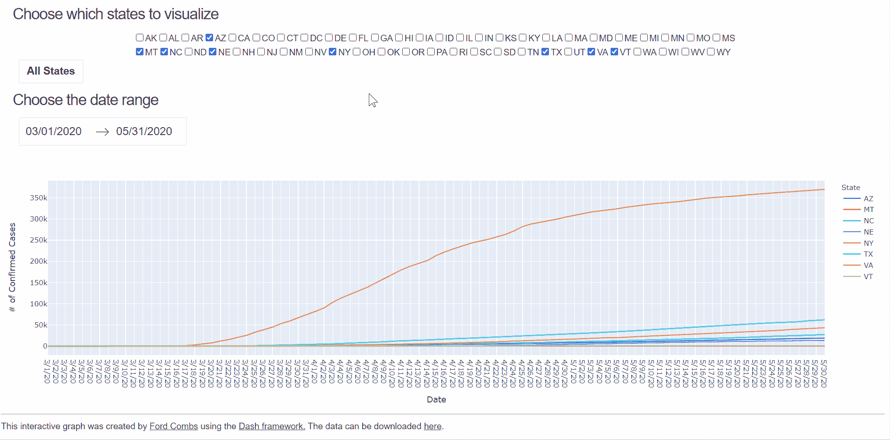

# 新冠肺炎确诊病例——一个交互式网络应用程序

> 原文：<https://towardsdatascience.com/covid-19-confirmed-cases-an-interactive-web-app-d5d6de3c0ad3?source=collection_archive---------53----------------------->

## 我如何使用 Dash 来制作我想看的图表

关于新冠肺炎峰值和浪涌的新闻遍布互联网，数据也很容易获得。 [CDC](https://www.cdc.gov/covid-data-tracker/#cases) 、 [USAFacts](https://usafacts.org/visualizations/coronavirus-covid-19-spread-map/) 、 [Worldometer](https://www.worldometers.info/coronavirus/country/us/) 等都有很棒的数据可视化，但有时它们没有你想要的东西。我想看到每个州的新冠肺炎案例的折线图，所以我自己用[破折号](https://dash.plotly.com/introduction)做了这个图。在本文中，我将介绍构建和部署 Dash 应用程序的过程，您可以在这里查看我的应用程序。


选择各个州将其数据添加到图表中

# 破折号

Dash 是一个易于使用的 web 应用程序框架。它允许您用 Python 编写简单的程序，生成漂亮的交互式数据可视化。Dash 应用程序有两个主要部分:1)应用程序布局和 2)回调。首先，让我们弄些样板文件出来。

我的应用程序的`#Data prep code here`如下所示。数据可以在[这里](https://usafacts.org/visualizations/coronavirus-covid-19-spread-map/)下载，数据被读入，一些列被删除。数据框架包含县级确诊的新冠肺炎病例，因此`by_state.groupby`代码将这些数据整合到州计数中。最后，状态 ID 存储在一个列表中，供以后使用。还有几个样式设置用来改变按钮的颜色，稍后会详细介绍。

## 布局

这是你添加应用程序所有不同部分的地方。使用`dash_html_components`，您可以添加 HTML 组件，如标题、段落和 div。使用`dash_core_components`，您可以添加下拉菜单、按钮、图表等。请务必查看 [html](https://dash.plotly.com/dash-html-components) 和[核心](https://dash.plotly.com/dash-core-components)组件的文档，这样您就可以准确地添加您需要的内容。对于我的应用程序，三个最重要的交互式组件是用于选择州的清单、用于选择所有州的按钮和用于选择日期范围的日期选择器。您可以在下面看到应用程序布局的代码。

`dcc.Checklist`组件允许用户选择他们想在图表中看到的州。它的 ID 是`state-select`。`options`来自上述的状态 ID 列表，而`value=['NY','TX'`是初始值。`labelStyle`将复选框和相关的状态 ID 放在一起，否则当浏览器窗口被调整时，它们会被分开。`html.Button`有显示文本、ID、点击次数和样式变量。`dcc.DatePickerRange`允许用户选择他们想要查看的日期。它有最小和最大允许日期以及初始开始和结束日期。初始可见月份决定了当您更改范围时显示的日历月份。



使用交互式日历选择日期范围

图表非常简单；它是用`dcc.Graph`组件声明的。它的 ID 是`'lines'`并且`config=`部分删除了一个模式栏。

## 复试

Dash 应用程序的第二部分包含回调函数。这是赋予应用程序交互性的部分。它有一个简单的格式:有一个 decorator 后跟一个函数。应用程序的输入和输出在`@app.callback`装饰器之后声明。每个输入和输出都遵循格式`(component-id,component-property)`，其中 id 和属性引用回应用程序布局代码。

输出和输入都是列表。我的应用程序中有四个输入，每个都来自布局中描述的一个交互组件。这些输入然后被传递给`update_graph`回调函数。来自`state-select`输入的`value` 被传入`grpnames`，来自`button`的`n_clicks`被传入`clicks`，以此类推。对于我的应用程序，有两个输出都是从`update_graph`回调函数返回的。`Output('lines','figure')`将绘图发送给`dcc.Graph`组件，而`Output('button','style')`组件将样式发送给`html.Button`组件。

`update_graph`功能有几个步骤。首先，按钮的点击次数用于确定是否选择了“所有状态”。如果数量是奇数，则`style`变量被设置为`bl`。接下来，来自`dcc.DatePickerRange`的日期被重新格式化，以符合下载的数据。



单击“所有状态”按钮以可视化每个状态的数据

`plot the data`段创建数据帧的副本，并使用 melt 功能将其从宽格式转换为窄格式。这使得绘图变得容易，你可以在这里了解更多关于这种转换的信息。if/else 代码确定是否选择了“所有状态”,并相应地返回数据的子集。最后，数据被剔除，以包含使用`dcc.DataPickerRange`选择的相关日期。

Plotly.express 用于绘制数据，x 轴为日期，y 轴为确诊病例数，并按州进行着色。注意`x='variable'`和`y='value'`是指 melt 函数生成的列名。`Plot`和`style`从回调中返回，并发送到布局组件，如输出语句中所声明的。

## 与 Heroku 一起部署

[Heroku](https://devcenter.heroku.com/) 是一个云平台，你可以在这里部署各种网络应用。它有很好的文档，易于使用，并支持 python 应用程序。要部署 Dash 应用程序，您可以遵循这里的简单说明。下面是我使用 [WSL](https://ubuntu.com/wsl) 在 Windows 中运行 Ubuntu 终端来部署我的应用程序的步骤。

```
#Step 1
mkdir covid_app
cd covid_app
```

现在，您已经创建了自己的目录并将其刻录到 cd 中，您需要设置一个虚拟环境并安装必要的库。

```
#Step 2
git init
virtualenv venv
source venv/bin/activate
pip install dash
pip install plotly
pip install gunicorn
```

您的目录中至少需要四个文件:1) app.py，2)。gitignore，3) Procfile，4) requirements.txt. app.py 就是你的 Dash app，里面包含了上面描述的代码。的。gitignore 文件应该如下所示:

```
venv
*.pyc
.DS_Store
.env
```

Procfile 没有文件扩展名**并且包含一行简单的代码:**

```
web: gunicorn app:server
```

可以用这个命令生成 requirements . txt:`pip freeze > requirements.txt`。现在，您可以使用 heroku 部署您的应用程序，如下所示:

```
heroku create my-dash-app
git add .
git commit -m 'Initial commit'
git push heroku master 
heroku ps:scale web=1
```

## 零碎东西

你可以在这里查看上述[的 app。这是一个简单的交互式图表，它实现了我很想看到的可视化。我可能会扩展该项目，以包含其他可视化，并将尝试写下我所做的任何补充。也就是说，当你开始自己的 Dash 应用程序项目时，你可能需要注意一些其他的主题。其中之一是`assets`目录。如果您在应用程序目录中创建了其中的一个，您可以包含 css 和 JavaScript 文件来为您的应用程序设计样式和添加功能。你可以在这里](https://bystate-covid-app.herokuapp.com/)了解更多关于那个[的信息。甚至还有专门为生物信息学设计的 Dash Bio 套件。我目前正在攻读生物信息学博士学位，所以我一定会探索这个功能，并在未来的文章中写出来。](https://dash.plotly.com/external-resources)