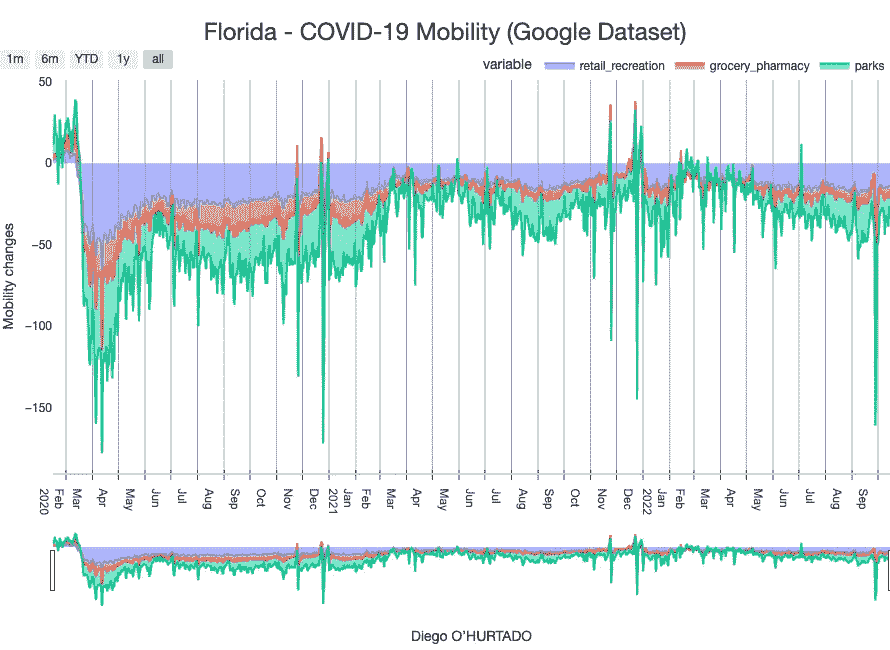
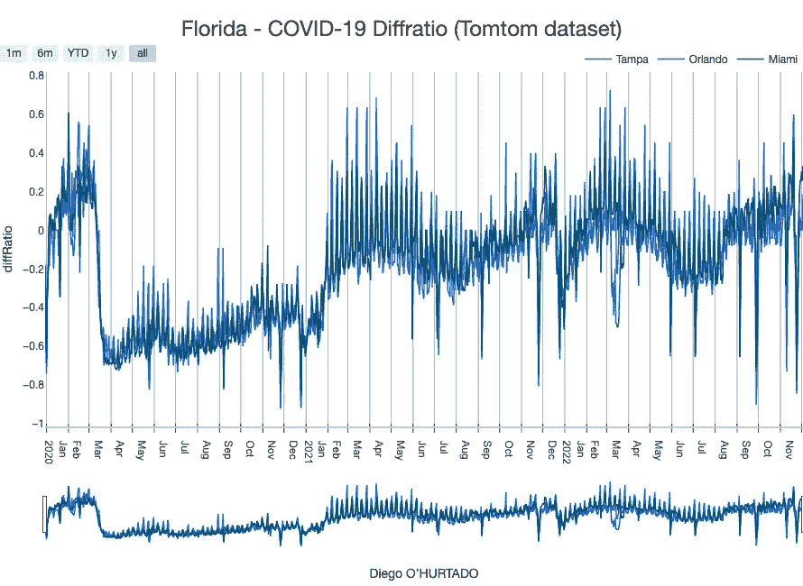
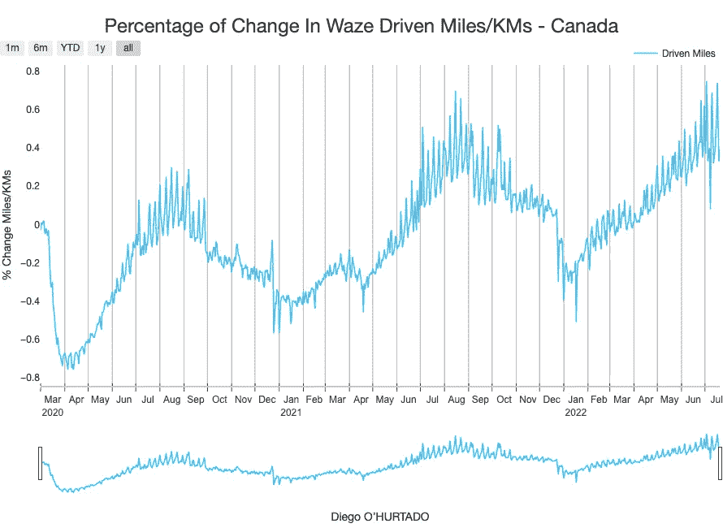
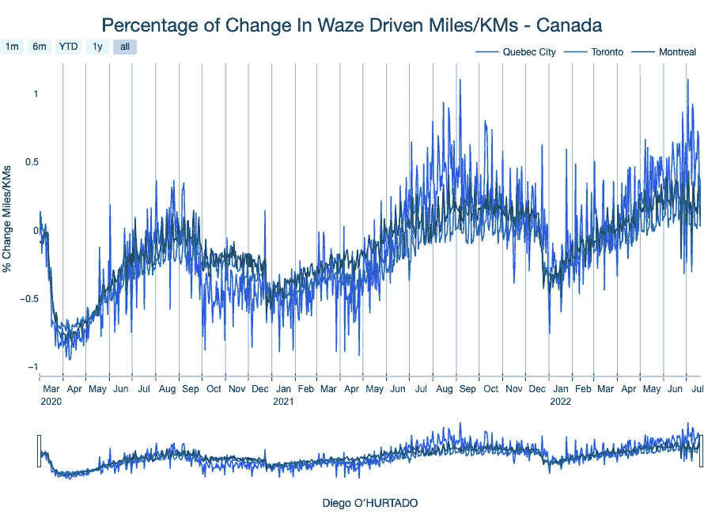
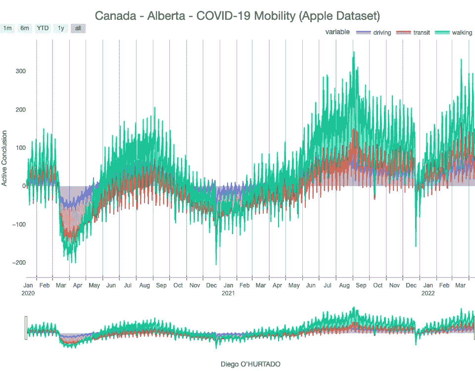

# 北美新冠肺炎疫情的数据分析

> 原文：<https://towardsdatascience.com/covid-19-coronavirus-top-ten-most-affected-countries-c165171c50d7?source=collection_archive---------54----------------------->

## 深入了解新冠肺炎教在北美的传播

北美的新冠肺炎(迭戈·乌尔塔多)

# 介绍

这篇笔记的目的是描述当前北美形势的总体全景，这可以为人们采取有益的社会和健康措施以阻止新冠肺炎的传播服务。

自 2019 年 12 月下旬以来，一种新型冠状病毒疾病的爆发(新冠肺炎；此前被称为 2019-nCoV)在中国武汉被报道，随后影响了全球 210 个国家。总的来说，新冠肺炎是一种急性疾病，但也可能是致命的。由于大量肺泡损伤和进行性呼吸衰竭，严重疾病发作可能导致死亡。截至 2022 年 12 月 3 日，已确诊约 6.45 亿例病例，超过 664 万人死亡。

# 美利坚合众国

该数据集是从“纽约时报”获得的。(2021).美国冠状病毒(新冠肺炎)数据[4]

## 州

# 加利福尼亚

# 得克萨斯州

# 佛罗里达州

# 纽约

# Covid 19 —墨西哥概述🇲🇽

我使用了确诊/死亡病例的时间序列，并结合了 covid 期间个人描述的数据集

**确诊病例(迭戈·乌尔塔多)**

**确诊病例最多的时期。第三波(迭戈·乌尔塔多)**

**死亡病例墨西哥(迭戈·乌尔塔多)**

**死亡病例最多的时期(Diego Hurtado)**

**按年龄划分的死亡病例(Diego Hurtado)**

**按年龄确认病例范围(Diego Hurtado)**

**确诊病例的年龄分布(Diego Hurtado)**

**按性别分列的确诊病例比例(Diego Hurtado)**

**住院人数百分比(Diego Hurtado)**

# 墨西哥的流动性🚗 🇲🇽

> 尽管感染人数激增，墨西哥总统在五月开始了“新常态”来“重新激活”经济

在商店外面，顾客们在等待，没有注意到健康距离。Av。CDMX Eje Central 的华雷斯角。2020 年 5 月 21 日。**图片:***angelica Escobar/福布斯墨西哥版。*

**观察:**

我们可以看到，确认/死亡/流动性在 2021 年 5 月*****【新常态】*** 开始时开始增长**

****

****墨西哥死亡病例(迭戈·乌尔塔多)****

****

****确诊病例(迭戈·乌尔塔多)****

**我使用不同的数据集来了解 Covid 19 期间墨西哥的移动趋势**

****************************************************

**“新常态是一种幻觉，我们正处于流行病活动中，我认为在这个时候提议重新开始社会活动实际上是自杀行为，我认为这会以前所未有的水平重新激活患病和死亡人数”——**马拉奎亚斯·洛佩斯·塞万提斯****

# **加拿大**

## **各省确诊病例**

********************

## **各省死亡案例**

****************************

# ****各州案件****

## **安大略**

********************

## **魁北克省**

********************

## **艾伯塔**

****************

# **顺便说一句:我正在寻找新的工作机会！📊**

****

**我正在寻找一个机会，在那里我可以把这些能力投入到我热爱的任务中去！**

****

> **“当有人问你是否能胜任某项工作时，告诉他们，‘我当然能！那就忙起来，搞清楚怎么做。”—西奥多·罗斯福。**

****

**坐在办公桌前的金毛猎犬贝利(knowyourmeme，2022)**

****LinkedIn**:[https://www.linkedin.com/in/diego-gustavo-hurtado-olivares/](https://www.linkedin.com/in/diego-gustavo-hurtado-olivares/)**

**[**Msc。迭戈·乌尔塔多**](https://www.linkedin.com/in/diego-gustavo-hurtado-olivares/)
**商业分析顾问****

# **催单**

**1918 年的疫情流感是近年来最严重的疫情。它是由带有禽类基因的 H1N1 病毒引起的。尽管对病毒的起源没有普遍的共识，但它在 1918-1919 年间在世界范围内传播。**

**全世界死亡人数估计至少为 5000 万，其中约 675，000 例发生在美国。**

**5 岁以下、20-40 岁和 65 岁及以上人群的死亡率较高。健康人群的高死亡率，包括 20-40 岁年龄组的人群，是疫情的一个独特特征。**

****

**流感疫情图表(Reeve 003143)，国家健康和医学博物馆**

**疫情流感| 1918 年和 1919 年期间美洲和欧洲的死亡率。图表:“疫情流感。1918 年和 1919 年间美国和欧洲的死亡率每周因各种原因造成的死亡，以每年每 1000 人的死亡率表示。包括代表纽约、伦敦、巴黎和柏林的线条。**

> *****我们到了。*****

****

**流感疫情图表(Reeve 003143)，国家健康和医学博物馆**

****结论:****

**本文详细分析了新冠肺炎是如何影响世界的，以及由此得出的见解如何用于下游分析。这些图表还可以应用于其他场景，以推断关键的数据洞察力。**

**我希望你们都喜欢这篇文章。所有的图表都是使用 [Plotly](https://plot.ly/graphing-libraries/) 创建的。Plotly 是一个非常棒的可视化库，用于构建交互式的图形。他们有 Python 和 JavaScript 的图形库。**

**领英:[https://www.linkedin.com/in/diego-gustavo-hurtado-olivares/](https://www.linkedin.com/in/diego-gustavo-hurtado-olivares/)**

****编者按:** [迈向数据科学](http://towardsdatascience.com/)是一份以研究数据科学和机器学习为主的媒体出版物。我们不是健康专家或流行病学家，本文的观点不应被解释为专业建议。要了解更多关于疫情冠状病毒的信息，你可以点击[这里](https://www.who.int/emergencies/diseases/novel-coronavirus-2019/situation-reports)。**

# **参考**

**[1]徐，郑，石，李，王，杨，张，黄，李，张，陈，… &泰，杨(2020).急性呼吸窘迫综合征相关新冠肺炎的病理表现。*柳叶刀呼吸内科*， *8* (4)，420–422。**

**[2]m .卡斯塞拉、m .拉杰尼克、m .科莫、a .杜勒博恩、S. C .、r .迪那不勒斯(2020 年)。冠状病毒的特征、评估和治疗(新冠肺炎)。在 *Statpearls【互联网】*。StatPearls 出版社。**

**[3]世界卫生组织。(2020).冠状病毒疾病 2019(新冠肺炎):情况报告，72。**

**[4]美国和欧洲 1918-1919 年流感死亡率图表|奥的斯历史档案国家健康和医学博物馆(http://www . Flickr . com/photos/medical Museum/5857153474/in/set-72157614214049255)，由 CC-BY-NC-SA(http://creativecommons.org/licenses/by-nc-sa/2.0/uk/)授权**

**[5]《纽约时报》。(2021).美国冠状病毒(新冠肺炎)数据。从[https://github.com/nytimes/covid-19-data](https://github.com/nytimes/covid-19-data)取回【在此插入日期】。”**

**[6]谷歌有限责任公司*《谷歌新冠肺炎社区移动报告》*。
https://www.google.com/covid19/mobility/接入:< fecha >。**