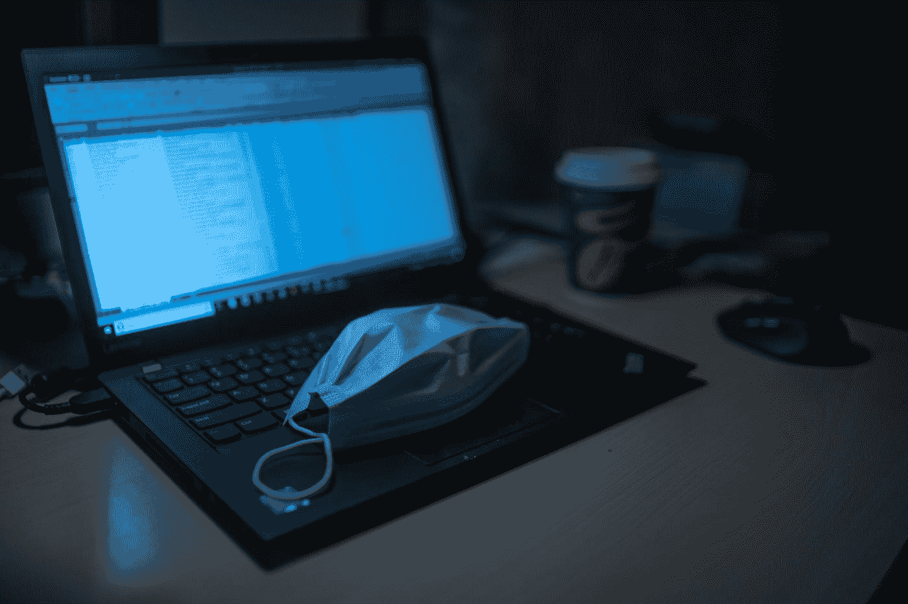
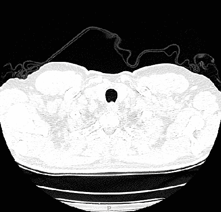
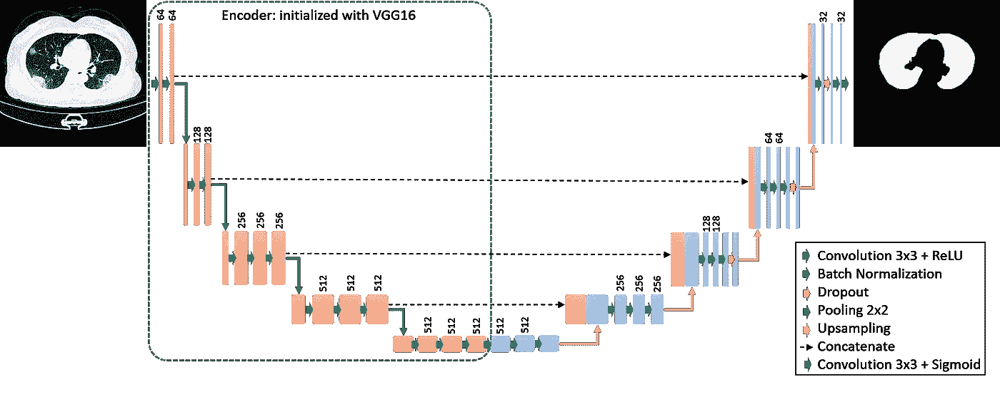
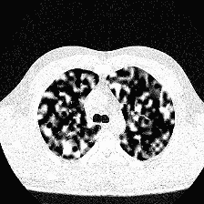
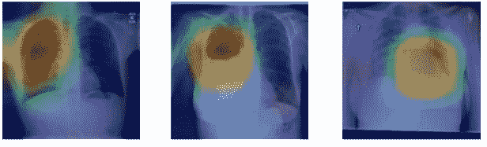
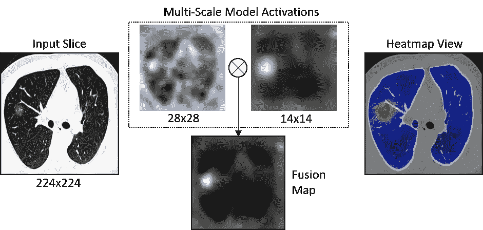
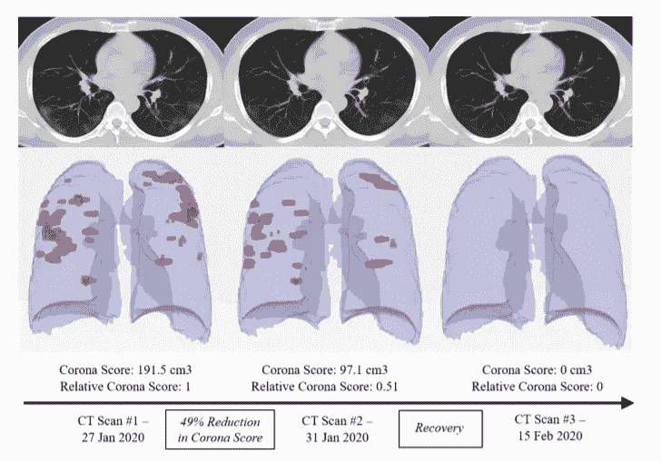

# 使用深度学习的新冠肺炎 CT 分析

> 原文：<https://towardsdatascience.com/covid-19-ct-analysis-using-deep-learning-7342a6ba5a31?source=collection_archive---------52----------------------->

## 我们如何在(几乎)没有数据和注释的情况下开发深度学习新冠肺炎 CT 分析工具

一月中旬，关于中国出现一种导致发烧和咳嗽的新病毒的消息开始传来。

*当时，我们正在与一家中国公司合作，整合我们的胸部 CT 分析工具。该公司开发了一个云 PACS(图片存档和通信系统)，使放射科医生能够远程查看病例并编辑来自多家医院的放射报告。*

*我们注意到胸部 CT 扫描中有肺部异常的患者，这些患者被引导到实验室检查。随着医学成像算法的研究，我们认为可以开发一种解决方案来检测这些发现。*

*当时我们还很天真，无法想象几个月后，全世界都会遭受冠状病毒疫情的侵袭，而我们的新冠肺炎 CT 分析工具将作为新冠肺炎检测和患者监测的工具，为全世界的放射科医生提供服务。*

迪米特里·卡拉斯泰列夫在 [Unsplash](https://unsplash.com?utm_source=medium&utm_medium=referral) 上的照片

首先，我们面临两个问题(这在医学成像领域相当普遍):(1)小数据集——我们只有几个疑似新冠肺炎患者的病例；(2)完全没有注释

在接下来的章节中，我将阐述我们如何使用深度学习工具快速构建新冠肺炎解决方案。*这里提出的思路和方法可以用于任何具有 CT 影像特征的新病毒或疾病，尤其是在数据几乎不可用的初期阶段。*

新冠肺炎 chect CT 分析的深度学习框架[图片由作者提供]

# 1.基于切片的解决方案

CT 扫描包括一系列切片(对于不熟悉 CT 的人，请阅读下面的简短说明)。由于我们对新冠肺炎患者的扫描数量非常有限，我们决定使用 2D 切片代替每次扫描的 3D 体积。
这使我们能够将数据集多元化，并克服小数据集的第一个障碍。使用 2D 切片的另一个原因是对 CT 扫描的切片厚度变化(两个连续 CT 切片之间的 z 边缘)具有鲁棒性的能力。

我们收集了 50 名患者的异常胸部 CT 扫描，这些患者被放射科医生诊断为可疑新冠肺炎。

> [**【CT】**](https://radiopaedia.org/articles/computed-tomography?lang=us)扫描是一种诊断成像程序，它使用 x 射线来构建身体的横截面图像(“切片”)。根据对所研究对象体积中 x 射线束衰减系数的测量来重建横截面。在数据显示在屏幕上之前，常规的重新标度被制成 CT 数，用 [Hounsfield 单位(HU)](https://radiopaedia.org/articles/hounsfield-unit?lang=us) 表示【1】。CT 切片具有高动态范围(通常为 12 位或 16 位)，并以 DICOM 格式提供。

检查 ct 切片[图片由作者提供]

将 CT dicom 文件读取为 numpy 数组的代码示例:

# **2。肺部分割**

分析的第一步是在图像中找到\分割肺部，并在肺部周围裁剪图像。这使得我们可以专注于感兴趣的区域(ROI)进行进一步分析。

用于医学成像分割任务的一种流行的深度学习架构是 [U-net](https://arxiv.org/pdf/1505.04597.pdf)%e5%92%8c%5bTiramisu%5d(https://arxiv.org/abs/1611.09326.pdf) 。原始架构有许多变化，包括我们使用的包含 [VGG16 预训练编码器](https://arxiv.org/pdf/1810.02113.pdf)的架构。

基于 U-net 的肺部分割架构[图片由作者提供]

为了进行训练，我们使用了 6150 个肺部异常病例的 CT 切片及其相应的肺面罩。使用表示肺组织的[-1000，0] HU 的窗口对输入切片进行剪辑(意味着所有大于 0 的值都被设置为 0，所有小于-1000 的值都被设置为-1000)。然后，我们将像素归一化到范围[0，1]，并将图像大小调整为 224x224 像素。

*剪切和归一化 CT 切片的代码示例:*

我们使用随机裁剪、水平翻转和向肺部区域添加正态分布噪声来扩充数据，以提高对感染性肺部(这在新冠肺炎患者中很常见)的分割的鲁棒性。

将噪声添加到肺部区域作为增强(噪声标度=0.1，噪声均值=0.0，噪声标准值= 0.8)[图片由作者提供]

*向图像添加正态分布噪声的代码示例:*

> 这里我们使用了一个私有数据集，但是有几个 CT 扫描的公共数据集，都有相应的肺掩膜( [LUNA16](https://luna16.grand-challenge.org/Data/) 、[肺部 CT 分割挑战 2017](https://wiki.cancerimagingarchive.net/display/Public/Lung+CT+Segmentation+Challenge+2017) 、 [StructSeg](https://structseg2019.grand-challenge.org/Home/) 、 [MedSeg](http://medicalsegmentation.com/covid19/) )。MedSeg 是为新冠肺炎病人准备的。

# 3.新冠肺炎分类器

由于我们已经决定使用 2D 切片，并且由于我们**没有注释**来解决**分类任务**，我们手动将 50 个病例的每个切片注释为正常或异常，这意味着它包含新冠肺炎感染(因为感染在连续切片中可见，这不是一个非常复杂的注释任务！).使用这种方法，我们设法收集了 1865 个 CT 切片的注释数据集:1036 个正常，829 个异常。
为了进一步丰富我们的训练集，我们采用了数据增强技术，包括图像旋转、水平翻转和裁剪。然后，我们使用上文详述的肺部分割来裁剪肺部 ROI，并将每个输入图像的大小调整为 224X224 像素，以基于在 ImageNet 数据库上预训练的 [ResNet-50 架构](https://openaccess.thecvf.com/content_cvpr_2016/papers/He_Deep_Residual_Learning_CVPR_2016_paper.pdf)来训练每个切片的新冠肺炎分类器。使用[迁移学习](/deep-learning-using-transfer-learning-python-code-for-resnet50-8acdfb3a2d38)通常可以提高分类性能，尤其是在训练数据有限的情况下。
由于 ImageNet 分类任务包括 1000 个类别，而我们只需要对 2 个类别进行分类，因此我们移除了预训练模型的最后几层，并添加了两个密集层，然后添加了一个 sigmoid 激活函数。

*加载预训练 ResNet-50 架构并修改最后几层以适应新分类任务的代码示例(使用 Keras):*

# 4.细粒度本地化

*如何输出* ***汉化*** *地图带* ***无标注*** *？*
[Grad-CAM 技术](https://openaccess.thecvf.com/content_ICCV_2017/papers/Selvaraju_Grad-CAM_Visual_Explanations_ICCV_2017_paper.pdf)是[深度学习](https://medium.com/@mrsalehi/a-review-of-different-interpretation-methods-in-deep-learning-part-1-saliency-map-cam-grad-cam-3a34476bc24d)中最常用的解释方法之一(旨在可视化“网络在看”哪里，以对特定目标进行分类)。在医学图像中，这种技术通常用于弱监督定位甚至分割，其中仅通过正常与异常的切片标签来进行监督，以生成定位热图图像。

使用 CAM 技术生成的热图图像示例，用于 X 射线图像中的病理定位。来源: [Rajpurkar，Pranav 等人(2017)](https://arxiv.org/abs/1711.05225)

在 GradCam 生成粗略定位图的同时，我们在两种图像分辨率上采用该技术，并在它们之间进行融合，以生成新冠肺炎感染区域的精细定位图。更具体地说，我们在对应于 ResNet-50 网络的大小为 14X14 和 28X28 的分辨率的激活层上使用 GradCam(在这些分辨率的最后激活层上定义 GradCam 输出)。

这两个贴图被归一化为[0，1]并调整为输入图像形状(224X224)。我们将两个图相乘以生成一个细粒度的定位图，它可以作为热图图像应用于彩色图像:

融合两种分辨率图像的 GradCam 精细定位:热图显示肺部新冠肺炎感染区域的高活性[图片由作者提供]

# 5.案例决策和 3D 概述

在我们为每个 2D 切片生成肺部分割和新冠肺炎定位图之后，我们可以将所有切片的这些结果组合起来，以获得该病例的完整 3D 体积概览。为了将不同切片的定位图融合成平滑的视图，我们应用阈值来获得新冠肺炎感染分割，并使用 3D 高斯模糊。

使用 [*matplotlib*](https://matplotlib.org/) 和[*skim age . measure*](https://scikit-image.org/docs/dev/api/skimage.measure.html)python 库可以在肺部和感染部位生成三维绘图图像:

为了结束病例级分类，我们计算了新冠肺炎分类器检测为阳性的切片数量和属于肺部区域的切片数量。如果它们之间的比率超过预定义的阈值(根据最佳表现设置)，则整个病例被分类为疑似新冠肺炎。

用于监测患者疾病进展的 Corona 评分。资料来源: [O. Gozes 和 M . Frid-Adar 等人(2020 年)](https://arxiv.org/abs/2003.05037)

我们还提出了一个严重性评分，允许医生随着时间的推移跟踪患者的新冠肺炎病——“电晕评分”。通过由新冠肺炎分类器对阳性检测切片的定位图上求和，并乘以切片像素间距(z 轴)来计算分数。电晕得分是以厘米为单位的体积测量。

***参考文献***

[1][https://radiopaedia.org/articles/computed-tomography?lang=us](https://radiopaedia.org/articles/computed-tomography?lang=us)

[2] O .龙内贝格、p .菲舍尔和 t .布罗克斯。 [U-net:用于生物医学图像分割的卷积网络](https://arxiv.org/pdf/1505.04597.pdf)%e5%92%8c%5bTiramisu%5d(https://arxiv.org/abs/1611.09326.pdf) (2015)。医学图像计算和计算机辅助介入国际会议。

[3] M. Frid-Adar 等人[使用带有 imagenet 预训练编码器的 u-net 改善胸部 x 光照片中解剖结构的分割](https://arxiv.org/pdf/1810.02113.pdf) (2018)。运动器官、乳房和胸部图像的图像分析。施普林格，查姆，2018。159–168.‏

[4] K. He 等[用于图像识别的深度残差学习](https://openaccess.thecvf.com/content_cvpr_2016/papers/He_Deep_Residual_Learning_CVPR_2016_paper.pdf) (2016)。IEEE 计算机视觉和模式识别会议录。

[5] RR。Selvaraju 等人 [Grad-cam:通过基于梯度的定位从深度网络进行视觉解释](https://openaccess.thecvf.com/content_ICCV_2017/papers/Selvaraju_Grad-CAM_Visual_Explanations_ICCV_2017_paper.pdf) (2017)。IEEE 计算机视觉国际会议论文集。

[6] O. Gozes 等人[冠状病毒(新冠肺炎)疫情的快速人工智能开发周期:使用深度学习 ct 图像分析进行自动检测的初步结果&患者监测](https://arxiv.org/abs/2003.05037) (2020)。arXiv 预印本 arXiv:2003.05037。

提出的新冠肺炎检测和定位方法是作为我作为算法开发负责人工作的 RADLogics 的初始工具开发的。

这是我的第一个媒体博客——希望你喜欢！【maayan.frid@gmail.com】随时给我写信