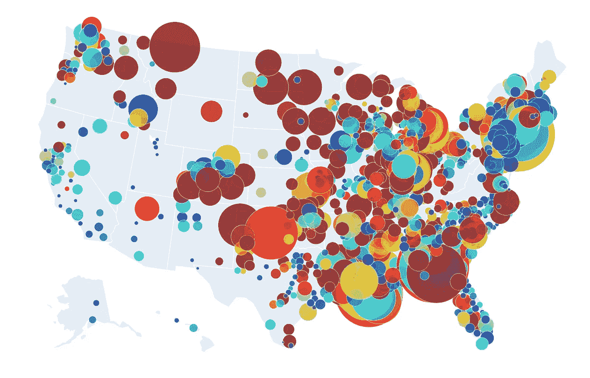
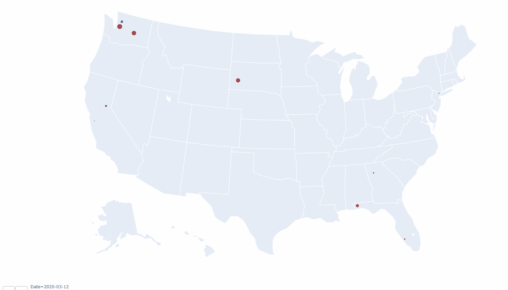
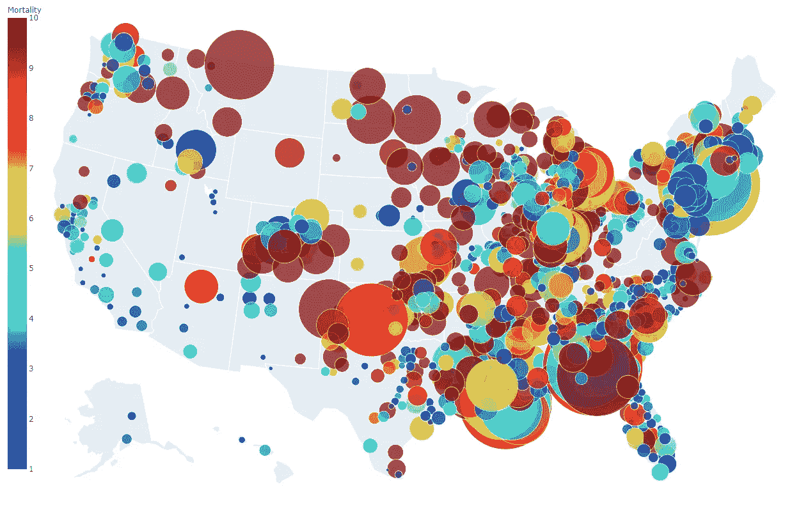
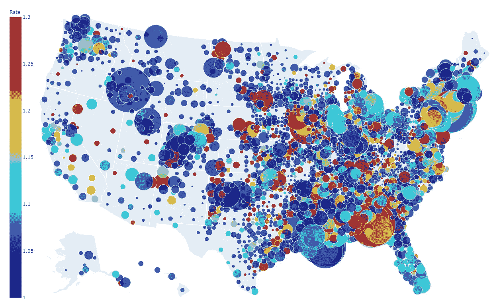
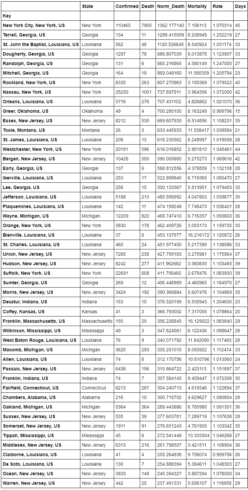
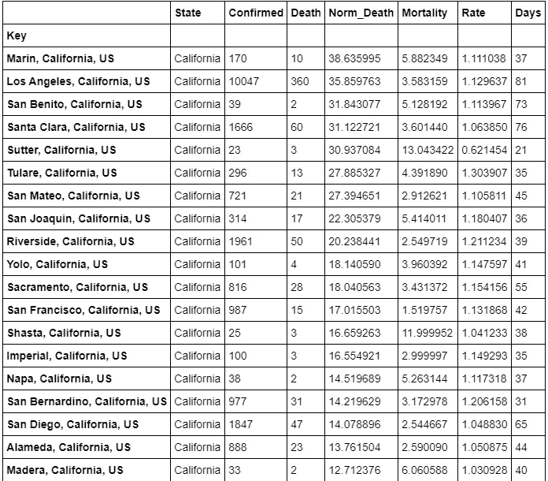
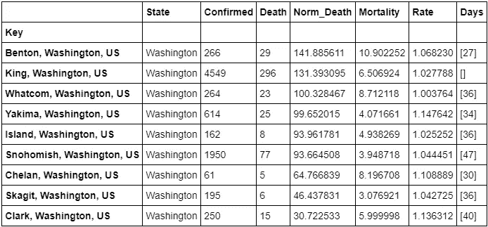
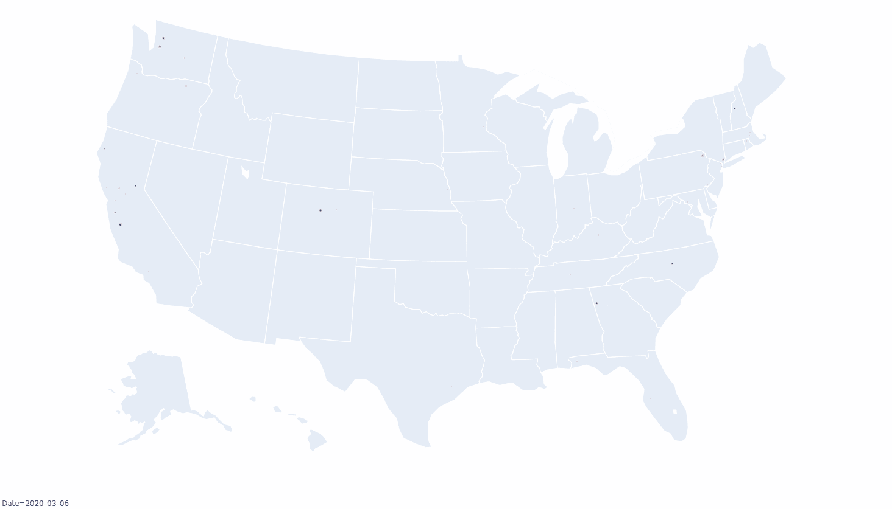

# 揭示美国巨大鸿沟的开源新冠肺炎仪表板——第二部分

> 原文：<https://towardsdatascience.com/covid-19-dashboard-1910df63f14e?source=collection_archive---------48----------------------->



**基于[约翰·霍普斯金大学的数据](https://github.com/CSSEGISandData/COVID-19)(最后更新于 2020 年 4 月 14 日)用[新的开源代码](https://github.com/sidbannet/COVID-19_analysis)生成了一张美国新冠肺炎**互动地图

为什么**基于地区、数据驱动的**决策有理由开放全球最大的经济体——为什么*位于*的迪凯特是当前的 COVID 热点，而加州的*旧金山*却不是

> “我们相信上帝，所有其他人都必须带来数据。”—[w·爱德华兹·戴明](https://quotes.deming.org/authors/W._Edwards_Deming)

问当前的问题是:在数周的封锁后，我们何时以及如何开放这个国家，以减缓新冠肺炎的蔓延？缓解措施有效吗？从目前的数据中我们可以了解到什么？为了回答这个问题，可视化数据非常重要，它能让我们更好地了解我们生活的这个疫情时期的事态。[约翰·霍普斯金·新冠肺炎仪表板](https://coronavirus.jhu.edu/us-map)在展示新型冠状病毒的传播方面给人留下了非常深刻的印象，但我注意到了两个大缺陷。

*   它没有显示病例数随时间的增长
*   一个地区的确诊病例或死亡人数与其人口规模无关

诚然，像加利福尼亚州的圣弗朗西斯科、伊利诺伊州的芝加哥和 T21 这样的大城市，由于人口众多，自然会有更多的新冠肺炎病例，而不是像阿拉巴马州的农村地区或印第安纳州的农村地区。较低的病例数或报告的死亡数是否是回答我们在个别地区很好地控制这种病毒的完整措施？答案是没有。为了看到数据所说的，人们必须在他们的仪表板中考虑当地人口。因此，我使用 python 编写了一个[软件代码来分析和呈现新冠肺炎数据，并使用 GitHub 的代码库平台使其免费可用【我在本系列文章的](https://github.com/sidbannet/COVID-19_analysis)[第一部分](/covid-19-trends-corona-virus-in-numbers-8725c25b636d)中发布了关于该软件的所有内容】。



**图 1** :交互式新冠肺炎仪表盘显示了美国各县新冠肺炎死亡人数的历史和地理增长。气泡的大小代表每百万人口的死亡人数，颜色代表新冠肺炎县的死亡率

**图 1** 展示了提议的新新冠肺炎仪表板的重要特征。您可以与历史上任何时间点的数据进行交互，并查看病例数在几天或几周内的增长情况。您可以将鼠标悬停在感兴趣的特定区域上，查看那里的 COVID 案例的详细统计数据。气泡的大小和颜色包含了关于病例数或死亡数(用该县的人口数标准化)以及该地区死亡率的重要信息。

## 那么可视化热点需要考虑哪些重要因素呢？

由于缺乏广泛的检测，确诊病例数低于受病毒影响的总人数。因此，不幸的是，死亡人数是衡量这种传染病传播的更可靠的方法。本文中考虑的数据分析的重要因素有:

*   *人均* ***死亡人数*** *全县*
*   *人均* ***确诊*** *冠状病毒病例*
*   ***死亡率*** *:每 100 例确诊病例死亡人数*
*   ***率****:3 天确诊病例数增长*
*   ****天数*** *自首例确诊病例**

*如果某个特定县的*死亡率很高，这意味着要么对受病毒影响的真实人口进行了总体漏报，要么表明该县的医疗系统面临潜在的严重压力，要么该县有相当大比例的弱势人口因病毒而患重病。另一方面，一个地方最糟糕的一天还在后头，如果是确诊病例的 ***增长率*** 高于全国平均水平。自第一例病例以来的 ***天数*** 显示了一个特定的县在其独特的病毒传播轨迹中所处的位置。通常随着一个县的发展，曲线变平的时间越长，距离第一个案例的时间就越长。因此**较低的死亡率、较低的增长率和自第一例病例以来比全国平均水平多的天数意味着一个社区比美国的许多其他社区做得更好*。*** 为了重开经济，一个基于区域的数据驱动的决策预计会考虑所有这些因素。**

# **美国的新冠肺炎热点在哪里？**

***本文图表最后更新于 2020 年 4 月 14 日***

**基于每百万人口死亡人数的美国各县排名揭示了美国在抗击疫情方面的分歧。两张图片显示了美国各县是如何应对疫情的。**

****

****图 2** :基于每百万人口死亡人数的美国新冠肺炎热点地区(截至 2020 年 4 月 14 日)**

****

****图 3** :基于每百万人口确诊病例的新冠肺炎热点(截至 2020 年 4 月 14 日)**

****

****表 1** :美国新冠肺炎热点县，按人均死亡人数排名(截至 2020 年 4 月 14 日)**

****图 2** ，是一个`geo-scatter`图，其中每个气泡代表美国的一个县。气泡的大小表示每百万人口中*死亡人数，气泡的颜色表示 ***死亡率*** 死亡率。最大的泡沫遍布美国东海岸和中西部地区。令人惊讶的是，美国西海岸各县的*死亡人数相对于其人口数量要少。当地各县的死亡率差异很大。****

*****图 3** ，也是`geo-scatter`，但气泡大小代表 ***确诊*** 病例相对于该县人口的数量，颜色代表*比率，即过去 3 天报告的新型冠状病毒病例的快慢。在 ***确诊*** 病例的`geo-scatter`中可以看到美国大分水岭，如图**图 2** 所示。美国东部和中西部地区受到疫情的重创，而西海岸相对较好地遏制了疫情。基于**确诊病例*南达科他州**科罗拉多州**俄克拉荷马州**密西西比州**路易斯安那州**佐治亚州**佛罗里达州*狭长地带。分散在中西部和山区的一些地区，确诊病例的数量每 2 到 3 天翻一番。******

******表 1** 按百万分之*死亡人数降序排列了至少有 500 人和 3 例 COVID 死亡的美国县。不足为奇的是，纽约州的 T42 是受这种病毒打击最严重的县，每百万人口中有将近 1400 人死亡。随着 ***死亡率*** 率约为 7 %(美国平均报告死亡率为 4.2%) *纽约，NY* 可能仍有大量未报告的冠状病毒感染病例。随着~110k ***确诊*** 病例于 4 月 14 日(本文日期)*纽约*于其第 45-*日标志以来第一例 COVID 病例在那里出现。******

*****令人惊讶的是，像佐治亚州埃尔勒尔县这样的地方。，格里尔县，OK。路易斯安那州比恩维尔县。堪萨斯州科菲县。亚拉巴马州钱伯斯县。位于印第安纳州迪凯特县。根据每百万人口中的*死亡人数，美国排名前 30 的热点城市有。令人惊讶的是，一些人口密度高的大城市地区，如伊利诺伊州的芝加哥或加利福尼亚州的旧金山，在处理这场危机中表现相对较好。这张表显示的是美国印第安纳州的迪凯特县。在这个疫情的中心，每百万人口中有 375 人*死亡，自从第一个病例出现以来，在第 23-*天。这一统计数字堪比在受灾严重的密歇根州韦恩县(底特律，密歇根州)每百万人中有 460 人*死亡以及在其第 36-*日以来的首例。**********

## *****那么到目前为止，加州和华盛顿的情况如何？*****

**********

*******表 2** :加利福尼亚州的新冠肺炎热点县，按每 100 万人口中的死亡人数排名*****

*****因此，为了知道西海岸各州是否真的做得更好，我用类似的标准列出了*【人口】中死亡人数**加州 ( **表 2** )和*华盛顿州* ( **表 3** )的县。挑出这两个州背后的合理性来自于这样一个事实，即新冠肺炎在美国的爆发首先发生在华盛顿州的西雅图和加利福尼亚州的旧金山附近的县。********

****在加州，*马林、洛杉机、圣克拉拉*等县仍然高居*加州*之首，每百万人中有 27 至 38 人*。自从那里出现第一例病例以来，在 85 天*内，洛杉矶县每百万人口中约有 35 人 ***死亡。确诊病例增长率*为每三天 1.12。旧金山湾区的各县在遏制疫情方面做得相对较好，在第一例病例出现后的第 75-*天，每百万人中有 17 至 38 人*。与美国中西部的农村地区相比，这一数据显示旧金山在减轻新冠肺炎方面做得更好。************

********

******表 3** :佤邦的新冠肺炎热点县，按每 100 万人口的死亡人数排列****

****当华盛顿州金县的一家疗养院报告冠状病毒爆发时，全国首次开始关注新冠肺炎。如今，每百万人中约有 131 人*死亡，死亡率*约为 6%。这在华盛顿州排名第二。这里的情况可能是，大量老年人集中在一个县，导致高于平均水平的死亡率。******

*******【更多未来分析将基于读者的兴趣和反馈】……*******

# *****用于重新生成仪表板和分析新冠肺炎数据的开源代码片段*****

*****与仪表板互动对于真实感受每个县在抗击疫情中所处的位置非常重要。下面是代码片段，让您生成相同的分析，并与**图 1** 和 **4** 中显示的仪表板进行交互。*****

## *****首先克隆 git 存储库*****

*****使用 Google 的[合作实验室](https://colab.research.google.com/notebooks/intro.ipynb#recent=true)很容易用简单的代码片段克隆我的 GitHub [库](https://github.com/sidbannet/COVID-19_analysis)和所有的依赖项。*****

```
****# Clone repository*
!git clone https://github.com/sidbannet/COVID-19_analysis.git
%cd ./COVID-19_analysis
!git submodule init
!git submodule update --remote***
```

## ****在 python 控制台中加载包和工具****

****克隆存储库后，使用 Jupyter Notebook 的单元:****

*   ****导入分析类****
*   ****导入绘图工具****

```
***# Import nessesary modules*
**from** **tools** **import** collection **as** cll
**import** **plotly.tools** **as** **tls**
**from** **plotly.offline** **import** iplot
**import** **plotly.express** **as** **px****
```

## ****解析数据****

****代码是使用面向对象的编程风格编写的。因此对象`d`被定义为包含分析所需的所有方法和属性。****

*   ****定义一个对象`d`(你可以在这里命名任何其他名称)作为类`cll.DataClass()`的实例****
*   ****使用`d.parse()`和一个受保护的方法`d._parse_timeseries_()`解析数据****
*   ****`df_us`包含解析数据的 panda DataFrame 是否是以后用于仪表板的必要可视化数据****

```
***# Setup data class and parse the database* 
d = cll.DataClass() 
d.parse()
d._parse_timeseries_() 
df_us = d.df_geo_us**
```

## ****获取动画仪表板****

****由于与马萨诸塞州杜克斯和楠塔基特县人口规模相关的数据库中的错误，我们做了一个小的更正。****

```
**df_us.Population.values[cll.np.where(df_us.Key == 'Dukes and Nantucket,Massachusetts,US')] = 17352

df_us.Number_Cases_per_1mil.values[cll.np.where(df_us.Key == 'Dukes and Nantucket,Massachusetts,US')] = \
    df_us.Confirmed.values[cll.np.where(df_us.Key == 'Dukes and Nantucket,Massachusetts,US')] \
    / df_us.Population.values[cll.np.where(df_us.Key == 'Dukes and Nantucket,Massachusetts,US')]

**for** inum, value **in** enumerate(df_us.Number_Cases_per_1mil.values):
    df_us.Number_Cases_per_1mil.values[inum] = cll.np.floor(value)# Get the time string for plotly functionality
date_time = [str(date) **for** date **in** df_us.Date]
date_str = [str.split(date, ' ')[0] **for** date **in** date_time]
df_us.Date = date_str**
```

*   ****使用`plotly`获得动画仪表盘****

```
**fig = px.scatter_geo(df_us,
                     lat="Lat", lon="Long",
                     color="Rate",
                     color_continuous_scale='jet', range_color=[1.0, 2.0],
                     hover_name="Key",
                     hover_data=['Population', 'Confirmed', 'Death'],
                     size="Number_Cases_per_1mil",
                     animation_frame="Date",
                     title='Confirmed Cases per 1 mil population',
                     size_max=int(4000000),
                     width=2000, height=1000,
                     scope = 'usa',
                     projection="albers usa")
fig.show()**
```

****这将显示基于每个县确诊病例的交互式仪表板(**图 4** )。****

********

******图 4** :交互式新冠肺炎仪表盘，显示美国各县新冠肺炎病例的历史和地理增长情况。气泡的大小代表每百万人口的确诊病例数，颜色代表新冠肺炎的本地增长率****

****要获得类似的仪表板(**图 1** )，但报告了 COVID 的死亡，请在单元格中使用以下代码片段:****

```
***# Doing some pre-analysis*
df_us['Norm_Death'] = (df_us.Death / (df_us.Population + 0.0001)) * 1e6fig = px.scatter_geo(df_us,
                     lat="Lat", lon="Long",
                     color="Mortality",
                     color_continuous_scale='jet', range_color=[1.0, 10.0],
                     hover_name="Key",
                     hover_data=['Population', 'Confirmed', 'Death'],
                     size="Norm_Death",
                     animation_frame="Date",
                     title='Deaths per million in county',
                     size_max=int(8000000),
                     width=2000, height=1000,
                     scope = 'usa',
                     projection="albers usa")
fig.show()**
```

****开源新冠肺炎仪表板 GitHub 要点****

****[](https://medium.com/@sidbannet/membership) [## 通过我的推荐链接加入 Medium 悉达多·班纳吉博士

### 作为一个媒体会员，你的会员费的一部分会给你阅读的作家，你可以完全接触到每一个故事…

medium.com](https://medium.com/@sidbannet/membership)****