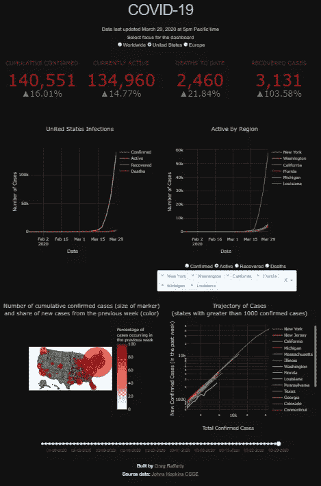
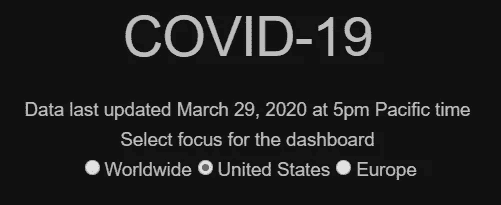
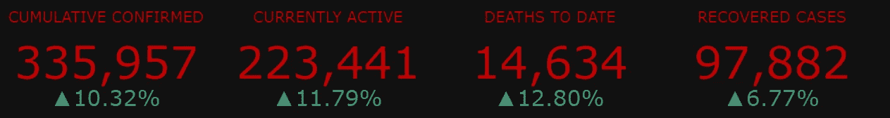
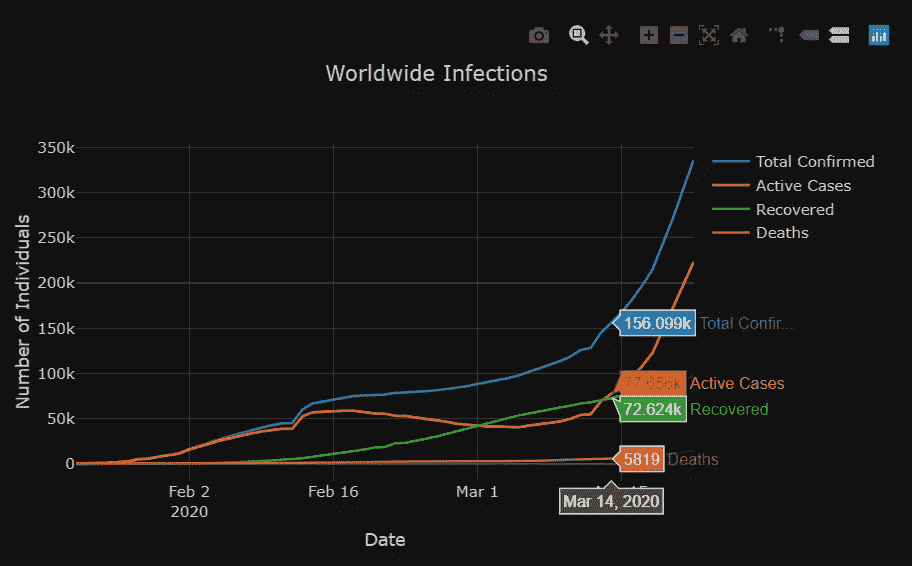
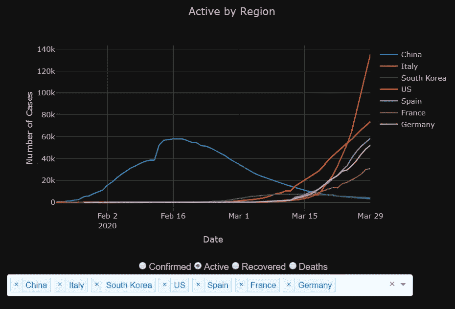
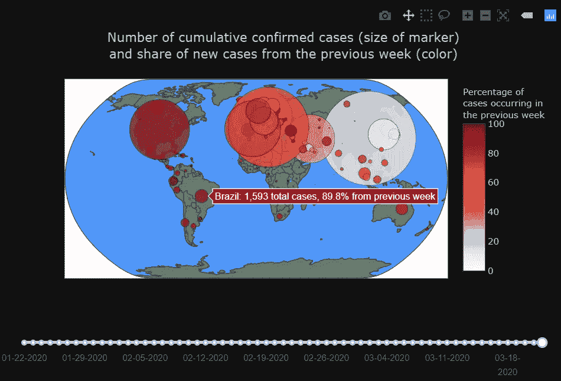
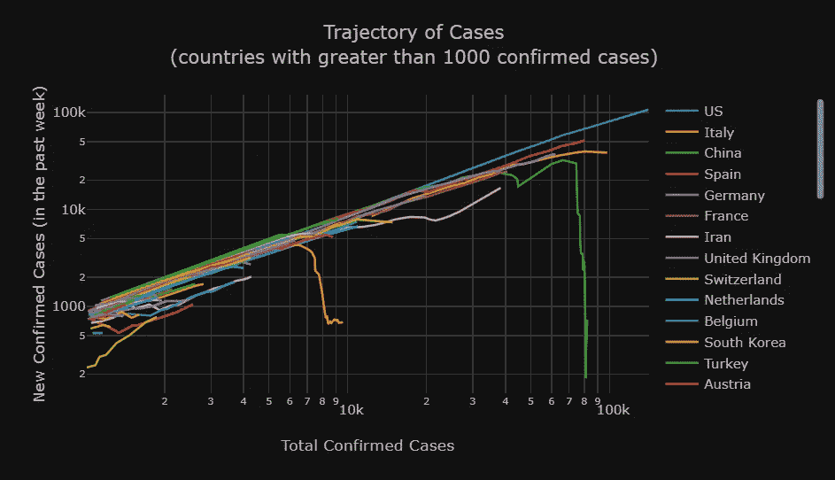

# 新冠肺炎仪表板

> 原文：<https://towardsdatascience.com/covid-19-dashboard-b7f8b7c59431?source=collection_archive---------16----------------------->

## 我使用 Dash 构建了一个基于 web 的仪表板来可视化疫情

> 被困在付费墙后面？点击[这里](/covid-19-dashboard-b7f8b7c59431?source=friends_link&sk=052bfd87662775d68c5e8b15efcc8aff)阅读完整的故事和朋友链接！

我是 Greg Rafferty，湾区的数据科学家。这个项目的代码可在我的 [GitHub](https://github.com/raffg/covid-19) 和仪表板在[https://covid-19-raffg.herokuapp.com/](https://covid-19-raffg.herokuapp.com/)现场。

我用 Python 和 [Dash](https://dash.plot.ly/) 构建了一个 web dashboard，图表用 [Plotly](https://plot.ly/) 制作。数据由约翰霍普金斯系统科学与工程中心提供，并在太平洋时间每晚 5:30 自动更新到仪表板上。

# **焦点选择**

仪表板可以在全球范围内设置在疫情上，或者通过顶部的单选按钮集中在美国或欧洲:

此按钮更改每个显示图表的基础数据，以反映选定的区域。

每天晚上大约 5 点，约翰霍普金斯大学用当天的新病例更新他们的数据源。我的仪表板自动运行一个 ETL 脚本来下载新数据，将其处理成仪表板要求的格式，并上传到 Heroku。这里的标题声明了数据最近更新的时间。

# **组件**

仪表板有五个主要组件:指标、所选区域的感染率、按子区域的病例分析、感染图和轨迹图。

## **指示器**

共有四个指标，每个指标都由红色的当前值和绿色的与昨天相比的百分比变化组成。

*   **累计确认**是所选地区所有检测并确认病例的累计总数。
*   **当前活动**仅测量今天活动的案例。它被计算为`ACTIVE = CONFIRMED — DEATHS — RECOVERED`
*   **迄今死亡人数**衡量所有新冠肺炎相关死亡人数的累计总数
*   **痊愈病例**是指患者被认为已经从疾病中康复，不再被感染或传染的病例数。

## **传染病**

感染图表按日期显示所选地区的`CONFIRMED`、`ACTIVE`、`RECOVERED`和`DEATHS`的总数。将鼠标悬停在图表上，将显示特定日期的每个指标的计数。使用鼠标，您可以放大和缩小，或者单击并拖动以选择要放大的框。此外，将鼠标悬停在图表(或控制面板上的任何图表)上，可以看到图表右上角的几个控制按钮。每个图表的选项略有不同，但特别有用的是将图表重置回原始缩放级别的能力。

## **按分区域分列的案例**

病例图形按`CONFIRMED`、`ACTIVE`、`RECOVERED`或`DEATHS`子区域显示折线图，可通过图表下方的单选按钮进行选择。如果选择的地区是`Worldwide`或`Europe`，显示的子地区是国家。如果选择的区域是`United Sates`，则子区域是状态。悬停时，将为鼠标悬停的子区域显示所选指标的准确计数。

默认情况下，它显示创建该仪表板时特别感兴趣的子区域。底部的下拉栏允许您选择不同的子区域进行显示，可以是`Worldwide`和`Europe`焦点所在的国家，也可以是`United States`焦点所在的州。在下拉栏中输入将允许您搜索子区域。

与此仪表板上的其他两个折线图一样，单击图例中的某个项目会暂时从图表中删除该项目。再次点击会将其添加回去。双击一个项目将删除所有其他项目，并隔离图表上的单个项目。再次双击将添加回所有项目。

## **感染地图**

感染图在每个子区域上都有一个圆形标记。标记的大小与该子区域内`CONFIRMED`病例的平方根相关，颜色表示前 7 天内新确诊病例的百分比。从本质上来说，标记的大小是衡量自爆发开始以来该次区域内有多少人感染了该病毒，颜色是衡量该病毒目前的活跃程度，深红色表示该病毒正在积极传播，白色表示它已得到控制。将鼠标悬停在一个标记上，将显示国家名称和这两个度量的确切值。与其他图表一样，地图可以缩放和拖动。图表下方是控制地图显示数据的日期的滑动条。默认情况下，它被设置为最近的可用日期，但通过向左拖动，您可以看到疫情随时间的分布。

## **轨迹**

该图表显示了疫情在子区域内的轨迹。x 轴按子区域显示累计确认数，y 轴显示上周确认的案例数。通过这种可视化，一旦某个次区域在某种程度上成功控制了疫情，该线应该会突然下降，如图中的中国(绿色)和南朝鲜(橙色)所示。虽然`date`不在任何一个轴上，但数据仍然按日期绘制；将鼠标悬停在任一行上将显示该数据点的记录日期。此外，底部的日期滑块也控制这个图表；因此，随着地图的出现，轨迹随时间的变化可以被观察到。