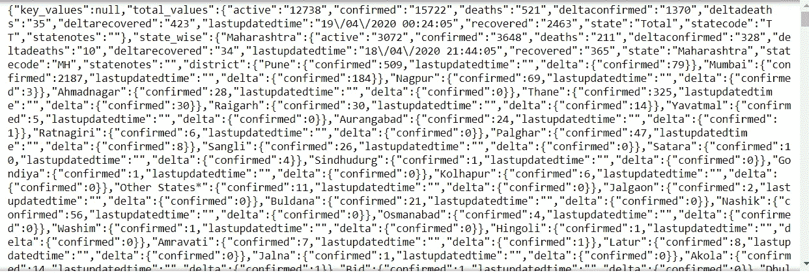
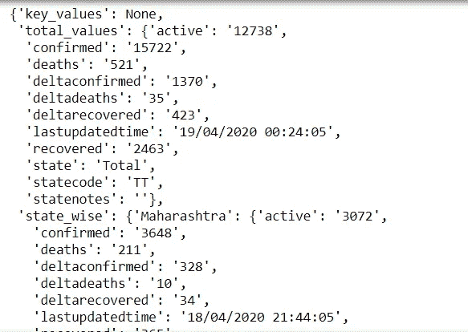
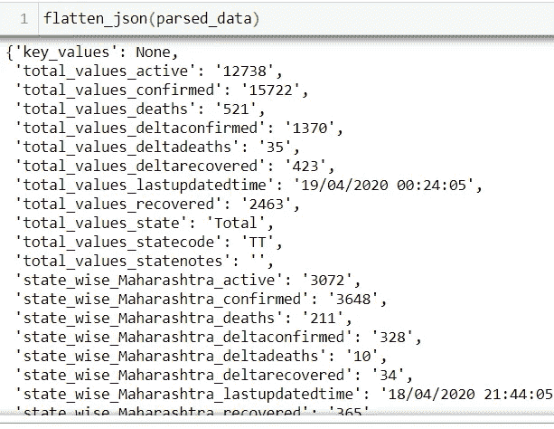
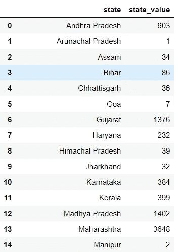
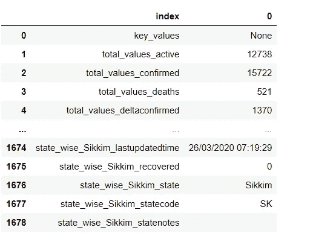
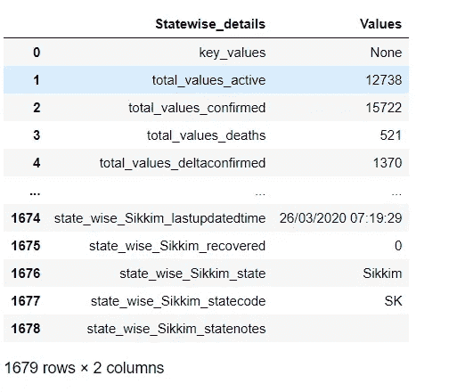
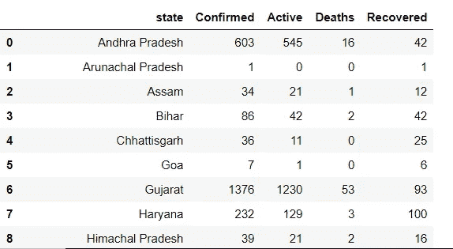

# 新冠肺炎数据收集:Python 和 API 的故事。

> 原文：<https://towardsdatascience.com/covid-19-data-collection-a-python-api-story-347aafa95e69?source=collection_archive---------33----------------------->


[图像来源](https://unsplash.com/)

本文将简要讨论使用 python 从 API 收集数据。这方面的议程如下。

1.  *使用 python 连接 API*
2.  将收集的数据解析为 CSV 格式
3.  一点点蟒蛇熊猫的味道

**API-应用编程接口:**

假设你想在你的程序中使用其他网站数据。你有不同的选择。你可以使用 BeautifulSoup 和 Scrapy 来抓取网站，也可以使用一个界面来帮助你和你的程序交流。那个接口就是 API。

更详细地说，如果网站有 API，你可以将你的 connect 应用程序连接到互联网，它会将数据发送到服务器。然后，服务器检索数据，并根据您的应用程序执行某些操作。这主要是通过 API 实现的

## 那么安全问题呢？

现代 API 具有多层安全特性。当您的应用程序向服务器发送请求时，当目标网站发送响应时，它们永远不会完全暴露在互联网上。这两种通信都是通过小数据包和按需共享的信息进行的。这是如此的可信，以至于很多大公司都是通过 API 来获得收入的。下面是关于 API 为什么有用的几点。

1.  现代的 API 遵循 HTTP 和 REST 的标准，对开发人员友好。
2.  这些不仅仅是一段代码，而且是为特定受众的消费而构建的。
3.  API 的构建遵循适当的安全性、治理。它在 SDLC 中开发，并受到全面监控。

这个博客致力于使用 python 连接一个 API，同时我也会让你知道熊猫库的一些技术。这里我将使用新冠肺炎 API。你可以从 rapid-api 网站得到那个 API。这些人在制作不同的 API 方面做得很好。我会推荐访问网站或者你可以做一个自己用的 API。这个网站的好处是，你可以得到不同编程语言的样本代码。

先决条件:

1.  python 3 的本地开发环境
2.  API URL 和密钥

在这里，密钥被用作第一安全措施来识别所请求的数据是真实的。它用于防止不道德地使用原料药。

> 让我们开始编码吧。

步骤 1-导入这些必要的库

```
import json 
import pandas as pd
import requests
```

步骤 2-获取 API URL 和密钥并发送请求

```
url = “[y](https://corona-virus-world-and-india-data.p.rapidapi.com/api_india)our url"headers = {
 ‘x-rapidapi-host’: “api host”,
 ‘x-rapidapi-key’: “api token”
 }response = requests.request("GET", url, headers=headers)
print(response)
```

如果响应为 200，则表示请求成功。

通常，API 有关于 API 细节及其用途的文档。一些 API 服务有 API 包装器，需要安装在你的电脑上才能访问 API。

API 可能包含 JSON、XML 或任何定制格式的数据。为了解析数据，你可以在 python 中使用不同的库。请求和响应头通常包括请求头和密钥。这是关于您使用 API 服务的当前信息。

> 瞧啊。！！你拿到结果了。



版权所有 Somesh

但是我得到的数据就像一个嵌套的 JSON 数据结构。让我们进一步处理它。

步骤 3-解析 JSON 数据

```
parsed_data = json.loads(response.text)
print(parsed_data)
```



版权所有 Somesh

JSON 数据似乎更有条理。但是这些仍然是嵌套形式。让我们来弄平这个 JSON

```
def flatten_json(json):
   dict1 = {} def flatten(i, name=’’): if type(i) is dict:
         for a in i:
             flatten(i[a], name + a + ‘_’)
      else:
         dict1[name[:-1]] = i flatten(json)
   return dict1df = pd.DataFrame.from_dict(flatten_json(parsed_data), orient=’index’)
```

flatten_json()将帮助您在单个 json 结构中制作嵌套的 json。



版权所有 Somesh

这个 JSON 很容易转换成 DataFrame。你得到的 csv 格式的数据是一列数字值。你看到的按字母顺序排列的数据实际上是索引。

> **让我们在数据集**中应用一些熊猫技术

1.  **全州确诊病例**



版权所有 Somesh

```
states = [‘Andhra Pradesh’,’Arunachal Pradesh’, ‘Assam’, ‘Bihar’, ‘Chhattisgarh’, ‘Goa’, ‘Gujarat’, ‘Haryana’,
 ‘Himachal Pradesh’, ‘Jharkhand’, ‘Karnataka’, ‘Kerala’, ‘Madhya Pradesh’, ‘Maharashtra’, ‘Manipur’,
 ‘Meghalaya’, ‘Mizoram’, ‘Nagaland’, ‘Odisha’, ‘Punjab’, ‘Rajasthan’, ‘Sikkim’, ‘Tamil Nadu’,
 ‘Telangana’, ‘Tripura’, ‘Uttar Pradesh’, ‘Uttarakhand’, ‘West Bengal’, ‘Andaman and Nicobar Islands’,
 ‘Chandigarh’, ‘Dadra and Nagar Haveli’, ‘Daman and Diu’, ‘Delhi’, ‘Lakshadweep’, ‘Puducherry’,
 ‘Jammu and Kashmir’, ‘Ladakh’]
list1 = []
list2 = []
for i in states:
 list1.append(df.at[‘state_wise_{}_confirmed’.format(i), 0])
 list2.append(i)
df1 = pd.DataFrame(list(zip(list2,list1)), columns=[‘state’,’state_value’])
```

这将有助于您根据各州获得已确认的案例详情

**2 .重置 _ 索引()**

```
df.reset_index()
```



版权所有 Somesh

此处索引已更改。数据帧中的前一个索引已被转换为列。

**3。df.rename()-重命名列名**

```
df = df.rename(columns={“index”: “Statewise_details”, 0 : “Values”})
```



版权所有 Somesh

**4。在[]**

```
print(df.at[4,’Statewise_details’],”:”,df.at[4,’Values’])
```

at[]可帮助您随时访问单元格值。输出如下所示

```
total_values_deltaconfirmed : 1370
```

**5。根据状态为治愈、康复、死亡和确诊病例创建单独的数据帧，并将其合并**

如果您扩展案例 1 的逻辑(**状态确认案例**，您将得到以下结果



版权所有 Somesh

你可以使用熊猫来执行不同的操作。稍后，您可以使用 matplotlib、seaborn 和许多其他库和工具来可视化数据。

这个博客是一种收集数据的方式，这些数据在服务器中不断产生。很快我将带着另一个网络抓取的故事回来。

我希望你喜欢自然语言处理[第一部分](/natural-language-processing-a-beginners-guide-part-i-1a5880cc3bdc) & [第二部分](/natural-language-processing-a-beginners-guide-part-ii-54a1bf8c0497)。在 [**Medium**](https://medium.com/@somesh.routray11) 关注我，或者订阅我的博客了解他们。一如既往，我欢迎反馈和建设性的批评，可以通过 Twitter @RoutraySomesh 联系。