# 熊猫数据框架的新冠肺炎数据处理

> 原文：<https://towardsdatascience.com/covid-19-data-processing-58aaa3663f6?source=collection_archive---------2----------------------->

## 下载、加载、合并、清理和聚合新冠肺炎时间序列数据的分步指南


[安东](https://unsplash.com/@uniqueton?utm_source=unsplash&utm_medium=referral&utm_content=creditCopyText)在 [Unsplash](https://unsplash.com/s/photos/covid-19?utm_source=unsplash&utm_medium=referral&utm_content=creditCopyText) 上拍照

几天前我发表了一篇文章，展示了一步一步构建用于探索冠状病毒传播的[交互式数据可视化的教程。一些人在上面留下了私人笔记，专门询问数据处理步骤。](/interactive-data-visualization-for-exploring-coronavirus-spreads-f33cabc64043)

今天，我张贴一步一步的教程来下载，加载，合并，清理和汇总新冠肺炎时间序列数据。数据由约翰·霍普金斯大学系统科学与工程中心(JHU·CSSE)提供，他们在 Github 的公共页面上分享了他们的数据。约翰霍普金斯 CSSE 汇总了主要来源的数据，如世界卫生组织、国家和地区公共卫生机构。这些数据免费提供，并且每天更新。

在我们进入细节之前，我想给你看一下新冠肺炎数据处理的最终结果。****均为累计数据。*****新增病例*** 均为日明智数据。本数据帧按 ***日期*** 和 ***国家/地区*** 排序。******

**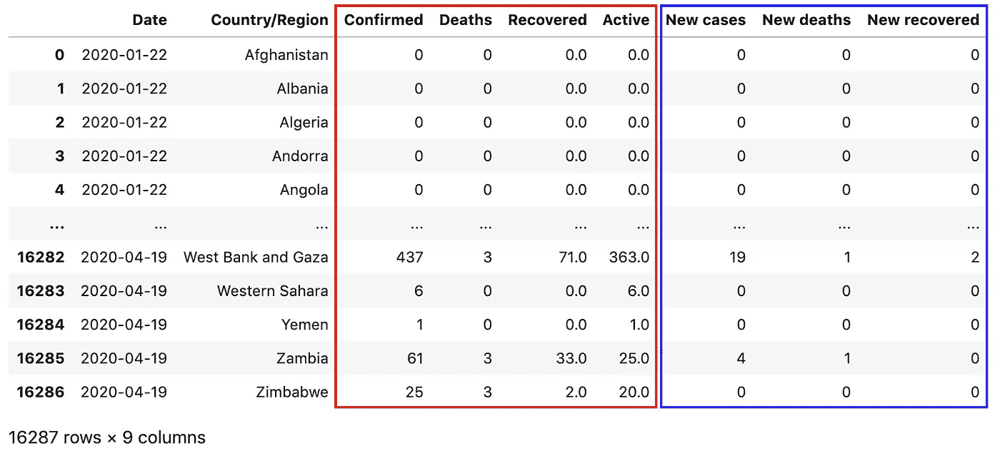**

**新冠肺炎数据处理的最终输出**

**此外，我还要感谢以下项目提供的新冠肺炎数据处理思路:**

*   **[https://github . com/imdevskp/covid _ 19 _ jhu _ data _ web _ scrap _ and _ cleaning](https://github.com/imdevskp/covid_19_jhu_data_web_scrap_and_cleaning)**
*   **[https://www . ka ggle . com/imdevskp/新冠肺炎-分析-可视化-比较/笔记本](https://www.kaggle.com/imdevskp/covid-19-analysis-visualization-comparisons/notebook)**
*   **[https://www . ka ggle . com/neelkudu 28/新冠肺炎-可视化-预测-预测](https://www.kaggle.com/neelkudu28/covid-19-visualizations-predictions-forecasting)**

# **为什么是数据处理？**

**数据处理背后的主要原因是**数据几乎从来不会以一种对我们来说已经准备好的形式出现**。以我个人的经验，花在数据科学项目上的大量时间是在操纵数据上。**

**让我们来看看新冠肺炎的时间序列数据，**

**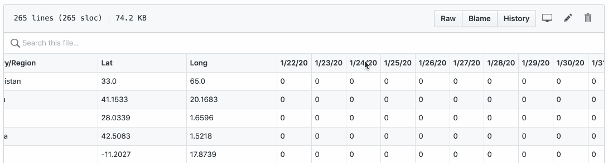**

**以下是我的一些问题:**

*   *****确诊*** ， ***死亡*** 和*保存在不同的 CSV 文件中。这使得我很难在相同的数据可视化中绘制它们。***
*   ***看一下上面的截图。日期实际上显示为列名，这是非常奇怪的数据形状。***
*   ******确诊*** 、 ***死亡*** 和 ***痊愈*** 因数据缺失不完全匹配，部分国家不上报 ***痊愈*** 的省/州级 stat。***
*   **其他缺失值、错误数据类型和三艘游轮报告的案例。**

**本新冠肺炎数据处理教程运行以下步骤:**

1.  **从 JHU CSSE 公共网站 [Github 页面](https://github.com/CSSEGISandData/COVID-19)下载原始 CSV 数据集**
2.  **加载原始 CSV 数据集并提取常用日期列表**
3.  **将原始确认、死亡和恢复的 CSV 数据合并到一个数据框架中。**
4.  **由于缺少值、错误的数据类型和来自游轮的案例，执行数据清理。**
5.  **数据汇总:增加一个活动案例列 ***活动*** ，由`active_case = confirmed — deaths — recovered`计算。将数据聚集到`Country/Region` wise 中，并按照`Date`和`Country/Region`对它们进行分组。之后，加上当日新增 ***病例*** ， ***新增死亡*** 和 ***新增痊愈*** 减去前一日相应的累计数据。**

**在数据处理的最后，我将用 Altair 展示 2 个简单的数据可视化以供演示。**

# **逐步下载，加载，合并，清理和汇总新冠肺炎数据**

**让我们导入我们需要的库**

```
**import pandas as pd
import wget**
```

## **1.下载原始数据集**

**进入约翰霍普金斯 CSSE 公共 [Github 页面](https://github.com/CSSEGISandData/COVID-19)并导航至**csse _ covid _ 19 _ data/CSS _ covid _ 19 _ time _ series/****

**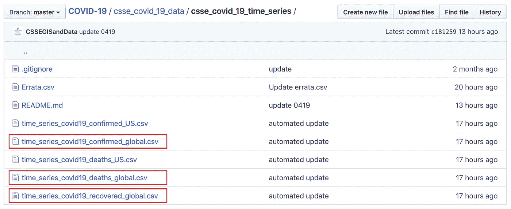**

**单击全局 CSV 数据集，然后单击“原始”按钮获取数据 url。**

**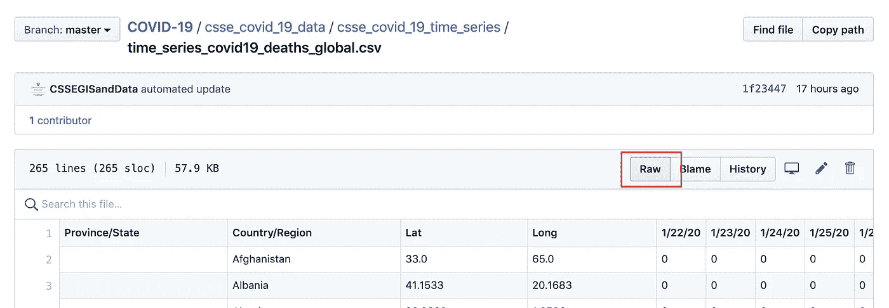**

**然后，将这些 URL 保存在一个集合中，并使用`wget.download()`下载**

```
**# url of the raw csv dataset
urls = [
    '[https://raw.githubusercontent.com/CSSEGISandData/COVID-19/master/csse_covid_19_data/csse_covid_19_time_series/time_series_covid19_confirmed_global.csv'](https://raw.githubusercontent.com/CSSEGISandData/COVID-19/master/csse_covid_19_data/csse_covid_19_time_series/time_series_covid19_confirmed_global.csv'),
    '[https://raw.githubusercontent.com/CSSEGISandData/COVID-19/master/csse_covid_19_data/csse_covid_19_time_series/time_series_covid19_deaths_global.csv'](https://raw.githubusercontent.com/CSSEGISandData/COVID-19/master/csse_covid_19_data/csse_covid_19_time_series/time_series_covid19_deaths_global.csv'),
    '[https://raw.githubusercontent.com/CSSEGISandData/COVID-19/master/csse_covid_19_data/csse_covid_19_time_series/time_series_covid19_recovered_global.csv'](https://raw.githubusercontent.com/CSSEGISandData/COVID-19/master/csse_covid_19_data/csse_covid_19_time_series/time_series_covid19_recovered_global.csv')
][wget.download(url) for url in urls]**
```

**一旦下载完成，它应该输出如下，这 3 个文件应该出现在您的工作目录。**

```
**['time_series_covid19_confirmed_global.csv',
 'time_series_covid19_deaths_global.csv',
 'time_series_covid19_recovered_global.csv']**
```

## **2.加载数据集并提取日期列表**

```
**confirmed_df = pd
    .read_csv('time_series_covid19_confirmed_global.csv')deaths_df = pd
    .read_csv('time_series_covid19_deaths_global.csv')recovered_df = pd
    .read_csv('time_series_covid19_recovered_global.csv')**
```

**让我们快速看一下数据，例如，`confirmed_df.head()`显示 93 列。在`deaths_df`和`recovered_df`上应该是一样的**

**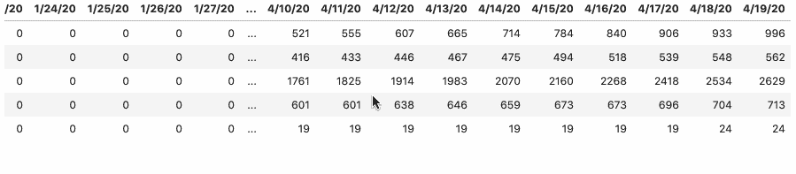**

**通过运行`confirmed_df.columns`、`deaths_df.columns`和`recovered_df.columns`，它们都应该输出如下相同的结果:**

****

**请注意，从第 4 列开始，所有列都是日期，以获取日期列表`confirmed_df.columns[4:]`**

**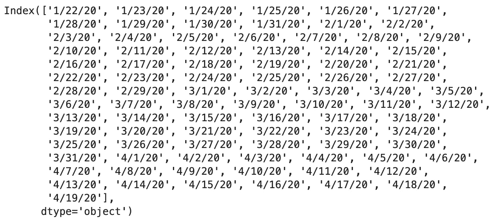**

## **3.合并确认，死亡和恢复**

**在合并之前，我们需要使用`melt()`将数据帧从当前的宽格式转换为长格式。换句话说，我们把所有的日期列都转换成了值。以下是相关的主要设置:**

*   **使用`‘Province/State’`、`‘Country/Region’`、 `‘Lat’`、`‘Long’`作为标识符变量。我们稍后将使用它们进行合并。**
*   **用变量列`‘Date’`和值列 `‘Confirmed’`取消透视日期列(如我们之前看到的`columns[4:]`**

```
**dates = confirmed_df**.columns[4:]**confirmed_df_long = confirmed_df.melt(
    **id_vars=['Province/State', 'Country/Region', 'Lat', 'Long'],** 
    **value_vars=dates,** 
    **var_name='Date',** 
    **value_name='Confirmed'**
)deaths_df_long = deaths_df.melt(
    **id_vars=['Province/State', 'Country/Region', 'Lat', 'Long'],** 
    **value_vars=dates, 
    var_name='Date', 
    value_name='Deaths'**
)recovered_df_long = recovered_df.melt(
    **id_vars=['Province/State', 'Country/Region', 'Lat', 'Long'], 
    value_vars=dates, 
    var_name='Date', 
    value_name='Recovered'**
)**
```

**以上应该返回新的长数据帧。它们都是按 ***日期*** 和 ***国家/地区*** 排序的，因为原始数据已经按 ***国家/地区*** 排序，日期列已经按 ASC 排序。**

**这里是`confirmed_df_long`的例子**

**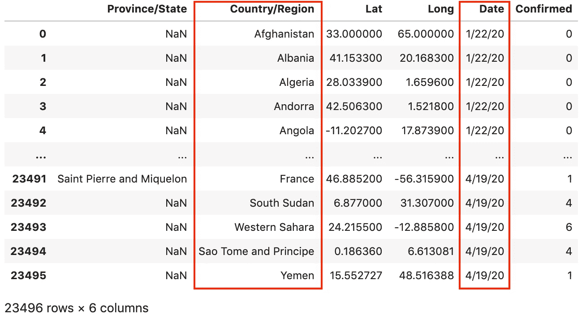**

**`confirmed_df_long`的例子**

**此外，由于不匹配问题，我们必须删除加拿大的恢复数据(🤷加拿大‍♂恢复的数据按国家统计，而不是按省/州统计)。**

```
**recovered_df_long = recovered_df_long[**recovered_df_long['Country/Region']!='Canada'**]**
```

**之后，我们使用`merge()`依次合并 3 个数据帧**

```
**# Merging **confirmed_df_long** and **deaths_df_long**
full_table = **confirmed_df_long**.merge(
  right=**deaths_df_long**, 
  how='left',
 **on=['Province/State', 'Country/Region', 'Date', 'Lat', 'Long']** )# Merging **full_table** and **recovered_df_long**
full_table = **full_table**.merge(
  right=**recovered_df_long**, 
  how='left',
 **on=['Province/State', 'Country/Region', 'Date', 'Lat', 'Long']** )**
```

**现在，我们应该得到一个包含`Confirmed`、`Deaths`和`Recovered`列的完整表格**

****

**包含已确认、死亡和已恢复的 full_table 示例**

## **4.执行数据清理**

**我们希望完成 3 项任务**

1.  **将日期从字符串转换为日期时间**
2.  **替换丢失的值`NaN`**
3.  **3 艘邮轮报告的冠状病毒病例应区别对待**

**您可能已经注意到，新的 ***日期*** 列中的值都是具有 **m/dd/yy** 格式的字符串。要将 ***日期*** 值从字符串转换为日期时间，让我们使用`DataFrame.to_datetime()`**

```
**full_table['Date'] = **pd.to_datetime(full_table['Date'])****
```

**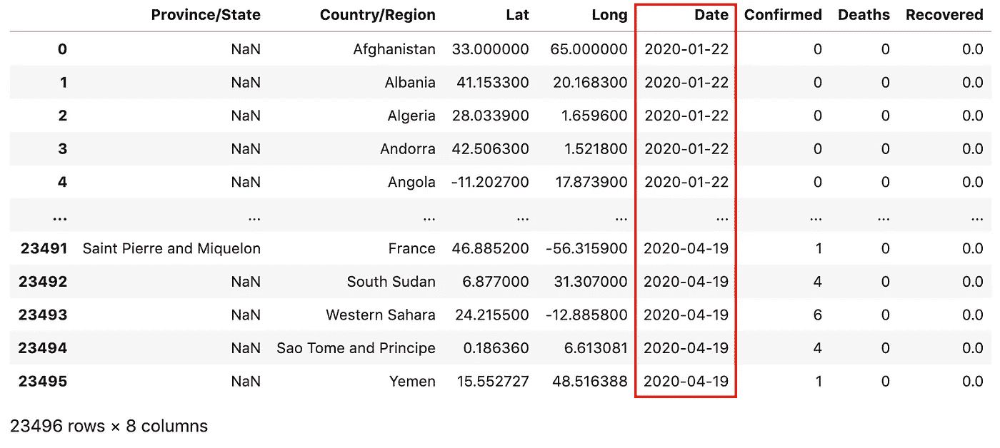**

**to_datetime()之后的输出**

**运行`full_table.isna().sum()`可以检测缺失值`NaN`**

```
**full_table.isna().sum()Province/State    16198
Country/Region        0
Lat                   0
Long                  0
Date                  0
Confirmed             0
Deaths                0
Recovered          1602
dtype: int64**
```

**我们在 ***省/州*** 中发现了很多`NaN`，这是有道理的，因为许多国家只报告国家级数据。但是 ***中有 1602 个 nan 被恢复*** 让我们用`0`来代替。**

```
**full_table['Recovered'] = **full_table['Recovered'].fillna(0)****
```

**除了缺失值，还有 3 艘邮轮报告的冠状病毒病例:**大公主**、**钻石公主**和 **MS Zaandam** 。由于 ***省/州*** 和 ***国家/地区*** 随着时间的推移不匹配，需要提取这些数据并区别对待。这就是我所说的:**

**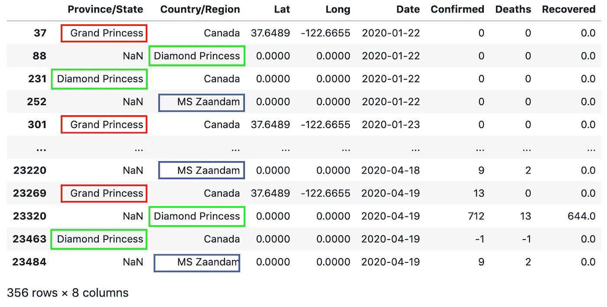**

**`full_ship`的错配问题**

**这是我们如何提取船只数据。**

```
****ship_rows** = full_table['Province/State'].str.contains('Grand Princess') | full_table['Province/State'].str.contains('Diamond Princess') | full_table['Country/Region'].str.contains('Diamond Princess') | full_table['Country/Region'].str.contains('MS Zaandam')full_ship = **full_table[ship_rows]****
```

**并从`full_table`中去掉飞船数据:**

```
**full_table = full_table[~(ship_rows)]**
```

****5。数据汇总****

**到目前为止，所有的 ***确认******死亡******恢复*** 都是来自原始 CSV 数据集的现有数据。我们来添加一个活动案例列 ***活动*** ，由`active = confirmed — deaths — recovered`计算。**

```
**# Active Case = confirmed - deaths - recovered
full_table[**'Active'**] = **full_table['Confirmed'] - full_table['Deaths'] - full_table['Recovered']****
```

**这里是`full_table`现在的样子。**

**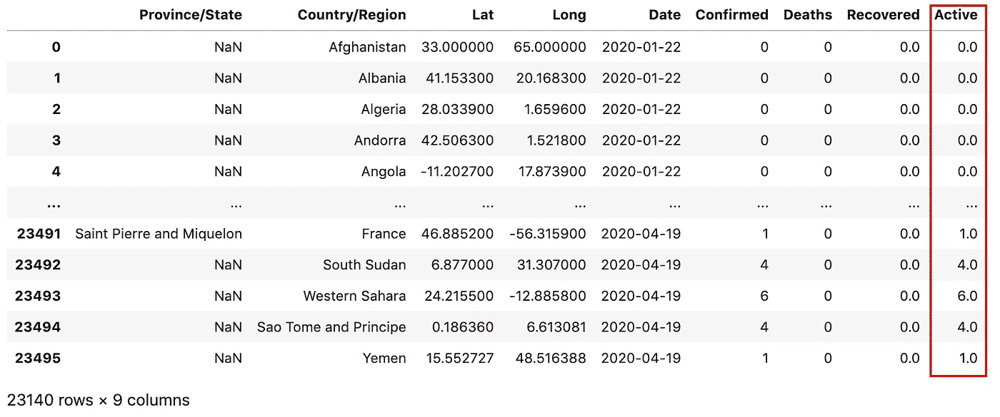**

**接下来，让我们将数据聚集到`Country/Region` wise 中，并按照`Date`和`Country/Region`对它们进行分组。**

```
**full_grouped = full_table.**groupby**(['Date', 'Country/Region'])['Confirmed', 'Deaths', 'Recovered', 'Active']**.sum().reset_index()****
```

*   **`sum()`是获取给定****国家/地区的“确诊”、“死亡”、“康复”、“活跃”总数。******
*   **`reset_index()`重置指标，使用默认指标，即 ***日期*** 和 ***国家/地区。*****

**这是`full_grouped`现在的样子**

**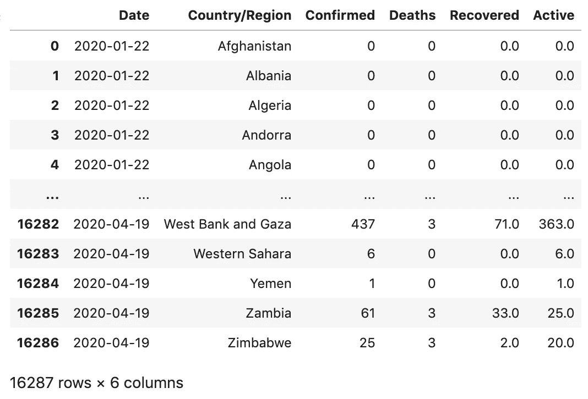**

**现在让我们通过扣除前一天相应的累计数据来添加当日明智 ***新增病例******新增死亡病例*** 和 ***新增痊愈病例*** 。**

```
**# new cases 
temp = full_grouped.groupby(['Country/Region', 'Date', ])['Confirmed', 'Deaths', 'Recovered']
temp = temp.sum().diff().reset_index()mask = temp['Country/Region'] != temp['Country/Region'].shift(1)temp.loc[mask, 'Confirmed'] = np.nan
temp.loc[mask, 'Deaths'] = np.nan
temp.loc[mask, 'Recovered'] = np.nan# renaming columns
temp.columns = ['Country/Region', 'Date', 'New cases', 'New deaths', 'New recovered']# merging new values
full_grouped = pd.merge(full_grouped, temp, on=['Country/Region', 'Date'])# filling na with 0
full_grouped = full_grouped.fillna(0)# fixing data types
cols = ['New cases', 'New deaths', 'New recovered']
full_grouped[cols] = full_grouped[cols].astype('int')# 
full_grouped['New cases'] = full_grouped['New cases'].apply(lambda x: 0 if x<0 else x)**
```

**最后这里是`full_grouped`。请注意，这个最终输出是国家级数据**

*   ******为累计数据。******
*   ******新增病例*** ， ***新增死亡病例*** 和 ***新增痊愈病例*** 均为日明智数据。***
*   **本数据帧按 ***日期*** 和 ***国家/地区*** 排序。**

****

**最后，这里是`full_grouped`的数据**

**最后，您可以将这些最终数据保存到 CSV 文件中:**

```
**full_grouped.**to_csv**('COVID-19-time-series-clean-complete.csv')**
```

# **数据探索**

**为了简单起见，让我们使用 Python 数据可视化库 Altair 来创建一些简单的可视化。Altair 是 Python 的声明式统计可视化库，基于 [Vega](http://vega.github.io/vega) 和 [Vega-Lite](http://vega.github.io/vega-lite) 。Altair 提供了强大而简洁的可视化语法，使您能够快速构建各种各样的统计可视化。**

**对于 Altair 安装，我强烈建议创建一个新的虚拟环境，因为 Altair 有很多依赖项。然后，激活你的虚拟环境，运行`pip install altair vega_datasets`来安装 Altair 以及 [vega_datasets](https://github.com/altair-viz/vega_datasets) 中的示例数据集。**

**关于虚拟环境的教程，可以看看:**

**[](/create-virtual-environment-using-virtualenv-and-add-it-to-jupyter-notebook-6e1bf4e03415) [## 使用“virtualenv”创建虚拟环境，并将其添加到 Jupyter 笔记本中

### 你是机器学习工程师，正在使用 Python 和 Jupyter Notebook 吗？在这篇文章中，你会看到为什么…

towardsdatascience.com](/create-virtual-environment-using-virtualenv-and-add-it-to-jupyter-notebook-6e1bf4e03415) [](https://medium.com/analytics-vidhya/create-virtual-environment-using-conda-and-add-it-to-jupyter-notebook-d319a81dfd1) [## 使用“conda”创建虚拟环境，并将其添加到 Jupyter 笔记本中

### 你正在使用 anaconda 和使用 Jupyter Notebook 和 Python 吗？在这篇文章中，你将看到如何创建虚拟的…

medium.com](https://medium.com/analytics-vidhya/create-virtual-environment-using-conda-and-add-it-to-jupyter-notebook-d319a81dfd1) 

## 显示总病例和每日病例

首先，让我们导入库，加载数据并选择一个国家，例如英国:

```
import pandas as pd
import altair as altfull_grouped = pd.read_csv('COVID-19-time-series-clean-complete.csv', **parse_dates=['Date']**)uk = full_grouped[**full_grouped['Country/Region'] == 'United Kingdom'**]
```

然后，让我们用公共元素创建一个基础图表

```
base = alt.Chart(uk).mark_bar().encode(
    **x='monthdate(Date):O',**
).properties(
    width=500
)
```

之后，我们可以使用`|`操作符水平连接

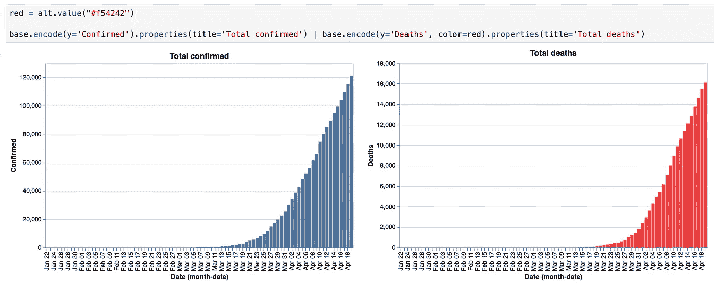

一段时间内的总确诊人数和总死亡人数

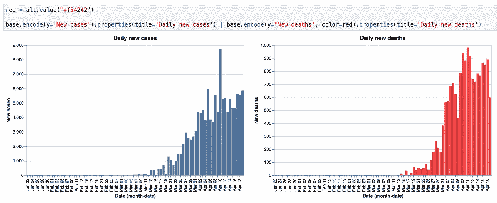

一段时间内每日新增病例和每日新增死亡人数

## 显示冠状病毒的传播

首先，让我们导入库，加载数据并选择一个国家列表

```
import pandas as pd
import altair as altfull_grouped = pd.read_csv('COVID-19-time-series-clean-complete.csv', **parse_dates=['Date']**)countries = ['US', 'Italy', 'China', 'Spain', 'Germany', 'France', 'Iran', 'United Kingdom', 'Switzerland']selected_countries = full_grouped[full_grouped['Country/Region']**.isin(countries)**]
```

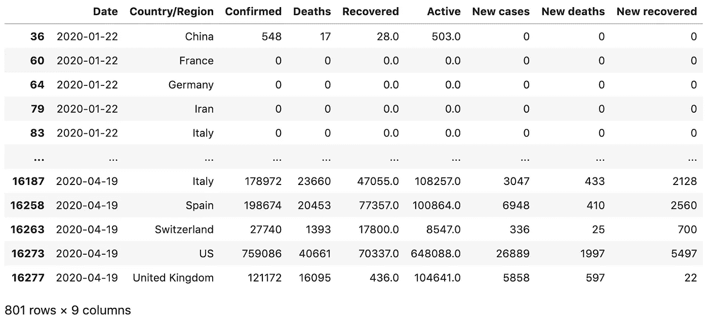

选定 _ 国家

让我们创建一个圆形图表来显示当天明智的 ***新增病例*** ，

```
alt.Chart(selected_countries).**mark_circle()**.encode(
    **x='monthdate(Date):O',**
    **y='Country/Region',**
    **color='Country/Region',**
    size=alt.Size(**'New cases:Q'**,
        scale=alt.Scale(range=[0, 1000]),
        legend=alt.Legend(title='Daily new cases')
    ) 
).properties(
    width=800,
    height=300
)
```

这是输出

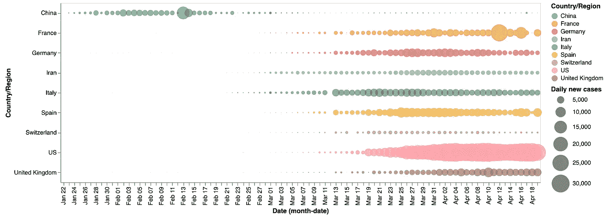

每日新病例圆形图

# 尽情享受吧！

这篇文章主要是向大家展示如何使用 Pandas 逐步处理新冠肺炎数据。在数据探索部分只有两个简单的例子来演示。

如果你有兴趣学习牛郎星，可以看看下面两篇文章。

[](/python-interactive-data-visualization-with-altair-b4c4664308f8) [## 用 Altair 实现 Python 交互式数据可视化

### 用不到 20 行代码创建交互式图表。

towardsdatascience.com](/python-interactive-data-visualization-with-altair-b4c4664308f8) [](/interactive-data-visualization-for-exploring-coronavirus-spreads-f33cabc64043) [## 探索冠状病毒传播的交互式数据可视化

### 使用 Altair 创建不到 30 行代码的交互式复合图表

towardsdatascience.com](/interactive-data-visualization-for-exploring-coronavirus-spreads-f33cabc64043) 

大概就是这样。感谢阅读**