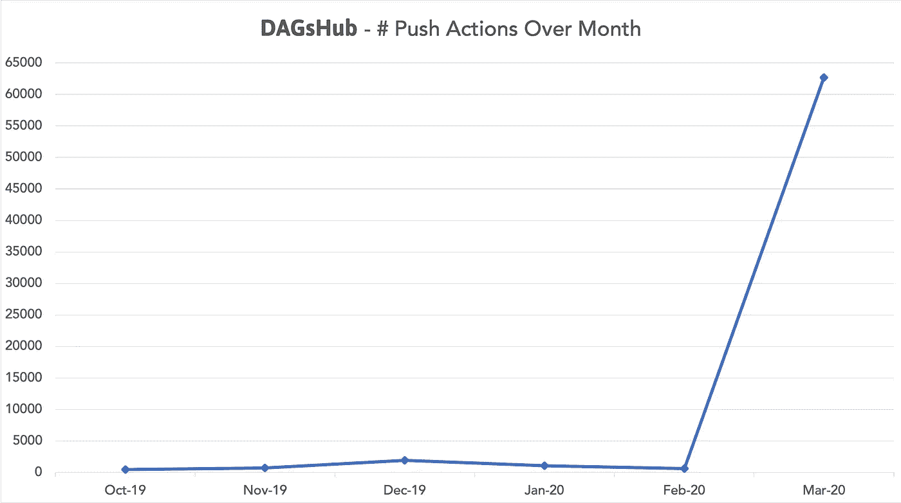
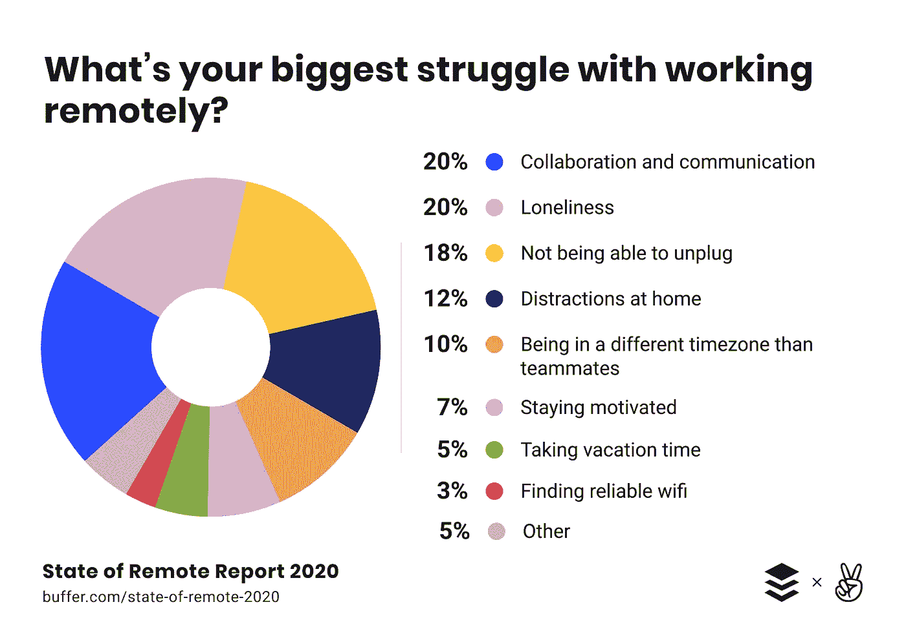
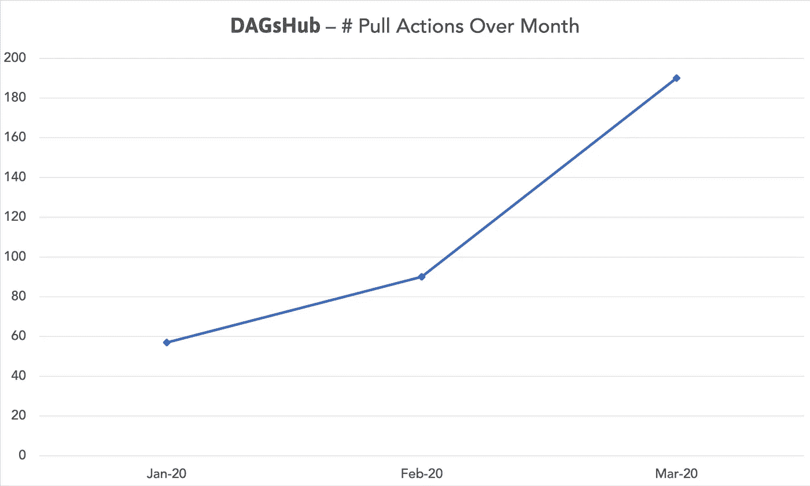

# 新冠肺炎如何改变数据科学工作流程

> 原文：<https://towardsdatascience.com/covid-19-data-science-workflow-f8eea10c77fa?source=collection_archive---------50----------------------->

## 新冠肺炎正在改变很多事情。数据科学家可以做些什么来充分利用这种情况？

达格正在尽自己的力量对抗新冠肺炎

我是数据科学协作平台 [DAGsHub](https://DAGsHub.com) 的创始人之一，这个平台是为不坐在一起的团队设计的。我不打算讨论新冠肺炎和在家工作的一般方面。相反，我将特别关注数据科学家需要在远程有效工作的内容。

当危机开始时，我们的假设是现有用户的使用会因新情况而激增。事情是这样的:

一个月内向 DAGsHub 推送操作的次数

这到底是怎么回事？我们认为我们的测试版有很好的口碑增长和牵引力，但自从冠状病毒以来的增长使它相形见绌，直到它看起来像是零。

我们的用户需要比他们坐在一起时更频繁的项目管理和协作工具。这证明当我们过渡到远程工作时，我们需要改变我们的工具。

远程工作最大的困难是协作和沟通。[缓冲& AngelList 报道](https://lp.buffer.com/state-of-remote-work-2020)

这种使用率的上升也可能表明，现在不良实践对团队的伤害比平时更大，导致他们更多地依赖于修复这些问题的工具。

现在，你可能会说—“但这只是推送操作，也许用户只是在平台上添加实验来查看指标并在它们之间进行比较。合作是双向的。”你可能是对的。我们预计拉动行为也会显著增加，尽管这种增加会更加微妙，因为你更经常地创造一个新的实验，而不是复制一个已经完成的实验。

一个月内对 DAGsHub 的拉动操作数量—我们在 2020 年初开始衡量拉动操作

在最近三个月，我们可以看到拉动操作的数量几乎增加了两倍。

让我们深入探讨一下在我看来阻碍我们健康的数据科学合作(尤其是远程合作)的四大问题。这些问题是:

1.  我们的实验缺乏可重复性
2.  对我们工作的跟踪和记录不好
3.  合作者之间难以共享工作
4.  孤立的工作流助长了独狼心态，从长远来看会损害组织的生产力

以上各点都是相互联系的。

## 可重复的实验

关于这个话题已经写了很多，贾斯汀·博伊兰-图米(Justin Boylan-too mey)对[可再生数据科学项目(reproducible data science project)](/creating-reproducible-data-science-projects-1fa446369386)或[马修·斯图尔特(Matthew Stewart)，博士研究员](https://medium.com/u/b89dbc0712c4?source=post_page-----f8eea10c77fa--------------------------------)的[对机器学习危机的](/the-machine-learning-crisis-in-scientific-research-91e61691ae76)。调试自己的代码有时可能很困难，但是当别人的代码不方便使用时，或者当一些问题可能是由您使用的环境的差异引起时，调试别人的代码是一场噩梦。我们需要以一种集成的方式管理我们的代码、数据、模型和环境的版本，以便尽可能简单地实现可再现性。这会为你自己和你的团队成员节省大量的时间和悲伤。

## 跟踪和记录您的工作

这是相关的，可能是实现再现性所必需的，但它的意义远不止于此。记录参数和指标可以相当容易地完成，为大多数广泛使用的数据科学库创建了自动记录功能。正确地做到这一点会让你或你的合作者专注于重要的实验，并很容易找到下一个值得尝试的伟大事物。通常，在你记录的实验数据之上会使用一个实验可视化系统。但是要做到这一点，你首先必须记录你的工作。

不是这种木头。照片由[艾蒂安·吉拉代](https://unsplash.com/@etiennegirardet?utm_source=medium&utm_medium=referral)在 [Unsplash](https://unsplash.com?utm_source=medium&utm_medium=referral) 上拍摄

## 共享工作

当人们坐在一起，你在和同事讨论你的工作时，很容易指着你屏幕上的相关部分说“看这里，这就是有趣的地方”。远程工作使这个简单的任务变得更加困难，团队可能会发现自己使用几个不同的工具，它们之间需要手动同步，或者，上帝保佑，通过电子邮件发送链接到上传到 Google Drive 的项目部分。

解决共享工作的最好方法是解决前两个问题。如果我们确保我们有可重复的实验，并正确记录我们的工作，我们需要做的就是确保所有这些工件都上传到中央系统。如果是这样的话，每个实验的最后一步就是将结果发送到平台上。这样做给你一个中央网络用户界面，在那里每个人都可以谈论相同的事情，创造一种共同的语言，分享变得像告诉一个合作者`git pull`到他们的系统一样容易。

## 孤立的工作流

最后一个问题可能是最困难的，即使我们坐在一起，这个问题也会渗透到数据科学工作中——独狼心态。这个问题与其说是技术问题，不如说是心理问题。我们专注于自己的工作，以团队的生产力和解决真正困难问题的能力为代价。在许多情况下，前面提到的问题导致了一个恶性循环，其中工具阻止了协作，这反过来促进了独狼心态，导致没有开发协作工作流。

照片由[塔霍](https://unsplash.com/@tahoe?utm_source=medium&utm_medium=referral)在 [Unsplash](https://unsplash.com?utm_source=medium&utm_medium=referral) 上拍摄

没有工具来支持协作工作流的团队将会更加强烈地感受到孤狼心态的负面影响。

好消息是，如果你解决了前三个问题，你就在解决最后一个问题上取得了重大进展。您可以为每个问题分配多个人，或者分配需要互相检查工作或在问题出现时进行咨询的小组。

也就是说，上面提到的工具是必要的，尽管[并不总是足够的](https://multithreaded.stitchfix.com/blog/2016/03/16/engineers-shouldnt-write-etl/)。团队合作是困难的，有些问题需要艰难的组织文化变革，比如更加关注过程和沟通。建立支持协作工作流所需的系统使得解决这些难题变得更加容易。

# 用 DAGsHub 解决远程数据科学问题

您可以使用开源工具来实现可重复性，或者创建您自己的标准(尽管不推荐后者)，以及用于实验跟踪的工具。**但你不必**。DAGsHub 使用 Git 和 DVC 进行版本控制，将可视化 UI 与实验跟踪相结合来管理数据版本。

当你创建[可重复实验](https://dagshub.com/docs/collaborating_on_dagshub/reproducing_results/)时，你可以[比较指标，搜索超参数](https://dagshub.com/docs/reference/open_data_science_formats/)和更多。使用 [DAGsHub 实验追踪](https://dagshub.com/docs/collaborating_on_dagshub/discovering_experiments/)不一定要用 DVC，它们互为补充，完全模块化。我们使用开源工具和开放格式，因此您永远不必担心黑盒解决方案和供应商锁定。

DAGsHub 对每个人完全免费，以促进科学合作和对抗冠状病毒危机。我们希望能够帮助团队轻松过渡到远程工作，并了解如何在远程数据科学环境中成功工作。

# 关于新冠肺炎项目的最后一句话

我们在 DAGsHub 的首要目标是支持[开源数据科学社区](/making-a-case-for-open-source-data-science-osds-9118ca4c1630)。如果您正在从事新冠肺炎数据科学项目，我们很乐意在云基础设施或任何其他方面提供帮助。我们的能力有限，但如果这与您相关，请通过[covid@dagshub.com](mailto:covid@dagshub.com)联系我们！

*感谢* [*盖伊·斯莫伊洛夫*](https://medium.com/u/6eb1e688322f?source=post_page-----f8eea10c77fa--------------------------------)*[*阿米尔·谢瓦特*](https://medium.com/u/d6c12c2b751a?source=post_page-----f8eea10c77fa--------------------------------) *和* [*Siim 出纳员*](https://medium.com/u/c481104565d4?source=post_page-----f8eea10c77fa--------------------------------) *对撰写这篇作品的帮助。**